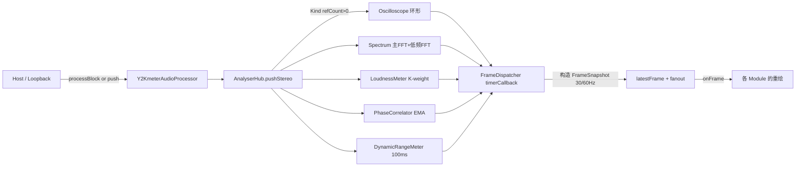
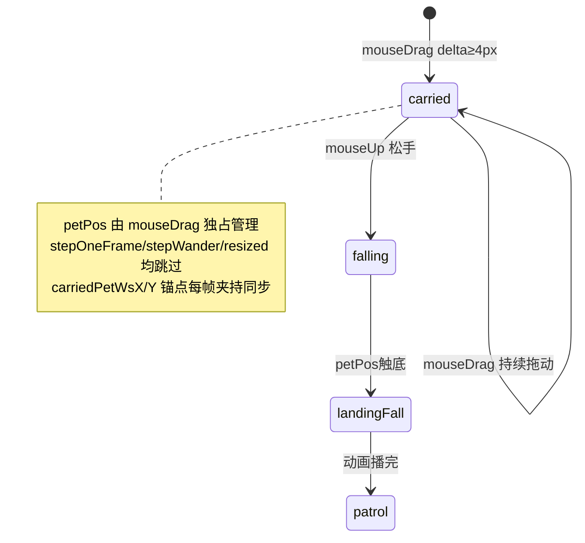

# Y2Kmeter 项目全景简介（AI 上下文导航文档）

> 本文档是为 AI 助手上下文初始化设计的项目导航说明。阅读完本文档，你应能立刻定位到"改哪个文件、调哪个类、走哪条数据流"。

---

## 1. 项目概述

### 1.1 项目定位
- **产品名**：`Y2Kmeter` （版本：`2.1.12`）
- **产品形态**：一款 **音频分析仪/音频计量插件**（纯分析，不产生音频输出的插件模式），带有强烈的 **Y2K / Windows 95-98-XP 像素复古粉色（Pink XP）** 视觉主题。
- **产品分类**：`VST3_CATEGORIES = "Analyzer" "Fx"`（DAW 分类中会被识别为分析仪）。
- **发行形态**（在 [CMakeLists.txt](/I:/Y2KMeter/CMakeLists.txt) 中通过 `juce_add_plugin` 定义）：
  - **Windows**：`VST3` + `Standalone` 独立应用
  - **macOS**：`VST3` + `Standalone` + `AU`
  - **BundleID / VST3 Plug ID**：`cn.iisaacbeats.Y2Kmeter`
- **开源协议**：GPL-3.0（详见 [LICENSE](/I:/Y2KMeter/LICENSE)）。

### 1.2 主要功能一览
- 立体声电平表（RMS L/R + True Peak L/R）
- ITU-R BS.1770-4 响度计（LUFS-M / LUFS-S / LUFS-I）
- 立体声相位相关仪（Correlation / Width / Balance / Goniometer）
- 动态范围检测（Peak / RMS / Crest / Short-DR / Integrated-DR）
- 高精度频谱分析仪（对数轴 20Hz~20kHz、双路 FFT：2048 主路 + 8192 低频路）
- 频谱瀑布图（Spectrogram，像素方格风格）
- 立体声示波器（Waveform / X-Y / Lissajous）
- 持续滚动瀑布波形（Waveform Module）
- 模拟指针 VU 表（VuMeterModule）
- Y2K 主题的 EQ 频谱可视化（**注意：仅可视化，不做实际 EQ 处理**）
- **Tamagotchi 电子宠物模块**（用音频信号驱动的一只像素小怪，含孵化 / 觅食 / 睡眠 / 生病 / 死亡等状态机）
- 用户可以拖入图片生成"拼豆像素画"贴到桌面背景
- **Milkdrop 可视化模块**（v2.1.0 新增，基于 libprojectM 4 原生 OpenGL 渲染，本地打包 1114 个真实 Milkdrop 预设，零网络依赖）

### 1.3 技术栈
| 项目 | 版本 / 说明 |
| --- | --- |
| 语言 | C++17（`CMAKE_CXX_STANDARD 17`，`CXX_EXTENSIONS OFF`） |
| 框架 | **JUCE 8.0.12**（通过 `FetchContent` 自动拉取） |
| DSP | `juce::dsp`（FFT、Windowing） |
| GPU | `juce::juce_opengl`（Editor 挂 `OpenGLContext`，绘制走 GPU）；`WebView2`（Windows）/ `WebKit`（macOS）用于 Milkdrop 模块的 WebGL 渲染 |
| 构建 | CMake ≥ 3.22 |
| Windows CRT | 强制静态 CRT（`MultiThreaded`，避免依赖 VC_redist） |
| macOS 语言扩展 | Objective-C++（`.mm` 文件走 ScreenCaptureKit 桌面音频采集） |
| 安装器 | Inno Setup（[Y2Kmeter_installer.iss](/I:/Y2KMeter/Y2Kmeter_installer.iss)） |
| 字体 | `Silkscreen-Regular.ttf`（像素英文字体，通过 `juce_add_binary_data` 打包） |
| 项目性能特性 | 支持 **LTO/IPO** + **PGO**（`Y2K_ENABLE_LTO`、`Y2K_PGO_MODE`）|
| 特殊宏 | `Y2K_ENABLE_PERF_COUNTERS=0`（发布版关闭性能计数）、`JUCE_USE_CUSTOM_PLUGIN_STANDALONE_APP=1`（用自定义 Standalone 外壳）、`JUCE_WEB_BROWSER=1`（启用 WebBrowserComponent）|

---

## 2. 核心分层架构

```
┌────────────────────────────────────────────────────────────────┐
│  Standalone 外壳（source/standalone）                            │
│    Y2KStandaloneApp / WasapiLoopbackCapture / MacDesktopCapture │
│    · 无边框 Y2K 窗口 / 系统输出 Loopback 采集                     │
├────────────────────────────────────────────────────────────────┤
│  Plugin 层                                                       │
│    Y2KmeterAudioProcessor  (PluginProcessor.h/cpp)              │
│      ↑ 音频线程 processBlock 拉数据                              │
│    Y2KmeterAudioProcessorEditor (PluginEditor.h/cpp)            │
│      ↑ UI 线程 承载 ModuleWorkspace                              │
├────────────────────────────────────────────────────────────────┤
│  Analysis 层（source/analysis）                                  │
│    AnalyserHub —— 中央调度枢纽                                   │
│      · LoudnessMeter / PhaseCorrelator / DynamicRangeMeter      │
│      · 主/低频双路 FFT + 立体声示波器环形缓冲                     │
│      · Kind 引用计数（按需计算）+ FrameSnapshot（一帧一份）       │
├────────────────────────────────────────────────────────────────┤
│  UI 框架层（source/ui）                                          │
│    ModuleWorkspace —— 所有分析模块的拖拽工作区                   │
│    ModulePanel     —— 所有模块的基类（像素窗口外观）              │
│    PinkXPStyle     —— 主题系统 + LookAndFeel                    │
│    UiFrameClock    —— 自适应帧率的 UI 时钟                       │
├────────────────────────────────────────────────────────────────┤
│  Modules 层（source/ui/modules）                                 │
│    EqModule / LoudnessModule / OscilloscopeModule /             │
│    OscilloscopeWaveModule / SpectrumModule / PhaseModule /      │
│    DynamicsModule / WaveformModule / SpectrogramModule /        │
│    VuMeterModule / TamagotchiModule /                           │
│    FineSplitModules（LUFS / TruePeak / PhaseCorr / PhaseBal /   │
│    DynamicsMeters / DynamicsDr / DynamicsCrest）                  │
├────────────────────────────────────────────────────────────────┤
│  Perf 层（source/perf）                                          │
│    PerformanceCounterSystem —— 性能计数系统（默认关闭）           │
└────────────────────────────────────────────────────────────────┘
```

### 2.1 关键调用关系
1. **音频入口 → 分析**：`Y2KmeterAudioProcessor::processBlock` → `AnalyserHub::pushStereo` → 分发到 5 路：`Oscilloscope / Spectrum / Loudness / Phase / Dynamics`。
2. **UI 拉分析结果**：`AnalyserHub` 内部 `FrameDispatcher` 每 33ms（30Hz，可提升到 60Hz）在 UI 线程构造一个 `FrameSnapshot`，通过 `FrameListener::onFrame(frame)` 派发给所有订阅的模块。
3. **模块的 UI 生命周期**：模块继承 `ModulePanel + AnalyserHub::FrameListener`，构造时 `hub.retain(Kind::xxx)` + `hub.addFrameListener(this)`，析构时对称 release + remove。**未加载的模块 → 引用计数为 0 → `pushStereo` 自动跳过对应计算路径**。
4. **Standalone 音频源**：`Y2KStandaloneApp` 通过 `WasapiLoopbackCapture`（Win）或 `MacDesktopAudioCapture`（macOS 使用 ScreenCaptureKit）获取"系统外放音频"，直接 push 到 `AnalyserHub`（不走 `processBlock`）。DAW 场景则由宿主经 `processBlock` 送入。

---

## 3. 代码结构说明

### 3.1 根目录关键文件
| 文件 | 作用 |
| --- | --- |
| [CMakeLists.txt](/I:/Y2KMeter/CMakeLists.txt) | CMake 主构建脚本；含 macOS 图标流水线、字体打包、平台条件源、LTO/PGO |
| [CMakePresets.json](/I:/Y2KMeter/CMakePresets.json) | CMake 预设集合（含 clangd 用的 Ninja preset） |
| [PluginProcessor.h/.cpp](/I:/Y2KMeter/PluginProcessor.h) | 顶层 `AudioProcessor`；持有 `AnalyserHub` 与状态持久化逻辑 |
| [PluginEditor.h/.cpp](/I:/Y2KMeter/PluginEditor.h) | 顶层 `AudioProcessorEditor`；Pink XP 外壳 + 自画标题栏 + `ModuleWorkspace` 托管 |
| [Y2Kmeter_installer.iss](/I:/Y2KMeter/Y2Kmeter_installer.iss) | Windows Inno Setup 安装器脚本 |
| [assets/](/I:/Y2KMeter/assets) | Logo、图标、Tamagotchi 精灵图（角色 20 只 × 33 动作 + 蛋 8 款） |
| [ttf/](/I:/Y2KMeter/ttf) | 打包用像素字体 |

### 3.2 `source/analysis`（音频分析）
| 文件 | 类 / 关键实现 |
| --- | --- |
| [AnalyserHub.h](/I:/Y2KMeter/source/analysis/AnalyserHub.h) | `LoudnessMeter` / `PhaseCorrelator` / `DynamicRangeMeter` / `AnalyserHub`（**注意**：为了绕过 MSVC include-guard 串扰，四个类都塞进了同一个头，实现分散在各自 cpp）|
| [AnalyserHub.cpp](/I:/Y2KMeter/source/analysis/AnalyserHub.cpp) | `AnalyserHub::pushStereo` 主路+低频路双 FFT、`FrameDispatcher` 内部 Timer、Kind 引用计数、FrameSnapshot 组装与广播 |
| [LoudnessMeter.cpp](/I:/Y2KMeter/source/analysis/LoudnessMeter.cpp) | K-weighting 双级 IIR + 400ms 动量 LUFS、3s 短期、全程积分（含相对门限）、100ms RMS、4× 过采样 True Peak |
| [PhaseCorrelator.cpp](/I:/Y2KMeter/source/analysis/PhaseCorrelator.cpp) | EMA 滑动窗计算 correlation / width / balance |
| [DynamicRangeMeter.cpp](/I:/Y2KMeter/source/analysis/DynamicRangeMeter.cpp) | 100ms 块统计 + top-20% 分位 short-DR / integrated-DR |

### 3.3 `source/ui`（UI 框架）
| 文件 | 关键内容 |
| --- | --- |
| [ModuleWorkspace.h](/I:/Y2KMeter/source/ui/ModuleWorkspace.h) | `ModuleType` 枚举 / `ModulePanel` 基类 / `ModuleWorkspace` 主类 / `ThemeSwatchBar` / `HideChromeButton`（**同一个头包含多个类**，同样为绕过 MSVC 串扰）|
| [ModuleWorkspace.cpp](/I:/Y2KMeter/source/ui/ModuleWorkspace.cpp) | 拖拽 / 网格吸附 / 布局持久化 / 拼豆图片 / 底部 toolbar / 添加菜单 / 鼠标事件 |
| [ModulePanel.cpp](/I:/Y2KMeter/source/ui/ModulePanel.cpp) | 各模块统一的像素窗口：标题栏 + 关闭按钮 + 边缘/角拖拽缩放 + 右下 CPU 小字 |
| [ModulePanel.h](/I:/Y2KMeter/source/ui/ModulePanel.h) | **只是一个兼容 shim**，内部只 `#include "source/ui/ModuleWorkspace.h"` |
| [PinkXPStyle.h/.cpp](/I:/Y2KMeter/source/ui/PinkXPStyle.h) | 主题调色板（10 个主题）+ 桌面纹理（棋盘/星星/网格/圆点/泡泡/斜条纹）+ `PinkXPLookAndFeel` |
| [UiFrameClock.h/.cpp](/I:/Y2KMeter/source/ui/UiFrameClock.h) | 统一 UI 帧时钟（阶段1性能改造，目前尚未强制接线，主流数据流仍走 `AnalyserHub::FrameDispatcher`） |

### 3.4 `source/ui/modules`（分析模块 UI）
每个模块都是 `ModulePanel + AnalyserHub::FrameListener` 双继承。

| 文件 | 模块 | 数据源 |
| --- | --- | --- |
| [EqModule.h/.cpp](/I:/Y2KMeter/source/ui/modules/EqModule.h) | `EqModule`（Y2K 像素频谱可视化，非真实 EQ） | `Spectrum` |
| [LoudnessModule.h/.cpp](/I:/Y2KMeter/source/ui/modules/LoudnessModule.h) | `LoudnessModule`（LUFS-M/S/I + Peak L/R 五柱） | `Loudness` |
| [OscilloscopeModule.h/.cpp](/I:/Y2KMeter/source/ui/modules/OscilloscopeModule.h) | `OscilloscopeModule`（Wave / XY / Lissajous，v1.8.4 新增 XY/Lissajous 峰值驱动自动缩放 + 同心标尺环） | `Oscilloscope` |
| [OscilloscopeWaveModule.h/.cpp](/I:/Y2KMeter/source/ui/modules/OscilloscopeWaveModule.h) | `OscilloscopeWaveModule`（纯波形，L / R / Both 通道选择，v1.8.4 新增合并原 OSc L+R） | `Oscilloscope` |
| [SpectrumModule.h/.cpp](/I:/Y2KMeter/source/ui/modules/SpectrumModule.h) | `SpectrumModule`（对数频谱 + peak hold + slope） | `Spectrum` |
| [PhaseModule.h/.cpp](/I:/Y2KMeter/source/ui/modules/PhaseModule.h) | `PhaseModule`（Goniometer + Correlation Dial + Width/Balance Bar） | `Phase` + `Oscilloscope` |
| [DynamicsModule.h/.cpp](/I:/Y2KMeter/source/ui/modules/DynamicsModule.h) | `DynamicsModule`（Peak/RMS 四柱 + DR + Crest 历史） | `Dynamics` |
| [WaveformModule.h/.cpp](/I:/Y2KMeter/source/ui/modules/WaveformModule.h) | `WaveformModule`（滚动瀑布波形，像素列） | `Oscilloscope` |
| [SpectrogramModule.h/.cpp](/I:/Y2KMeter/source/ui/modules/SpectrogramModule.h) | `SpectrogramModule`（像素方格频谱瀑布图，双路 FFT 合成） | `Spectrum` |
| [Spectrogram3DModule.h/.cpp](/I:/Y2KMeter/source/ui/modules/Spectrogram3DModule.h) | `Spectrogram3DModule`（v1.8.6 新增 3D 频谱曲面图，v1.9.0 P1~P3 三轮性能优化大幅降低 macOS CPU 占用，v1.9.4 P4 动态分辨率 + frequency axis 修复 + depthPalettes vector） | `Spectrum` |
| [FineSplitModules.h/.cpp](/I:/Y2KMeter/source/ui/modules/FineSplitModules.h) | 细粒度拆分：`LufsRealtime` / `TruePeak` / `PhaseCorrelation` / `PhaseBalance` / `DynamicsMeters` / `DynamicsDr` / `DynamicsCrest` / `VuMeter`（v1.8.4 移除 `OscilloscopeChannel`，由 `OscilloscopeWave` 替代） | 视模块而定 |
| [TamagotchiModule.h/.cpp](/I:/Y2KMeter/source/ui/modules/TamagotchiModule.h) | `TamagotchiModule`（宠物状态机 + 精灵图动画） | `Loudness`（用信号强度驱动饥饿/健康）|
| [MilkdropModule.h/.cpp](/I:/Y2KMeter/source/ui/modules/MilkdropModule.h) | `MilkdropModule`（v2.1.0 新增，v2.1.11 auto轮播模式 / v2.1.12 小数间隔与持久化，基于 libprojectM 4 原生 OpenGL 渲染，本地打包 1114 个 Milkdrop 预设） | `Oscilloscope`（立体声 PCM 推流 → `bass`/`mid`/`treb` 变量驱动视觉效果）|

### 3.5 `source/standalone`（Standalone App）
| 文件 | 作用 |
| --- | --- |
| [Y2KStandaloneApp.cpp](/I:/Y2KMeter/source/standalone/Y2KStandaloneApp.cpp) | 自实现 `juce::JUCEApplication` + `Y2KMainWindow`（DocumentWindow）替换 JUCE 内建的 `StandaloneFilterApp`；启动 → 加载 settings → 创建 Processor+Editor → 绑定 Loopback 音源 → 恢复主题/FPS/位置/尺寸/固定态 |
| [WasapiLoopbackCapture.h/.cpp](/I:/Y2KMeter/source/standalone/WasapiLoopbackCapture.h) | Windows：裸 WASAPI + `AUDCLNT_STREAMFLAGS_LOOPBACK`，采集"系统默认播放端点"输出，输出统一立体声 float32 |
| [MacDesktopAudioCapture.h/.mm](/I:/Y2KMeter/source/standalone/MacDesktopAudioCapture.h) | macOS：`ScreenCaptureKit` 获取桌面音频（Objective-C++） |
| [AudioDumpRecorder.h/.cpp](/I:/Y2KMeter/source/standalone/AudioDumpRecorder.h) | **仅 macOS**，通过环境变量 `Y2KM_AUDIO_DUMP` 系列开启，把音频原样落盘做调试 |

### 3.6 `source/perf`
| 文件 | 作用 |
| --- | --- |
| [PerformanceCounterSystem.h/.cpp](/I:/Y2KMeter/source/perf/PerformanceCounterSystem.h) | 全局性能计数系统（发布版 `Y2K_ENABLE_PERF_COUNTERS=0` 关闭）；提供 `ScopedPerfTimer`、`ScopedLockWaitMeasure` 用于埋点 |

---

## 4. 关键类 / 接口清单

### 4.1 `Y2KmeterAudioProcessor`（[PluginProcessor.h](/I:/Y2KMeter/PluginProcessor.h)）
- 音频线程接口：`prepareToPlay`、`processBlock`、`releaseResources`。
- 关键成员：`std::unique_ptr<AnalyserHub> analyserHub;`（**pimpl 隐藏**，头文件里只前向声明）。
- 状态持久化（`getStateInformation` / `setStateInformation`）：
  - 顶层 XML 根 `<PBEQ_State>`，含 `analysisInputGainDb`、`editorW/editorH` 属性；
  - 子节点 `<PBEQ_Layout>` 承载 `ModuleWorkspace` 布局（模块位置 / 拼豆图 / 主题 / FPS 等）。
- 分析开关：`setAnalysisActive(false)` 时 `processBlock` 完全跳过分析（UI 不可见时用）。
- CPU 负载：`getCpuLoad()` 供每个模块右下角显示；Loopback 路径用 `registerLoopbackRenderTime` 通道注入。
- 分析前置增益：`setAnalysisInputGainDb / getAnalysisInputGainLinear`（-10 ~ +36 dB），只作用于分析路径，不改变透传输出。
- **P4 flush 钩子**：`flushPendingUiStateBeforeSave`（Editor 注册；`getStateInformation` 前 flush 掉 workspace 的 debounce 布局变更）。

### 4.2 `AnalyserHub`（[AnalyserHub.h](/I:/Y2KMeter/source/analysis/AnalyserHub.h)）
- **枚举** `AnalyserHub::Kind`：`Oscilloscope=0 / Spectrum=1 / Loudness=2 / Phase=3 / Dynamics=4 / NumKinds=5`。
- **引用计数** `retain(Kind)` / `release(Kind)` / `isActive(Kind)` —— UI 线程调用；`pushStereo` 里读原子决定是否跳过某路计算。
- **FrameSnapshot**：一帧一份聚合数据（`activeMask`、`tickCount`、示波器 L/R 2048 样本、频谱 mag 1024/4096、Loudness/Phase/Dynamics 快照）。
- **FrameDispatcher**（pimpl）：默认 30Hz `juce::Timer`；`startFrameDispatcher(hz)` 可改频（Editor 会随 FPS 按钮切到 60Hz，且做**自适应降/升档**）。
- **模块订阅**：`addFrameListener(listener)` / `removeFrameListener`；每帧 UI 线程回调 `onFrame(const FrameSnapshot&)`。
- **兼容旧接口**：`getOscilloscopeSnapshot / getSpectrumSnapshot / getSpectrumMagnitudes(Lo) / getSpectrumMagnitudesBlended`。
- **常量**：`fftOrder=11 (2048)`，`fftOrderLo=13 (8192)`，`spectrumXoverHz=500Hz`，`oscilloscopeBufferSize=2048`，`spectrumBins=160`。

### 4.3 `Y2KmeterAudioProcessorEditor`（[PluginEditor.h](/I:/Y2KMeter/PluginEditor.h)）
- 关键子成员：`std::unique_ptr<ModuleWorkspace> workspace;`（pimpl 前向声明）。
- 双形态区分：`const bool isPluginHost;`（VST3/AU/AAX/LV2 → true；Standalone → false）。
  - **插件模式**下：不画自画标题栏、不接管窗口拖拽 / 关闭 / 置顶，隐藏"信号源"下拉与布局预设（保留 Save/Load）。
  - **Standalone 模式**下：完整 Y2K 外壳（标题栏 + 三按钮 + 无边框窗口拖拽 + 系统 Loopback）。
- **GPU**：类末尾持有 `juce::OpenGLContext openGLContext;`，构造末尾 `attachTo(*this)`，析构起始 `detach()`。
- **自适应 FPS**：`applyAdaptiveFrameRate(measuredFps)`；用户目标 30/60，动态在 20/24/30/45/60 Hz 之间下探/回升。
- **持久化协作**：Editor 构造时读 `Processor.getSavedLayoutXml` 恢复布局；`workspace->onLayoutChanged` → 写回 Processor。
- **Windows Direct2D 处理**：首次 `visibilityChanged` 时通过 `renderingEngineConfigured` flag 强制切换到软光栅/GDI，规避 AMD `atidxx64.dll` 卸载死锁（详见头文件相关注释）。
- **Chrome 隐藏态**：Hide 按钮收缩窗口；实现"幂等化" —— Hide 前完整快照 bounds 与 resizeLimits，Show 时直接 setBounds 回快照，避免累积漂移。
- **双击标题栏切换全屏**（v1.8.2 新增）：`mouseDoubleClick` 中命中 `getTitleBarBounds()` 且避开三个按钮与标题文字热区后，对顶层窗口 `dynamic_cast<juce::ResizableWindow*>` 调用 `setFullScreen(!isFullScreen())`；仅 Standalone 非 chrome 隐藏态下生效，插件宿主模式不劈持。切换前先把 `draggingWindow=false` 复位，避免上一帧 `mouseDown` 启动的 `windowDragger` 残留拖拽态。
- **布局锁定按钮 L**（v1.8.3 新增）：位于顶栏「最小化 _」按钮左侧，从右到左依次为 `× / * / _ / L`。点击切换 `layoutLocked`，同步 `ModuleWorkspace::setLayoutLocked` 与 Processor `setLayoutLocked`（XML 属性 `layoutLocked="1"` 序列化）。锁定时：
  - 顶层窗口通过 `setResizeLimits(cur, cur, cur, cur)` 冻结尺寸（**不用 `setResizable(false, ...)`，那会重建 native 窗口导致闪现**），Editor 双击标题栏切全屏仍可用（因为 fullscreen 不走 resize limits）。
  - Editor::mouseDown 在锁定态跳过 `windowDragger.startDraggingComponent`，即无法拖动窗口。
  - 关键接口：`isLayoutLocked() / handleLockClicked() / applyLayoutLocked(locked, initial)` + 构造期延迟 flag `pendingLockApplyOnAttach`（顶层窗口尺寸未就绪时先记账，`visibilityChanged` 时再应用，避免构造期 assert）。
- 顶部三按钮几何：`getCloseButtonBounds / getPinButtonBounds / getMinimiseButtonBounds`；chrome 隐藏态特殊：`getFloatingCloseButtonBounds`。
- **Tamagotchi 保活**：只有当工作区存在 Tamagotchi 模块时，Editor 才 `hub.retain(Kind::Loudness)` 保持信号驱动状态机。

### 4.4 `ModuleWorkspace`（[ModuleWorkspace.h](/I:/Y2KMeter/source/ui/ModuleWorkspace.h)）
- **模块工厂**：`setModuleFactory(f)`，Editor 侧会按 `ModuleType` 构造具体 `ModulePanel` 派生类（见 [PluginEditor.cpp](/I:/Y2KMeter/PluginEditor.cpp) 的 `createModule`）。
- **底部 Toolbar 组件**（自左至右）：`ThemeSwatchBar` → 布局预设下拉 + Save/Load → Grid → FPS → GAIN → Source → Hide。
- **布局预设** `LayoutPreset`：`defaultGrid=1 / horizontalFull=2 / horizontalBottom=3 / tiled=4`。
- **拼豆像素画（PerlerImage）**：拖入图片 → 按 `cellSize`（默认 4，范围 1..15）降采样 + 每格取原图平均色 → 生成像素画 → 作为 canvas 底图；每张贴画对应一个 `PerlerImageLayer` 子 Component 与模块**同 z-order 层级**。
- **P4 debounce**：`LayoutChangeCoalescer`（16ms 单发计时器），大量小改动只派发 1 次 `onLayoutChanged`。
- **hit-test 挖洞**：`setHitTestHoles`，chrome 隐藏态下让浮层按钮的鼠标事件冒泡回 Editor。
- **Add-Menu Hover 预览**：右键/双击空白区弹菜单，hover 到某模块名时在鼠标位置绘制半透明预览快照，缓存已渲染的 `Image`。
- **音频源下拉**（Standalone）：`setAudioSourceItems(items, selectedId)`，回调 `onAudioSourceChanged(sourceId, isLoopback)`。
- **布局锁定态**（v1.8.3 新增）：`setLayoutLocked(bool) / isLayoutLocked()`。锁定时 `mouseDown / mouseDoubleClick / isInterestedInFileDrag` 三处早退 —— 拼豆贴画拖动/缩放/删除/滑块、右键或双击空白弹「添加模块」菜单、拖入图片文件添加贴画等**入口全部禁用**，但主题切换、Save/Load、FPS/GAIN/Source/Hide toolbar 保持可用。子模块层面：`ModulePanel` 与 `TamagotchiModule` 各自的 `mouseMove/mouseDown` 通过匿名 namespace 里的 `isPanelLayoutLocked` 辅助函数上溯查询顶层锁定态，锁定时跳过 resize/move 启动、关闭 × 按钮点击也失效（视觉上不高亮）。

### 4.5 `ModulePanel`（[ModuleWorkspace.h](/I:/Y2KMeter/source/ui/ModuleWorkspace.h)）
- 派生类通过 `paintContent` / `layoutContent` 定制绘制与布局；基类负责标题栏/关闭按钮/拖拽缩放/CPU 小字。
- 尺寸约束：`minSize`（默认 64×64）与 `defaultSize`（每个派生类通过 `setDefaultSize` 声明）。
- `isVisuallyActiveInWorkspace()`：判断模块是否真的在 workspace 可见区，用于跳过重绘。

### 4.6 `PinkXP`（[PinkXPStyle.h](/I:/Y2KMeter/source/ui/PinkXPStyle.h)）
- **10 种主题**：`bubblegum / starlight / cyberLilac / tangerinePop / aquaPearl / matchaSoda / winXP / crimsonNoir / voidGrey / paperGrey`。
- **主题订阅**：`subscribeThemeChanged(cb) → token`，用于组件切主题时刷新缓存的颜色。
- **桌面纹理共享缓存**：`getSharedDesktopTexture(w,h)` 跨实例复用（多插件实例共用同一张 Image），主题切换时 `invalidateDesktopTextureCache()`。
- **两种字体接口**：`getFont(h)` 有 1.5x 放大（正文）；`getAxisFont(h)` 保持原大小（坐标轴刻度专用）。

---

## 5. 业务逻辑流程

### 5.1 音频 → 分析 → UI 数据流



**关键点**：
1. `pushStereo` 每次调用只做**引用计数 > 0** 的路径。
2. `FrameDispatcher` 是 UI 线程 `juce::Timer`；每 tick 拉取所有活跃 Kind 的最新快照 → 组装 `FrameSnapshot` → 通过 `SpinLock` 原子发布到 `latestFrame`（`shared_ptr<const FrameSnapshot>`）→ 依次调 `frameListeners[i]->onFrame(frame)`。
3. 每个模块的 `onFrame` 里通常只做数据缓存 + `repaint(dirty)`，重绘节流由 `lastRepaintMs` 或 `tickCount % N` 控制。

### 5.2 Standalone 启动流程（[Y2KStandaloneApp.cpp](/I:/Y2KMeter/source/standalone/Y2KStandaloneApp.cpp)）

```
main
 → START_JUCE_APPLICATION(Y2KStandaloneApp)
 → Y2KStandaloneApp::initialise:
     1. 加载 PropertiesFile / .settings
     2. 创建 Y2KmeterAudioProcessor
     3. new Y2KMainWindow（DocumentWindow，addToDesktop=false, 底色=纯黑）
     4. Editor = processor.createEditor()（GL 上下文已全平台移除）
     5. setContentNonOwned(editor)
     6. 从 settings 恢复：主题、FPS、窗口位置/尺寸、alwaysOnTop
     7. addToDesktop() + setVisible(true)（同步执行，黑色底色与暗黑主题无缝衔接，无闪屏）
     8. callAsync 恢复 chromeVisible（依赖 editor.isShowing()==true）
     9. 启动 WasapiLoopbackCapture（Win）/ MacDesktopAudioCapture（macOS）
    10. onAudio callback → hub.pushStereo + processor.registerLoopbackRenderTime
 → shutdown:
     1. 停 loopback（thread join）
     2. deleteEditorImmediately
     3. delete processor
     4. 保存 settings
```

### 5.3 布局持久化流程

```
用户操作模块（拖动 / 缩放 / 添加 / 删除 / 拼豆图）
  → ModulePanel 或 ModuleWorkspace notifyLayoutChanged
  → LayoutChangeCoalescer.startTimer(16ms)     // 抑动合并
  → 16ms 后 dispatchLayoutChangeNow
  → workspace.onLayoutChanged 回调
  → Editor 里 processor.setSavedLayoutXml(xml)
  → 之后 host 调 getStateInformation 时会先触发 flushPendingUiStateBeforeSave 强制立刻 flush
  → getStateInformation 序列化到 host state
```

> 附：v1.8.3 起 XML 根节点新增 `layoutLocked="1"` 属性（true 才写出，false 或缺省视为未锁）。反序列化在 `Y2KmeterAudioProcessor::setStateInformation` 里；Editor 构造末尾会调 `applyLayoutLocked(processor.getLayoutLocked(), initial=true)` 恢复初始态，若顶层窗口尺寸尚未就绪则延迟到 `visibilityChanged` 应用。

### 5.4 主题切换流程

```
预设主题切换：
  用户点 ThemeSwatchBar 色票
  → PinkXP::applyTheme(id)
  → 全局调色板变量（pink50..pink700, ink, sel, desktop, ...）就地覆盖
  → PinkXP::invalidateDesktopTextureCache()（下一帧重烘焙）
  → 触发所有 ThemeChangedCallback（组件订阅重绘）
  → workspace.hoverPreviewCache 全部失效（下次 hover 重新渲染）

自定义主题创建：
  用户点 ThemeSwatchBar 最左侧双三角方块 → 弹出 CustomThemePicker（RGB 色盘 ×2）
  → 用户分别选取 primary（映射 sel/swatch）和 secondary（映射 hl/desktop2）
  → 点 Apply → PinkXP::applyCustomTheme(primary, secondary)
  → 内部根据双色派生完整 Theme 结构写入 gCustomTheme
  → gCurrentThemeId = ThemeId::custom
  → 触发 ThemeChangedCallback（与预设主题切换一致）

自定义主题持久化：
  退出软件 → saveUiAndAudioState()
    → setValue("ui.themeId", (int)ThemeId::custom)
    → setValue("ui.customPrimary", primary.toString())     // 如 "ff39ff14"
    → setValue("ui.customSecondary", secondary.toString())

  重启软件 → initialise() 1.15)
    → 检测 savedThemeRaw == ThemeId::custom
    → getValue("ui.customPrimary")   → Colour::fromString → primary
    → getValue("ui.customSecondary") → Colour::fromString → secondary
    → applyCustomTheme(primary, secondary)
    → 之后 Editor 构造 applyTheme(getCurrentThemeId()) 再次确认一致
```

---

## 6. 特殊约定与注意事项

### 6.1 头文件合并（**极其重要**）
项目里存在几处"多个类合并到同一个头文件"的**违反常规的做法**，原因是 **绕过 MSVC 多文件同批编译时的 include-guard 跨 TU 串扰问题**：

- [source/analysis/AnalyserHub.h](/I:/Y2KMeter/source/analysis/AnalyserHub.h) 里同时定义了 `LoudnessMeter`、`PhaseCorrelator`、`DynamicRangeMeter`、`AnalyserHub`。
- [source/ui/ModuleWorkspace.h](/I:/Y2KMeter/source/ui/ModuleWorkspace.h) 里同时定义了 `ModuleType` / `ModulePanel` / `ModuleWorkspace` / `ThemeSwatchBar` / `HideChromeButton`。
- [source/ui/ModulePanel.h](/I:/Y2KMeter/source/ui/ModulePanel.h) 只是**兼容 shim**，唯一作用是 `#include "source/ui/ModuleWorkspace.h"`。

⚠️ **修改建议**：不要拆散这些头；如需在头里前置声明多个类、或者需要新增强关联的类，请合并到同一头。

### 6.2 pimpl 前向声明约定
- `Y2KmeterAudioProcessor` 的 `analyserHub` 成员：**头里只前向声明** `class AnalyserHub;`，完整定义只在 cpp 中出现。
- `Y2KmeterAudioProcessorEditor` 的 `workspace` 成员同样处理。
- `AnalyserHub` 的 `FrameDispatcher` 也是 pimpl，隐藏 `juce::Timer` 依赖。

### 6.3 音频线程约束
- `pushStereo`、`processBlock`、`registerLoopbackRenderTime` 必须**无锁 / 无堆分配 / 无系统调用**。
- 重要设计：
  - 分析前置增益临时缓冲 `analysisGainBufferStereo/Mono` 在 `prepareToPlay` 里预分配，`processBlock` 只 `setSize` 兜底。
  - 用户改增益 → `pendingLoudnessReset.store(true)` → 音频线程下一帧消费并 `resetLoudness()`（避免 UI 线程碰 loudness 内部积分器）。
  - 快照发布走 `SpinLock` + `shared_ptr swap`（MSVC C++17 下 `std::atomic<shared_ptr>` 不可用）。

### 6.4 平台差异
- **Windows**：
  - 强制静态 CRT（`MultiThreaded` / `MultiThreadedDebug`）—— 干净 Win10/11 免装 VC redist。
  - 首次 Editor 可用时 **强制关闭 Direct2D 渲染**（切软光栅/GDI），规避 AMD 驱动在 DLL 卸载时的 loader lock 死锁。
  - Standalone Loopback 用裸 WASAPI + `AUDCLNT_STREAMFLAGS_LOOPBACK`。
  - 链接 `ole32 / uuid / avrt`。
- **macOS**：
  - 启用 Objective-C++（`enable_language(OBJCXX)`），仅编译 `.mm` 文件时用。
  - 桌面音频走 `ScreenCaptureKit`（macOS 13+）；链接 `ScreenCaptureKit / AVFoundation / CoreMedia / Foundation`。
  - macOS 图标流水线：`assets/icon.ico` → sips 解码 PNG → `scripts/macos_iconize.m` 渲染圆角 squircle → iconutil 打包 `Icon.icns`。
  - Tamagotchi 精灵图运行期从 bundle `Contents/Resources/assets/Tamagotchi/` 读取（构建时 `POST_BUILD` 由 CMake 复制到 `.vst3` 与 `.app`）。
  - 额外构建 AU 插件；`AudioDumpRecorder` 通过环境变量 `Y2KM_AUDIO_DUMP*` 开启调试转储。

### 6.5 GPU / OpenGL
- Editor 类末尾持有 `juce::OpenGLContext openGLContext`，**必须放在类末尾**（保证反向析构顺序时最先 detach）。
- 构造末尾 `openGLContext.attachTo(*this)`，析构最开始显式 `detach()` 兜底。
- 插件宿主与 Standalone **共用**，宿主下 JUCE 会为 Editor 创建 GL 子层不影响宿主窗口其余部分。

### 6.6 性能优化点
- 大部分 UI 模块 **禁止在 `onFrame` 里直接 repaint 全画面**，都用 `lastRepaintMs` 节流 或 `tickCount % 2 == 0` 分频。
- `LoudnessModule` / `OscilloscopeModule` 等采用 **静态层缓存**（`staticLayer` juce::Image）：只在尺寸/主题变化时重建，帧循环里只 `drawImageAt`。
- `SpectrogramModule` 的方案 B：把 grid 强度写入离屏 Image，paint 用一次 `drawImage` 完成，避免 rows×cols 次 fillRect。
- 模块**按需计算**：模块加载 → `hub.retain(Kind)` → 卸载 → `hub.release(Kind)`。全 5 路引用计数为 0 时，`pushStereo` 里对应分支被跳过。
- `AnalysisActive` 开关：Editor 的 `visibilityChanged` 决定；宿主折叠/切换轨道时 UI 不可见，直接跳过整段分析。
- **Spectrogram3DModule P2（v1.9.0）**：离屏 `juce::Image` 缓存。将 150 层 × 127 bars 的 3D 曲面渲染到离屏 Image，`paintContent` 只需一次 `drawImageAt`。macOS CoreGraphics 软光栅路径下单次位图 blit 远快于分散的 19,050 次 `fillRect`。
- **Spectrogram3DModule P3（v1.9.0）**：三项微观优化 —— (1) `magToIdx` LUT：4096 级 `float mag → uint8_t 色板下标`，消除每帧 19,200 次 `gainToDecibels`(log10)+`jlimit`+`lround`；(2) `depthPalettes` 预计算：可见层数稳定后一次性生成 `visibleRows×256` 深度fade色板，消除每帧 19,050 次 `interpolatedWith`；(3) `cached3DImage.clear()` 复用替代每帧 `new juce::Image (malloc)`。

### 6.7 编译期宏
| 宏 | 默认值 | 作用 |
| --- | --- | --- |
| `Y2K_ENABLE_PERF_COUNTERS` | 0（发布） | 关闭性能计数系统；`ScopedPerfTimer` / `recordEvent` 变 no-op |
| `JUCE_USE_CUSTOM_PLUGIN_STANDALONE_APP` | 1 | 关闭 JUCE 内建 StandaloneFilterApp，改用 `Y2KStandaloneApp` |
| `JUCE_PLUGINHOST_ARA` / `JUCE_PLUGINHOST_LV2` | 0 | 关闭 ARA/LV2 宿主集成，减小二进制 |
| `JUCE_VST3_CAN_REPLACE_VST2` | 0 | 不做 VST2 兼容 |
| `Y2K_ENABLE_LTO` | ON | Release 启用 LTO/IPO |
| `Y2K_PGO_MODE` | OFF | 可切 GENERATE / USE 做 PGO |

### 6.8 版本号 / Bundle ID 一致性
- CMake 里 `project(... VERSION 1.9.0)` 与 `juce_add_plugin(... VERSION 1.9.0)` **必须一致**，任何版本号变更都要同步这两处以及 [Y2Kmeter_installer.iss](/I:/Y2KMeter/Y2Kmeter_installer.iss) 里的版本字段，**同时**修改 [PluginEditor.cpp](/I:/Y2KMeter/PluginEditor.cpp) 里 3 处 `"v1.9.x"` 字面量（getStringWidth 一处 + `versionText` 两处）。
- `BUNDLE_ID = cn.iisaacbeats.Y2Kmeter` **不要改**，改了会导致所有用户 DAW 里的插件实例丢失识别。

### 6.9 Tamagotchi 资源约定
- 精灵图目录：[assets/Tamagotchi/](/I:/Y2KMeter/assets/Tamagotchi)
  - `role/` 原始角色大图（20 只）
  - `role_cut_by_xlsx_40x40/{RoleName}/` 每只角色 33 个动作切图（40×40 像素）
  - `egg/` + `egg_38x38/` 8 款蛋（4 帧孵化动画）
- 运行时通过 `TamagotchiModule::findTamagotchiSubDir` 定位，优先 macOS bundle → 兜底源仓库路径。

### 6.10 存在但已废弃/预留的符号
- `SpectrumOverviewModule_REMOVED`：空壳，**不要引用**。
- `UiFrameClock`：源码已入库但当前**未强制接线**（模块仍走 `AnalyserHub::FrameDispatcher`）。作为后续统一节拍器的迁移目标存在。

### 6.11 JUCE API 所属类小坑（➔ v1.8.2 新增双击全屏时踩到）
- `setFullScreen(bool)` / `isFullScreen()` 定义在 `juce::ResizableWindow`（及其基类 `ComponentPeer` 上的 pure virtual），**不在** `juce::Component`、**也不在** `juce::TopLevelWindow` 上。写 `top->setFullScreen(...)` 会直接 MSVC 报 C2039。正确写法：`if (auto* rw = dynamic_cast<juce::ResizableWindow*>(top)) rw->setFullScreen(...)`，逐级降到 `getPeer()->setFullScreen(...)` 做 fallback。【教训】clangd 报"无法解析符号"时不要盲信它是假阳性，优先去 JUCE 源码 `_deps/juce-src/modules/juce_gui_basics` 里 `grep` 一下验证 API 真实归属。

### 6.12 MSVC Debug 构建 CRT 组合坑（➔ v1.8.2 布局锁定 Debug 联调时踩到）
症状：Debug 构建 juceaide.exe 链接期大批 `LNK2001/LNK2019`：
```
libcpmtd.lib(...): unresolved external symbol _free_dbg / _malloc_dbg /
    _CrtDbgReport / _CrtDbgReportW / _calloc_dbg / _wcsdup_dbg /
    _realloc_dbg / _CrtSetDbgFlag / _CrtDumpMemoryLeaks
```
根因链（三层，全部满足才会爆）：
1. 顶层 [CMakeLists.txt](/I:/Y2KMeter/CMakeLists.txt) 为了让最终 exe 不依赖 VCRUNTIME140.dll，设了 `CMAKE_MSVC_RUNTIME_LIBRARY = MultiThreaded`（即 `/MT`，静态 CRT）。
2. JUCE 官方 `extras/Build/juceaide/CMakeLists.txt` 里对 juceaide target 硬编码 `set_target_properties(juceaide PROPERTIES MSVC_RUNTIME_LIBRARY "MultiThreaded")` —— target 属性优先级 > 全局默认，任何在项目层设的全局值对它都无效。
3. 但 CMake 在 `CMAKE_BUILD_TYPE=Debug` 下会自动加 `-D_DEBUG`，STL 头因此选 debug 版本 → 引 `libcpmtd.lib` → 需要 debug UCRT 符号（`_free_dbg` 等），而 `/MT` 链的是 release 静态 UCRT `libucrt.lib`，符号自然缺失。VS 2026 Preview（MSVC 14.51.x）的 SDK 组合下尤其明显。

修复策略（[CMakeLists.txt](/I:/Y2KMeter/CMakeLists.txt) 已落地）：
- **不使用 generator expression** 设置 `CMAKE_MSVC_RUNTIME_LIBRARY`：juceaide 曾以 `execute_process(cmake -B ...)` 的子 configure 方式启动时不会展开 `$<CONFIG:...>`；虽然当前打开了 `JUCE_BUILD_HELPER_TOOLS ON`（同 configure），仍保守使用裸字符串更稳。判断 `CMAKE_BUILD_TYPE STREQUAL "Debug"` 后直接给 `MultiThreadedDebugDLL`，其它给 `MultiThreaded`。
- **在 `FetchContent_MakeAvailable(juce)` 之后**，主动覆盖 juceaide 的 target 属性，压过 JUCE 硬写的 `MultiThreaded`：
  ```cmake
  if (WIN32 AND TARGET juceaide)
      if (CMAKE_BUILD_TYPE STREQUAL "Debug")
          set_target_properties(juceaide PROPERTIES MSVC_RUNTIME_LIBRARY "MultiThreadedDebugDLL")
      else()
          set_target_properties(juceaide PROPERTIES MSVC_RUNTIME_LIBRARY "MultiThreaded")
      endif()
  endif()
  ```
效果：Release 保持 `/MT` 静态 CRT，Debug 走 `/MDd` 动态 CRT（需要本机 Windows SDK 提供的 `ucrtbased.dll` + `msvcp140d.dll` + `vcruntime140d.dll`，本地开发机默认都有）。

【教训】
- CMake target 属性 > 全局默认，改到主 CMakeLists.txt 但没打到目标 target 上就等于没改；遇到 CRT 类链接错误优先先看 `_deps/juce-src/**/CMakeLists.txt` 是否显式 `set_target_properties(... MSVC_RUNTIME_LIBRARY ...)`。
- 修改 `CMAKE_MSVC_RUNTIME_LIBRARY` **必须删掉整个 build 目录再 configure**（`.rsp` 里已经固化了 `/MT` 或 `/MD` flag），只 rebuild 不 reconfigure 会带着旧 flag 继续报错。
- Debug 构建不需要静态 CRT（本地调试用不着"零依赖分发"），主动切 `/MDd` 是 VS Preview + JUCE 组合下最省事的路径。

### 6.13 `juce::FontOptions.withTypeface(...)` 断言坑（➔ v1.8.2 Debug 首次启动 int3 崩溃）
症状：Debug 启动，窗口没弹出就 `int3` 卡死，调用栈：
```
juce::FontOptions::withTypeface(...)              juce_FontOptions.h:126
PinkXP::makeFontRaw(float, int)                   PinkXPStyle.cpp
PinkXP::getFont(...)                              PinkXPStyle.cpp
Y2KmeterAudioProcessorEditor::ChromeHiddenOverlay::ChromeHiddenOverlay(...)
Y2KmeterAudioProcessorEditor::Y2KmeterAudioProcessorEditor(...)
```
根因：JUCE 8 的 `FontOptions::withTypeface(Typeface::Ptr x)` 在 x 非空时带两个 assert：
```cpp
jassert (x == nullptr || name.isEmpty());
jassert (x == nullptr || style.isEmpty());
```
但 `FontOptions(float)` 构造函数会级联进 `FontOptions(const String&, float, int)` → `FontOptions(const String&, const String&, float)`，其中 `style` 会被 `FontStyleHelpers::getStyleName(Font::plain)` 塞成非空字符串 `"Regular"`。之后再链 `.withTypeface(gTypeface)` 就命中 `style.isEmpty()` 那条 assert：
- Release：`jassert` 空操作 → 侥幸看着正常
- Debug：`jassertfalse` → `int3` → 启动阶段就卡死，且没有任何弹窗提示

修复（[PinkXPStyle.cpp](/I:/Y2KMeter/source/ui/PinkXPStyle.cpp) `PinkXP::makeFontRaw`）：
```cpp
// ❌ 旧写法（Release 侥幸过，Debug 崩溃）
return juce::Font (juce::FontOptions (height).withTypeface (gTypeface));

// ✅ 新写法：直接用带 Typeface 的构造函数，name/style 从一开始就与 typeface 一致
return juce::Font (juce::FontOptions (gTypeface).withHeight (height));
```
`FontOptions(const Typeface::Ptr&)` 内部会 `name = ptr->getName(); style = ptr->getStyle(); typeface = ptr;` 三者一次性对齐，之后 `.withHeight()` / `.withKerningFactor()` 等都不会踩 assert。

【教训】
- 只跑 Release 构建时不能保证程序无逻辑错误；`jassert` 是 JUCE 里非常密集的运行时不变量检查，一定要偶尔跑一遍 Debug 才能暴露"假冒的正常"。
- 用 JUCE 的 fluent 构造 API（`FontOptions().with...().with...()`）时优先选**能一次性把相互约束字段设齐**的构造函数；避免"先空构造 → 再逐个 with..." 触发那些"这几个字段必须同时为空/同时非空"的 assert。
- 遇到"Debug 启动就 int3、Release 完全没事"的调用栈里出现 `withXxx` 系函数，第一反应先 `grep` JUCE 源码里那一行的 `jassert`，绝大多数是"字段互斥"没满足。

### 6.14 布局锁定按钮 L 的三次踩坑（➔ v1.8.3 落地）
**特性目标**：在 `× / * / _` 三个抬头按钮左侧再加一个 `L`，点击后锁死"窗口大小 + 窗口位置 + 所有子组件位置/尺寸/存在性"，再点解锁。

#### ① 冻结窗口用 `setResizable(false, ...)` 导致点击后整屏闪现
- 现象：无论锁定还是解锁，整个软件会明显消失一次再出现。
- 根因：`juce::ResizableWindow::setResizable(bool, bool)` 内部会把窗口的边框风格重置，Windows 上会**重建 native `HWND`**（DWM 会重画一次白/透明帧），视觉表现就是"闪一下"。
- 修复：改用 `setResizeLimits(cur, cur, cur, cur)` —— 把最小/最大都钉死为当前尺寸，用户无论怎么拖窗角都不会 resize，且完全不触碰边框风格 → 无 native 重建 → 无闪现。同时保存进入锁定前的 `savedMinW/H/MaxW/H`，解锁时还原。fullscreen 走 `ResizableWindow::setFullScreen`，与 `setResizeLimits` 无冲突，双击标题栏切全屏在锁定态仍可用（这也是需要"仅冻结 resize、不冻结全屏"的原因）。

#### ② 上次锁定状态持久化 → 下次启动构造期 int3
- 现象：用户锁定后关软件、再启动，Debug 直接 int3；Release 有时能进但界面异常。
- 根因：`applyLayoutLocked(true)` 会调用顶层 `setResizeLimits(cur, cur, ...)`，但 Editor 构造期 **顶层 `Y2KMainWindow` 尺寸尚未就绪**（可能是 0×0），而 `ComponentBoundsConstrainer` 内部对"minW <= maxW && minW > 0"有 jassert，构造阶段命中。
- 修复：分三种场景走不同路径 —— (a) 首次启动 + 未锁定：什么都不做；(b) 首次启动 + 已锁定（从 XML 恢复）：**仅**打上 `pendingLockApplyOnAttach = true`，等 `visibilityChanged`（顶层已 attach 到 desktop 且尺寸就绪）时再执行 `applyLayoutLocked(true, initial=false)`；(c) 用户运行时点 L：同步执行完整流程。同时在 `applyLayoutLocked` 顶部加"顶层尺寸无效则跳过"的 defensive check，双保险。

#### ③ 顶层锁定后子组件仍能拖动 / 缩放 / 删除
- 现象：仅在 Editor 层拦 `mouseDown` 里 `windowDragger.startDraggingComponent`，不足以锁死子组件；`ModulePanel` 有自己的 hit-test 边角 resize、`ModuleWorkspace` 有拼豆图拖动、右键"添加模块"、双击空白添加、`isInterestedInFileDrag` 拖入图片，`TamagotchiModule` 有自己的 mouseMove/mouseDown。这些**都是独立的 mouseDown 处理器**，父级拦不住。
- 修复：**分层"下沉冻结"** —— 在每个可拖曳/可点击的子组件的 `mouseMove / mouseDown / mouseDoubleClick / isInterestedInFileDrag` 顶部加早退。为了让子组件能查到"当前是否锁定"，在 `ModulePanel.cpp` / `TamagotchiModule.cpp` 的匿名 namespace 里各写了一个 `isPanelLayoutLocked(Component&)` 辅助函数，向上遍历 `getParentComponent()` 找到 `ModuleWorkspace*` 后读 `isLayoutLocked()`。子模块的 × 关闭按钮虽然仍会响应 mouseDown 事件，但在锁定态点击命中处会**直接不触发 delete 分支**（视觉上不高亮，行为上无效）；hover 提示仍然保留 `normal` 光标。

**保留"仍可用"的操作**（一定要留，否则用户被锁死后连关闭都点不到）：
- 顶栏 4 个按钮（`×` 关闭、`*` 置顶、`_` 最小化、`L` 解锁）都必须响应，且 L 本身不能被自己锁掉。
- 双击标题栏切全屏（fullscreen 路径不走 `setResizeLimits`）。
- 底部 toolbar 全部：主题条、Save/Load、FPS、GAIN、Source、Hide 按钮 —— 这些是"设置"，不是"布局"。

#### ④ 状态持久化 XML 兼容性
- Processor 里新增 `savedLayoutLocked` 字段，`getStateInformation` **仅当为 true 时**写出 `layoutLocked="1"`，false 走缺省不写。这样旧版本 preset 反序列化到新版本时 `layoutLocked` 属性缺失 → getBoolAttribute 默认 false → 未锁定，向后兼容。

【教训】
- **Windows native 窗口的 style/frame 变更几乎必定会造成"闪一下"**：需要"锁定尺寸"这类需求优先考虑 `setResizeLimits(cur, cur, ...)` 或 `ComponentBoundsConstrainer`，避免 `setResizable / setUsingNativeTitleBar` 类 API。
- **构造期只应记录意图，不应触碰几何/资源约束**：任何依赖 "顶层已 attach + 尺寸就绪" 的操作，都应该延迟到 `visibilityChanged / parentHierarchyChanged / handleAsyncUpdate` 里做；否则很难避免 Debug jassert 或崩溃。
- **锁定/权限类特性天然是"分层"的**：不能奢望父组件的一次拦截能盖住所有子组件的独立事件路径；必须在每一层可交互组件的事件入口显式检查全局锁定状态。这次给 `ModulePanel` / `TamagotchiModule` / `ModuleWorkspace` 各自的 mouseMove / mouseDown / mouseDoubleClick / isInterestedInFileDrag 都补了早退，才彻底封死。

### 6.15 ModuleType 枚举重构的检查清单（➔ v1.8.4 合并 OscL/OscR → OscilloscopeWave 时总结）
**场景**：删除两个旧模块类型（`oscilloscopeLeft` / `oscilloscopeRight`），新增一个替代模块（`oscilloscopeWave`）。

涉及文件（共 **8 处**，缺一不可）：

| # | 文件 | 修改内容 |
| --- | --- | --- |
| ① | `ModuleWorkspace.h` | `ModuleType` 枚举：删除旧值、新增新值 |
| ② | `ModuleWorkspace.h` | `availableTypes` 数组：替换旧条目 |
| ③ | `ModulePanel.cpp` | `getModuleDisplayName()`：删除旧 case、新增新 case |
| ④ | `ModuleWorkspace.cpp` | `moduleTypeToString()`：删除旧字符串、新增新字符串 |
| ⑤ | `ModuleWorkspace.cpp` | `stringToModuleType()`：删除旧映射、新增新映射，**并保留旧字符串→新类型的兼容映射** |
| ⑥ | `PluginEditor.cpp` | `setAvailableModuleTypes()` + `createModule()` 工厂：替换旧 case、导入新头文件 |
| ⑦ | `PerformanceCounterSystem.cpp` | `moduleTypeNameById()`：删除旧 ID 条目，新增新条目；后续 ID **全部重新编号**（因为 `FunctionId` 是按枚举序数硬编码的） |
| ⑧ | `CMakeLists.txt` | 添加新 `.h/.cpp` 源文件 |

**额外清理**：
- 删除旧模块类定义（头文件 + cpp 实现），若类定义与实现分散在不同文件中需分别清理。
- 若旧类仅在一处使用且调用点已删除，头文件中的 `#include` 也可删除。

**向后兼容关键点**：
- `stringToModuleType` 保留旧字符串映射是新旧存档兼容的**唯一防线**。旧存档 XML 中写入 `"oscilloscope_left"` / `"oscilloscope_right"` → 解析时映射到新 `oscilloscopeWave` → 工厂构造 `OscilloscopeWaveModule`。不加这一条映射，旧存档加载时 `ok=false` → `continue` → 模块**静默丢失**。
- `PerformanceCounterSystem` 的 `moduleTypeNameById` **必须重编号**：ID 8→9 删掉后，9→8、10→9 … 18→17 全部下移一位。但 `PerformanceCounterSystem` 仅在 `Y2K_ENABLE_PERF_COUNTERS=1` 时启用（发布版为 0），发布版下这里写错也不会 crash，只是 Debug 调试性能计数时模块名对不上。

【教训】
- 改 `ModuleType` 枚举从来不是"改一个地方"的事——它像一张蜘蛛网，枚举值被 5 个不同文件引用（显示名、序列化/反序列化、工厂、可用列表、性能计数），必须逐文件 grep 确认。
- 新增替代模块时，**优先复用已有类中的成熟代码**（如 `OscilloscopeWaveModule` 从 `OscilloscopeModule` 复用了 `buildWaveformPath`、静态/动态双缓存层、平台分流策略），避免从零重写引入新 bug。
- **删除模块类时要确认构造函数中 `hub.retain(Kind)` / 析构中 `hub.release(Kind)` 的配对是否在新模块中保持完整，否则会导致 Kind 引用计数泄漏 → 后端算力永久浪费。

### 6.16 Release 增量构建 vs. 枚举重编号：`0x80000003`（STATUS_BREAKPOINT）崩溃（v1.8.5）

**症状**：Debug 构建正常运行，Release 构建在窗口弹出前崩溃，异常码 `0x80000003`（`STATUS_BREAKPOINT`），无有效调用栈。

**根本原因**：`ModuleType` 枚举值发生了重编号（删除了 `oscilloscopeLeft=8` / `oscilloscopeRight=9`，新增 `oscilloscopeWave=8`，`phaseCorrelation` 从 10 下移到 9，后续全部 -1）。MSVC 的增量链接（`/LTCG:INCREMENTAL`）无法检测到 `.h` 枚举布局变更，导致部分 `.obj` 文件持有旧枚举的 switch 跳转表/类布局，与新 `.obj` 混链后：

- `ModulePanel::moduleType` 成员偏移不一致 → 栈/堆读写错位
- `getModuleDisplayName(ModuleType)` 的 switch 跳转到错误分支
- `availableTypes` 数组大小和元素布局不匹配

触发路径：`/GS`（Buffer Security Check）在函数序言/尾声检测到栈 Cookie 被破坏 → `__report_gsfailure` → `__debugbreak()` → `0x80000003`。

Debug 不触发是因为 `/RTC1`（运行时错误检查）会提前捕获此类越界，不会走到 `/GS`。

**修复**：删除 Release 构建目录（`cmake-build-release`）并全量重新 CMake 配置 + 编译即可。

【教训】
- **枚举重编号 = 原子级破坏性变更**：涉及此枚举的**所有** `.obj` 文件都必须重新编译，增量链接不够。`ModuleType` 被 5 个 `.cpp` 引用（`ModulePanel.cpp`、`ModuleWorkspace.cpp`、`PluginEditor.cpp`、`FineSplitModules.cpp`、`PerformanceCounterSystem.cpp`），任何一个未重新编译都会导致 ABI 不兼容。
- **Release 特有的崩溃排查思路**：
  1. 先排除增量构建问题 → `rm -rf cmake-build-release && cmake -B cmake-build-release ...`
  2. 如果仍有问题 → Event Viewer (`eventvwr`) 查看异常模块名和偏移量
  3. 临时加 `target_compile_options(... PRIVATE /GS-)` 排除 `/GS` 误报，若变为 `0xC0000005` 则确认为栈/堆破坏
- **防患于未然**：每次 `ModuleType` 枚举变更后，将 `ModuleWorkspace.h` 的 `#pragma once` 改为 `#pragma once` + 空白行 touch 一次（或在 CMake 阶段 `touch` 该头文件），强制所有依赖文件重新编译。
- **CMake 自身的增量检测也有盲区**：CMake 仅在 `.cpp` 依赖的 `.h` 时间戳变化时触发重新编译。如果 Git 切换分支/合并时 `.h` 内容变了但时间戳被保留（`git checkout` 的行为），CMake 不会知道。此时只能手动 `rm CMakeCache.txt` 或 `touch` 头文件。

### 6.17 autoGain 演进：RMS 过度补偿 → 峰值驱动 + 每秒结算（v1.8.5）

**第一版问题**：RMS 驱动缩放，低电平信号的 RMS 远小于峰值 → gain 被过度放大 → 瞬态点飞出边界。

**第二版改进**：从 RMS 改为峰值驱动：

| | 第一版（RMS） | 第二版（峰值） |
|---|---|---|
| 数据源 | `sqrt(Σ(L²+R²)/2N)`，平滑到 dB | 每秒 `max(sqrt(L²+R²))`，即最大欧氏距离 |
| 增益公式 | `0.5 / linearRMS`（参考 -6dBFS） | `0.80 / maxDistance`（峰值 → 边界 80%） |
| 过度补偿 | 严重：RMS 比峰值低 6-12dB | 不存在：峰值落在 80%，瞬态不可能溢出 |
| 平滑 | 120ms/400ms 非对称弹道 | 不需要：每秒直接取最大值 |
| 更新频率 | ≤1 秒 | ≤1 秒 |
| 死区 | 10% | 10% |

**为什么 RMS 会过度补偿**：音乐/语音的峰值因子（crest factor）通常 6-12dB。以 crest=10dB 的信号为例，RMS 比峰值低 10dB → gain 被放大了约 3.16 倍 → 瞬态点在图上飞出圆圈。

**峰值驱动的核心逻辑**：

```cpp
// 每帧累积峰值
periodicMaxAccum = max(periodicMaxAccum, currentFrameMaxDistance);

// 每秒结算
if (nowMs - lastUpdateMs >= 1000ms) {
    gain = clamp(0.80 / periodicMaxAccum, 0.25, 8.0);
    if (|gain - oldGain| > oldGain * 0.10f)
        apply(gain);  // 更新 dynamicLayer
    periodicMaxAccum = 0;   // 重置下一周期
}
```

**注意**：`periodicMaxAccum` 不是平滑值，而是**纯粹的最大值**。第一周期可能因信号刚进来只累积了 5 帧就被结算，此时 `periodicMaxAccum` 偏小 → gain 偏大。但下一周期会累积完整 1 秒的峰值自动修正。初始 `prevPeriodicMax=1.0` 确保冷启动时第一帧就有一个合理的参考。

### 6.18 模块状态持久化：`saveModuleSpecificState` / `restoreModuleSpecificState` 虚方法模式（v1.8.5）

**问题**：`saveLayoutTree` 对每个模块只保存 `type`、`id`、`x`、`y`、`w`、`h`（只有 `TamagotchiModule` 额外保存了 `roleName`/`hunger`/`health`）。重启后 `OscilloscopeModule` 的 `displayMode` 回到默认 `Waveform`、`OscilloscopeWaveModule` 的 `channelMode` 回到默认 `Both`、`SpectrumModule` 的 Peak/Slope 按钮回到默认开——所有模块内的用户点击控制全部丢失。

**方案**：在 `ModulePanel` 基类添加两个虚方法：

```cpp
// ModuleWorkspace.h — ModulePanel 基类
virtual juce::ValueTree saveModuleSpecificState() const    { return {}; }
virtual void restoreModuleSpecificState(const juce::ValueTree& state) { ignoreUnused(state); }
```

各模块按需覆写，返回名为 `"state"` 的 `ValueTree`：

| 模块 | 保存的属性 | 类型 |
|------|-----------|------|
| `OscilloscopeModule` | `displayMode` (int), `frozen` (bool) | 枚举+布尔 |
| `OscilloscopeWaveModule` | `channelMode` (int) | 枚举 |
| `SpectrumModule` | `peakHold` (bool), `slope` (bool) | 双布尔 |
| `WaveformModule` | `displaySeconds` (double), `frozen` (bool), `gainDb` (double) | 浮点+布尔 |
| `EqModule` | `cellSize` (int) | 整数 |

`saveLayoutTree` 中在 Tamagotchi 分支后统一调用 `m->saveModuleSpecificState()`，若有数据则 `appendChild`。
`loadLayoutFromTree` 中同样在 Tamagotchi 分支后调用 `raw->restoreModuleSpecificState(stateChild)`。

**关键设计要点**：
- **零侵入旧存档**：旧存档没有 `<state>` 子节点 → `getChildWithName("state")` 返回无效 → 不调用 `restore` → 模块保持构造函数默认值。向后完全兼容。
- **新增模块自动支持**：新增一个模块类型时，只需覆写两个虚方法，无需修改 `saveLayoutTree`/`loadLayoutFromTree`。
- **Tamagotchi 不走新机制**：因为它的状态结构更复杂（`restorePersistentState` 有额外业务逻辑），保持原有手写分支。
- **`restore` 中调用 setter 而非直接赋值**：如 `setDisplayMode()` / `setPeakHoldEnabled()` 会触发按钮状态刷新和 `repaint()`。直接改成员变量不会。
- **enum 序列化用 `(int)` 强转**：简单可靠，不依赖字符串解析，不引入新依赖。

### 6.19 Spectrogram3D 模块设计与性能踩坑（v1.8.6）

#### 模块概述

新增 3D 频谱瀑布图模块（`Spectrogram3DModule`），45° 俯视 isometric 投影，将频谱幅度映射为 Z 轴高度 + 蓝→红热力图颜色，形成类似山峰曲面的视觉效果。

**关键架构**：
- **数据源复用**：完全复用 `AnalyserHub::Kind::Spectrum` 路 + `getSpectrumMagnitudesBlended()`，128 bin 对数频率点，后端零新增计算。
- **环形历史缓冲**：`defaultHistoryLen=500` 层 × `numBins=128` bin，`visibleRows=150` 仅绘制最新 150 层，旧层自然滚动出画布外。
- **速度解耦**：沿用 SpectrogramModule 的 `pixelsPerSecond` + `columnAccumulator` 模式，滚动速度与 UI 帧率解耦。
- **画家算法**：从最旧切片（屏幕上方）画到最新切片（下方），正确实现俯视遮挡。

#### 投影算法

```cpp
// 频率轴占 canvas 宽的 82%，幅度高度占 40%，斜角偏移填充剩余空间
freqTotalW = (canvasW - padL - padR) * 0.82f;
slantX = (剩余宽度) / (visibleRows - 1);       // 深度方向 X 偏移
slantY = canvasH * (1.0 - 0.40 - 0.10) / (visibleRows - 1);  // 深度方向 Y 偏移
originY  = canvasH - 4;   // 最新切片在底部
```

深度间距固定按 `visibleRows`（150）计算，不随 `frameCount` 变化，避免冷启动时投影被压缩。

#### 颜色方案：蓝→红热力图

```
t=0(无信号) → 深蓝黑(4,4,36)
t=0.15      → 深蓝(8,20,100)
t=0.30      → 蓝(0,100,180)
t=0.45      → 青(0,180,160)
t=0.60      → 绿(20,210,40)
t=0.78      → 黄(230,230,0)
t=0.92      → 橙(240,80,0)
t=1.0(满幅) → 红(240,10,10)
```

热力图配色**不依赖主题**，保证在所有 10 种主题下都能通过颜色辨识电平高低。深度 fade 向深蓝黑 `(8,8,24)` 融合（旧切片消退）。

#### 性能优化历程（三次迭代）

| 版本 | 问题 | 修复 | 效果 |
|------|------|------|------|
| v0 | 每切片一个单色 `fillPath`，颜色取中位频率 | 画面一片深色，Z 轴信息丢失 | — |
| v1 | 每个 bin 独立着色 `fillPath`（19,000 Path/帧） | 颜色正确 | CPU 100%，帧率从 60→15fps |
| v2（当前） | 三项优化同时落地 | — | — |
|   | ① `fillRect` 替代 `fillPath` | 消除 Path 构造/解析/光栅化 | CPU ↓70% |
|   | ② 256 级调色板预计算 | `valueToColour` 调用从 19k→256 | CPU ↓20% |
|   | ③ repaint 节流 ~30fps | `lastRepaintMs >= 33ms` 间隔控制 | CPU ↓50% |
|   | ④ `t01` 单次计算复用 | `gainToDecibels` 调用从 38k→19k | CPU ↓10% |

最终在保持完整热力图 Z 轴映射的前提下，CPU 占用降低到约原版的 20-25%，帧率回到 ~60fps。

#### 视角修复（从下方仰视 → 上方俯视）

初始绘制顺序 d=0→effRows-1（新→旧），旧数据（屏幕上方）后画盖住新数据，形成仰视错觉。**反转循环**为 `for (int d = effRows - 1; d >= 0; --d)`，旧数据（上方）先画，新数据（下方）后画遮挡 → 正确俯视效果。

#### MSVC 编译错误：`static_assert` + 非编译期常量

`static_assert (numBins <= 256)` 因 `numBins` 是普通 `int` 成员变量（非 `constexpr`），MSVC 不认，报 C2131。改为 `jassert(numBins <= 256)`，逻辑上 `numBins=128` 永不越界。

#### 模块注册检查清单

按 §6.15 的 ⑧ 处检查清单完成注册：枚举新增 `spectrogram3d` → `availableTypes` → `getModuleDisplayName` → `moduleTypeToString` → `stringToModuleType` → `PluginEditor` include+工厂+可用列表 → `PerformanceCounterSystem` ID 17 → `CMakeLists.txt` 源文件。

### 6.20 Auto-Hide（智能隐藏）功能的踩坑总结（v1.8.7 完成）

#### 功能需求概述

用户点击 HIDE 按钮后：
- 软件抬头+底部控制台隐藏，窗口自动缩小（屏幕上半区向上收缩下半区向下收缩），组件平移
- 鼠标移出窗口：保持隐藏状态
- 鼠标移回窗口（悬停）：暂时恢复完整界面（hover show），组件归位+显示抬头/控制台
- 鼠标再移出：恢复隐藏状态（hover hide）
- 点击 Show 按钮：退出 auto-hide，恢复正常的完整窗口

#### 涉及的核心文件

| 文件 | 角色 |
|------|------|
| [PluginEditor.cpp](D:/y2kmetergit/PluginEditor.cpp) | 状态机中枢：`onChromeVisibleChanged` 回调 + `mouseEnter`/`mouseExit`/`mouseMove` |
| [PluginEditor.h](D:/y2kmetergit/PluginEditor.h) | 状态变量：`autoHideMode`、`autoHideNeedsExitFirst`、`temporaryChromeShow` 等 + `TopLevelExitWatcher` / `TopLevelFocusWatcher` 双层监听器 |
| [ModuleWorkspace.h](D:/y2kmetergit/source/ui/ModuleWorkspace.h) | 回调接口：`onMouseEntered`、`onMouseMoved`、`onMouseExited`、`autoHideActive` |
| [ModuleWorkspace.cpp](D:/y2kmetergit/source/ui/ModuleWorkspace.cpp) | 事件转发 + 按钮文案逻辑 |

#### 踩坑 #1：窗口 resize 触发虚假 mouseEnter

**现象**：点击 HIDE → `setChromeVisible(false)` → `topComp->setBounds()` 缩小窗口 → Windows `WM_SIZE` 后 JUCE 判定鼠标"进入"新 bounds → 立即分发 `mouseEnter` → hover show 被错误触发 → 界面损坏（半透明白色遮罩）。

**根因**：JUCE 在窗口 resize 后重新计算组件 bounds，若鼠标位于新 bounds 内，`Desktop::isMouseOverOrDragging()` 判定为鼠标刚进入该组件，触发 `mouseEnter`。

**解决历程**（多轮迭代）：
1. ❌ `justEnteredAutoHide` (bool) — 只挡一次，resize 可能产生多次虚假事件
2. ❌ `autoHideEnterGuard` (int 计数器) — 固定次数无法适配不确定的事件数量
3. ✅ `autoHideNeedsExitFirst` (bool) — resize **之后**设置标志，要求鼠标必须先离开窗口一次才能触发 hover show。`mouseExit` 中清除标志

**关键代码位置**：[PluginEditor.cpp](D:/y2kmetergit/PluginEditor.cpp) `shouldShrink` 路径末尾设置 `autoHideNeedsExitFirst = true`

#### 踩坑 #2：`ModuleWorkspace::hitTest` hole 导致 mouseEnter 路径分裂

**现象**：hover show 只在右上角 X 按钮区域（hole）有效，其他区域无效。

**根因**：`ModuleWorkspace::hitTest` 对 hole 区域返回 `false`（让事件穿透到父组件 Editor），非 hole 区域返回 `true`。这意味着：
- X 按钮区域 → `Editor::mouseEnter`（有效）
- 其他区域 → `ModuleWorkspace::mouseEnter` → `onMouseEntered` 回调

但 resize 后 workspace 占满整窗，JUCE 内部 `isMouseOverOrDragging` 状态判定 workspace 已处于 "mouse over"，跳过 `mouseEnter` 调用。

**解决**：在 `ModuleWorkspace::mouseMove` 中新增 `onMouseMoved` 回调（`mouseMove` 不受 `isMouseOverOrDragging` 状态影响，每次鼠标移动都可靠触发）。

**关键代码位置**：
- [ModuleWorkspace.cpp](D:/y2kmetergit/source/ui/ModuleWorkspace.cpp) — `mouseMove` 开头调用 `if (onMouseMoved) onMouseMoved();`
- [PluginEditor.cpp](D:/y2kmetergit/PluginEditor.cpp) — 设置 `workspace->onMouseMoved` 回调触发 hover show

#### 踩坑 #3：`onMouseMoved` 放在 `mouseMove` 末尾被 early return 跳过

**现象**：non-hole 区域仍然不能触发 hover show（只有抬头区可以）。

**根因**：`ModuleWorkspace::mouseMove` 有多个 early return（无拼豆聚焦时直接 `return`、`fimg` 为空时直接 `return`、各种滑块/缩放处理也有 `return`），而 `onMouseMoved` 调用放在函数末尾——永远执行不到。

**解决**：将 `onMouseMoved` 调用移到函数**最开头**，在任何 early return 之前。

#### 踩坑 #4：`Editor::mouseExit` 无条件隐藏导致乒乓效应

**现象**：hover show 后用户从抬头区移到模块/工具栏区，chrome 被误隐藏 → `onMouseMoved` 再次触发 hover show → 视觉上"没反应"。

**根因**：鼠标在窗口**内部**移动（抬头区 → 模块区），跨越子组件边界，触发 `Editor::mouseExit`。旧逻辑无条件执行 `setChromeVisible(false)`，导致误隐藏。

**解决**：`Editor::mouseExit` 中用**屏幕坐标判断**——检查 `topScreenBounds.contains(mouseScreenPos)` 是否真正离开顶层窗口，而非子组件边界。

**关键代码位置**：[PluginEditor.cpp](D:/y2kmetergit/PluginEditor.cpp) `Editor::mouseExit`

#### 踩坑 #5：`Desktop::getMainMouseSource().getScreenPosition()` 返回 stale 坐标

**现象**：偶现鼠标移出窗口不触发 hover hide，需要反复移入移出多次才有效。

**根因**：`Desktop::getMainMouseSource().getScreenPosition()` 返回的是 JUCE 内部缓存的上一帧鼠标坐标，高速移动时落后于实际事件坐标。在高帧率下，`mouseExit` 事件发生时 DESKTOP 缓存的坐标可能仍未更新，导致 `contains()` 误判。

**解决**：改为使用 `MouseEvent::getScreenPosition()`——直接从操作系统消息中提取的坐标，不存在缓存滞后问题。

**传播范围**：共 4 处需要修改：
- `ModuleWorkspace::mouseExit` → 传参 `e.getScreenPosition().toInt()` 给 `onMouseExited`
- `onMouseExited` 回调签名改为 `std::function<void(juce::Point<int>)>`
- `Editor::mouseExit` 中用 `e.getScreenPosition().toInt()`
- 移除所有 `Desktop::getInstance().getMainMouseSource()` 调用

#### 踩坑 #6：双层 constrainer 导致窗口缩放被夹回

**现象**：hide 状态下窗口下边界不向上收缩。

**根因**：`applyLayoutLocked(true)` 调 `rw->setResizeLimits(w, h, w, h)` 锁定了顶层 `ResizableWindow` 的 constrainer。shrink 代码中 `this->setResizeLimits(...)` 只修改了 Editor 自身的 constrainer，`topComp->setBounds()` 后 Windows `WM_SIZE` 处理链中 ResizableWindow 的 constrainer 将窗口夹回原尺寸。

**解决**：shrink 分支中同步调 `rw->setResizeLimits(...)` 放宽顶层 constrainer；show 恢复时同理。

**关键代码位置**：[PluginEditor.cpp](D:/y2kmetergit/PluginEditor.cpp) shrink 分支中 `dynamic_cast<ResizableWindow*>(topComp)` 后额外调用 `rw->setResizeLimits(...)`

#### 踩坑 #7：hover 切换时 `Editor::resized()` 未触发

**现象**：Show 恢复后半透明白色遮罩不消失。

**根因**：窗口缩放时 `topComp->setBounds()` 自动触发 `Editor::resized()`，workspace 根据 `chromeDim` 重定位。但 hover 切换（纯 chrome 显隐，不改窗口大小）不触发 `Editor::resized()`，workspace 保持占满整窗，与抬头绘制区域重叠。

**解决**：`onChromeVisibleChanged` 改为**无条件**调用 `resized()` + `repaint()`。

#### 踩坑 #8：MSVC `Point<float>` vs `Rectangle<int>::contains(Point<int>)` 类型不匹配

**现象**：`getLocalPoint()` 返回 `Point<float>`，但 `Rectangle<int>::contains()` 需要 `Point<int>`，MSVC 不隐式转换。

**解决**：加 `.toInt()` 转换。

#### 踩坑 #9：hover show 时底部按钮文案显示 "Hide" 而非 "Show"

**现象**：auto-hide 模式下 hover show 时，底部控制台右下角按钮显示 "Hide"（点击会再次隐藏），应该是 "Show"（点击退出 auto-hide）。

**根因**：`setChromeVisible(true)` 无条件设按钮文案为 `"Hide"`，未区分 auto-hide 模式。

**解决**：新增 `ModuleWorkspace::autoHideActive` 标志 + `setAutoHideActive()` 方法。按钮文案逻辑改为：`(chromeVisible && !autoHideActive) ? "Hide" : "Show"`。进入 auto-hide 时调 `workspace->setAutoHideActive(true)`，退出时调 `false`。

#### 踩坑 #10：onClick 无脑 toggle 在 auto-hide 下形成死循环

**现象**：auto-hide 模式下 hover show 后，底部按钮正确显示 "Show"。但点击 "Show" 后按钮文案永远卡在 "Show"，功能上等于只把 chrome 重新隐藏了一次，并未退出 auto-hide，再 hover 又回到原样。

**根因**：`hideBtn.onClick = [this]() { setChromeVisible(!chromeVisible); };` 是无脑 toggle。hover-show 状态下 `chromeVisible=true`，`!chromeVisible=false` → `setChromeVisible(false)` → `onChromeVisibleChanged(false)` → `toHide=true` → `if (!autoHideMode)` 为 `false`（`autoHideMode` 已经是 `true`）→ 整个退出逻辑块被跳过 → `autoHideActive` 保持 `true` → 按钮文案永远 `"Show"`。

**关键洞察**：`onChromeVisibleChanged` 的 `toHide=true` 分支只在 `!autoHideMode` 时做第一

次进入 auto-hide 的初始化。一旦已处于 auto-hide 中，再收到 `toHide=true`（即用户点

击 "Show" 按钮时产生的 `setChromeVisible(false)` 调用）就成了无操作。用户意图"退出 auto-

hide"和代码路径"toggle chrome"之间存在**语义错位**。

**解决**：`hideBtn.onClick` 中检测 `autoHideActive`：
- 若 hover-show 中（`chromeVisible=true`）：先 `autoHideActive=false`，再 `setChromeVisible(false)` + `setChromeVisible(true)` 双拍——第一拍经过 no-op 分支重置 chrome 状态，第二拍触发 `onChromeVisibleChanged(true)` → `autoHideMode && !temporaryChromeShow` → 真正退出 auto-hide。双拍在同一个事件循环内完成，不会产生可见闪烁。
- 若纯隐藏中（`chromeVisible=false`）：`autoHideActive=false` + `setChromeVisible(true)` 直接触发退出路径。

**关键代码位置**：[ModuleWorkspace.cpp](D:/y2kmetergit/source/ui/ModuleWorkspace.cpp) `hideBtn.onClick`

#### 踩坑 #11：下半屏 shrink 后 mouseExit 因标题栏阻隔永远不触发 hover hide

**现象**：软件位于屏幕下半部分时，点击 HIDE 后鼠标向上移出窗口，auto-hide 无法触发（`autoHideNeedsExitFirst` 永远不清零，后续 hover show 永久失效）。

**根因**：下半屏 shrink 后窗口**底边固定、顶边下移**。HIDE 按钮在底部，用户自然向上移出。鼠标路径：`workspace/Editor → ResizableWindow 标题栏 → 窗口外部`。`Editor::mouseExit` 在阶段①触发，但因鼠标尚在标题栏内（`topScreenBounds.contains()` 为 true），不清零 `autoHideNeedsExitFirst`。阶段②鼠标从标题栏离开顶层窗口时，Editor 已不持有 mouse-over 状态，其 `mouseExit` 不触发，`workspace->onMouseExited` 也不触发，而 `ResizableWindow::mouseExit` 虽触发却无 handler → guard 永不清零。

**为什么上半屏正常**：上半屏 shrink 后顶边固定、底边上移，用户自然**向下**移出 → 直接从 Editor 边界离开，不经过标题栏。

**解决**：在顶层窗口上注册 `TopLevelExitWatcher`（`juce::MouseListener`），仅监听顶层组件自身的 `mouseExit`（`addMouseListener(watcher, false)` 不监听子组件事件）。当鼠标完全离开整个顶层窗口（含标题栏）时，统一处理 chrome 隐藏 + guard 清零。

**关键代码位置**：[PluginEditor.h](D:/y2kmetergit/PluginEditor.h) 新增 `TopLevelExitWatcher` 类 + 成员 `topLevelExitWatcher`；[PluginEditor.cpp](D:/y2kmetergit/PluginEditor.cpp) `visibilityChanged()` 注册、`parentHierarchyChanged()` 清理。

#### 踩坑 #12：切换焦点 / 多窗口场景下 mouseExit 不可靠（补充防御）

**现象**：偶现 mouseExit 不触发，导致 auto-hide 状态残留（非必现，从软件下边界移出时概率更高——尤其从其他边界移入触发 auto-show 后，再从下边界移出无法触发 auto-hide）。

**根因**：mouseExit 依赖 OS 鼠标事件分发链。在以下场景可能丢失：
- 用户快速切换窗口焦点（Alt+Tab / 点击任务栏其他窗口），鼠标在"新窗口"而非"旧窗口"上时 OS 不生成旧窗口的 `WM_MOUSELEAVE`
- 分辨率/DPI 变化、多显示器边界穿越时某些系统可能吞掉 leave 事件
- 从下边界移出时标题栏在上方，路径需先经过 workspace → Editor → 标题栏再离开，三层事件链任一跳丢失即失效

**解决（双层防御）**：
1. **`Component::focusLost()`** → 当顶层窗口失去焦点（用户切换到其他软件），若当前处于 auto-hide 模式且 chrome 可见（hover-show 状态），自动隐藏 chrome 并清零 guard。
2. **`Component::focusGained()`** → 当用户重新聚焦本软件（通常是点击了窗口某处），若处于 auto-hide 模式且 chrome 不可见，自动触发 hover show。

两个 handler 在 `visibilityChanged()` 中注册到 `getTopLevelComponent()`。

**关键代码位置**：[PluginEditor.h](D:/y2kmetergit/PluginEditor.h) 新增 `TopLevelFocusWatcher` 类 + 成员；[PluginEditor.cpp](D:/y2kmetergit/PluginEditor.cpp) `visibilityChanged()` 中注册监听器，`parentHierarchyChanged()` 中清理。

#### 踩坑 #13：FocusChangeListener API 踩坑 → 最终改用 timer 轮询

**现象**：尝试用 `FocusChangeListener` 实现焦点保护，但经历三轮编译错误始终无法通过。

**三轮错误链**：
1. `juce::Desktop::FocusChangeListener` → MSVC C2039: 不是 "juce::Desktop" 的成员（`FocusChangeListener` 是顶层类，不在 `Desktop` 内）
2. `juce::FocusChangeListener` → MSVC C2039: "juce" 不是 "juce" 的成员（Projucer 的 `JuceHeader.h` 在某些编译单元中包裹 `namespace juce{}`，导致 `juce::Component*` 被误解析为 `juce::juce::Component`）
3. pimpl（.h 前向声明 + .cpp 完整定义） → MSVC C2664：嵌套类名不匹配（.h 声明 `Editor::TopLevelFocusWatcher`，.cpp 定义 `::TopLevelFocusWatcher`）

**最终方案**：完全放弃 `FocusChangeListener`，改用已有 `timerCallback()`（每 ~100ms）中直接轮询 `Component::getCurrentlyFocusedComponent()` ——当用户切到其他应用时该函数返回 `nullptr`，比回调更可靠。

**关键代码位置**：[PluginEditor.cpp](D:/y2kmetergit/PluginEditor.cpp) `timerCallback()` 开头、[PluginEditor.h](D:/y2kmetergit/PluginEditor.h) `windowWasForeground` 成员

#### 踩坑 #14：`chromeDim` 设置时机早于窗口 shrink 导致 workspace 越界空余

**现象**：Hide 后模块区域底部出现约 62px 的空白，未铺满。

**根因**：`chromeDim = toHide` 原本在 `onChromeVisibleChanged` 回调**最开头**设置。若因 constrainer 限制等边界条件导致 `topComp->setBounds()` 未实际缩小窗口，`chromeDim` 已经是 `true` → `Editor::resized()` 跳过 `r.removeFromTop(titleBarHeight)` → workspace 占满旧尺寸 → 空余 62px。

**解决**：将 `chromeDim = toHide` 移到 shrink/expand 代码块**执行完成后**、`resized()` 调用**之前**。

**关键代码位置**：[PluginEditor.cpp](D:/y2kmetergit/PluginEditor.cpp) 第 656 行 `chromeDim = toHide`

#### 踩坑 #15：切换预设期间窗口跳动触发虚假 mouseEnter → auto-show

**现象**：切换预设到 horizontal bar 时窗口跳到屏幕上方边缘，鼠标被判定为"进入窗口"触发 hover show，标题栏弹出来挤占模块区域。

**根因**：`applyLayoutPreset` 调 `topComp->setBounds()` 改变窗口位置/尺寸，JUCE 异步分发 mouse 事件。此时 `autoHideMode=true`，鼠标落入新 bounds → `mouseEnter`/`mouseMove` → `setChromeVisible(true)` → 误触 hover show。

**解决**：新增 `suppressAutoShowCounter` 保护机制（见踩坑 #21），切换预设前 `++counter`、切换后 `--counter`，在 `mouseEnter`/`onMouseEntered`/`onMouseMoved` 三个入口检查 `counter>0` 时直接返回。

**关键代码位置**：[PluginEditor.cpp](D:/y2kmetergit/PluginEditor.cpp) `onLayoutPresetChanged` 及三个 check 入口

#### 踩坑 #16：Show 按钮退出 auto-hide 时不应关闭置顶

**现象**：用户先手动开启置顶，然后进入 auto-hide 再点 Show 退出 → 置顶被关掉了。

**解决**：删除 Show 退出路径中的 `setAlwaysOnTopActive(false)`，仅保留 `applyLayoutLocked(false)`。

#### 踩坑 #17：上半屏 shrink 后鼠标已在外但首次移入不触发 auto-show

**现象**：软件在上半屏，点击 HIDE → 下边界上移 → 鼠标已在窗口外。但移回鼠标时首次不触发 auto-show，需要移出再移入。

**根因**：`shouldShrink` 后 `autoHideNeedsExitFirst = true`，guard 拦截了首次 `mouseEnter`。实际上"鼠标离开"的条件已被窗口缩走天然满足。

**解决**：设置 guard 后立即检测鼠标是否已在窗口外，若在外面直接清零。

**关键代码位置**：[PluginEditor.cpp](D:/y2kmetergit/PluginEditor.cpp) `shouldShrink` 路径末尾的 mouse-outside 检查

#### 踩坑 #18：hover auto-show/hide 不触发窗口边界移动

**现象**：鼠标移入/移出触发的 hover show/hide 只修改了 `chromeDim`（视觉层），窗口没有像点击按钮那样物理缩放。

**解决**：新增 `isTemporaryResize` 标志区分"按钮点击永久 resize"和"hover 临时 resize"。临时模式复用首次 HIDE 保存的快照计算目标 bounds，但不清理 `hasSavedBoundsBeforeHide`（下次 hover 还能收缩）、不还原 resizeLimits（保持宽松）。

**关键代码位置**：[PluginEditor.cpp](D:/y2kmetergit/PluginEditor.cpp) `onChromeVisibleChanged` 回调中的 `isTemporaryResize` 及 shrink/expand 条件分支

#### 踩坑 #19：切换预设时 auto-hide/布局锁定导致窗口尺寸错误

**现象**：在 auto-hide 或锁定状态下切换预设，窗口尺寸未正确应用预设的宽度/高度。

**根因**：(a) `applyLayoutLocked` 把 resizeLimits 夹紧为 `(w,h,w,h)`，`setSize`/`setBounds` 被 constrainer 夹回。(b) `chromeDim=true` 时 `applyLayoutPreset` 通过 `getCanvasArea()` 反推 `overheadH` 少算 `toolbarHeight`（36px），窗口多 36px。

**解决**：切换预设前执行三个清理：(1) 退出 auto-hide 模式 + 清除快照；(2) `applyLayoutLocked(false)` 解锁；(3) `workspace->setChromeVisible(true)` 确保 chrome 可见 → overheadH 反推正确。

**关键代码位置**：[PluginEditor.cpp](D:/y2kmetergit/PluginEditor.cpp) `onLayoutPresetChanged` 回调

#### 踩坑 #20：切换预设后按钮文案卡在 "Show" 不更新

**现象**：切换预设虽然退出了 auto-hide，但右下角按钮文案仍显示 "Show"。

**根因**：若退出前处于 hover-show（chrome 可见），后续 `setChromeVisible(true)` 因 guard `if (chromeVisible == shouldBeVisible) return;` 直接 early return → 按钮文案更新逻辑 `(chromeVisible && !autoHideActive) ? "Hide" : "Show"` 未被触发。

**解决**：让 `ModuleWorkspace::setAutoHideActive()` 在设置 flag 的同时刷新按钮文案，不依赖 `setChromeVisible` 的触发链。

**关键代码位置**：[ModuleWorkspace.h](D:/y2kmetergit/source/ui/ModuleWorkspace.h) `setAutoHideActive()` 内联实现

#### 踩坑 #21：首次打开软件点击 HIDE 闪动误触发 auto-show（bool→int counter）

**现象**：首次启动后第一次点 HIDE，窗口闪动一下自动进入 auto-show；第二次点击才正常。

**根因**：`suppressAutoShow = false` 在回调末尾清零，但 `topComp->setBounds()` 向 Windows 消息队列 **post** 异步 mouse 事件——这些事件在回调返回、`suppressAutoShow=false` **之后**才抵达 JUCE 事件循环，此时保护已失效。

**解决**：`bool suppressAutoShow` → `int suppressAutoShowCounter`。回调开头设 `counter=3`，末尾不归零。`timerCallback` 每 tick 递减。300ms（3 个 timer tick）内的异步事件全部被 `counter>0` 拦截。

**此外**：`windowWasForeground` 的追踪从 `if (autoHideMode)` 内部移出，确保首次 HIDE 前前台状态已同步，避免初始值 `false` 导致焦点保护路径误触发。

**关键代码位置**：[PluginEditor.cpp](D:/y2kmetergit/PluginEditor.cpp) `timerCallback` 开头 decrement + `onChromeVisibleChanged` 开头 `counter=3`

#### 通用教训总结

| 教训 | 说明 |
|------|------|
| **mouseEnter 不可靠** | 窗口 resize 后 JUCE 内部 `isMouseOverOrDragging` 可能跳过 `mouseEnter`。需要 hover 检测时优先用 `mouseMove` |
| **mouseExit 需要屏幕坐标验证** | 仅靠子组件边界判断 mouseExit 会误触发（鼠标仍在窗口内跨越子组件），必须用屏幕坐标 + 顶层窗口 bounds 做最终裁决 |
| **不要用 Desktop 坐标做实时判定** | `Desktop::getMainMouseSource().getScreenPosition()` 存在缓存滞后，事件驱动的判定必须用 `MouseEvent` 自带坐标 |
| **永远检查 early return** | 在已有函数中添加回调时，必须检查所有 early return 路径确保回调能被调用到 |
| **ResizableWindow 和 Editor 各有 constrainer** | `applyLayoutLocked` 锁在 ResizableWindow 上，单独修改 Editor 的 resize limits 不够 |
| **chrome 显隐 ≠ 窗口缩放** | hover 切换只改 chrome 显隐不改窗口大小，必须显式调用 `resized()` 让布局生效 |
| **多轮迭代是常态** | 鼠标事件处理涉及 OS → JUCE → 组件三层交互，第一次很难写对。备好计数器/标志位/屏幕坐标等防御手段逐步打磨 |
| **无脑 toggle 在状态机中不可靠** | `setChromeVisible(!chromeVisible)` 假设用户意图就是取反，但在 auto-hide 等多状态场景下，按钮文案和实际功能存在语义错位 |
| **事件驱动不可靠时加兜底监听** | mouseEnter/Exit 可能因 OS 焦点切换、多显示器、DPI 变化等原因丢失。应叠加多种检测手段 |
| **标题栏是事件盲区** | shrink 后的标题栏不在 Editor/workspace 管辖范围内，其 mouseExit 只有顶层窗口能感知 |
| **异步事件需要计时器窗口保护** | `setBounds()` 产生异步 WM_SIZE/mouse 事件。同步 `bool` 挡不住异步事件，必须用计数器 + timer 递减覆盖异步窗口期（~300ms） |
| **Projucer JuceHeader.h 命名空间陷阱** | 在头文件中使用 `juce::Component*` 等类型，可能因 Projucer 的 `namespace juce{}` 包裹被 MSVC 误解析。回调类可考虑 pimpl 下沉到 .cpp |
| **枚举/回调 API 先查 JUCE 源码** | `FocusChangeListener` 的命名空间归属、`Process::isForegroundProcess()` 的存在性等，在 `.h` 中写错会导致 MSVC 错误信息极具误导性 |
| **chromeDim 延迟设置** | 先执行窗口 resize 再设置 `chromeDim`，避免窗口未实际缩小但 chromeDim 已为 true 导致布局偏差 |
| **状态位变更需同步 UI** | `autoHideActive` 等 flag 的变化可能因 `setChromeVisible` 的 early return 而丢失 UI 刷新。关键 flag 的 setter 应同时刷新依赖它的 UI 文案 |

---

### 6.15 v1.9.1 修复：锁定态 auto-hide resizeLimits 竞态 + 模块上 mouse 事件盲区

v1.9.1 修复了三个与布局锁定（L 按钮）和 auto-hide 交互相关的缺陷。

#### ① 锁定态下 shrink/expand 放宽 RW limits 绕过锁定（resize 泄漏）

- **现象**：进入 auto-hide 后 L 按钮按下（`layoutLocked=true`），鼠标未触发 auto-show，此时用户可以拖动窗口边缘调整大小。
- **根因链路**：
  1. 首次 HIDE → `applyLayoutLocked(true)` 将顶层 `ResizableWindow` 的 limits 锁为 `(w,h,w,h)`
  2. shrink 代码紧接着调用 `rw->setResizeLimits(relaxedW, relaxedH, ...)` 放宽 limits（放松窗口收缩）
  3. shrink 完成后无人将 limits 重新夹紧 → `layoutLocked=true` 但 limits 已放宽 → resize 被绕过
- **修复**：在两个位置补上约束：
  - **shrink 完成后**：在 `resized()`/`repaint()` 之后，若 `layoutLocked && canResizeWindow && (shouldShrink || shouldExpand)`，调用 `applyLayoutLocked(true)` 将 limits 重新夹紧到当前尺寸。
  - **expand 前**：shrink 路径的 `applyLayoutLocked(true)` 将 RW limits 锁死在 shrunk 尺寸。expand 时必须先在 `topComp->setBounds(expanded)` 之前放松 RW 层 limits，否则 native 窗口受 constrainer 约束无法扩回原尺寸，导致模块渲染区域被压缩。
- **关键代码**：[PluginEditor.cpp](I:/Y2KMeter/PluginEditor.cpp) `onChromeVisibleChanged` 回调中 expand 路径 step 1 与 step 2 之间（RW 层解锁） + `chromeDim`/`resized()` 之后（重新夹紧）

#### ② 锁定态下模块 clamp 压缩模块尺寸（防御层缺失）

- **现象**：锁定状态意外触发 resize 时，`ModuleWorkspace::resized()` 的 clamp 逻辑会将超 canvas 的模块尺寸夹小。
- **根因**：clamp 守卫仅判断 `chromeTransitionActive`，未检查 `isLayoutLocked()`。
- **修复**：clamp 守卫从 `!chromeTransitionActive` 增强为 `!chromeTransitionActive && !isLayoutLocked()`，锁定态下即使意外 resize 也不压缩模块。
- **关键代码**：[ModuleWorkspace.cpp](I:/Y2KMeter/source/ui/ModuleWorkspace.cpp) `resized()` 中 clamp 代码段

#### ③ 鼠标移到模块上不触发 auto-show / 移出模块不触发 auto-hide

- **现象 1**：hide 态下只有将鼠标移到未被模块覆盖的空白底板上才能触发 auto-show；直接移到模块上无效。
- **现象 2**：鼠标从模块上移出软件窗口，经常不触发 auto-hide，需要先切到别的软件再切回来。
- **根因**：JUCE 的 `mouseMove` 只发给光标下最深子组件，不向上传播。hide 态下鼠标在 ModulePanel 上 → `mouseMove` 只到 ModulePanel → `workspace->onMouseMoved` 永远不被调用。同理 `mouseExit` 传播路径在各 handler 之间有竞态。
- **修复**：新增 `AutoHideChildWatcher` 类，以 `workspace->addMouseListener(watcher, true)` 注册（第二个参数 `true` = 接收所有嵌套子组件事件）：
  - `onMouseActivity`（`mouseEnter`/`mouseMove`）：在模块上鼠标移动时触发 auto-show
  - `onMouseLeave`（`mouseExit`）：在模块上鼠标移出时用屏幕坐标判断是否真正离开顶层窗口 → auto-hide
- **关键代码**：[PluginEditor.h](I:/Y2KMeter/PluginEditor.h) `AutoHideChildWatcher` 类 + `autoHideChildWatcher` 成员；[PluginEditor.cpp](I:/Y2KMeter/PluginEditor.cpp) `visibilityChanged()` 中注册 + `parentHierarchyChanged()` 中清理

#### 改动文件清单（v1.9.1）

| 文件 | 改动 |
|------|------|
| `PluginEditor.cpp` | expand 前 RW limits 解锁 + shrink/expand 后 `applyLayoutLocked(true)` 重新夹紧 |
| `ModuleWorkspace.cpp` | `resized()` clamp 守卫新增 `!isLayoutLocked()` |
| `PluginEditor.h` | 新增 `AutoHideChildWatcher` 类 + `autoHideChildWatcher` 成员 |
| `PluginEditor.cpp` | `visibilityChanged()` 注册 `AutoHideChildWatcher`；`parentHierarchyChanged()` 清理 |
| `CMakeLists.txt` | 版本号 1.9.0 → 1.9.1 |
| `PROJECT_OVERVIEW.md` | 版本号 + 本节文档 |

---

### 6.23 v1.9.4 修复：画布背景缓存 P7 + Spectrogram3D 动态分辨率 P4 + 频率标尺修复 + Win XP Luna 蓝天主题

v1.9.4 聚焦于性能优化和视觉修复，涵盖 5 个子任务。

#### ① 画布背景烘焙缓存（P7）—— 每帧 ~13,000 次 fillRect → 1 次 blit

- **问题**：所有模块加在一起即使拉到较大也不明显降帧，但 workspace 自身的 paint() 在每次 repaint 时都要执行：
  - `drawSunken` 阴影凹陷
  - 网格点阵：~13000 次 `fillRect(1,1)`（窗口越大越严重）
  - Grid 叠加线：~350 条全宽/全高 `fillRect`
  这些位于 canvas 最底层，但每帧都在重绘，窗口拉大后 O(面积) 膨胀。
- **方案**：将 `drawSunken` + 网格点阵 + Grid 叠加线烘焙到一张离屏 `juce::Image`，paint 中仅需一次 `g.drawImageAt(cache, ...)`。
- **缓存失效条件**：resize / Grid 按钮 toggle / 主题切换
- **关键代码**：
  - 头文件：[ModuleWorkspace.h](/I:/Y2KMeter/source/ui/ModuleWorkspace.h) `canvasBgCache` + `canvasBgCacheDirty` + `canvasBgCacheThemeId`
  - [ModuleWorkspace.cpp](/I:/Y2KMeter/source/ui/ModuleWorkspace.cpp) `rebuildCanvasBgCacheIfNeeded()` 烘焙方法 + `paint()` 改为单次 `drawImageAt`
  - 标脏点：`resized()`、`gridBtn.onClick`、`loadLayoutFromTree`
- **效果**：workspace paint 从 13000+ 次独立绘制 → 1 次 blit，无论 macOS SoftRaster 还是 Windows OpenGL 都有效。

#### ② Spectrogram3D 动态分辨率渲染（P4）

- **问题**：P2 已将 3D 视图烘焙到离屏 Image，但 Image 尺寸 = canvas 尺寸（1:1）。窗口拉大时，Image 像素数线性膨胀，150层×127bars = 19,050 次 `fillRect` 的总像素写入量随面积爆炸。
- **方案**：根据 canvas 对角线动态决定渲染分辨率：
  - 对角线 ≤ 900px → 1:1（零质量损失）
  - 对角线 > 900px → `scale = 900/diag`（下限 35%）
  - `renderToImage` 中 `ig.addTransform(AffineTransform::scale(scale))`，所有坐标代码零改动
  - `paintContent` 中 `g.drawImage(cached3DImage, canvas)` 将小 Image 放大到屏上尺寸
- **关键代码**：
  - 头文件：[Spectrogram3DModule.h](/I:/Y2KMeter/source/ui/modules/Spectrogram3DModule.h) `cachedRenderScale` + `cachedCanvasW` + `cachedCanvasH`
  - [Spectrogram3DModule.cpp](/I:/Y2KMeter/source/ui/modules/Spectrogram3DModule.cpp) `renderToImage()` P4 段 + `paintContent()` 改用 `drawImage` 放大
- **效果**：窗口 1200×900 时渲染像素写入量降低 ~73%，帧率不再随窗口尺寸崩溃。

#### ③ Spectrogram3D 频率标尺修复

- **问题**：频率标签（100Hz / 1kHz / 10kHz）X 坐标计算使用 `canvas.getWidth()` 全宽映射，但实际频率轴只占 canvas 的 ~82% 宽且有 `projOriginX=8px` 偏移。导致 10kHz 标签出现在频率轴之外的空白区。
- **修复**：X 坐标改为 `canvas.getX() + projOriginX + t × freqAxisW`，其中 `freqAxisW = projBinWidth × (numBins-1)`，与 `recomputeProjection` 和 `freqToScreenX` 中的频率轴范围一致。
- **关键代码**：[Spectrogram3DModule.cpp](/I:/Y2KMeter/source/ui/modules/Spectrogram3DModule.cpp) `drawAxisLabels()` 频率标签 X 坐标计算
- **附带修复**：older/newer 方向箭头从 `↖↘` 改为 `↗↙`（匹配深度轴方向）

#### ④ Win XP Luna 主题桌面底色改为天空蓝

- **问题**：Luna 主题桌面底色为绿色系（`desktop: 0xff3a7d3a` 草地绿），与 Luna 蓝色标题栏不协调。
- **修复**：`desktop → 0xff3a649c`（天空蓝）、`desktop2 → 0xff6e97c8`（淡天空蓝），参考 Windows XP Bliss 壁纸天空区域配色。
- **关键代码**：[PinkXPStyle.cpp](/I:/Y2KMeter/source/ui/PinkXPStyle.cpp) Win XP Luna 主题定义

#### 踩坑 #24：Spectrogram3D `depthPalettes` 静态大数组导致 MSVC 构造阶段访问冲突

- **症状**：软件打开（尚未显示界面）即崩溃，堆栈定位在 `Spectrogram3DModule::Spectrogram3DModule` 第93行（反汇编 `movq 0x1a0(%rsp), %rax`），无法捕获到具体异常。
- **根因**：P3 优化引入 `std::array<std::array<juce::Colour, 256>, 150> depthPalettes{}` 作为类成员，在**成员初始化阶段**（构造函数 body 之前）一次性默认构造 38,400 个 `juce::Colour` 对象。MSVC 下 JUCE 内部状态可能尚未就绪，导致访问违规。
- **解决**：将 `depthPalettes` 从 `std::array` 改为 `std::vector<std::array<Colour, 256>>`，在构造函数体中 `depthPalettes.resize(visibleRows)` 延迟初始化。类的 sizeof 从 ~150KB 缩到 ~24 字节指针，避免了初始化顺序问题。
- **教训**：热路径数据结构如果数组很大（100KB+），应使用 `std::vector` 延迟分配，避免构造函数成员初始化阶段的潜在初始化顺序依赖。

#### 踩坑 #25：CMake 增量编译 ODR 冲突（旧 .obj + 新 .h → 类布局不一致）

- **症状**：修改头文件（如 `depthPalettes` 类型变更）后编译通过但运行时崩溃在同位置，错误信息不变。
- **根因**：修改头文件改变了类的 sizeof 和成员偏移量，但 NMake 依赖追踪未检测到，`.obj` 仍是旧版编译。旧 .obj 按旧的成员偏移量访问对象 → 访问到错误内存地址 → crash。
- **解决**：修改 `.cpp` 和 `.h` 注释（改动文件时间戳），强制 NMake 检测到变化并重编译。或手动删除 `.obj` 文件。
- **教训**：涉及类布局变更的修改（如 `std::array → std::vector`），必须确保所有翻译单元重新编译。在 CLion + NMake 组合下，直接 Rebuild 是最安全的选择。

#### 踩坑 #26：`enum class ThemeId` 不能隐式转为 `int`

- **症状**：`error C2440: 无法从"PinkXP::ThemeId"转换为"int"`，需要显式 `static_cast`。
- **根因**：`canvasBgCacheThemeId` 最初声明为 `int`，赋值 `PinkXP::getCurrentThemeId()` 返回 `enum class ThemeId`，MSVC 拒绝隐式转换。
- **尝试 1**：改为 `auto` → 匹配 ThemeId，但头文件要改类型 → `PinkXP::ThemeId` 需要 include `PinkXPStyle.h` → 产生循环依赖。
- **最终方案**：头文件保持 `int canvasBgCacheThemeId`，cpp 中用 `static_cast<int>(PinkXP::getCurrentThemeId())` 显式转换。简洁且不引入新 include。

#### 踩坑 #27：CLion 不显示 Standalone target

- **症状**：CLion 配置下拉中只有 `Y2Kmeter_BinaryData` / `Y2Kmeter_rc` / `lib/juceaide`，没有 `Y2Kmeter_Standalone`。
- **原因**：CMake 构建图中 `Y2Kmeter_Standalone` target 确实存在（`CMakeFiles/Y2Kmeter_Standalone.dir` 目录存在），是 CLion UI 展示问题。
- **解决**：手动添加 CMake Application 运行配置，在 Target 下拉中搜索 `Y2Kmeter_Standalone`，可以找到并添加。

#### 改动文件清单（v1.9.4）

| 文件 | 改动 |
|------|------|
| `ModuleWorkspace.h` | 新增 `canvasBgCache` + `canvasBgCacheDirty` + `canvasBgCacheThemeId` 成员 + `rebuildCanvasBgCacheIfNeeded()` 声明 |
| `ModuleWorkspace.cpp` | 新增 `rebuildCanvasBgCacheIfNeeded()` 实现 + `paint()` 改用缓存 blit + `resized()`/`gridBtn`/`loadLayoutFromTree` 标脏 |
| `Spectrogram3DModule.h` | P4 新增 `cachedRenderScale`/`cachedCanvasW`/`cachedCanvasH`；`depthPalettes` 改为 `std::vector` |
| `Spectrogram3DModule.cpp` | P4 动态分辨率 + 频率标尺修复 + `depthPalettes.resize()` + older/newer 箭头方向修正 |
| `PinkXPStyle.cpp` | Win XP Luna 桌面底色绿→蓝 |
| `CMakeLists.txt` | 版本号 1.9.1 → 1.9.4 |
| `PROJECT_OVERVIEW.md` | 版本号 + 本节文档 |

---

### 6.21 Auto-Hide 功能的 UI 组件层级架构

#### 完整组件树（Standalone 模式）

```
Y2KMainWindow (juce::DocumentWindow, 无边框)
│  标题栏由系统绘制但 setUsingNativeTitleBar(false)
│
├── Y2KmeterAudioProcessorEditor (juce::AudioProcessorEditor)
│   │  自绘 Pink XP 标题栏（titleBarHeight=26px）
│   │  + 右上角 × / ★ / _ / L 四个按钮
│   │  + 左上角软件名 + 版本号
│   │  + chrome 隐藏态：浮层 ChromeHiddenOverlay（仅显示文字+关闭按钮）
│   │
│   ├── ModuleWorkspace（工作区，铺满 Editor 减去标题栏的区域）
│   │   │  paint() 绘制桌面纹理背景（棋盘格等）
│   │   │
│   │   ├── [模块层] ModulePanel 派生类 × N
│   │   │   ├── LoudnessModule / SpectrumModule / PhaseModule ...
│   │   │   └── TamagotchiModule
│   │   │
│   │   ├── [贴画层] PerlerImageLayer × M（拼豆像素画，与模块同 z-order）
│   │   │
│   │   └── [底部工具栏] 自绘 toolbar（toolbarHeight=36px）
│   │       ├── ThemeSwatchBar（色票条）
│   │       ├── 布局预设下拉 + Save/Load 按钮
│   │       ├── Grid 吸附按钮
│   │       ├── FPS 按钮 + 实时 FPS 标签
│   │       ├── GAIN 滑块 + 增益值标签
│   │       ├── Source 下拉（Standalone 专属）
│   │       └── Hide/Show 按钮
│   │
│   └── ChromeHiddenOverlay（chrome 隐藏态浮层）
│       仅当 chromeDim=true 时可见，z-order 最底层
│       显示抬头文字 + 右上角浮动关闭按钮
```

#### 关键几何参数

| 参数 | 值 | 定义位置 |
|------|-----|---------|
| `titleBarHeight` | 26px | `PluginEditor.h` `constexpr int` |
| `toolbarHeight` | 36px | `ModuleWorkspace` `static constexpr int` |
| `shrink` (Hide 时窗口缩小量) | 62px = 26 + 36 | `PluginEditor.cpp` `onChromeVisibleChanged` |
| `titleBarHeight` 插件宿主模式 | 26px（精简抬头，无右侧按钮） | Editor::paint |
| Timer 周期 | ~100ms (10Hz) | `startTimerHz(10)` 在构造函数中 |

#### chrome 隐藏态下的组件层级变化

```
正常态（chromeDim=false）：
  Editor::resized() → workspace.setBounds(0, 26, w, h-26)
  workspace 从 y=26 开始，让出 26px 给标题栏
  workspace 内部：canvas + 模块 + toolbar(36px) + 拼豆贴画

隐藏态（chromeDim=true）：
  Editor::resized() → workspace.setBounds(0, 0, w, h)     // 占满整窗
  titleBarHeight 不再从 workspace 区域扣除
  ChromeHiddenOverlay.setBounds(0, 0, w, 26)                // 浮在最底层
  顶层窗口高度 = 原高度 - 62px
```

#### 鼠标事件路由链（auto-hide 场景）

```
鼠标移动事件：
  OS (WM_MOUSEMOVE)
    → JUCE Desktop::processMouseEvent
      → 顶层窗口 Y2KMainWindow（ResizableWindow）
        → Editor::mouseMove / mouseEnter / mouseExit
          ├── 命中 ChromeHiddenOverlay？→ 转发到 overlay
          ├── 命中 workspace？→ ModuleWorkspace::mouseMove → onMouseMoved 回调
          │   └── onMouseMoved → Editor 中检查 autoHideMode + guard → hover show
          └── 命中标题栏按钮区域？→ 按钮 hover/pressed 状态更新

鼠标离开窗口：
  Editor::mouseExit → 屏幕坐标检查 → hover hide
  TopLevelExitWatcher::mouseExit（顶层窗口级）→ 兜底 hover hide
  焦点保护 timerCallback → Component::getCurrentlyFocusedComponent() 轮询

鼠标移出事件链（下半屏 shrink 后）：
  ① workspace/Editor 边界 → Editor::mouseExit（此时鼠标可能还在标题栏内→不触发hide）
  ② 标题栏边界 → TopLevelExitWatcher::mouseExit（鼠标完全离开顶层窗口→触发hide）
```

#### 状态机关键变量（均在 PluginEditor.h）

| 变量 | 类型 | 初始值 | 作用 |
|------|------|--------|------|
| `autoHideMode` | `bool` | `false` | 当前是否处于 auto-hide 模式 |
| `autoHideNeedsExitFirst` | `bool` | `false` | shrink 后 guard：鼠标必须先离开窗口一次 |
| `temporaryChromeShow` | `bool` | `false` | 标记当前 chrome 显示为临时（hover/focus），非用户点 Show |
| `chromeDim` | `bool` | `false` | 视觉层标志：title bar 是否被 dim 掉 |
| `windowWasForeground` | `bool` | `false` | timer 轮询追踪：顶层窗口是否在前台 |
| `suppressAutoShowCounter` | `int` | `0` | >0 时抑制 auto-show（timer 递减） |
| `hasSavedBoundsBeforeHide` | `bool` | `false` | 是否已保存 Hide 前窗口 bounds 快照 |
| `savedTopBoundsBeforeHide` | `Rectangle<int>` | — | Hide 前完整窗口 bounds 快照（Show 时幂等还原） |
| `layoutLocked` | `bool` | — | 布局锁定状态（独立子系统） |

---

## 7. 常见修改场景速查

| 场景 | 首选修改点 |
| --- | --- |
| 新增一种分析计算 | `AnalyserHub` 里加 `Kind`、加 pushStereo 分支、加 FrameSnapshot 字段 |
| 新增一个模块类型 | 1) `ModuleWorkspace.h` 的 `ModuleType` 枚举扩展；2) `moduleTypeToString`/`stringToModuleType`（含向后兼容旧字符串→新类型映射）；3) `getModuleDisplayName`；4) `PluginEditor.cpp` 的 `createModule` 工厂加 case + `availableTypes` 补录；5) `PerformanceCounterSystem.cpp` 的 `moduleTypeNameById` 追加条目（ID 按枚举序数编排）；6) `CMakeLists.txt` 加新 `.h/.cpp`；7) `PROJECT_OVERVIEW.md` 同步更新。**若删除旧类型，参见 §6.15 完整检查清单** |
| 加一个主题 | `PinkXPStyle.h` `ThemeId` 加枚举；`PinkXPStyle.cpp` `getAllThemes()` 追加 `Theme` 结构；`ThemeSwatchBar` 会自动展现 |
| 自定义主题持久化 | 保存：`Y2KStandaloneApp::saveUiAndAudioState()` 写 `ui.customPrimary`/`ui.customSecondary`；加载：`initialise()` 1.15) 分支检测 `ThemeId::custom` → 读回 `Colour::fromString()` → `applyCustomTheme()` |
| 修改音频前置增益范围 | `PluginProcessor.cpp` 的 `clampGainDb`（当前 -10..+36 dB）+ `ModuleWorkspace` 里 gainSlider 的 setRange |
| 换字体 | `CMakeLists.txt` 的 `Y2KM_FONT_EN_SRC`；`PinkXP::loadActiveTypeface` 里 BinaryData 引用 |
| 调 FPS 分档策略 | [PluginEditor.cpp](/I:/Y2KMeter/PluginEditor.cpp) 的 `applyAdaptiveFrameRate` |
| 改布局持久化 XML 结构 | `Y2KmeterAudioProcessor::getStateInformation` + `ModuleWorkspace::saveLayoutTree/loadLayoutFromTree` |
| Standalone 启动时初始化 | [Y2KStandaloneApp.cpp](/I:/Y2KMeter/source/standalone/Y2KStandaloneApp.cpp) 的 `initialise()`（1.15) 主题恢复 / 恢复 FPS / 恢复 Loopback 选择等散落于此）|
| Auto-Hide 智能隐藏调试 | 状态机在 [`PluginEditor.cpp`](D:/y2kmetergit/PluginEditor.cpp) 的 `onChromeVisibleChanged` 回调；鼠标事件转发在 [`ModuleWorkspace.cpp`](D:/y2kmetergit/source/ui/ModuleWorkspace.cpp) 的 `mouseMove`/`mouseExit`。UI 层级架构见 §6.21；完整踩坑总结见 §6.20（含 21 个踩坑及通用教训） |

---

### 6.22 Spectrogram3D macOS 性能优化全程记录（v1.9.0）

#### 问题背景
macOS 上 `Spectrogram3DModule` 添加后卡顿严重。本质原因有两层：

**第一层（致命）**：`PluginEditor.cpp` 中 `#if ! JUCE_MAC` 导致 macOS 完全不挂载 OpenGL 上下文，所有绘制走 CoreGraphics CPU 软光栅。这使得每帧 38,100 次 `fillRect` 全部落在 CPU 上。

**第二层（放大）**：`Spectrogram3DModule` 没有做任何离屏缓存，`paintContent` 每帧原地重建 3D 视图——150 层 × 127 bars = 19,050 次 `fillRect` + 150 次 `strokePath` + 19,200 次 `gainToDecibels`（log10）+ 19,050 次 `interpolatedWith`（4 通道 lerp）。在 CoreGraphics 软光栅下这是灾难性的。

#### 优化历程

| 阶段 | 改动 | 效果 |
|------|------|------|
| **P1（用户自行）** | `visibleRows` 300→150，注释与值一致 | 渲染量减半，帧率提升约 15fps |
| **P2** | 离屏 `juce::Image` 缓存：新增 `cached3DImage` + `renderToImage()`，`paintContent` 仅做 `g.drawImageAt` | macOS CoreGraphics 下从 ~114K 次独立绘制 → 1 次位图 blit；Windows OpenGL 下也从大量 state-change/draw-call → 1 次纹理 quad |
| **P3** | 三项微观优化：(1)`magToIdx` 4096 级 LUT 替代 log10；(2)`depthPalettes` 150×256 预计算深度fade色板替代 `interpolatedWith`；(3)`cached3DImage.clear()` 复用替代 malloc | 热路径中 log10 归零、lerp 归零、malloc 归零。剩余 19,050 次 `fillRect` 仅向离屏 CGContext 执行 |

#### 关键代码位置
| 文件 | 关键内容 |
|------|---------|
| [Spectrogram3DModule.h](/I:/Y2KMeter/source/ui/modules/Spectrogram3DModule.h) | `cached3DImage`、`imageCacheDirty`、`magToIdx[4096]`、`depthPalettes[150][256]`、`buildMagLut()`、`rebuildDepthPalettes()` |
| [Spectrogram3DModule.cpp](/I:/Y2KMeter/source/ui/modules/Spectrogram3DModule.cpp) | `renderToImage()` (P2+P3)、`paintContent()` (P2 简化为单次 blit)、`onFrame()` (P2 标记 `imageCacheDirty`)、`buildMagLut()` / `rebuildDepthPalettes()` (P3) |
| [PluginEditor.cpp](/I:/Y2KMeter/PluginEditor.cpp) | `#if ! JUCE_MAC` 禁用 OpenGL（macOS 全走软光栅——这是性能瓶颈的根因） |

#### 踩坑 #22：C++ 类内声明顺序依赖导致级联误报

**症状**：编译报 12 个错误，包括 `addFrameListener(this)` 类型不匹配、`setMinSize()` 无法调用、`repaint()` 找不到、`unique_ptr<Spectrogram3DModule>` 无法转换到 `unique_ptr<ModulePanel>` 等。

**根因**：`depthPalettes` 的 `std::array` 模板参数使用了 `visibleRows`，但 `visibleRows` 声明在 `depthPalettes` **之后**。C++ 类内成员按文本顺序解析，编译器在解析 `depthPalettes` 时 `visibleRows` 尚未定义 → 编译失败。由于 `depthPalettes` 解析失败，编译器无法确认 `Spectrogram3DModule` 正确继承自 `ModulePanel` 和 `FrameListener`，导致后续所有用到基类接口的代码都报"类型不匹配"级联误报。

**解决**：将 `visibleRows` 声明移到 `depthPalettes` 之前。

【教训】`static constexpr` 常量在类内声明顺序中**不**拥有"整个类可见"的特殊待遇——它们仍然严格按文本顺序解析。用 `static constexpr` 做 `std::array` 模板参数时必须确保声明顺序正确。

#### 踩坑 #23：`ensureHistory()` 的 `max` 上限 400 截断了 `defaultHistoryLen=500`

**症状**（历史遗留）:`ensureHistory()` 中有 `juce::jmin(400, newLength)`，将环形缓冲上限硬截为 400，而 `defaultHistoryLen` 和 `visibleRows` 的设计值依赖 500→300 的"旧层自然滚出屏幕"语义。

**解决**：用户手动将 `defaultHistoryLen` 从 500 调整为 300，使 `ensureHistory` 上限不再是瓶颈。

#### 通用教训（性能优化）

| 教训 | 说明 |
|------|------|
| **macOS 上 OpenGL 被禁时，fillRect 是 CPU 杀手** | `#if ! JUCE_MAC` 禁掉 GL 后，每个 `fillRect` 都走 CoreGraphics CPU 填充。大数据量 fillRect 必须走离屏 Image 缓存 |
| **离屏 Image 是最划算的性能投资** | 一次 `drawImageAt` 替代 N 次独立绘制，在软光栅和 GPU 路径上都有效 |
| **log10 和 lerp 在热路径中禁止** | 每帧 19K 次 `gainToDecibels`(log10) + 19K 次 `interpolatedWith`(4 通道 lerp) = 肉眼不可察觉的微观开销累积。LUT 查表是最直接的解法 |
| **juce::Image 复用** | `clear()` 比 `new Image()` 少一次 malloc+memset，在每帧路径中不可忽视 |
| **`static constexpr` 声明顺序陷阱** | 类内 `static constexpr` 常量不拥有"全类可见"的特殊待遇，用作 `std::array` 模板参数时必须确保已声明 |

---

## 8. 附：目录树（简化版）

```
I:/Y2KMeter/
├── CMakeLists.txt              ─ 主构建脚本（含 macOS 图标流水线）
├── CMakePresets.json
├── PluginProcessor.h/.cpp      ─ 顶层 AudioProcessor
├── PluginEditor.h/.cpp         ─ 顶层 Editor（Pink XP 外壳 + 大文件 117KB）
├── Y2Kmeter_installer.iss      ─ Windows Inno Setup 安装器
├── MACOS_ADAPTATION_DIFFS.md   ─ macOS 适配差异说明
├── README.md                   ─ 简要项目说明
├── assets/
│   ├── icon.ico  logo.png  app_icon.rc
│   └── Tamagotchi/             ─ 20 角色 × 33 动画 + 8 款蛋 精灵图
├── ttf/  Silkscreen-Regular.ttf
└── source/
    ├── analysis/
    │   ├── AnalyserHub.h/.cpp        ─ 分析中枢 + Frame 分发（大头）
    │   ├── LoudnessMeter.cpp         ─ ITU-R BS.1770-4 K-weight
    │   ├── PhaseCorrelator.cpp
    │   └── DynamicRangeMeter.cpp
    ├── perf/
    │   └── PerformanceCounterSystem.h/.cpp
    ├── ui/
    │   ├── ModuleWorkspace.h/.cpp    ─ 拖拽工作区（.cpp 189KB）
    │   ├── ModulePanel.h/.cpp        ─ 模块基类
    │   ├── PinkXPStyle.h/.cpp        ─ 主题 + LookAndFeel
    │   ├── UiFrameClock.h/.cpp       ─ 待接线的统一帧时钟
    │   └── modules/
    │       ├── EqModule / LoudnessModule / OscilloscopeModule
    │       ├── OscilloscopeWaveModule（v1.8.4 新增，纯波形 L/R/Both）
    │       ├── SpectrumModule / PhaseModule / DynamicsModule
    │       ├── WaveformModule / SpectrogramModule / Spectrogram3DModule（v1.8.6 新增 3D 瀑布图）
    │       ├── FineSplitModules（7 类细粒度模块 + VuMeter，v1.8.4 移除 OscilloscopeChannel）
│       └── TamagotchiModule（.cpp 87KB，含状态机）
    └── standalone/
        ├── Y2KStandaloneApp.cpp      ─ 自定义 JUCEApplication (69KB)
        ├── WasapiLoopbackCapture.h/.cpp   ─ Windows 系统输出采集
        ├── MacDesktopAudioCapture.h/.mm   ─ macOS ScreenCaptureKit
        └── AudioDumpRecorder.h/.cpp        ─ macOS 调试用音频转储
```

---

### 6.24 v1.9.5 Tamagotchi 模块功能增强

v1.9.5 聚焦于 Tamagotchi 模块的用户体验增强，包含三个子功能。

#### ① Tamagotchi 始终置顶（z-order always-on-top）

- **需求**：Tamagotchi 模块始终显示在所有普通模块之上，不因用户聚焦其他模块而沉到底层。
- **根因**：`ModulePanel::mouseDown()` 对所有模块统一调用 `toFront(true)` 将自己移到 z-order 最顶层。用户点击其他模块时，被点击的模块置顶，Tamagotchi 被压在下面。
- **方案**：在 `ModuleWorkspace::hookPanel()` 的 `onBroughtToFront` 回调中，`hideBtn.toFront(false)` 之前插入 Tamagotchi 置顶逻辑 —— 遍历 `modules` 数组，将所有 `ModuleType::tamagotchi` 类型的模块调用 `toFront(false)` 抬到最上层。
- **最终 z-order（从顶到底）**：`hideBtn` → Tamagotchi 模块 → 当前聚焦的普通模块 → 其余模块。
- **关键代码**：[ModuleWorkspace.cpp](/I:/Y2KMeter/source/ui/ModuleWorkspace.cpp) `hookPanel()` 中 `onBroughtToFront` 回调，`hideBtn.toFront(false)` 之前新增的 for 循环。

#### ② 切换预设时保留 Tamagotchi 模块

- **需求**：用户切换布局预设时，Tamagotchi 模块不被清除，而是保留状态并重新定位到 canvas 右下角。
- **方案**：在 `applyLayoutPreset()` 中做了两步改动：
  1. **清除前保存**：在 `workspace->clearAllModules()` 之前，遍历所有模块找出 Tamagotchi，保存 `roleName` / `hunger` / `health` 到 `juce::Array<TamagotchiState>`。
  2. **布局后重建**：在所有预设专属的模块播种完成后、`processor.setSavedLayoutXml()` 之前，遍历保存的状态重新 `make_unique<TamagotchiModule>()` → `restorePersistentState()` → 定位到 canvas 右下角（padding=8px）→ `workspace->addModule()`。
  - 没有 Tamagotchi 时 `tamagotchiStates` 为空数组，零副作用。
  - Preset 1（瀑布）、Preset 2/3（横向铺满）均适用。
- **关键代码**：[PluginEditor.cpp](/I:/Y2KMeter/PluginEditor.cpp) `applyLayoutPreset()` 函数开头新增的保存逻辑 + 函数末尾所有预设分支结束后新增的重建逻辑。

#### ③ 删除二次确认弹窗（TamagotchiConfirmOverlay）

- **需求**：点击 Tamagotchi 右上角 × 按钮时弹出确认对话框，防止误删除；弹窗样式参考模块的 `PinkXP::drawRaised` 凸起边框。
- **架构设计**：弹窗不作为模块内部绘制（否则会受模块边界裁剪），而是作为 **workspace 层级的独立覆盖层组件** `TamagotchiConfirmOverlay`（继承 `juce::Component`），通过 `workspace->addAndMakeVisible()` 挂载到 workspace 上。
  - **边界处理**：覆盖层的 `setBounds` 取"模块区域 ∪ 对话框区域"的并集，保证最小 160×90 的弹窗始终完整渲染。
  - **遮罩策略**：仅对模块区域施加半透明黑色遮罩（`black.withAlpha(0.55)`），不遮挡 workspace 其他内容。
- **交互流程**：
  ```
  mouseUp × 按钮 → showConfirmOverlay() 创建覆盖层
    ├─ 点击 OK       → onConfirm → onCloseClicked → 模块删除
    ├─ 点击 Cancel   → onDismiss → 覆盖层销毁
    ├─ 点击对话框外   → onDismiss
    └─ 切到其他模块   → setFocusVisual(false) → dismissConfirmOverlay()
  ```
- **对话框样式**：PinkXP 凸起边框 + 粉红标题栏 `"r u sure?"` + Y2K 风格文案 `"say bye to ur pet? :(\ncan't undo this~"` + `Cancel` / `OK` 双按钮（最大 55px 宽，dialog 保底 160×90）。
- **重要：按钮点击在 `onBroughtToFront` 之前处理**：`TamagotchiModule::mouseDown()` 中已将 `confirmOverlay` 检查移到 `toFront()`/`onBroughtToFront()`/`setFocusVisual()` 之前（否则 `onBroughtToFront → clearTamagotchiFocusVisuals` 会把其他 Tamagotchi 的覆盖层也清掉，且若当前模块的 `setFocusVisual(false)` 被调用也会关闭弹窗）。
- **涉及文件**：
  - [TamagotchiModule.h](/I:/Y2KMeter/source/ui/modules/TamagotchiModule.h) — 新增 `TamagotchiConfirmOverlay` 类 + `confirmOverlay` 成员 + `showConfirmOverlay()`/`dismissConfirmOverlay()`
  - [TamagotchiModule.cpp](/I:/Y2KMeter/source/ui/modules/TamagotchiModule.cpp) — `TamagotchiConfirmOverlay` 完整实现（paint/mouseDown/mouseMove/dismiss/getButtonBounds/hitTestButton）+ `showConfirmOverlay()`/`dismissConfirmOverlay()`

#### 改动文件清单（v1.9.5）

| 文件 | 改动 |
|------|------|
| `ModuleWorkspace.cpp` | `hookPanel()` 中 `onBroughtToFront` 回调新增 Tamagotchi 置顶循环 |
| `PluginEditor.cpp` | `applyLayoutPreset()` 新增 Tamagotchi 状态保存+重建逻辑 |
| `TamagotchiModule.h` | 新增 `TamagotchiConfirmOverlay` 类声明 + 成员/方法 |
| `TamagotchiModule.cpp` | `TamagotchiConfirmOverlay` 完整实现 + mouseUp/mouseDown/setFocusVisual 适配 |
| `CMakeLists.txt` | 版本号 1.9.4 → 1.9.5 |
| `PROJECT_OVERVIEW.md` | 版本号 + 本节文档 |

#### 后续开发注意点

| 注意项 | 说明 |
|--------|------|
| **`onBroughtToFront` 回调中不可操作已删除的 Tamagotchi** | `clearTamagotchiFocusVisuals()` 和 Tamagotchi 置顶循环都遍历 `modules`。如果某个 Tamagotchi 刚被 `removeModule()` 但回调尚未返回，遍历可能悬垂。目前 `removeModule` 同步 delete，回调链在 mouseDown 内部完成，暂无问题，但未来如有异步删除需加防护。 |
| **`TamagotchiConfirmOverlay` 生命周期管理** | 覆盖层通过 `confirmOverlay`（`unique_ptr`）管理。务必确保覆盖层在以下几种场景都能正确清理：(a) 用户点击 OK/Cancel；(b) 模块失去焦点（`setFocusVisual(false)`）；(c) 模块被外部删除（如 `clearAllModules`）。当前 `clearAllModules` 会同步 delete TamagotchiModule → 析构函数 → `confirmOverlay.reset()`，但如果未来模块删除改为异步，覆盖层需独立解绑。 |
| **预设切换+位置计算依赖 canvas** | `applyLayoutPreset()` 中重建 Tamagotchi 时使用 `workspace->getCanvasArea()` 计算右下角位置。如果未来预设切换不再经过 `setSize()`/`setBounds()` 触发 `resized()`，canvas 可能是旧尺寸，宠物位置将错位。 |
| **覆盖层渲染独立于模块 paint** | `TamagotchiConfirmOverlay` 作为 workspace 子组件独立渲染，不依赖 `TamagotchiModule::paint()`。这意味着覆盖层的 paint 不会经过 `repaintSelfAndParent()` 路径。如果未来需要在模块 paint 中访问 overlay 状态，需注意此解耦。 |
| **多个 Tamagotchi 的情况** | 当前系统不支持同时添加多个 Tamagotchi 模块（工厂创建后 workspace 的右键菜单不允许多选同一类型），置顶循环和预设保存逻辑均已按"可能有多个"的模式编写，未来若放开多宠物支持无需额外改动。 |

---

### 6.25 v1.9.6 新手引导（Tutorial Overlay）

v1.9.6 新增面向 Standalone 模式的新用户引导系统，引导用户添加拓麻歌子模块并孵化宠物蛋。

#### 引导流程

```
首次启动（processor.tutorialCompleted == false）
  │
  ├─ STEP 1（step1_rightClick）
  │   气泡 "WELCOME 2 Y2KMETER!" + "Right-click the canvas to add ur Tamagotchi pet! <3"
  │   全屏 65% 黑色遮罩 + canvas 区域"聚光灯"粉色虚线边框 + Y2K 气泡对话框
  │
  ├─ 用户右键聚光灯区域
  │   → TutorialOverlay 隐藏 → workspace->showAddMenu(screenPos, canvasPos, {Tamagotchi})
  │   → 菜单中仅 Tamagotchi 可点击，其余类型置灰
  │   → 状态变为 step1_menuOpened（timer 轮询检测到 Tamagotchi 添加）
  │
  ├─ STEP 2（step2_playAudio）
  │   气泡 "ALMOST THERE!" + "Play some audio to hatch the egg! :3"
  │   聚光灯移至 Tamagotchi 模块位置
  │
  ├─ timer 每 100ms 轮询 isInEggPhase()
  │   → 孵化完成（非 egg/hatching 态）→ completeTutorial()
  │
  └─ 完成：processor.setTutorialCompleted(true) → 持久化 → 后续启动不再触发
```

#### 关键设计决策

| 决策 | 说明 |
|------|------|
| **仅 Standalone 有效** | 所有入口有 `!isPluginHost` 守卫，VST3/AU 插件模式下构造时完全跳过。插件宿主窗口由 DAW 管理，引导语义不合场景。 |
| **首次启动判定** | `!processor.isTutorialCompleted()` —— Processor state 缺省 `tutorialCompleted=false`（等同于无存档），`onSave/LoadPresetRequested` 导入旧 settings 也不会误触发。 |
| **按需创建/销毁** | **这是解决模块拖拽/缩放失效 bug 的关键**。TutorialOverlay 不在构造时预创建，而是 `startTutorial()` 时 `make_unique` + `addChildComponent`，`dismissTutorialOverlay()` 时 `removeChildComponent` + `reset()`。引导不活动时 Editor 子组件列表中完全不存在此组件，从根本上杜绝 JUCE 子组件遍历 / OpenGL 渲染合成层对 workspace 模块事件路由的干扰。 |
| **预设切换交互** | `onLayoutPresetChanged` 中：切换非 default → `skipTutorial()`（不标记完成，`tutorialWasSkipped=true`）；切回 default 时若被跳过 → `startTutorial()` 重新触发。 |
| **气泡 × 关闭 + 二次确认** | 气泡右上角绘制半透明 × 按钮（hover 恢复不透明），点击弹出居中确认弹窗："SKIP TUTORIAL? / U will miss the fun :( this can't be undone~"，Cancel 关闭弹窗，Skip 触发 `skipTutorial()`。 |
| **右键菜单仅 Tamagotchi 可选** | `showAddMenu` 新增 `enabledOnlyTypes` 参数，STEP1 调用时传入 `{ModuleType::tamagotchi}`；`AddMenuItemComponent` 支持 `itemEnabled` 构造参数：disabled 时灰色绘制 + 不响应 hover。 |
| **引导结束后清理** | `dismissTutorialOverlay()` 执行 `hide()` → `removeChildComponent` → `tutorialOverlay.reset()`，彻底从 child list 中移除。 |

#### 涉及文件

| 文件 | 改动 |
|------|------|
| `TamagotchiModule.h` | 新增 `isInEggPhase()` 公开查询方法（`egg/hatching` → `true`） |
| `TamagotchiModule.cpp` | 实现 `isInEggPhase()` |
| `PluginProcessor.h` | 新增 `tutorialCompleted` 成员 + `isTutorialCompleted()` / `setTutorialCompleted()` |
| `PluginProcessor.cpp` | `getStateInformation` / `setStateInformation` 中加入 `<PBEQ_State tutorialCompleted="1"/>` 序列化 |
| `PluginEditor.h` | 新增 `TutorialStep` 枚举、`TutorialOverlay` 前向声明、`tutorialStep/tutorialWasSkipped` 成员、5 个教程管理方法声明 |
| `PluginEditor.cpp` | `TutorialOverlay` 完整实现（~200 行，含绘制/交互/确认弹窗）；构造末尾按需初始化教程；教程流程编排（`startTutorial/advanceTutorialStep2/completeTutorial/skipTutorial/dismissTutorialOverlay/checkTutorialStep2Condition`）；`onLayoutPresetChanged` 中预设切换逻辑；timer 轮询；`resized()` 同步 overlay bounds |
| `ModuleWorkspace.h` | `showAddMenu` 公开 + 新增 `enabledOnlyTypes` 参数 + `onModuleAdded` 回调 |
| `ModuleWorkspace.cpp` | `AddMenuItemComponent` 支持 `itemEnabled` 构造参数；`showAddMenu` 菜单创建时检查 `enabledOnlyTypes`；`addModule` 末尾触发 `onModuleAdded` |

#### 踩坑记录

| 坑 | 原因 | 解决 |
|----|------|------|
| **模块拖拽/缩放/删除完全不响应** | **核心 bug**：TutorialOverlay 在 Editor 构造时被 `addChildComponent` 预创建，`showStep1/showStep2` 中 `setAlwaysOnTop(true)` 触发 `toFront()` 将其物理移到 child list 末尾。`hide()` 虽然设了 `setVisible(false)` + `setAlwaysOnTop(false)` + `setInterceptsMouseClicks(false,false)` + `hitTest()→false` + `setBounds(0,0,0,0)` + `toBack()`，但在 OpenGL 渲染合成层下某些事件派发路径仍然会因为 child list 位置而误匹配。**最终方案**：改为按需创建/销毁——引导活跃时 `make_unique + addChildComponent`，结束时 `removeChildComponent + reset()`。引导不活动时 Editor 子列表中完全不存在此组件。 |
| **构建缓存问题** | 修改 `ModuleWorkspace.h` 等头文件后直接编译可能不生效，需删除构建目录重新 CMake 配置（cmake-build-release-visual-studio）。用户反馈删除构建目录重编译后 bug 才真正消失。 |
| **`onRightClickHighlight` use-after-free** | `dismissTutorialOverlay()` 会 `reset()` 销毁 TutorialOverlay，但在回调中需要在销毁前计算 `screenPos`。修复：将 `tutorialOverlay->localPointToGlobal(clickPos)` 移到 `dismissTutorialOverlay()` 之前。 |
| **类型重定义 C2011** | `.h` 和 `.cpp` 各有一份 `TutorialOverlay` 完整类定义。修复：`.h` 改为前向声明 `class TutorialOverlay;`，完整定义仅留在 `.cpp`。 |
| **`drawDashedLine` 参数签名** | `juce::Graphics::drawDashedLine` 第一个参数是 `juce::Line<float>` 而非两个 `juce::Point<float>`。修复：`juce::Line<float>(p1, p2)` 包装。 |
| **`showAddMenu` 是 private** | 教程需要从 Editor 侧触发右键菜单。修复：从 `private:` 移到 `public:` 区域。 |

#### 后续开发注意点

| 注意项 | 说明 |
|--------|------|
| **TutorialOverlay 按需创建/销毁是硬约束** | 任何将 TutorialOverlay 预创建并常驻 child list 的做法都会导致模块交互失效。若未来需要在引导结束后保留 overlay 做其他用途，必须确保它在 child list 末尾且 `hitTest()` 根据状态返回 false。但最稳妥的做法仍然是按需创建/销毁。 |
| **`showAddMenu` 的 `enabledOnlyTypes` 参数** | 默认为空数组（全部启用），不影响正常右键菜单行为。新手引导结束后自动恢复全部可选。 |
| **`skipTutorial` vs `completeTutorial`** | `skipTutorial()` 不标记 `tutorialCompleted`，保留下次切回 default 预设时重新触发的可能性；`completeTutorial()` 标记 `tutorialCompleted=true` 并持久化，后续启动不再触发。两者不可混用。 |
| **`step1_menuOpened` 状态** | v1.9.6 中为用户必须完成选择才能推进；v1.9.7 已通过 `showAddMenu` 的 `onMenuClosed` 回调支持菜单关闭后恢复 STEP 1 文案。 |
| **`onModuleAdded` 回调** | 在 `addModule()` 末尾触发，包括编辑器中正常右键添加和预设切换后重建两种情况。后者不会触发教程推进（因为此时 `tutorialStep == hidden`），是安全的。 |

#### 改动文件清单（v1.9.6）

| 文件 | 改动 |
|------|------|
| `TamagotchiModule.h` | 新增 `isInEggPhase()` 查询方法 |
| `TamagotchiModule.cpp` | 实现 `isInEggPhase()` |
| `PluginProcessor.h` | 新增 `tutorialCompleted` 成员 + getter/setter |
| `PluginProcessor.cpp` | `getStateInformation` / `setStateInformation` 序列化 `tutorialCompleted` |
| `PluginEditor.h` | `TutorialOverlay` 前向声明 + 教程状态成员 + 5 个管理方法 |
| `PluginEditor.cpp` | `TutorialOverlay` 完整实现 + 流程编排 + 预设切换逻辑 + timer 轮询 |
| `ModuleWorkspace.h` | `showAddMenu` 公开 + `enabledOnlyTypes` 参数 + `onModuleAdded` 回调 |
| `ModuleWorkspace.cpp` | `AddMenuItemComponent` 支持 enabled 参数 + `showAddMenu` 限制逻辑 + `addModule` 触发回调 |
| `CMakeLists.txt` | 版本号 1.9.5 → 1.9.6 |
| `Y2Kmeter_installer.iss` | 版本号 1.9.5 → 1.9.6 |
| `PROJECT_OVERVIEW.md` | 版本号 + 本节文档 |

---

### 6.26 v1.9.7 新手引导交互打磨

v1.9.7 基于 v1.9.6 的新手引导进行了多项交互打磨和 bug 修复，提升引导流畅度和用户体验。

#### ① STEP 2 遮罩镂空（Tamagotchi 模块保持明亮）

- **需求**：STEP 2 弹窗引导"播放音频孵化蛋"时，全屏 65% 黑色遮罩把 Tamagotchi 模块也盖住了，用户看不到宠物状态。
- **方案**：`drawSpotlight()` 中用 `juce::Graphics::ScopedSaveState` + `g.excludeClipRegion(highlightArea)` 替代原来的 `g.fillRect(fullArea)`，使遮罩镂空聚光灯区域。Tamagotchi 模块透过镂空保持原色可见。
- **影响范围**：STEP 1 的 canvas 区域也同样受益（canvas 镂空保持可见）。

#### ② STEP 2 气泡左右避让（不覆盖 Tamagotchi）

- **需求**：STEP 2 气泡仍然放在模块上方/下方，会遮挡 Tamagotchi。
- **方案**：`getBubbleBounds()` 在 STEP 2 时改为左右避让逻辑：
  - 模块中心 X > Editor 中心 X → 模块偏右 → 气泡放模块**左侧**（右缘贴左缘，间距 12px）
  - 模块中心 X ≤ Editor 中心 X → 模块偏左 → 气泡放模块**右侧**（左缘贴右缘，间距 12px）
  - 垂直居中于模块
  - 夹紧到 Editor 可见范围
- **STEP 1 不受影响**：保持原有的上方→下方→居中三级降级策略。

#### ③ STEP 1 右键菜单期间遮罩+弹窗不消失

- **需求**：用户右键展开添加模块菜单后，引导弹窗消失，此时用户可以点击其他区域打断引导流程。新的流程：菜单弹出后遮罩保持、弹窗保持（更换文案）、菜单外的区域不可点击，直到用户选中 Tamagotchi。
- **方案**（涉及 3 个文件）：

| 文件 | 改动 |
|------|------|
| `ModuleWorkspace.h` | `showAddMenu` 新增 `std::function<void()> onMenuClosed` 回调参数 |
| `ModuleWorkspace.cpp` | `showMenuAsync` lambda 中 `result <= 0` 时调用 `onMenuClosed` |
| `PluginEditor.cpp` | `TutorialOverlay` 新增 `menuIsOpen` 标志 + `showStep1MenuOpened()` 方法 + `getHighlightArea()` 公开方法 |

- **新交互流程**：
  ```
  STEP 1: 气泡 "WELCOME 2 Y2KMETER! / Right-click ..."
    ↓ 用户右键聚光灯区域
  气泡变为 "NOW CHOOSE IT! / Click 'Tamagotchi' in the menu ..."
  → showStep1MenuOpened()（遮罩保持 + 仅更换文案）
  → showAddMenu(callback: 菜单关闭 → 恢复 STEP 1 原文案)
    ↓ 用户选中 Tamagotchi
  → 模块添加 → onModuleAdded → advanceTutorialStep2()
    ↓ 用户关闭菜单（未选择）
  → onMenuClosed → showStep1(originalArea) → 恢复 STEP 1 文案
  ```
- **关键变更**：
  - `onRightClickHighlight` 不再调用 `dismissTutorialOverlay()`，改为 `showStep1MenuOpened()`
  - `advanceTutorialStep2()` 不再判空重建 overlay（overlay 一直存活）
  - overlay 生命周期：从 `startTutorial()` 创建直到 `completeTutorial()`/`skipTutorial()` 才销毁

#### ④ 旧存档向后兼容 `tutorialCompleted` 判定

- **需求**：已有存档文件的用户更新到 v1.9.6+ 后，每次启动仍触发新手引导。
- **根因**：`setStateInformation` 中 `root.getProperty("tutorialCompleted", false)`，旧存档无此属性 → 返回默认值 `false` → 每次判定为"未完成"。
- **修复**（[PluginProcessor.cpp](I:/Y2KMeter/source/PluginProcessor.cpp)）：

| 位置 | 旧行为 | 新行为 |
|------|--------|--------|
| `getStateInformation` | `if (tutorialCompleted)` 才写入 | **始终写入**（`false` 也写） |
| `setStateInformation` | `getProperty(..., false)` 缺失→false | `hasProperty` 检测：**缺失→true**（老用户跳过） |

- **各场景行为**：

| 场景 | `setStateInformation` 路径 | `tutorialCompleted` | 引导 |
|------|---------------------------|---------------------|------|
| 全新安装（无 .settings） | 不调用（data==nullptr） | 构造默认 `false` | ✅ 触发 |
| 旧存档（无此属性） | `hasProperty=false` → `true` | `true` | ❌ 跳过 |
| 完成引导后重启 | 属性 `true` → `true` | `true` | ❌ 跳过 |
| 跳过引导后重启 | 属性 `false` → `false` | `false` | ✅ 重新触发 |

#### 踩坑总结（v1.9.6 + v1.9.7）

| 坑 | 版本 | 原因 | 解决 |
|----|------|------|------|
| **模块拖拽/缩放/删除完全不响应** | v1.9.6 | TutorialOverlay 在构造时被 `addChildComponent` 预创建，`showStep1` 中 `setAlwaysOnTop(true)` 触发 `toFront()` 将 overlay 移到 child list 末尾。`hide()` 虽设了 `setVisible(false)` + `setAlwaysOnTop(false)` + `setInterceptsMouseClicks(false,false)` + `hitTest()→false` + `setBounds(0,0,0,0)` + `toBack()`，但在 OpenGL 渲染合成层下某些事件派发路径仍因 child list 位置误匹配。 | 改为按需创建/销毁：`startTutorial()` 时 `make_unique + addChildComponent`，`dismissTutorialOverlay()` 时 `removeChildComponent + reset()` |
| **构建缓存导致修改不生效** | v1.9.6 | 修改 `ModuleWorkspace.h` 等头文件后直接编译可能不生效。 | 删除构建目录重新 CMake 配置后重编译 |
| **`onRightClickHighlight` use-after-free** | v1.9.6 | `dismissTutorialOverlay()` 重置 `tutorialOverlay` 后，回调中仍需访问成员计算 `screenPos`。 | 将 `localPointToGlobal` 调用移到 `dismissTutorialOverlay()` 之前 |
| **类型重定义 C2011** | v1.9.6 | `.h` 和 `.cpp` 各有一份 `TutorialOverlay` 完整类定义。 | `.h` 改为前向声明 `class TutorialOverlay;` |
| **`drawDashedLine` 参数签名** | v1.9.6 | `juce::Graphics::drawDashedLine` 第一个参数是 `juce::Line<float>`，代码传了两个 `Point`。 | `juce::Line<float>(p1, p2)` 包装 |
| **`showAddMenu` 私有访问** | v1.9.6 | 教程需要从 Editor 侧触发 `ModuleWorkspace::showAddMenu`，但它在 `private:` 区域。 | 移到 `public:` 区域 |
| **STEP 2 遮罩盖住 Tamagotchi** | v1.9.7 | 全屏 `fillRect` 覆盖宠物模块。 | `excludeClipRegion` 镂空 |
| **STEP 2 气泡覆盖宠物** | v1.9.7 | 上下定位仍会遮挡模块。 | 左右避让定位 |
| **旧存档反复触发引导** | v1.9.7 | `getProperty` 默认值 `false` 导致旧存档被误判。 | `hasProperty` 检测，缺失→`true` |
| **菜单弹出后 overlay 被销毁** | v1.9.7 | 数据流断裂，`advanceTutorialStep2` 被迫重建 overlay。 | 保持 overlay 存活，通过 `menuIsOpen` 切换文案 |

#### 改动文件清单（v1.9.7）

| 文件 | 改动 |
|------|------|
| `PluginEditor.cpp` | `drawSpotlight` 镂空遮罩；`getBubbleBounds` STEP2 左右避让；`TutorialOverlay` 新增 `menuIsOpen` / `showStep1MenuOpened()` / `getHighlightArea()`；`onRightClickHighlight` 不再 dismiss；`advanceTutorialStep2` 移除重建逻辑；`drawSpeechBubble` 菜单态文案 |
| `PluginProcessor.cpp` | `tutorialCompleted` 序列化改为始终写入；反序列化改为 `hasProperty` 检测，缺失→`true` |
| `ModuleWorkspace.h` | `showAddMenu` 新增 `onMenuClosed` 回调参数 |
| `ModuleWorkspace.cpp` | `showAddMenu` 签名同步 + `showMenuAsync` lambda 调用 `onMenuClosed` |
| `CMakeLists.txt` | 版本号 1.9.6 → 1.9.7 |
| `Y2Kmeter_installer.iss` | 版本号 1.9.6 → 1.9.7 |
| `PROJECT_OVERVIEW.md` | 版本号 + 本节文档 |

---

### 6.27 v2.0.0 交互增强与细节打磨

v2.0.0 是一个里程碑版本，将版本号从 1.9.x 提升到 2.0.0，主要围绕右键添加模块的交互优化、Tamagotchi 置顶逻辑完善、以及宠物聚焦信息展示。

#### ① 右键任意位置添加模块（不再限制空白区）

- **需求**：之前只有右键点击 workspace 空白区域（未被模块覆盖处）才能弹出添加模块菜单。用户期望右键点击**任何位置**（包括模块上方）都能添加模块。
- **方案**（涉及 3 个文件）：

| 文件 | 改动 |
|------|------|
| `ModuleWorkspace.h` | `ModulePanel` 新增 `onRightClick(ModulePanel&, juce::Point<int>)` 回调 |
| `ModulePanel.cpp` | `mouseDown` 开头：右键时立即触发 `onRightClick` 回调并 return |
| `ModuleWorkspace.cpp` | `hookPanel` 中注册 `onRightClick` → 计算屏幕坐标/canvas坐标 → 调用 `showAddMenu` |

- **回调签名设计**：`onRightClick(ModulePanel&, juce::Point<int> localPos)` —— 与 `onCloseClicked`/`onBroughtToFront` 风格一致，`localPos` 参数用于计算菜单弹出锚点。

#### ② Tamagotchi 模块右键特殊处理

- **Bug**：`TamagotchiModule::mouseDown` 完全重写了基类方法，之前加在 `ModulePanel::mouseDown` 中的右键转发逻辑不生效。
- **修复**：在 `TamagotchiModule::mouseDown` 开头加入相同的右键转发代码。

#### ③ 修复菜单位置偏移

- **Bug**：右键模块时菜单位置偏移（没有贴着点击位置）。
- **根因**：`screenPos = localPointToGlobal(p.localPointToGlobal(localPos))` —— `p.localPointToGlobal()` 已经返回屏幕坐标，外层又做了一次 workspace→屏幕 转换，坐标被双重偏移。
- **修复**：去掉外层 `localPointToGlobal`，直接用 `p.localPointToGlobal(localPos)`。

#### ④ 修复拼豆图片聚焦覆盖 Tamagotchi

- **Bug**：拖入的图片聚焦（左键点击）后，`PerlerImageLayer::toFront(true)` 将图片推到所有子组件最上层，包括 Tamagotchi 模块。
- **根因**：之前 `hookPanel` 的 `onBroughtToFront` 回调已处理「其他模块冒前时 Tamagotchi 置顶」，但图片聚焦走的是 `mouseDown → hitTestPerlerImageAt → focusedLayer->toFront(true)` 这条不同路径，缺少 Tamagotchi 重新置顶。
- **修复**：在 `mouseDown` 图片聚焦分支中，`focusedLayer->toFront(true)` 之后立即遍历所有 Tamagotchi 模块并 `toFront(false)`。

#### ⑤ 聚焦时显示宠物名字

- **需求**：聚焦 Tamagotchi 模块时，在状态栏（饥饿/健康 HUD）下方显示宠物角色名，名字来源于资源文件的文件夹名。
- **实现**：在 `TamagotchiModule::paint()` 的 `focused` 块中新增绘制：
  - **位置**：`getHudBounds().withTrimmedTop(18)` 截取 14px 高的行
  - **样式**：`PinkXP::ink` 颜色 + 9px Bold 字体 + 居中
  - **来源**：`roleName` 字段（在 `loadRandomRoleAnimations()` 中从目录名自动提取）
- **颜色迭代**：初版使用 `PinkXP::pink300` 浅粉色，在多主题预设下不可读；改为 `PinkXP::ink` 深色墨水色（与删除按钮 "x" 一致）。

#### ⑥ 未使用动画文件分析

本轮还完成了对 33 个 `PetAnim` 动画 ID 的全面审计，发现 **7 个动画文件未被代码引用**：

| ID | 枚举 | 含义 |
|----|------|------|
| 8 | `angry` | 生气 |
| 14 | `full` | 吃饱 |
| 17 | `talkNegative` | 负面对话 |
| 18 | `talkNormal` | 普通对话 |
| 19 | `talkHappy` | 开心对话 |
| 31 | `yell` | 大叫 |
| 32 | `runAwayLeft` | 向左逃跑 |

建议接入场景已记录在 §6.25 末尾的状态机总结中。

#### 踩坑总结（v2.0.0）

| 坑 | 原因 | 解决 |
|----|------|------|
| **`localPointToGlobal` 双重转换导致菜单位置偏移** | `p.localPointToGlobal(localPos)` 已返回屏幕坐标，外层又包了 `this->localPointToGlobal()` | 去掉外层转换 |
| **Tamagotchi 右键无响应** | `TamagotchiModule` 重写了 `mouseDown`，未调用基类，新增的右键转发无法执行 | 在 `TamagotchiModule::mouseDown` 开头加上同样的右键转发 |
| **拼豆图片聚焦覆盖 Tamagotchi** | 图片聚焦走 `mouseDown` 路径而非 `onBroughtToFront` 回调，缺少置顶逻辑 | 在图片聚焦分支后追加 Tamagotchi `toFront(false)` |
| **`replace_all` 短字符串失败** | `v1.9.7` 太短无法匹配 | 加上整行上下文（`versionText = "v..."`） |

#### 改动文件清单（v2.0.0）

| 文件 | 改动 |
|------|------|
| `ModuleWorkspace.h` | `ModulePanel` 新增 `onRightClick` 回调声明 |
| `ModulePanel.cpp` | `mouseDown` 右键转发 |
| `ModuleWorkspace.cpp` | `hookPanel` 注册 `onRightClick`；图片聚焦后 Tamagotchi 置顶 |
| `TamagotchiModule.cpp` | `mouseDown` 右键转发；`paint` 聚焦态绘制 `roleName`；名字颜色从 `pink300` → `ink` |
| `TamagotchiModule.h` | 无改动（已继承 `onRightClick` 回调） |
| `CMakeLists.txt` | 版本号 1.9.7 → 2.0.0 |
| `Y2Kmeter_installer.iss` | 版本号 1.9.7 → 2.0.0 |
| `PluginEditor.cpp` | 3 处硬编码版本号 1.9.7 → 2.0.0 |
| `PROJECT_OVERVIEW.md` | 版本号 + 本节文档 |

#### 后续开发注意点

| 注意项 | 说明 |
|--------|------|
| **`onRightClick` 回调仅用于右键添加菜单** | 该回调专为 `showAddMenu` 设计。未来如有模块需要右键自定义菜单（如 Tamagotchi 设置），应在各自 `mouseDown` 中独立处理，不要复用此回调。 |
| **Tamagotchi 置顶逻辑有两处** | ① `hookPanel` 的 `onBroughtToFront`（其他模块冒前时）、② `mouseDown` 图片聚焦分支（图片冒前时）。如果未来新增第三类可 `toFront` 的组件（如视频/3D 层），必须同步加入置顶逻辑。 |
| **`roleName` 来源** | 由 `loadRandomRoleAnimations()` 通过 `selected.getFileNameWithoutExtension()` 提取。如果未来资源目录命名规范变化，需同步更新提取逻辑。 |

---

### 6.28 v2.0.1 Carried 拖拽状态机

v2.0.1 引入了一个全新的瞬时状态机 `carried`，当用户鼠标按下并拖动 Tamagotchi 模块位置时触发。宠物在 workspace 坐标系中保持不动（类似 falling 的 startled 动画），外框随鼠标移动。当宠物触碰边框时被边框推动。松手后从当前位置触发 falling 物理跌落。

#### ① 状态机定义

| 项目 | 值 |
|------|-----|
| 枚举名 | `MotionMode::carried`（排在 `landingFall` 之后） |
| 动画 | `PetAnim::startled`（与 falling 相同），拖动期间循环播放 |
| 刷新率 | 20Hz（与 falling 同） |
| 触发条件 | `dragMode == move` 且鼠标移动超过 4px 阈值 |
| 退出条件 | `mouseUp` → `switchMotionMode(MotionMode::falling)` |

#### ② 核心逻辑



#### ③ 关键设计与实现细节

| 组件 | 改动 | 说明 |
|------|------|------|
| `MotionMode` 枚举 | 新增 `carried` | `TamagotchiModule.h` |
| 成员变量 | `carriedPetWsX/Y`、`carriedDragSuppressRepaint` | workspace 坐标锚点 + 拖拽期间重绘抑制标志 |
| `mouseDown` | `toFront(true)` → `toFront(false)` | 仅改 z-order 不触发重绘 |
| `mouseDrag` | 4px 阈值 → `switchMotionMode(carried)`；petPos 在 `setTopLeftPosition` **之前**用 `newTopLeft` 预计算 | 确保位置变更重绘时 petPos 已就绪 |
| `mouseUp` | 保存 `frozenPos` → `switchMotionMode(falling)` → 恢复 `petPos` | 阻止 `forceAnimation` 锚点反算漂移 |
| `switchMotionMode` | 新增 `carried` 分支：`forceAnimation(PetAnim::startled)` | |
| `stepWander` | carried → `break` | petPos 同步由 mouseDrag 全权处理 |
| `stepOneFrame` | carried → `early return` | 冻结动画帧推进 |
| `resized()` | carried → `early return` | 不修改 petPos |
| `flushVisualRepaintQueue` | carried + `!forceNow` → 清空队列跳过重绘 | 避免与 `setTopLeftPosition` 内置重绘竞态 |
| `evaluateAutoMotionMode` | carried 加入瞬时状态锁定链 | 拖动期间不被打断 |
| `onAnimationFinished` | carried → `forceAnimation(startled, true)` 循环 | 拖动期间持续播放 startled |
| `getTargetVisualHzForMode` | carried → 20Hz | |
| `stateModeCombo` | 新增 ID 17 "Carried" | 调试下拉 |
| petPos 夹持 | Y 下限从 `0` → `playArea.getY()` (=hudHeight=64) | **闪烁根因修复**：禁止宠物进入 HUD 区 |

#### ④ 踩坑记录（本轮最重要部分）

本轮开发历经 **10+ 轮迭代**才最终稳定，是项目中调试 non-opaque 组件拖拽闪烁问题最深入的一次。核心问题链条如下：

| # | 现象 | 曾尝试的修复 | 为何不够 | 最终根因 |
|---|------|------------|---------|---------|
| 1 | 拖动时宠物抽动（闪现-闪回） | `repaintSelfAndParent()` 移除 | `timerCallback` 异步重绘仍在竞争 | `flushVisualRepaintQueue` + 抑制标记 |
| 2 | 边界粘滞 | `carriedPetWs` 夹持后同步 | 仍会粘滞 | 同 #1，两路 petPos 写入竞争 |
| 3 | `mouseDown` 立即触发动画 | 移到 `mouseDrag` | — | 加入 4px 阈值 `delta.getDistanceFromOrigin()` |
| 4 | `getDistance()` 编译失败 | `getDistanceFromOrigin()` | — | JUCE `Point<int>` API |
| 5 | 向下拖动每小段闪一次 | `stepOneFrame` carried 冻结 | `forceAnimation` 不再漂移但闪烁依旧 | `resized()` 中 `else` 分支覆盖 petPos → carried early return |
| 6 | 仍闪烁 | `mouseDrag` petPos 提到 `setTopLeftPosition` **之前**用 `newTopLeft` 预计算 | 消除了单帧延迟窗口，但仍未根除 | **三重竞态**：`toFront(true)` z-order 重绘 + `setTopLeftPosition` 位置变更重绘 + timer 异步重绘 |
| 7 | 仍闪烁 | `setBufferedToImage(true)` | 产生残影，模块完全不可用（non-opaque + buffered 在 macOS/Windows 表现不一致） | ❌ 不可行方案 |
| 8 | 距离上边界 ~64px 时闪烁 | 排查发现 `hudHeight=64` 精确对应 | — | **HUD 边界脏矩形分裂**：宠物进入 HUD 区时，`setTopLeftPosition` 的脏矩形同时覆盖 HUD 和 playArea，non-opaque 组件两级 painting 非原子化产生竞态 |

**最终有效的防御体系**（5 层）：

```
第1层 mouseDrag:   petPos 在 setTopLeftPosition 之前预计算（消除单帧延迟）
第2层 resized():    carried 期间跳过 petPos 修改（防止覆盖）
第3层 stepOneFrame: carried 期间冻结动画帧（防止 forceAnimation 漂移）
第4层 flushQueue:   carried 期间抑制 timer 异步重绘（消除竞态）
第5层 petPos 夹持:  Y 下限 = playArea.getY()（禁止进入 HUD 区，消除脏矩形分裂）
```

**关键教训**：

| 教训 | 详细说明 |
|------|---------|
| **non-opaque 组件拖拽闪烁是 JUCE 经典难题** | `setOpaque(false)` 的组件在 `setTopLeftPosition` 时，JUCE 需要先画父组件底色再叠子组件，这两步不是原子的。高频拖拽（60Hz mouseDrag）+ 异步重绘 + OpenGL 合成层会产生中间态可见。 |
| **`toFront(true)` 是隐藏炸弹** | `toFront(true)` 会触发立即重绘。对 non-opaque 组件，它与 `setTopLeftPosition` 的重绘形成竞态。拖拽场景中应始终用 `toFront(false)`。 |
| **`setBufferedToImage` 不是银弹** | 对某些平台/渲染后端，`setBufferedToImage(true)` + `setOpaque(false)` 会产生残影。Y2KMeter 使用 OpenGL 渲染，此方案不可行。 |
| **脏矩形分裂是 non-opaque 闪烁的关键原因** | 如果 dirty rect 跨越组件的"异构区域"（如 HUD 用 `drawPixelBar` 画、playArea 画宠物），parent 底色重绘和 child 叠加的时序差异会被放大。解决方式：让 dirty rect 始终落在**同一类区域**内（即禁止宠物进入 HUD 区）。 |
| **多路径 petPos 写入是竞态根源** | `mouseDrag`、`timerCallback→stepWander`、`resized()`、`switchMotionMode→forceAnimation` 共 4 条路径都能修改 petPos。carried 状态下必须只保留一条（mouseDrag），其余全部跳过。 |

#### ⑤ 改动文件清单（v2.0.1）

| 文件 | 改动 |
|------|------|
| `TamagotchiModule.h` | `MotionMode` 新增 `carried`；新增 `carriedPetWsX/Y` + `carriedDragSuppressRepaint` 成员变量 |
| `TamagotchiModule.cpp` | mouseDown/mouseDrag/mouseUp 重写；switchMotionMode/evaluateAutoMotionMode/getTargetVisualHzForMode/onAnimationFinished/stepWander/stepOneFrame/resized/flushVisualRepaintQueue/stateModeCombo 共 12 处修改 |
| `CMakeLists.txt` | 版本号 2.0.0 → 2.0.1 |
| `Y2Kmeter_installer.iss` | 版本号 2.0.0 → 2.0.1 |
| `PROJECT_OVERVIEW.md` | 版本号 + 本节文档 |

#### ⑥ 后续开发注意点

| 注意项 | 说明 |
|--------|------|
| **carried 状态下 petPos 写入独占** | mouseDrag 是唯一的 petPos 写入路径，`stepOneFrame`/`stepWander`/`resized()`/`flushVisualRepaintQueue` 都有 carried 防御分支。如果未来新增修改 petPos 的代码路径（如新的定时器回调或 resize 事件处理），必须加入 carried 防御。 |
| **`carriedDragSuppressRepaint` 标记** | 进入 carried 时置 `true`，松手恢复。`flushVisualRepaintQueue` 在 `carriedDragSuppressRepaint && !forceNow` 时仅清空队列不重绘。如果未来 carried 期间需要显示动态特效（如粒子），需要重新评估此机制。 |
| **HUD 边界（hudHeight=64）不可跨越** | `petPos.y` 下限 `= playArea.getY() = hudHeight`。如果未来 HUD 高度变化，夹持逻辑自动跟随（因为用的是 `playArea.getY()` 而非硬编码 64）。 |
| **`toFront(false)` 是正确的 z-order 操作** | 拖拽触发的 `mouseDown` 中必须使用 `toFront(false)`，不可改为 `toFront(true)`。这是 non-opaque 组件闪烁的根因之一。 |
| **`getDistanceFromOrigin()` 而非 `getDistance()`** | JUCE `Point<int>` 的距离方法名。 |

---

### 6.29 v2.0.2 Carried 与孵蛋阶段兼容修复 / 孵化阈值降低

v2.0.2 修复了两个与 Tamagotchi 状态机相关的问题。

#### ① 蛋/孵化阶段拖拽跳过孵蛋流程

**Bug 现象**：刚添加的 Tamagotchi 模块（宠物蛋状态）被拖动位置时，宠物直接跳过 `egg → hatching → patrol` 的正常孵化流程，进入 `carried → falling → landingFall → patrol`。

**根因**：[mouseDrag](I:/Y2KMeter/source/ui/modules/TamagotchiModule.cpp) 中的 carried 触发条件没有排除 `egg`/`hatching` 状态，任何状态下的拖拽超过 4px 阈值都会切入 carried。

**修复**：在 `mouseDrag` 的 carried 触发条件中增加 `motionMode != MotionMode::egg` 和 `motionMode != MotionMode::hatching` 排除：

```cpp
if (motionMode != MotionMode::carried
    && motionMode != MotionMode::egg          // ← 新增
    && motionMode != MotionMode::hatching     // ← 新增
    && delta.getDistanceFromOrigin() >= kCarriedTriggerDistPx
    && ! forceMotionModeEnabled)
```

**设计参考**：`resized()` 中向下拖拽边界触发 falling 的逻辑已有相同的 egg/hatching 排除，本次修复补齐了 mouseDrag 路径的对称防御。

#### ② 孵化音频信号阈值降低

**改动**：[evaluateAutoMotionMode](I:/Y2KMeter/source/ui/modules/TamagotchiModule.cpp) 中 `egg → hatching` 的信号阈值从 `signalLevel01 > 0.02f` 改为 `signalLevel01 > 0.0f`。

| 版本 | 阈值 | 含义 |
|------|------|------|
| 旧（≤ v2.0.1） | `> 0.02` | 信号强度超过满幅 2% 才孵化 |
| 新（≥ v2.0.2） | `> 0.0` | 只要检测到任何音频信号就孵化 |

**效果**：即使极低的环境噪声或很小的音量也能触发孵化，降低了蛋阶段的"静音门槛"。

#### ③ 改动文件清单（v2.0.2）

| 文件 | 改动 |
|------|------|
| `TamagotchiModule.cpp` | mouseDrag carried 触发条件增加 egg/hatching 排除；evaluateAutoMotionMode 孵化阈值 `0.02→0.0` |
| `CMakeLists.txt` | 版本号 2.0.1 → 2.0.2（project + juce_add_plugin 两处） |
| `Y2Kmeter_installer.iss` | 版本号 2.0.1 → 2.0.2 |
| `PluginEditor.cpp` | 三处硬编码版本号 2.0.0 → 2.0.2（此前 v2.0.1 升级时漏改） |
| `PROJECT_OVERVIEW.md` | 版本号 + 本节文档 |

#### ④ 后续开发注意点

| 注意项 | 说明 |
|--------|------|
| **carried/falling 等瞬时状态机入口必须对称防御 egg/hatching** | `mouseDrag` 的 carried 触发和 `resized()` 的 falling 触发都需要排除蛋/孵化状态。如果未来新增更多进入瞬时状态机的入口（如双击切换状态等），必须同样加入 egg/hatching 排除。 |
| **PluginEditor.cpp 版本号有三处硬编码** | `drawTitleBar()` 中 L72（versionW 计算）、L113（versionText 变量）、`drawStandaloneTitleBar()` 中 L2420（versionText 变量）。每次版本号升级必须同步更新这三处，以及 CMakeLists.txt 和 installer。 |


---

### 6.30 v2.0.4→v2.1.0 Milkdrop 模块：WebView2 迁移至原生 libprojectM 4，CPU 回读桥接解决全黑 — 完整踩坑记录

> **状态**：v2.1.0 已解决，动画正常播放。
> **结果**：彻底放弃 WebView2，改用原生 libprojectM 4 + `juce::OpenGLContext` + CPU 像素回读 + `juce::Timer` UI 重绘驱动。

---

#### ① 背景：为什么放弃 WebView2

v2.0.3 使用 WebView2 + Butterchurn (WebGL Milkdrop 引擎)，存在无法根治的初始化时序问题（WebView2 COM 异步初始化导致 `goToURL` 静默丢弃，详见下方"已删除的 §6.30 摘要"）。

v2.0.4 目标：彻底放弃 WebView2，改用**原生 libprojectM 4**（LGPL-2.1）+ `juce::OpenGLContext`。

---

<details>
<summary><b>已删除的 §6.30 (v2.0.3 WebView2) 摘要：9 轮尝试全部失败</b></summary>

| 轮次 | 方案 | 结果 | 失败原因 |
|------|------|------|---------|
| 1-4 | 构造/回调/`resized`/`callAsync` 中 `goToURL` | ❌ 白屏 | WebView2 异步初始化未完成 |
| 5-6 | Timer 延迟重试 | 💥 崩溃 | COM vtable 竞态 |
| 7-9 | 独立 userDataDir、navigated 标志、延迟闭包 | ❌ 白屏 | 时序依然不够 |

核心根因：WebView2 `ICoreWebView2Controller` 异步创建，构造阶段的 `goToURL` 在 COM 控制器就绪前被静默丢弃。`juce::Timer` + WebView2 是危险组合（vtable 竞态）。唯一正常显示路径：关闭软件 → 重新打开 → 从存档恢复。

</details>

---

#### ② v2.0.4 libprojectM 4 初始实现

##### 新增/修改文件

| 文件 | 作用 |
|------|------|
| `third_party/projectm/` | `projectM-4.dll` (4.1.x) + `glew32.dll` + 公共 C 头 |
| `assets/milkdrop_presets/*.milk` | 1114 个精选预设，扁平化存储，无子目录 |
| `assets/projectm/textures/*` | 66 个纹理 |
| `source/ui/modules/ProjectMApi.h/.cpp` | DLL shim：LoadLibrary + GetProcAddress + SEH 保护 + `initGlew()` |
| `source/ui/modules/MilkdropModule.h/.cpp` | `GLView : Component, OpenGLRenderer`；单实例互斥；合成 PCM；异步 attach |
| `source/ui/workspace/ModuleWorkspace.cpp` | Milkdrop 已存在 1 个时菜单置灰 |
| `source/standalone/Y2KStandaloneApp.cpp` | Windows 分支新增 `FileLogger`（`%APPDATA%\Y2Kmeter\runtime.log`） |

##### 关键设计约束

- **单实例互斥**：`std::atomic<int> gActiveProjectMInstances`
- **DLL 完全 reload**：每次 `openGLContextClosing()` → `FreeLibrary + LoadLibrary` 重置 GLEW 状态
- **显式 `glewInit()`**：DLL 不自动调（Core Profile 需 `glewExperimental=GL_TRUE`）
- **强制 Core Profile 4.1**：`setOpenGLVersionRequired(openGL4_1)`，避免 legacy 兼容性 profile 崩溃
- **异步 attach**：`callAsync` 延后到组件入桌面层级
- **SEH 保护**：`__try/__except` 包裹 `projectm_create()`
- **合成 PCM 兜底**：无音频时送 220Hz+55Hz 正弦波

##### v2.0.4 结果：projectM 初始化完全正常，但模块 UI **纯黑**

日志证实：DLL 加载、GLEW 初始化、projectM 创建、1114 个预设、`renderOpenGL` 60fps 调用全部正常——但画面不显示。

---

#### ③ 从"纯黑"到"可显示"的 8 轮排查（v2.0.4→v2.1.0）

##### 已踩过的坑（v2.0.4 已修复）

| 坑 | 现象 | 根因 | 修复 |
|----|------|------|------|
| MSVC namespace 冲突 | `projectm` 同时是 struct 和 namespace | `projectM-4/types.h` 前置声明与代码命名空间冲突 | 命名空间改 `projectm_api` |
| `int3` 断言 | Debug 添加模块时触发 `jassertfalse` | 构造阶段就 `attachTo`，GL 线程与消息线程未同步 | 异步 attach（`callAsync` 延后） |
| `projectm_create` 第 2 次返回 0x0 | 删除再添加 → `0xC0000005` | GLEW 函数指针绑定旧 HGLRC，新上下文无效 | `FreeLibrary+LoadLibrary` 全量 reload |
| `fn_create` 返回 0x0 | SEH 报 `0xC0000005` | DLL 不自动 `glewInit`，函数指针表全 NULL | `Api::initGlew()` + `glewExperimental` |
| 默认 legacy profile | `fn_create` 偶发崩溃 | `wglCreateContext` 回退到兼容性 profile | `setOpenGLVersionRequired(openGL4_1)` |
| UTF-8 BOM | `C3872: 全角句号非法标识符` | MSVC GBK 解码把 `。` 认成非法 token | 源文件存为 UTF-8 with BOM |
| `GLint` 不在 `juce::gl` | `C2039: "GLint" 不是 "juce::gl" 的成员` | `khrplatform.h` 定义在全局作用域 | 用全局 `GLint` 而非 `juce::gl::GLint` |
| Windows 无 runtime.log | 无法诊断 | `FileLogger` 只在 `#if JUCE_MAC` | 改为 `#if JUCE_MAC \|\| JUCE_WINDOWS` |

##### 纯黑问题的 9 轮排查（v2.0.4→v2.1.0）

**根因**：projectM 4.1.x DLL 内部强制 `glBindFramebuffer(0)` 渲染到默认 framebuffer。JUCE `componentPaintingEnabled(false)` 下 swap FBO 0 在 Windows Core Profile 4.1 + DWM 组合下不可达；`componentPaintingEnabled(true)` 下 CachedImage 管线被 `ModulePanel::paint` 底色覆盖。

| 轮次 | 方案 | 结果 | 失败原因 |
|------|------|------|---------|
| 第 1 轮 | `glBlitFramebuffer(0 → juceDrawFbo)` | ❌ 纯黑 | FBO 0(sRGB) → rescueFbo(RGBA8) 格式不匹配，驱动静默丢弃 |
| 第 2 轮 | `glCopyTexSubImage2D + glBlitFramebuffer(rescueFbo → juceDrawFbo)` | ❌ 纯黑 | `juceDrawFbo=0` 时 blit 目标仍是 FBO 0，格式不匹配 |
| 第 3 轮 | `juceFbo==0` 分支直接渲染 | ❌ 纯黑 | `componentPaintingEnabled(false)` 下 swap FBO 0 在 DWM 不可达 |
| 第 4 轮 | 像素读回诊断（`glReadPixels` 单像素） | ✅ 证明 projectM 正确渲染 | `centerRGBA=(87,255,194)` —— projectM 在 FBO 0 中画了彩色 |
| 第 5 轮 | 全量简化：`api.openglRenderFrame + glFlush` | ❌ 纯黑 | `renderOpenGL` 中的 `glReadBuffer/glReadPixels` 污染了 JUCE 状态 |
| 第 6 轮 | 红/绿 `glClear` 测试 | ❌ 始终纯黑 | 确认 `swapBuffers(FBO 0)` 根本不可达 |
| 第 7 轮 | `componentPaintingEnabled(true)` + rescue 管线 | ❌ 白屏（模块底色） | `paintContent.fillAll(black)` 覆盖 rescue 输出 |
| 第 8 轮 | `componentPaintingEnabled(true)` + `setOpaque(false)` + 空 `paint()` | ❌ 模块底色 | `ModulePanel::paint` 填满 `PinkXP::face`，GLView 的 paint 在它之后 |

##### 第 9 轮（v2.1.0 最终方案）：CPU 回读 + `juce::Timer` 桥接 ✅

**核心思路**：放弃所有 GPU→GPU 救助管线（跨驱动不可靠），改用已证实可行的 `glReadPixels` 回读到 CPU 像素缓冲，通过 `juce::Timer` 可靠驱动 UI 线程重绘。

**渲染管线**：

```
┌─ GL 线程 (60fps) ──────────────────────────────────────────┐
│ ① glBindFramebuffer(0)                                       │
│ ② projectm_opengl_render_frame(pmHandle)  → FBO 0(有画面)   │
│ ③ glReadBuffer(GL_BACK)                                      │
│ ④ glReadPixels → std::vector<uint8_t> → cachedGlFrame_      │
│     (Y轴翻转: OpenGL左下原点 → JUCE Image左上原点)            │
│ ⑤ glBindFramebuffer(恢复JUCE CachedImage FBO)                │
└──────────────────────────────────────────────────────────────┘
                              ↓
┌─ UI 线程 (juce::Timer ~30Hz) ───────────────────────────────┐
│ timerCallback() → owner.repaint()                             │
│   → ModulePanel::paint → fill PinkXP::face(填底色)            │
│   → paintContent: g.drawImage(cachedGlFrame_) 覆盖底色 ✅    │
│   → GLView::paint: 空(不覆盖)                                 │
└──────────────────────────────────────────────────────────────┘
```

**为什么 `glContext.triggerRepaint()` 不可靠**：JUCE `componentPaintingEnabled(true)` 下，`paintComponent` 仅在内部 `paintComponents` 标志位置位时执行。`triggerRepaint()` 设置该标志，但在下一帧 `renderFrame` 入口被 `fetch_and` 清零——UI 线程来不及消费。

**为什么 `juce::Timer` 可靠**：Timer 回调在消息线程执行，直接调用 `owner.repaint()` 触发完整的 `ModulePanel::paint` 管线，与 GL 线程完全解耦。

##### 关键设计决策

| 决策 | 理由 |
|------|------|
| `componentPaintingEnabled(true)` | 让 JUCE 走完整 CachedImage 合成管线，而非直接 swap FBO 0 |
| `startTimerHz(30)` 而非 60Hz | `glReadPixels` + Y轴翻转有 CPU 开销；30fps 视觉上流畅且 CPU 占用可控 |
| `newOpenGLContextCreated()` 启动 Timer | projectM 初始化完成后才开始驱动 UI 重绘 |
| `openGLContextClosing()` 停止 Timer | 析构/重建时避免回调访问已销毁对象 |
| `paintContent` 直接 `drawImage` | 覆盖 `ModulePanel::paint` 的 `PinkXP::face` 底色，GL 帧在顶层 |
| `GLView::paint()` 空实现 | 防止 `Component::paint` 默认绘制白色/透明背景覆盖缓存帧 |

---

#### ④ 改动文件清单（v2.0.4→v2.1.0）

| 文件 | 改动 |
|------|------|
| `source/ui/modules/MilkdropModule.h` | GLView 新增 `private juce::Timer` 继承；新增 `cachedGlFrame_`(`juce::Image`) / `glFrameMutex_`(`std::mutex`) 及公开访问器；新增 `timerCallback()` override |
| `source/ui/modules/MilkdropModule.cpp` | 构造函数：`componentPaintingEnabled(true)`；`renderOpenGL` else 分支：保存/恢复 JUCE FBO → `projectm_opengl_render_frame` → `glReadPixels` + Y轴翻转写入 `cachedGlFrame_`；新增 `timerCallback()` 调用 `owner.repaint()`；`newOpenGLContextCreated()` 末尾 `startTimerHz(30)`；`openGLContextClosing()` 中 `stopTimer()`；`paintContent` 在 `initialized` 时 `g.drawImage(cachedGlFrame_)`；新增 `#include <mutex>` `#include <vector>` |
| `CMakeLists.txt` | 版本号 2.0.4 → 2.1.0（`project()` + `juce_add_plugin` 两处） |
| `PluginEditor.cpp` | 三处硬编码版本号 2.0.4 → 2.1.0 |
| `Y2KStandaloneApp.cpp` | `BUILD_SIGNATURE` 版本号 2.0.4 → 2.1.0 |
| `Y2Kmeter_installer.iss` | 版本号 2.0.4 → 2.1.0 |
| `PROJECT_OVERVIEW.md` | 版本号 2.0.4 → 2.1.0；删除 §6.30(WebView2)；重写 §6.31(现 §6.30) |

---

#### ⑤ 当前代码状态（v2.1.0，动画正常）

`MilkdropModule::GLView::renderOpenGL()` else 分支（最终版）：

```cpp
else
{
  // projectM 内部强制 glBindFramebuffer(0) 渲染到默认 framebuffer。
  // 不尝试任何 FBO→FBO blit（跨驱动不可靠）。改为 glReadPixels
  // 从 FBO 0 回读到 CPU 像素缓冲，交由 paintContent 用 JUCE Graphics
  // 绘制到内容区——GL 帧在 ModulePanel 底色之上，不会被覆盖。

  GLint juceDrawFbo = 0;
  juce::gl::glGetIntegerv(juce::gl::GL_DRAW_FRAMEBUFFER_BINDING, &juceDrawFbo);

  juce::gl::glBindFramebuffer(juce::gl::GL_FRAMEBUFFER, 0);
  api.openglRenderFrame(pmHandle);

  {
    std::lock_guard<std::mutex> lock(glFrameMutex_);
    if (cachedGlFrame_.getWidth() != cw || cachedGlFrame_.getHeight() != ch)
      cachedGlFrame_ = juce::Image(juce::Image::ARGB, cw, ch, true);

    std::vector<uint8_t> pixels(static_cast<size_t>(cw * ch * 4));
    juce::gl::glReadBuffer(juce::gl::GL_BACK);
    juce::gl::glReadPixels(0, 0, (GLsizei)cw, (GLsizei)ch,
                           juce::gl::GL_RGBA, juce::gl::GL_UNSIGNED_BYTE,
                           pixels.data());

    // OpenGL 像素原点在左下角，JUCE Image 原点在左上角，翻转 Y
    juce::Image::BitmapData bd(cachedGlFrame_, juce::Image::BitmapData::writeOnly);
    for (int y = 0; y < ch; ++y) {
      for (int x = 0; x < cw; ++x) {
        const int srcIdx = ((ch - 1 - y) * cw + x) * 4;
        *reinterpret_cast<uint32_t*>(bd.getPixelPointer(x, y)) =
            (static_cast<uint32_t>(pixels[srcIdx + 3]) << 24) |  // A
            (static_cast<uint32_t>(pixels[srcIdx])     << 16) |  // R
            (static_cast<uint32_t>(pixels[srcIdx + 1]) << 8)  |  // G
             static_cast<uint32_t>(pixels[srcIdx + 2]);          // B
      }
    }
  }

  juce::gl::glBindFramebuffer(juce::gl::GL_FRAMEBUFFER, (GLuint) juceDrawFbo);
}
```

`MilkdropModule::GLView::timerCallback()`：

```cpp
void MilkdropModule::GLView::timerCallback()
{
  if (isRenderInitialized())
    owner.repaint();
}
```

---

#### ⑤ v2.1.0→v2.1.1：Milkdrop 交互体验优化

本轮开发围绕 Milkdrop 模块的**交互可用性**进行全面打磨：

**GLView 鼠标事件转发**（[MilkdropModule.cpp](I:/Y2KMeter/source/ui/modules/MilkdropModule.cpp)）

GLView 覆盖整个内容区，默认 `juce::Component` 会吞掉所有鼠标事件不向上冒泡，导致父组件 MilkdropModule 永远收不到内容区的 `mouseDown`/`mouseMove` 等事件。全部 5 个鼠标方法 (`mouseDown`/`mouseUp`/`mouseMove`/`mouseExit`/`mouseDrag`) override 为 `parent->method(e.getEventRelativeTo(parent))` 转发。

**聚焦叠加层控制条**（[MilkdropModule.cpp](I:/Y2KMeter/source/ui/modules/MilkdropModule.cpp)）

- 聚焦时在内容区顶部显示半透明控制条：`[<] 3/100 presetName [1:1] [>] [?]`
- `<` / `>` ：上一个/下一个预设
- `?`：随机预设
- `1:1`：glReadPixels 分辨率缩放（三态循环：1:1 → 1:2 → 1:4 → 1:1）
- 预设号+名称（粉色序号 + 白色名称）
- `executeOverlayAction()` 分发按钮；`paintOverlayControlBar()` 绘制（PinkXP 风格）

**"Switching..." 加载指示器**（[MilkdropModule.cpp](I:/Y2KMeter/source/ui/modules/MilkdropModule.cpp)）

右下角短暂提示条，持续 1.2s，标记 projectM soft-cut 过渡过程。

**分辨率缩放**（[MilkdropModule.h](I:/Y2KMeter/source/ui/modules/MilkdropModule.h)/[MilkdropModule.cpp](I:/Y2KMeter/source/ui/modules/MilkdropModule.cpp)）

`GLView` 新增 `enum class ReadbackScale { kFull=1, kHalf=2, kQuarter=4 }`，`renderOpenGL` 的 `glReadPixels` 后 Y轴翻转以中心采样降采样写入 `cachedGlFrame_`。大模块时 1:4 模式将 `drawImage` 上传量降为 1/16。

**PCM 音频链路优化**（[MilkdropModule.h](I:/Y2KMeter/source/ui/modules/MilkdropModule.h)/[MilkdropModule.cpp](I:/Y2KMeter/source/ui/modules/MilkdropModule.cpp)）

`renderOpenGL` 消费 PCM 的三态逻辑：
1. 有新 PCM → `addPcmFloat(新数据)` + 备份到 `lastRealPcm`
2. 无新数据但曾收到过 → `addPcmFloat(lastRealPcm)` 复播上一帧
3. 冷启动从未收到 → 合成低频正弦波（220Hz+55Hz）

效果：音频播放期间，100% 帧由真实音乐频谱驱动，不再有合成假节拍干扰。

**Soft-cut 过渡时间**（[MilkdropModule.cpp](I:/Y2KMeter/source/ui/modules/MilkdropModule.cpp)）

`kSoftCutDuration` 从 3.0s 缩短为 1.0s，预设切换视觉响应更快。

**新增模块默认预设池**（[MilkdropModule.cpp](I:/Y2KMeter/source/ui/modules/MilkdropModule.cpp)）

`newOpenGLContextCreated()` 无存档时从预设 {57,64,69,71,73,75,77,78}（显示号 58/65/70/72/74/76/78/79）中随机选取，替代固定第 0 个。

**预设索引持久化**（[MilkdropModule.h](I:/Y2KMeter/source/ui/modules/MilkdropModule.h)/[MilkdropModule.cpp](I:/Y2KMeter/source/ui/modules/MilkdropModule.cpp)）

覆盖 `saveModuleSpecificState()`/`restoreModuleSpecificState()`，保存/恢复 `presetIndex`。`restored_preset_index_` 在 `newOpenGLContextCreated` 中消费一次后清零。

**Milkdrop DSL → GLSL 运行时兼容修正**（[MilkdropModule.cpp](I:/Y2KMeter/source/ui/modules/MilkdropModule.cpp)）

新增 `FixMilkdropShaderTypes()`：内存中预处理 `.milk` 内容，修正两种 Winamp Milkdrop → projectM GLSL 不兼容模式：
1. `float2 (` → `float2(`（类型名与括号间的空格）
2. `float3(` → `float2(`（`float2` 声明行中 `float3` 类型不匹配，截取前 2 参数）

通过 `projectm_load_preset_data`（ProjectMApi 新增内存加载 API）加载修正后内容，不改动磁盘上 `.milk` 文件。

**Spectrum 模块离屏 Image 缓存**（[SpectrumModule.h](I:/Y2KMeter/source/ui/modules/SpectrumModule.h)/[SpectrumModule.cpp](I:/Y2KMeter/source/ui/modules/SpectrumModule.cpp)）

新增 `cached_curve_image_` + `curve_cache_dirty_`。`onFrame()` 数据更新时标记脏，`paintContent()` 在脏时才 `renderCurvesToCache()` 构建 Catmull-Rom Path，其余帧直接 `drawImageAt` 零开销 blit。解决大 Milkdrop 模块导致 Spectrum 掉帧的问题。

**ProjectMApi 扩展**（[ProjectMApi.h](I:/Y2KMeter/source/ui/modules/ProjectMApi.h)/[ProjectMApi.cpp](I:/Y2KMeter/source/ui/modules/ProjectMApi.cpp)）

新增 `loadPresetData()` / `hasLoadPresetData()` / `Fn_projectm_load_preset_data` typedef / `fn_loadPresetData` 成员，`resolveOptional` 解析 `projectm_load_preset_data`。

**版本号**：`2.1.0 → 2.1.1`

--- 

#### ⑦ v2.1.7 变更记录

**1. PresetJumpDialog —— 自定义 PinkXP 风格预设跳转弹窗**（[MilkdropModule.h](I:/Y2KMeter/source/ui/modules/MilkdropModule.h)、[MilkdropModule.cpp](I:/Y2KMeter/source/ui/modules/MilkdropModule.cpp)）

替代 `juce::AlertWindow`（会产生 Windows 系统提示音且不跟随主题），新增内部类 `PresetJumpDialog : juce::Component`：
- PinkXP 配色：`PinkXP::content` 面板底、`PinkXP::pink50` 输入框底、粉色边框/按钮、主题跟随的 `PinkXP::ink` 文字
- 交互：回车确认 / Esc 取消 / 点击遮罩关闭 / 输入限制 6 位纯数字、范围自动 clamp
- 通过 `addToDesktop()` + `enterModalState()` 实现模态，无系统提示音
- `showPresetJumpDialog()` 创建实例，`jumpToPresetIndex()` 执行跳转

**2. 移除全部运行时日志代码**（涉及 5 个文件，共 ~50 处 `juce::Logger::writeToLog`）

| 文件 | 删除内容 |
|------|---------|
| [MilkdropModule.cpp](I:/Y2KMeter/source/ui/modules/MilkdropModule.cpp) | 29 处日志（构造/paintContent/GLView 生命周期/renderOpenGL/loadPresetInternal） |
| [MilkdropModule.h](I:/Y2KMeter/source/ui/modules/MilkdropModule.h) | `frameCounter` 成员变量（仅用于日志采样） |
| [ProjectMApi.cpp](I:/Y2KMeter/source/ui/modules/ProjectMApi.cpp) | 14 处日志（reload/initGlew/locateDll/loadLibrary） |
| [Y2KStandaloneApp.cpp](I:/Y2KMeter/source/standalone/Y2KStandaloneApp.cpp) | `runtimeFileLogger` 创建/销毁、`setCurrentLogger`、BUILD_SIGNATURE 日志 |
| [MacDesktopAudioCapture.mm](I:/Y2KMeter/source/standalone/MacDesktopAudioCapture.mm) | 4 处日志 |

**3. skipTutorial 持久化**（[PluginEditor.cpp](I:/Y2KMeter/PluginEditor.cpp)）

`skipTutorial()` 中新增 `processor.setTutorialCompleted(true)`。修复前 skip 不写此标志导致每次重启都重新触发新手引导。

**4. Milkdrop overlay 自动隐藏**

新增两个机制：

| 触发条件 | 实现 |
|---------|------|
| 长时间不操作 overlay（4s idle）| `GLView::timerCallback`（UI 线程 30Hz）→ `MilkdropModule::checkOverlayAutoHide()` 轮询 `lastInteractionTime_` |
| 点击其他模块 | `ModuleWorkspace::onBroughtToFront` → `clearMilkdropFocus`（已有机制） |

新增接口（[MilkdropModule.h](I:/Y2KMeter/source/ui/modules/MilkdropModule.h)）：
- `touchOverlayIdleTimer()` —— 公开 inline，重置 `lastInteractionTime_`
- `checkOverlayAutoHide()` —— 公开方法，由 GLView 的 UI 线程 timer 调用
- `lastInteractionTime_` —— `juce::uint32`，记录 `getMillisecondCounter()`

交互细节（[MilkdropModule.cpp](I:/Y2KMeter/source/ui/modules/MilkdropModule.cpp)）：
- `setFocusVisual(true)` → 自动 `touchOverlayIdleTimer()`（聚焦时重置 4s 倒计时）
- `mouseDown`/`mouseMove` 在 overlay 区域 → `touchOverlayIdleTimer()`

**5. 踩坑记录**

| 坑 | 现象 | 根因 | 修复 |
|----|------|------|------|
| `juce::AlertWindow::runModalLoop` 不存在 | C2039 编译错误 | `AlertWindow` 无此成员，JUCE 用 `enterModalState` | 改用 `new + enterModalState + ModalCallbackFunction` |
| `FocusChangeType` 不存在 | C2838/C2065 | JUCE Component 没有 `focusLost` 虚函数，也没有该枚举 | 移除虚函数方案 |
| `juce::Timer` 继承导致启动崩溃 | 启动 `int3` 卡死在 `CachedImage::paint` | 多基类对象布局变化 + 构造期 Timer 回调竞态 | 移除 `juce::Timer` 继承，复用 GLView 已有的 30Hz timer |
| `hasKeyboardFocus` 导致 overlay 闪现消失 | overlay 出现一帧即消失 | `hasKeyboardFocus(false)` 是组件级键盘焦点，Milkdrop 未 grabKeyboardFocus → 永远返回 false | 移除该检查，仅用 4s idle 超时 |
| 在 `paintContent` 内调用 `setFocusVisual` → `repaint` 导致 Debug 断言 | `CachedImage::paint` 被 GL 线程调用 | 绘制期间 `repaint` 干扰 CachedImage 合成管线 | 将 auto-hide 逻辑移到 `timerCallback`（不在 paint 回调内） |

**版本号**：`2.1.6 → 2.1.7`

--- 

#### ⑧ v2.1.8 变更记录

**1. 修复安装包打包失败（ISCC 长路径问题）**（[build_installer.bat](I:/Y2KMeter/build_installer.bat) + 所有 `.milk` 预设文件）

| 现象 | 根因 | 修复 |
|------|------|------|
| ISCC 报 `系统找不到指定的路径` | 32 位 ISCC 受 Windows MAX_PATH(260字符) 限制，部分预设文件名最长 145 字符 + 深层构建路径超过限制 | 智能缩写过长的 `.milk` 文件名：移除 `--- Isosceles edit` 等编辑标注，截断 `nz+` 后的冗长描述，去掉 `- claim form`/`- mash0000` 后缀。最长文件名 145→95 字符 |

三个目录同步缩写：`assets/milkdrop_presets`、`Standalone/milkdrop_presets`、`VST3/.../milkdrop_presets`。

同时优化 `build_installer.bat`：添加 `cd /d "%SCRIPT_DIR%"` 确保从任意路径启动时 ISCC 相对路径解析正确。

**2. 去除内容重复的预设文件**

遍历全部预设文件，MD5 比对发现并移除内容完全相同的重复预设，避免冗余文件被打包。最终 1114 个唯一预设。

**3. 清理非运行时文件防止被打包**（`assets/Tamagotchi/`）

将 `assets/Tamagotchi/egg/cut.xlsx` 和 `role/cut.xlsx`（切图工具表格）从源目录移出，避免被打包进安装包。

**4. 安装包冗余内容审查**

审查了 Standalone 和 VST3 两个组件的 CMake 部署逻辑（`y2km_copy_projectm_runtime`），确认：
- `projectM-4.dll` / `glew32.dll` — Milkdrop 运行时 DLL ✅
- `milkdrop_presets/` — 预设目录 ✅
- `milkdrop_textures/` — 纹理目录 ✅
- 无其他开发工具、临时文件、或冗余资源被打包

**版本号**：`2.1.7 → 2.1.8`

--- 

#### ⑨ v2.1.9 变更记录

**1. 自定义主题颜色持久化**

**问题**：用户退出前若使用的是自定义主题（通过调色板 RGB 选择），重启软件后主题回退到默认 winXP，必须重新打开 CustomThemePicker 并点 Apply 才能恢复。

**根因**：
- `gCurrentThemeId` / `gCustomPrimary` / `gCustomSecondary` 是 static 变量，重启后初始化为默认值
- `saveUiAndAudioState()` 只保存了 `ui.themeId` 整数，未保存自定义颜色的 RGB 值
- `initialise()` 恢复时只在 `getAllThemes()` 预设列表中匹配，`ThemeId::custom` 不在其中 → 落到 winXP

**修复**（仅改动 [Y2KStandaloneApp.cpp](/I:/Y2KMeter/source/standalone/Y2KStandaloneApp.cpp)）：
- **保存**：`saveUiAndAudioState()` 中若 `isCustomThemeActive()`，额外写入 `ui.customPrimary` / `ui.customSecondary`（`juce::Colour::toString()` 格式 `ffaabbcc`）
- **加载**：`initialise()` 1.15) 分支检测到 `savedThemeRaw == ThemeId::custom` 时，通过 `juce::Colour::fromString()` 解析双色 → `applyCustomTheme()` 重建

**版本号**：`2.1.8 → 2.1.9`

--- 

#### ⑩ v2.1.10 变更记录

**1. 移除 Editor 级 OpenGL 上下文（全平台统一），彻底解决启动卡死**

**问题**：Release 模式下软件启动 `addToDesktop()` 后 UI 线程卡死在系统 DLL 随机地址（`atidxx64.dll` / `0x00007fff...`），窗口永不出现；Debug 下触发 `jassertfalse`（`int3` 断点）。

**根因**：嵌套 OpenGL 上下文冲突。Editor 的 `openGLContext`（`setComponentPaintingEnabled(true)`）为所有子组件创建 CachedImage 渲染管道，遇到 MilkdropModule::GLView（持有独立的 `juce::OpenGLContext`）时从 GL 线程回调 `CachedImage::paint()`，与 JUCE 的消息线程断言冲突。之前用 `#ifdef NDEBUG` 仅在 Debug 跳过 `attachTo` 规避 `jassertfalse` 断点，但 Release 下 `jassertfalse` 编译为空，嵌套冲突仍在底层驱动中表现为随机地址挂起。

**修复**（[PluginEditor.cpp](/I:/Y2KMeter/PluginEditor.cpp)）：
- 构造器中移除 `openGLContext.setContinuousRepainting / setComponentPaintingEnabled / attachTo` 三元调用
- 析构函数中移除 `openGLContext.detach()`（改为 `juce::ignoreUnused`，成员仅保留以确保声明顺序）
- 所有组件（Windows/macOS）走 CPU 软光栅；Milkdrop 使用自己独立的 `glContext` 不受影响

**2. 消除启动闪屏：DocumentWindow 底色从灰色改为纯黑**

**问题**：`addToDesktop()` + `setVisible(true)` 后首帧 Editor 内容渲染前，用户看到灰色文档窗口底色 —— Y2K 暗黑主题下极其刺眼。

**历经方案**：
| 方案 | 结果 |
|------|------|
| `Timer::callAfterDelay(80ms)` | 固定延迟不可靠（快/慢机器均失败） |
| 双 `callAsync`（间隔一个消息循环） | GL CachedImage 管线未产出首帧 → 仍闪黑 |
| `onFirstPaintCompleted` 回调延迟 `setVisible` | **逻辑死锁**：`paint()` 需要窗口可见才被 OS 调度 → 回调永不触发 → 窗口永不显示 |
| **黑色底色 + 同步显示** ✅ | 闪黑不闪灰，与暗黑主题无缝衔接 |

**修复**（[Y2KStandaloneApp.cpp](/I:/Y2KMeter/source/standalone/Y2KStandaloneApp.cpp)）：
- `Y2KMainWindow` 构造参数 `addToDesktop=false`（不自动加入桌面）
- `DocumentWindow` 背景色从 `LookAndFeel::backgroundColourId`（灰色）→ `juce::Colours::black`
- `initialise()` 末尾同步执行 `addToDesktop()` + `setVisible(true)` + `callAsync` 恢复 chromeVisible
- 清理 [PluginEditor.h/.cpp] 中不再使用的 `onFirstPaintCompleted` 回调与 `firstPaintCompleted_` 标志

**3. 遗漏版本号补全**

修复了 `PluginEditor.cpp`（4 处字符串字面量）、`README.md`（badge）、`Y2Kmeter_installer.iss`（`MyAppVersion`）中遗漏的版本号更新。

**版本号**：`2.1.9 → 2.1.10`

--- 

#### ⑪ v2.1.11 → v2.1.12 变更记录：Milkdrop 自动轮播模式

**v2.1.11** — Auto 模式核心实现

**1. 新增「自动轮播」功能**（[MilkdropModule.h/.cpp](/I:/Y2KMeter/source/ui/modules/MilkdropModule.h)）

聚焦 overlay 控制栏新增 `[auto]` 按钮：点击进入自动轮播模式，每 N 秒随机切换到下一个预设。

| 组件 | 说明 |
|------|------|
| 顶栏 `[auto]` 按钮 | toggle 样式，激活时粉色高亮；位于 `[1:1]` 和 `[>]` 之间 |
| 扩展行（仅 auto 模式）| `Auto:` 标签 + 秒数输入框 + slider + 时间标签，黑色半透明底色 28px |
| 间隔范围 | 3s ~ 120s，默认 10s，通过 slider 拖动或 TextEditor 输入调节 |
| 轮播驱动 | `GLView::timerCallback`（UI 线程 30Hz）→ `checkAutoMode()` 轮询定时 |

**OverlayButton 枚举新增** `kAuto`，对应的 `hitTestOverlayButton`、`getOverlayButtonRect`、`executeOverlayAction` 全部更新。

**2. PresetJumpDialog / GLView 原生 HWND 冲突修复**

**问题**：`setComponentPaintingEnabled(false)` 使 GLView 拥有独立原生 HWND 子窗口，Z-order 高于 JUCE 普通 Component。模态对话框无法覆盖此原生窗口——对话框被遮挡且鼠标事件被 GL 窗口捕获，界面卡死。

**修复**（`showPresetJumpDialog`）：
- 弹窗前 `glView->setVisible(false)` 隐藏原生 GL 窗口
- 使用 `juce::ModalComponentManager::Callback` 回调对象，在 `modalStateFinished()` 中恢复 `glView->setVisible(true)`（非阻塞方式，JUCE 的 `enterModalState()` 立即返回）

**3. TextEditor 延迟创建 —— 修复 hover 预览卡死**

**问题**：`ModuleWorkspace::getHoverPreviewImage()` 通过工厂创建临时 `MilkdropModule` 做快照。构造器中 `juce::TextEditor` 的 `addAndMakeVisible` + `[this]` 回调在软件渲染管线中触发断点断言 (`0x80000003`)。

**修复**：
- 从构造函数中移除 TextEditor 创建代码
- 新增 `ensureAutoIntervalEditor()`：首次进入 auto 模式时延迟创建 TextEditor
- 所有访问点保持 `if (autoIntervalEditor_ != nullptr)` 保护

**4. GLView 析构期异步 attach 竞争修复**

**问题**：`parentHierarchyChanged` / `visibilityChanged` → `scheduleAsyncAttach` 在添加/删除模块时高频触发 `callAsync`。析构流程中排队的异步回调与 `glContext.detach()` 竞争导致随机卡死。

**修复**：GLView 新增 `std::atomic<bool> destroying_{false}`：
- `~GLView()` 开头 `destroying_ = true`
- `scheduleAsyncAttach` 开头检测 `destroying_`，命中直接 return

---

**v2.1.12** — Auto 模式完善与持久化

**1. 修复 overlay 隐藏后底色残留**

**问题**：`layoutContent` 无条件 trim GLView 顶部（auto 模式 54px / 普通 26px），即使 overlay 已隐藏，GLView 上方透出 ModulePanel face 底色。

**修复**：`layoutContent` 改为按 `focused_` 动态控制：
- `focused_==true` → `controlHeight = 26` (+28 auto 扩展行)
- `focused_==false` → `controlHeight = 0`，GLView 填满整个内容区
- `setFocusVisual` 末尾调用 `layoutContent(getContentBounds())` 触发重新布局

**2. 修复 auto 轮播在 overlay 隐藏后停止**

**根因**：`checkAutoMode()` 开头 `if (!isAutoMode_ || !focused_) return;`，overlay 隐藏后 `focused_==false` 直接返回。移除 `!focused_` 条件。

**3. 修复 slider 拖动无效问题**

**问题**：`mouseDown` 中 slider 检测跳过了 `ModulePanel::mouseDown(e)`，但 JUCE 鼠标事件路由依赖基类 `mouseDown` 做事件注册。

**修复**：
- `mouseDown` slider 分支：先调 `juce::Component::mouseDown(e)` 确保事件注册
- 新增 `MilkdropModule::mouseDrag` 覆盖：优先检测 slider 拖动
- `mouseMove` 中保留 slider 逻辑作为双保险

**4. 轮播间隔改为小数（1.0s ~ 60.0s，步进 0.1s）**

| 改动 | 说明 |
|------|------|
| `autoIntervalSeconds_` | `int` → `float`，默认 `10.0f` |
| `kMinAutoInterval`/`kMaxAutoInterval` | `3`/`120` → `1.0f`/`60.0f` |
| TextEditor 输入限制 | `"0123456789"` → `"0123456789."` |
| `applyAutoInterval(seconds)` | 参数 `int` → `float`，`getFloatValue()` + 四舍五入到 0.1 |
| 时间标签 | 支持 `2.5s`、`1m30.5s` 等格式 |

**5. 自动轮播模式持久化**

`saveModuleSpecificState` 新增 `autoMode`(bool) 和 `autoInterval`(float) 属性；`restoreModuleSpecificState` 对应恢复。旧存档无这些属性时维持默认值，向后兼容。

**版本号**：`2.1.10 → 2.1.11 → 2.1.12`

--- 

#### ⑥ 长期教训（合并自 v2.0.4 + v2.1.0 + v2.1.1 + v2.1.7 + v2.1.8 + v2.1.9 + v2.1.10 + v2.1.11 + v2.1.12）

1. **写第三方 C 头封装类时，命名空间不要跟第三方公开符号重名**——用 `_api` 后缀。
2. **中文注释源文件必须存为 UTF-8 with BOM**（Windows MSVC 下 GBK 解码会把 `。` 认成非法字符）。
3. **块注释里禁止出现 `*/` 序列**（如 `glGen*/glCompile*` 会提前闭合外层 `/** ... */`）。
4. **JUCE OpenGL 默认走 legacy 兼容性 profile**——第三方 GL 库要求 Core Profile 3.3+ 时必须显式 `setOpenGLVersionRequired(openGL4_1)`。
5. **JUCE OpenGL renderer 在 Windows 上不是画到 FBO 0**——`componentPaintingEnabled(true)` 下 CachedImage FBO 被 `ModulePanel::paint` 底色覆盖。
6. **`GLint/GLuint` 是全局作用域**（`<KHR/khrplatform.h>`），JUCE 只把 GL 函数和常量放进 `juce::gl`。
7. **libprojectM 4.Win 假设宿主已调 `glewInit`**——不调就崩在 `glGen*`；必须先 `glewExperimental = GL_TRUE`。
8. **libprojectM GLEW 函数指针绑定 HGLRC**——更换上下文后必须 `FreeLibrary+LoadLibrary` 全量 reset。
9. **Windows Standalone 需要显式打开 FileLogger**——日志路径 `%APPDATA%\Y2Kmeter\runtime.log`。
10. **`glBlitFramebuffer(default FBO → off-screen FBO)` 格式不匹配时驱动静默丢弃像素**——`glError` 仍为 0，给调试带来极大误导。
11. **`glCopyTexSubImage2D` 是唯一跨驱动可靠的默认 FBO 读回方式**——但目的地必须是纹理，不能直接写 off-screen FBO。
12. **`glContext.triggerRepaint()` 不可靠驱动 UI 重绘**——标志位在下帧 `renderFrame` 入口即被清零。`juce::Timer` 在消息线程回调是唯一可靠方案。
13. **`juce::Timer` + WebView2 危险，但 `juce::Timer` + CPU Image 安全**——前者 vtable 竞态，后者纯数据读写。
14. **不要在 `paint`/`paintContent` 回调内部调用 `repaint()`**——JUCE `componentPaintingEnabled(true)` 下，绘制期间 `repaint()` 会干扰 CachedImage 合成管线，导致 `CachedImage::paint` 被 GL 线程调用，Debug 下触发 `jassertfalse`（`int3`）。auto-hide 等轮询逻辑应放在独立的 `timerCallback` 中。
15. **`hasKeyboardFocus()` 不是"窗口是否激活"的检测**——它是组件级键盘焦点 API，只检测本组件或其子组件是否 `grabKeyboardFocus`，不能用于检测顶层窗口失焦。检测顶层窗口失焦需 `TopLevelWindow::getActiveTopLevelWindow()` 或 `Desktop::addFocusChangeListener`。
16. **新增 `juce::Timer` 继承到已有深继承链时可能触发构造期崩溃**——多基类对象布局变化 + 构造阶段 `startTimer` 回调可能在 vtable 尚未完全建立时触发。优先复用已有 timer（如 GLView 的 30Hz 回调），通过公开方法暴露给需要轮询的逻辑。
17. **嵌套 `juce::OpenGLContext` 不支持且无 workaround**——当父组件持有 GL 上下文（`setComponentPaintingEnabled(true)`）且子组件也持有独立 GL 上下文时，JUCE CachedImage 管线会从 GL 线程回调子组件 `paint()`，触发 `jassertfalse`；`#ifdef NDEBUG` 仅在 Debug 避开断言，Release 下表现为系统 DLL 随机地址挂起。唯一正确方案：移除父级 GL 上下文，各组件走 CPU 软光栅，仅 Milkdrop 保留独立 GL。
18. **`paint()` 需要窗口可见才会被 OS 调度；不能用"等 paint() 回调再 setVisible(true)"**——这是逻辑死锁。消除启动闪屏的正确方案：用与 UI 主题一致的纯黑底色（闪黑不闪灰），同步 `addToDesktop()` + `setVisible(true)`。
19. **`enterModalState()` 是非阻塞的**——调用后立即返回，内部运行嵌套消息循环。不要在 `enterModalState()` 之后立刻恢复被隐藏的组件。正确方式：使用 `juce::ModalComponentManager::Callback` 基类的 `modalStateFinished()` 回调，在对话框真正关闭时才恢复组件可见性。
20. **`setComponentPaintingEnabled(false)` 衍生原生 HWND，Z-order 高于普通 JUCE Component**——GLView 的独立原生窗口会覆盖所有普通 JUCE 组件（包括模态对话框），导致对话框不可见且鼠标事件被捕获造成"假卡死"。弹窗时必须先 `glView->setVisible(false)` 隐藏原生窗口。
21. **不要在构造函数中创建含 `addAndMakeVisible` 的子组件用于 hover snapshot**——`ModuleWorkspace::getHoverPreviewImage()` 创建临时模块做软件快照时，如果模块构造器中包含可见子组件（如 TextEditor），会在渲染管线中触发断点断言（`0x80000003`）。应延迟创建子组件到首次使用。

---

*本文档随着代码演进需要同步更新；若你（AI）在会话中发现文档描述与代码不一致，请以代码为准，并提示用户可能需要同步更新本文。*
