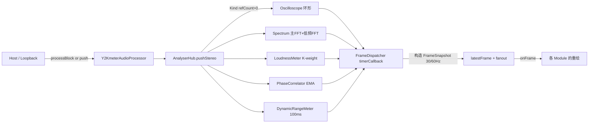

# Y2Kmeter 项目全景简介（AI 上下文导航文档）

> 本文档是为 AI 助手上下文初始化设计的项目导航说明。阅读完本文档，你应能立刻定位到"改哪个文件、调哪个类、走哪条数据流"。

---

## 1. 项目概述

### 1.1 项目定位
- **产品名**：`Y2Kmeter` （版本：`1.8.2`）
- **产品形态**：一款 **音频分析仪/音频计量插件**（纯分析，不产生音频输出的插件模式），带有强烈的 **Y2K / Windows 95-98-XP 像素复古粉色（Pink XP）** 视觉主题。
- **产品分类**：`VST3_CATEGORIES = "Analyzer" "Fx"`（DAW 分类中会被识别为分析仪）。
- **发行形态**（在 [CMakeLists.txt](/I:/Y2KMeter/CMakeLists.txt) 中通过 `juce_add_plugin` 定义）：
  - **Windows**：`VST3` + `Standalone` 独立应用
  - **macOS**：`VST3` + `Standalone` + `AU`
  - **BundleID / VST3 Plug ID**：`cn.iisaacbeats.Y2Kmeter`
- **开源协议**：GPL-3.0（详见 [LICENSE](/I:/Y2KMeter/LICENSE)）。

### 1.2 主要功能一览
- 立体声电平表（RMS L/R + True Peak L/R）
- ITU-R BS.1770-4 响度计（LUFS-M / LUFS-S / LUFS-I）
- 立体声相位相关仪（Correlation / Width / Balance / Goniometer）
- 动态范围检测（Peak / RMS / Crest / Short-DR / Integrated-DR）
- 高精度频谱分析仪（对数轴 20Hz~20kHz、双路 FFT：2048 主路 + 8192 低频路）
- 频谱瀑布图（Spectrogram，像素方格风格）
- 立体声示波器（Waveform / X-Y / Lissajous）
- 持续滚动瀑布波形（Waveform Module）
- 模拟指针 VU 表（VuMeterModule）
- Y2K 主题的 EQ 频谱可视化（**注意：仅可视化，不做实际 EQ 处理**）
- **Tamagotchi 电子宠物模块**（用音频信号驱动的一只像素小怪，含孵化 / 觅食 / 睡眠 / 生病 / 死亡等状态机）
- 用户可以拖入图片生成"拼豆像素画"贴到桌面背景

### 1.3 技术栈
| 项目 | 版本 / 说明 |
| --- | --- |
| 语言 | C++17（`CMAKE_CXX_STANDARD 17`，`CXX_EXTENSIONS OFF`） |
| 框架 | **JUCE 8.0.12**（通过 `FetchContent` 自动拉取） |
| DSP | `juce::dsp`（FFT、Windowing） |
| GPU | `juce::juce_opengl`（Editor 挂 `OpenGLContext`，绘制走 GPU） |
| 构建 | CMake ≥ 3.22 |
| Windows CRT | 强制静态 CRT（`MultiThreaded`，避免依赖 VC_redist） |
| macOS 语言扩展 | Objective-C++（`.mm` 文件走 ScreenCaptureKit 桌面音频采集） |
| 安装器 | Inno Setup（[Y2Kmeter_installer.iss](/I:/Y2KMeter/Y2Kmeter_installer.iss)） |
| 字体 | `Silkscreen-Regular.ttf`（像素英文字体，通过 `juce_add_binary_data` 打包） |
| 项目性能特性 | 支持 **LTO/IPO** + **PGO**（`Y2K_ENABLE_LTO`、`Y2K_PGO_MODE`）|
| 特殊宏 | `Y2K_ENABLE_PERF_COUNTERS=0`（发布版关闭性能计数）、`JUCE_USE_CUSTOM_PLUGIN_STANDALONE_APP=1`（用自定义 Standalone 外壳） |

---

## 2. 核心分层架构

```
┌────────────────────────────────────────────────────────────────┐
│  Standalone 外壳（source/standalone）                            │
│    Y2KStandaloneApp / WasapiLoopbackCapture / MacDesktopCapture │
│    · 无边框 Y2K 窗口 / 系统输出 Loopback 采集                     │
├────────────────────────────────────────────────────────────────┤
│  Plugin 层                                                       │
│    Y2KmeterAudioProcessor  (PluginProcessor.h/cpp)              │
│      ↑ 音频线程 processBlock 拉数据                              │
│    Y2KmeterAudioProcessorEditor (PluginEditor.h/cpp)            │
│      ↑ UI 线程 承载 ModuleWorkspace                              │
├────────────────────────────────────────────────────────────────┤
│  Analysis 层（source/analysis）                                  │
│    AnalyserHub —— 中央调度枢纽                                   │
│      · LoudnessMeter / PhaseCorrelator / DynamicRangeMeter      │
│      · 主/低频双路 FFT + 立体声示波器环形缓冲                     │
│      · Kind 引用计数（按需计算）+ FrameSnapshot（一帧一份）       │
├────────────────────────────────────────────────────────────────┤
│  UI 框架层（source/ui）                                          │
│    ModuleWorkspace —— 所有分析模块的拖拽工作区                   │
│    ModulePanel     —— 所有模块的基类（像素窗口外观）              │
│    PinkXPStyle     —— 主题系统 + LookAndFeel                    │
│    UiFrameClock    —— 自适应帧率的 UI 时钟                       │
├────────────────────────────────────────────────────────────────┤
│  Modules 层（source/ui/modules）                                 │
│    EqModule / LoudnessModule / OscilloscopeModule /             │
│    SpectrumModule / PhaseModule / DynamicsModule /              │
│    WaveformModule / SpectrogramModule / VuMeterModule /         │
│    FineSplitModules（LUFS / TruePeak / OscL / OscR / …）/       │
│    TamagotchiModule                                             │
├────────────────────────────────────────────────────────────────┤
│  Perf 层（source/perf）                                          │
│    PerformanceCounterSystem —— 性能计数系统（默认关闭）           │
└────────────────────────────────────────────────────────────────┘
```

### 2.1 关键调用关系
1. **音频入口 → 分析**：`Y2KmeterAudioProcessor::processBlock` → `AnalyserHub::pushStereo` → 分发到 5 路：`Oscilloscope / Spectrum / Loudness / Phase / Dynamics`。
2. **UI 拉分析结果**：`AnalyserHub` 内部 `FrameDispatcher` 每 33ms（30Hz，可提升到 60Hz）在 UI 线程构造一个 `FrameSnapshot`，通过 `FrameListener::onFrame(frame)` 派发给所有订阅的模块。
3. **模块的 UI 生命周期**：模块继承 `ModulePanel + AnalyserHub::FrameListener`，构造时 `hub.retain(Kind::xxx)` + `hub.addFrameListener(this)`，析构时对称 release + remove。**未加载的模块 → 引用计数为 0 → `pushStereo` 自动跳过对应计算路径**。
4. **Standalone 音频源**：`Y2KStandaloneApp` 通过 `WasapiLoopbackCapture`（Win）或 `MacDesktopAudioCapture`（macOS 使用 ScreenCaptureKit）获取"系统外放音频"，直接 push 到 `AnalyserHub`（不走 `processBlock`）。DAW 场景则由宿主经 `processBlock` 送入。

---

## 3. 代码结构说明

### 3.1 根目录关键文件
| 文件 | 作用 |
| --- | --- |
| [CMakeLists.txt](/I:/Y2KMeter/CMakeLists.txt) | CMake 主构建脚本；含 macOS 图标流水线、字体打包、平台条件源、LTO/PGO |
| [CMakePresets.json](/I:/Y2KMeter/CMakePresets.json) | CMake 预设集合（含 clangd 用的 Ninja preset） |
| [PluginProcessor.h/.cpp](/I:/Y2KMeter/PluginProcessor.h) | 顶层 `AudioProcessor`；持有 `AnalyserHub` 与状态持久化逻辑 |
| [PluginEditor.h/.cpp](/I:/Y2KMeter/PluginEditor.h) | 顶层 `AudioProcessorEditor`；Pink XP 外壳 + 自画标题栏 + `ModuleWorkspace` 托管 |
| [Y2Kmeter_installer.iss](/I:/Y2KMeter/Y2Kmeter_installer.iss) | Windows Inno Setup 安装器脚本 |
| [assets/](/I:/Y2KMeter/assets) | Logo、图标、Tamagotchi 精灵图（角色 20 只 × 33 动作 + 蛋 8 款） |
| [ttf/](/I:/Y2KMeter/ttf) | 打包用像素字体 |

### 3.2 `source/analysis`（音频分析）
| 文件 | 类 / 关键实现 |
| --- | --- |
| [AnalyserHub.h](/I:/Y2KMeter/source/analysis/AnalyserHub.h) | `LoudnessMeter` / `PhaseCorrelator` / `DynamicRangeMeter` / `AnalyserHub`（**注意**：为了绕过 MSVC include-guard 串扰，四个类都塞进了同一个头，实现分散在各自 cpp）|
| [AnalyserHub.cpp](/I:/Y2KMeter/source/analysis/AnalyserHub.cpp) | `AnalyserHub::pushStereo` 主路+低频路双 FFT、`FrameDispatcher` 内部 Timer、Kind 引用计数、FrameSnapshot 组装与广播 |
| [LoudnessMeter.cpp](/I:/Y2KMeter/source/analysis/LoudnessMeter.cpp) | K-weighting 双级 IIR + 400ms 动量 LUFS、3s 短期、全程积分（含相对门限）、100ms RMS、4× 过采样 True Peak |
| [PhaseCorrelator.cpp](/I:/Y2KMeter/source/analysis/PhaseCorrelator.cpp) | EMA 滑动窗计算 correlation / width / balance |
| [DynamicRangeMeter.cpp](/I:/Y2KMeter/source/analysis/DynamicRangeMeter.cpp) | 100ms 块统计 + top-20% 分位 short-DR / integrated-DR |

### 3.3 `source/ui`（UI 框架）
| 文件 | 关键内容 |
| --- | --- |
| [ModuleWorkspace.h](/I:/Y2KMeter/source/ui/ModuleWorkspace.h) | `ModuleType` 枚举 / `ModulePanel` 基类 / `ModuleWorkspace` 主类 / `ThemeSwatchBar` / `HideChromeButton`（**同一个头包含多个类**，同样为绕过 MSVC 串扰）|
| [ModuleWorkspace.cpp](/I:/Y2KMeter/source/ui/ModuleWorkspace.cpp) | 拖拽 / 网格吸附 / 布局持久化 / 拼豆图片 / 底部 toolbar / 添加菜单 / 鼠标事件 |
| [ModulePanel.cpp](/I:/Y2KMeter/source/ui/ModulePanel.cpp) | 各模块统一的像素窗口：标题栏 + 关闭按钮 + 边缘/角拖拽缩放 + 右下 CPU 小字 |
| [ModulePanel.h](/I:/Y2KMeter/source/ui/ModulePanel.h) | **只是一个兼容 shim**，内部只 `#include "source/ui/ModuleWorkspace.h"` |
| [PinkXPStyle.h/.cpp](/I:/Y2KMeter/source/ui/PinkXPStyle.h) | 主题调色板（10 个主题）+ 桌面纹理（棋盘/星星/网格/圆点/泡泡/斜条纹）+ `PinkXPLookAndFeel` |
| [UiFrameClock.h/.cpp](/I:/Y2KMeter/source/ui/UiFrameClock.h) | 统一 UI 帧时钟（阶段1性能改造，目前尚未强制接线，主流数据流仍走 `AnalyserHub::FrameDispatcher`） |

### 3.4 `source/ui/modules`（分析模块 UI）
每个模块都是 `ModulePanel + AnalyserHub::FrameListener` 双继承。

| 文件 | 模块 | 数据源 |
| --- | --- | --- |
| [EqModule.h/.cpp](/I:/Y2KMeter/source/ui/modules/EqModule.h) | `EqModule`（Y2K 像素频谱可视化，非真实 EQ） | `Spectrum` |
| [LoudnessModule.h/.cpp](/I:/Y2KMeter/source/ui/modules/LoudnessModule.h) | `LoudnessModule`（LUFS-M/S/I + Peak L/R 五柱） | `Loudness` |
| [OscilloscopeModule.h/.cpp](/I:/Y2KMeter/source/ui/modules/OscilloscopeModule.h) | `OscilloscopeModule`（Wave / XY / Lissajous） | `Oscilloscope` |
| [SpectrumModule.h/.cpp](/I:/Y2KMeter/source/ui/modules/SpectrumModule.h) | `SpectrumModule`（对数频谱 + peak hold + slope） | `Spectrum` |
| [PhaseModule.h/.cpp](/I:/Y2KMeter/source/ui/modules/PhaseModule.h) | `PhaseModule`（Goniometer + Correlation Dial + Width/Balance Bar） | `Phase` + `Oscilloscope` |
| [DynamicsModule.h/.cpp](/I:/Y2KMeter/source/ui/modules/DynamicsModule.h) | `DynamicsModule`（Peak/RMS 四柱 + DR + Crest 历史） | `Dynamics` |
| [WaveformModule.h/.cpp](/I:/Y2KMeter/source/ui/modules/WaveformModule.h) | `WaveformModule`（滚动瀑布波形，像素列） | `Oscilloscope` |
| [SpectrogramModule.h/.cpp](/I:/Y2KMeter/source/ui/modules/SpectrogramModule.h) | `SpectrogramModule`（像素方格频谱瀑布图，双路 FFT 合成） | `Spectrum` |
| [FineSplitModules.h/.cpp](/I:/Y2KMeter/source/ui/modules/FineSplitModules.h) | 细粒度拆分：`LufsRealtime` / `TruePeak` / `OscilloscopeChannel` / `PhaseCorrelation` / `PhaseBalance` / `DynamicsMeters` / `DynamicsDr` / `DynamicsCrest` / `VuMeter` | 视模块而定 |
| [TamagotchiModule.h/.cpp](/I:/Y2KMeter/source/ui/modules/TamagotchiModule.h) | `TamagotchiModule`（宠物状态机 + 精灵图动画） | `Loudness`（用信号强度驱动饥饿/健康）|

### 3.5 `source/standalone`（Standalone App）
| 文件 | 作用 |
| --- | --- |
| [Y2KStandaloneApp.cpp](/I:/Y2KMeter/source/standalone/Y2KStandaloneApp.cpp) | 自实现 `juce::JUCEApplication` + `Y2KMainWindow`（DocumentWindow）替换 JUCE 内建的 `StandaloneFilterApp`；启动 → 加载 settings → 创建 Processor+Editor → 绑定 Loopback 音源 → 恢复主题/FPS/位置/尺寸/固定态 |
| [WasapiLoopbackCapture.h/.cpp](/I:/Y2KMeter/source/standalone/WasapiLoopbackCapture.h) | Windows：裸 WASAPI + `AUDCLNT_STREAMFLAGS_LOOPBACK`，采集"系统默认播放端点"输出，输出统一立体声 float32 |
| [MacDesktopAudioCapture.h/.mm](/I:/Y2KMeter/source/standalone/MacDesktopAudioCapture.h) | macOS：`ScreenCaptureKit` 获取桌面音频（Objective-C++） |
| [AudioDumpRecorder.h/.cpp](/I:/Y2KMeter/source/standalone/AudioDumpRecorder.h) | **仅 macOS**，通过环境变量 `Y2KM_AUDIO_DUMP` 系列开启，把音频原样落盘做调试 |

### 3.6 `source/perf`
| 文件 | 作用 |
| --- | --- |
| [PerformanceCounterSystem.h/.cpp](/I:/Y2KMeter/source/perf/PerformanceCounterSystem.h) | 全局性能计数系统（发布版 `Y2K_ENABLE_PERF_COUNTERS=0` 关闭）；提供 `ScopedPerfTimer`、`ScopedLockWaitMeasure` 用于埋点 |

---

## 4. 关键类 / 接口清单

### 4.1 `Y2KmeterAudioProcessor`（[PluginProcessor.h](/I:/Y2KMeter/PluginProcessor.h)）
- 音频线程接口：`prepareToPlay`、`processBlock`、`releaseResources`。
- 关键成员：`std::unique_ptr<AnalyserHub> analyserHub;`（**pimpl 隐藏**，头文件里只前向声明）。
- 状态持久化（`getStateInformation` / `setStateInformation`）：
  - 顶层 XML 根 `<PBEQ_State>`，含 `analysisInputGainDb`、`editorW/editorH` 属性；
  - 子节点 `<PBEQ_Layout>` 承载 `ModuleWorkspace` 布局（模块位置 / 拼豆图 / 主题 / FPS 等）。
- 分析开关：`setAnalysisActive(false)` 时 `processBlock` 完全跳过分析（UI 不可见时用）。
- CPU 负载：`getCpuLoad()` 供每个模块右下角显示；Loopback 路径用 `registerLoopbackRenderTime` 通道注入。
- 分析前置增益：`setAnalysisInputGainDb / getAnalysisInputGainLinear`（-10 ~ +36 dB），只作用于分析路径，不改变透传输出。
- **P4 flush 钩子**：`flushPendingUiStateBeforeSave`（Editor 注册；`getStateInformation` 前 flush 掉 workspace 的 debounce 布局变更）。

### 4.2 `AnalyserHub`（[AnalyserHub.h](/I:/Y2KMeter/source/analysis/AnalyserHub.h)）
- **枚举** `AnalyserHub::Kind`：`Oscilloscope=0 / Spectrum=1 / Loudness=2 / Phase=3 / Dynamics=4 / NumKinds=5`。
- **引用计数** `retain(Kind)` / `release(Kind)` / `isActive(Kind)` —— UI 线程调用；`pushStereo` 里读原子决定是否跳过某路计算。
- **FrameSnapshot**：一帧一份聚合数据（`activeMask`、`tickCount`、示波器 L/R 2048 样本、频谱 mag 1024/4096、Loudness/Phase/Dynamics 快照）。
- **FrameDispatcher**（pimpl）：默认 30Hz `juce::Timer`；`startFrameDispatcher(hz)` 可改频（Editor 会随 FPS 按钮切到 60Hz，且做**自适应降/升档**）。
- **模块订阅**：`addFrameListener(listener)` / `removeFrameListener`；每帧 UI 线程回调 `onFrame(const FrameSnapshot&)`。
- **兼容旧接口**：`getOscilloscopeSnapshot / getSpectrumSnapshot / getSpectrumMagnitudes(Lo) / getSpectrumMagnitudesBlended`。
- **常量**：`fftOrder=11 (2048)`，`fftOrderLo=13 (8192)`，`spectrumXoverHz=500Hz`，`oscilloscopeBufferSize=2048`，`spectrumBins=160`。

### 4.3 `Y2KmeterAudioProcessorEditor`（[PluginEditor.h](/I:/Y2KMeter/PluginEditor.h)）
- 关键子成员：`std::unique_ptr<ModuleWorkspace> workspace;`（pimpl 前向声明）。
- 双形态区分：`const bool isPluginHost;`（VST3/AU/AAX/LV2 → true；Standalone → false）。
  - **插件模式**下：不画自画标题栏、不接管窗口拖拽 / 关闭 / 置顶，隐藏"信号源"下拉与布局预设（保留 Save/Load）。
  - **Standalone 模式**下：完整 Y2K 外壳（标题栏 + 三按钮 + 无边框窗口拖拽 + 系统 Loopback）。
- **GPU**：类末尾持有 `juce::OpenGLContext openGLContext;`，构造末尾 `attachTo(*this)`，析构起始 `detach()`。
- **自适应 FPS**：`applyAdaptiveFrameRate(measuredFps)`；用户目标 30/60，动态在 20/24/30/45/60 Hz 之间下探/回升。
- **持久化协作**：Editor 构造时读 `Processor.getSavedLayoutXml` 恢复布局；`workspace->onLayoutChanged` → 写回 Processor。
- **Windows Direct2D 处理**：首次 `visibilityChanged` 时通过 `renderingEngineConfigured` flag 强制切换到软光栅/GDI，规避 AMD `atidxx64.dll` 卸载死锁（详见头文件相关注释）。
- **Chrome 隐藏态**：Hide 按钮收缩窗口；实现"幂等化" —— Hide 前完整快照 bounds 与 resizeLimits，Show 时直接 setBounds 回快照，避免累积漂移。
- **双击标题栏切换全屏**（v1.8.2 新增）：`mouseDoubleClick` 中命中 `getTitleBarBounds()` 且避开三个按钮与标题文字热区后，对顶层窗口 `dynamic_cast<juce::ResizableWindow*>` 调用 `setFullScreen(!isFullScreen())`；仅 Standalone 非 chrome 隐藏态下生效，插件宿主模式不劈持。切换前先把 `draggingWindow=false` 复位，避免上一帧 `mouseDown` 启动的 `windowDragger` 残留拖拽态。
- 顶部三按钮几何：`getCloseButtonBounds / getPinButtonBounds / getMinimiseButtonBounds`；chrome 隐藏态特殊：`getFloatingCloseButtonBounds`。
- **Tamagotchi 保活**：只有当工作区存在 Tamagotchi 模块时，Editor 才 `hub.retain(Kind::Loudness)` 保持信号驱动状态机。

### 4.4 `ModuleWorkspace`（[ModuleWorkspace.h](/I:/Y2KMeter/source/ui/ModuleWorkspace.h)）
- **模块工厂**：`setModuleFactory(f)`，Editor 侧会按 `ModuleType` 构造具体 `ModulePanel` 派生类（见 [PluginEditor.cpp](/I:/Y2KMeter/PluginEditor.cpp) 的 `createModule`）。
- **底部 Toolbar 组件**（自左至右）：`ThemeSwatchBar` → 布局预设下拉 + Save/Load → Grid → FPS → GAIN → Source → Hide。
- **布局预设** `LayoutPreset`：`defaultGrid=1 / horizontalFull=2 / horizontalBottom=3 / tiled=4`。
- **拼豆像素画（PerlerImage）**：拖入图片 → 按 `cellSize`（默认 4，范围 1..15）降采样 + 每格取原图平均色 → 生成像素画 → 作为 canvas 底图；每张贴画对应一个 `PerlerImageLayer` 子 Component 与模块**同 z-order 层级**。
- **P4 debounce**：`LayoutChangeCoalescer`（16ms 单发计时器），大量小改动只派发 1 次 `onLayoutChanged`。
- **hit-test 挖洞**：`setHitTestHoles`，chrome 隐藏态下让浮层按钮的鼠标事件冒泡回 Editor。
- **Add-Menu Hover 预览**：右键/双击空白区弹菜单，hover 到某模块名时在鼠标位置绘制半透明预览快照，缓存已渲染的 `Image`。
- **音频源下拉**（Standalone）：`setAudioSourceItems(items, selectedId)`，回调 `onAudioSourceChanged(sourceId, isLoopback)`。

### 4.5 `ModulePanel`（[ModuleWorkspace.h](/I:/Y2KMeter/source/ui/ModuleWorkspace.h)）
- 派生类通过 `paintContent` / `layoutContent` 定制绘制与布局；基类负责标题栏/关闭按钮/拖拽缩放/CPU 小字。
- 尺寸约束：`minSize`（默认 64×64）与 `defaultSize`（每个派生类通过 `setDefaultSize` 声明）。
- `isVisuallyActiveInWorkspace()`：判断模块是否真的在 workspace 可见区，用于跳过重绘。

### 4.6 `PinkXP`（[PinkXPStyle.h](/I:/Y2KMeter/source/ui/PinkXPStyle.h)）
- **10 种主题**：`bubblegum / starlight / cyberLilac / tangerinePop / aquaPearl / matchaSoda / winXP / crimsonNoir / voidGrey / paperGrey`。
- **主题订阅**：`subscribeThemeChanged(cb) → token`，用于组件切主题时刷新缓存的颜色。
- **桌面纹理共享缓存**：`getSharedDesktopTexture(w,h)` 跨实例复用（多插件实例共用同一张 Image），主题切换时 `invalidateDesktopTextureCache()`。
- **两种字体接口**：`getFont(h)` 有 1.5x 放大（正文）；`getAxisFont(h)` 保持原大小（坐标轴刻度专用）。

---

## 5. 业务逻辑流程

### 5.1 音频 → 分析 → UI 数据流



**关键点**：
1. `pushStereo` 每次调用只做**引用计数 > 0** 的路径。
2. `FrameDispatcher` 是 UI 线程 `juce::Timer`；每 tick 拉取所有活跃 Kind 的最新快照 → 组装 `FrameSnapshot` → 通过 `SpinLock` 原子发布到 `latestFrame`（`shared_ptr<const FrameSnapshot>`）→ 依次调 `frameListeners[i]->onFrame(frame)`。
3. 每个模块的 `onFrame` 里通常只做数据缓存 + `repaint(dirty)`，重绘节流由 `lastRepaintMs` 或 `tickCount % N` 控制。

### 5.2 Standalone 启动流程（[Y2KStandaloneApp.cpp](/I:/Y2KMeter/source/standalone/Y2KStandaloneApp.cpp)）

```
main
 → START_JUCE_APPLICATION(Y2KStandaloneApp)
 → Y2KStandaloneApp::initialise:
     1. 加载 PropertiesFile / .settings
     2. 创建 Y2KmeterAudioProcessor
     3. new Y2KMainWindow（DocumentWindow，无边框）
     4. Editor = processor.createEditor()
     5. 从 settings 恢复：主题、FPS、窗口位置/尺寸、alwaysOnTop、chromeVisible、Loopback 选择
     6. 启动 WasapiLoopbackCapture（Win）/ MacDesktopAudioCapture（macOS）
     7. onAudio callback → hub.pushStereo + processor.registerLoopbackRenderTime
 → shutdown:
     1. 停 loopback（thread join）
     2. deleteEditorImmediately
     3. delete processor
     4. 保存 settings
```

### 5.3 布局持久化流程

```
用户操作模块（拖动 / 缩放 / 添加 / 删除 / 拼豆图）
  → ModulePanel 或 ModuleWorkspace notifyLayoutChanged
  → LayoutChangeCoalescer.startTimer(16ms)     // 抑动合并
  → 16ms 后 dispatchLayoutChangeNow
  → workspace.onLayoutChanged 回调
  → Editor 里 processor.setSavedLayoutXml(xml)
  → 之后 host 调 getStateInformation 时会先触发 flushPendingUiStateBeforeSave 强制立刻 flush
  → getStateInformation 序列化到 host state
```

### 5.4 主题切换流程

```
用户点 ThemeSwatchBar 色票
  → PinkXP::applyTheme(id)
  → 全局调色板变量（pink50..pink700, ink, sel, desktop, ...）就地覆盖
  → PinkXP::invalidateDesktopTextureCache()（下一帧重烘焙）
  → 触发所有 ThemeChangedCallback（组件订阅重绘）
  → workspace.hoverPreviewCache 全部失效（下次 hover 重新渲染）
```

---

## 6. 特殊约定与注意事项

### 6.1 头文件合并（**极其重要**）
项目里存在几处"多个类合并到同一个头文件"的**违反常规的做法**，原因是 **绕过 MSVC 多文件同批编译时的 include-guard 跨 TU 串扰问题**：

- [source/analysis/AnalyserHub.h](/I:/Y2KMeter/source/analysis/AnalyserHub.h) 里同时定义了 `LoudnessMeter`、`PhaseCorrelator`、`DynamicRangeMeter`、`AnalyserHub`。
- [source/ui/ModuleWorkspace.h](/I:/Y2KMeter/source/ui/ModuleWorkspace.h) 里同时定义了 `ModuleType` / `ModulePanel` / `ModuleWorkspace` / `ThemeSwatchBar` / `HideChromeButton`。
- [source/ui/ModulePanel.h](/I:/Y2KMeter/source/ui/ModulePanel.h) 只是**兼容 shim**，唯一作用是 `#include "source/ui/ModuleWorkspace.h"`。

⚠️ **修改建议**：不要拆散这些头；如需在头里前置声明多个类、或者需要新增强关联的类，请合并到同一头。

### 6.2 pimpl 前向声明约定
- `Y2KmeterAudioProcessor` 的 `analyserHub` 成员：**头里只前向声明** `class AnalyserHub;`，完整定义只在 cpp 中出现。
- `Y2KmeterAudioProcessorEditor` 的 `workspace` 成员同样处理。
- `AnalyserHub` 的 `FrameDispatcher` 也是 pimpl，隐藏 `juce::Timer` 依赖。

### 6.3 音频线程约束
- `pushStereo`、`processBlock`、`registerLoopbackRenderTime` 必须**无锁 / 无堆分配 / 无系统调用**。
- 重要设计：
  - 分析前置增益临时缓冲 `analysisGainBufferStereo/Mono` 在 `prepareToPlay` 里预分配，`processBlock` 只 `setSize` 兜底。
  - 用户改增益 → `pendingLoudnessReset.store(true)` → 音频线程下一帧消费并 `resetLoudness()`（避免 UI 线程碰 loudness 内部积分器）。
  - 快照发布走 `SpinLock` + `shared_ptr swap`（MSVC C++17 下 `std::atomic<shared_ptr>` 不可用）。

### 6.4 平台差异
- **Windows**：
  - 强制静态 CRT（`MultiThreaded` / `MultiThreadedDebug`）—— 干净 Win10/11 免装 VC redist。
  - 首次 Editor 可用时 **强制关闭 Direct2D 渲染**（切软光栅/GDI），规避 AMD 驱动在 DLL 卸载时的 loader lock 死锁。
  - Standalone Loopback 用裸 WASAPI + `AUDCLNT_STREAMFLAGS_LOOPBACK`。
  - 链接 `ole32 / uuid / avrt`。
- **macOS**：
  - 启用 Objective-C++（`enable_language(OBJCXX)`），仅编译 `.mm` 文件时用。
  - 桌面音频走 `ScreenCaptureKit`（macOS 13+）；链接 `ScreenCaptureKit / AVFoundation / CoreMedia / Foundation`。
  - macOS 图标流水线：`assets/icon.ico` → sips 解码 PNG → `scripts/macos_iconize.m` 渲染圆角 squircle → iconutil 打包 `Icon.icns`。
  - Tamagotchi 精灵图运行期从 bundle `Contents/Resources/assets/Tamagotchi/` 读取（构建时 `POST_BUILD` 由 CMake 复制到 `.vst3` 与 `.app`）。
  - 额外构建 AU 插件；`AudioDumpRecorder` 通过环境变量 `Y2KM_AUDIO_DUMP*` 开启调试转储。

### 6.5 GPU / OpenGL
- Editor 类末尾持有 `juce::OpenGLContext openGLContext`，**必须放在类末尾**（保证反向析构顺序时最先 detach）。
- 构造末尾 `openGLContext.attachTo(*this)`，析构最开始显式 `detach()` 兜底。
- 插件宿主与 Standalone **共用**，宿主下 JUCE 会为 Editor 创建 GL 子层不影响宿主窗口其余部分。

### 6.6 性能优化点
- 大部分 UI 模块 **禁止在 `onFrame` 里直接 repaint 全画面**，都用 `lastRepaintMs` 节流 或 `tickCount % 2 == 0` 分频。
- `LoudnessModule` / `OscilloscopeModule` 等采用 **静态层缓存**（`staticLayer` juce::Image）：只在尺寸/主题变化时重建，帧循环里只 `drawImageAt`。
- `SpectrogramModule` 的方案 B：把 grid 强度写入离屏 Image，paint 用一次 `drawImage` 完成，避免 rows×cols 次 fillRect。
- 模块**按需计算**：模块加载 → `hub.retain(Kind)` → 卸载 → `hub.release(Kind)`。全 5 路引用计数为 0 时，`pushStereo` 里对应分支被跳过。
- `AnalysisActive` 开关：Editor 的 `visibilityChanged` 决定；宿主折叠/切换轨道时 UI 不可见，直接跳过整段分析。

### 6.7 编译期宏
| 宏 | 默认值 | 作用 |
| --- | --- | --- |
| `Y2K_ENABLE_PERF_COUNTERS` | 0（发布） | 关闭性能计数系统；`ScopedPerfTimer` / `recordEvent` 变 no-op |
| `JUCE_USE_CUSTOM_PLUGIN_STANDALONE_APP` | 1 | 关闭 JUCE 内建 StandaloneFilterApp，改用 `Y2KStandaloneApp` |
| `JUCE_PLUGINHOST_ARA` / `JUCE_PLUGINHOST_LV2` | 0 | 关闭 ARA/LV2 宿主集成，减小二进制 |
| `JUCE_VST3_CAN_REPLACE_VST2` | 0 | 不做 VST2 兼容 |
| `Y2K_ENABLE_LTO` | ON | Release 启用 LTO/IPO |
| `Y2K_PGO_MODE` | OFF | 可切 GENERATE / USE 做 PGO |

### 6.8 版本号 / Bundle ID 一致性
- CMake 里 `project(... VERSION 1.8.2)` 与 `juce_add_plugin(... VERSION 1.8.2)` **必须一致**，任何版本号变更都要同步这两处以及 [Y2Kmeter_installer.iss](/I:/Y2KMeter/Y2Kmeter_installer.iss) 里的版本字段，**同时**修改 [PluginEditor.cpp](/I:/Y2KMeter/PluginEditor.cpp) 里 3 处 `"v1.8.x"` 字面量（getStringWidth 一处 + `versionText` 两处）。
- `BUNDLE_ID = cn.iisaacbeats.Y2Kmeter` **不要改**，改了会导致所有用户 DAW 里的插件实例丢失识别。

### 6.9 Tamagotchi 资源约定
- 精灵图目录：[assets/Tamagotchi/](/I:/Y2KMeter/assets/Tamagotchi)
  - `role/` 原始角色大图（20 只）
  - `role_cut_by_xlsx_40x40/{RoleName}/` 每只角色 33 个动作切图（40×40 像素）
  - `egg/` + `egg_38x38/` 8 款蛋（4 帧孵化动画）
- 运行时通过 `TamagotchiModule::findTamagotchiSubDir` 定位，优先 macOS bundle → 兜底源仓库路径。

### 6.10 存在但已废弃/预留的符号
- `SpectrumOverviewModule_REMOVED`：空壳，**不要引用**。
- `UiFrameClock`：源码已入库但当前**未强制接线**（模块仍走 `AnalyserHub::FrameDispatcher`）。作为后续统一节拍器的迁移目标存在。

### 6.11 JUCE API 所属类小坑（➔ v1.8.2 新增双击全屏时踩到）
- `setFullScreen(bool)` / `isFullScreen()` 定义在 `juce::ResizableWindow`（及其基类 `ComponentPeer` 上的 pure virtual），**不在** `juce::Component`、**也不在** `juce::TopLevelWindow` 上。写 `top->setFullScreen(...)` 会直接 MSVC 报 C2039。正确写法：`if (auto* rw = dynamic_cast<juce::ResizableWindow*>(top)) rw->setFullScreen(...)`，逐级降到 `getPeer()->setFullScreen(...)` 做 fallback。【教训】clangd 报"无法解析符号"时不要盲信它是假阳性，优先去 JUCE 源码 `_deps/juce-src/modules/juce_gui_basics` 里 `grep` 一下验证 API 真实归属。

---

## 7. 常见修改场景速查

| 场景 | 首选修改点 |
| --- | --- |
| 新增一种分析计算 | `AnalyserHub` 里加 `Kind`、加 pushStereo 分支、加 FrameSnapshot 字段 |
| 新增一个模块类型 | 1) `ModuleWorkspace.h` 的 `ModuleType` 枚举扩展；2) `moduleTypeToString`/`stringToModuleType`；3) `getModuleDisplayName`；4) `PluginEditor.cpp` 的 `createModule` 工厂加 case；5) `availableTypes` 数组补录；6) 新增 `source/ui/modules/XxxModule.h/.cpp` |
| 加一个主题 | `PinkXPStyle.h` `ThemeId` 加枚举；`PinkXPStyle.cpp` `getAllThemes()` 追加 `Theme` 结构；`ThemeSwatchBar` 会自动展现 |
| 修改音频前置增益范围 | `PluginProcessor.cpp` 的 `clampGainDb`（当前 -10..+36 dB）+ `ModuleWorkspace` 里 gainSlider 的 setRange |
| 换字体 | `CMakeLists.txt` 的 `Y2KM_FONT_EN_SRC`；`PinkXP::loadActiveTypeface` 里 BinaryData 引用 |
| 调 FPS 分档策略 | [PluginEditor.cpp](/I:/Y2KMeter/PluginEditor.cpp) 的 `applyAdaptiveFrameRate` |
| 改布局持久化 XML 结构 | `Y2KmeterAudioProcessor::getStateInformation` + `ModuleWorkspace::saveLayoutTree/loadLayoutFromTree` |
| Standalone 启动时初始化 | [Y2KStandaloneApp.cpp](/I:/Y2KMeter/source/standalone/Y2KStandaloneApp.cpp) 的 `initialise()`（1.15) 主题恢复 / 恢复 FPS / 恢复 Loopback 选择等散落于此）|

---

## 8. 附：目录树（简化版）

```
I:/Y2KMeter/
├── CMakeLists.txt              ─ 主构建脚本（含 macOS 图标流水线）
├── CMakePresets.json
├── PluginProcessor.h/.cpp      ─ 顶层 AudioProcessor
├── PluginEditor.h/.cpp         ─ 顶层 Editor（Pink XP 外壳 + 大文件 117KB）
├── Y2Kmeter_installer.iss      ─ Windows Inno Setup 安装器
├── MACOS_ADAPTATION_DIFFS.md   ─ macOS 适配差异说明
├── README.md                   ─ 简要项目说明
├── assets/
│   ├── icon.ico  logo.png  app_icon.rc
│   └── Tamagotchi/             ─ 20 角色 × 33 动画 + 8 款蛋 精灵图
├── ttf/  Silkscreen-Regular.ttf
└── source/
    ├── analysis/
    │   ├── AnalyserHub.h/.cpp        ─ 分析中枢 + Frame 分发（大头）
    │   ├── LoudnessMeter.cpp         ─ ITU-R BS.1770-4 K-weight
    │   ├── PhaseCorrelator.cpp
    │   └── DynamicRangeMeter.cpp
    ├── perf/
    │   └── PerformanceCounterSystem.h/.cpp
    ├── ui/
    │   ├── ModuleWorkspace.h/.cpp    ─ 拖拽工作区（.cpp 189KB）
    │   ├── ModulePanel.h/.cpp        ─ 模块基类
    │   ├── PinkXPStyle.h/.cpp        ─ 主题 + LookAndFeel
    │   ├── UiFrameClock.h/.cpp       ─ 待接线的统一帧时钟
    │   └── modules/
    │       ├── EqModule / LoudnessModule / OscilloscopeModule
    │       ├── SpectrumModule / PhaseModule / DynamicsModule
    │       ├── WaveformModule / SpectrogramModule
    │       ├── FineSplitModules（8 类细粒度模块 + VuMeter）
    │       └── TamagotchiModule（.cpp 82KB，含状态机）
    └── standalone/
        ├── Y2KStandaloneApp.cpp      ─ 自定义 JUCEApplication (69KB)
        ├── WasapiLoopbackCapture.h/.cpp   ─ Windows 系统输出采集
        ├── MacDesktopAudioCapture.h/.mm   ─ macOS ScreenCaptureKit
        └── AudioDumpRecorder.h/.cpp        ─ macOS 调试用音频转储
```

---

*本文档随着代码演进需要同步更新；若你（AI）在会话中发现文档描述与代码不一致，请以代码为准，并提示用户可能需要同步更新本文。*
