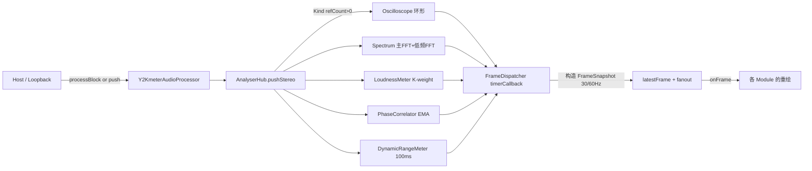
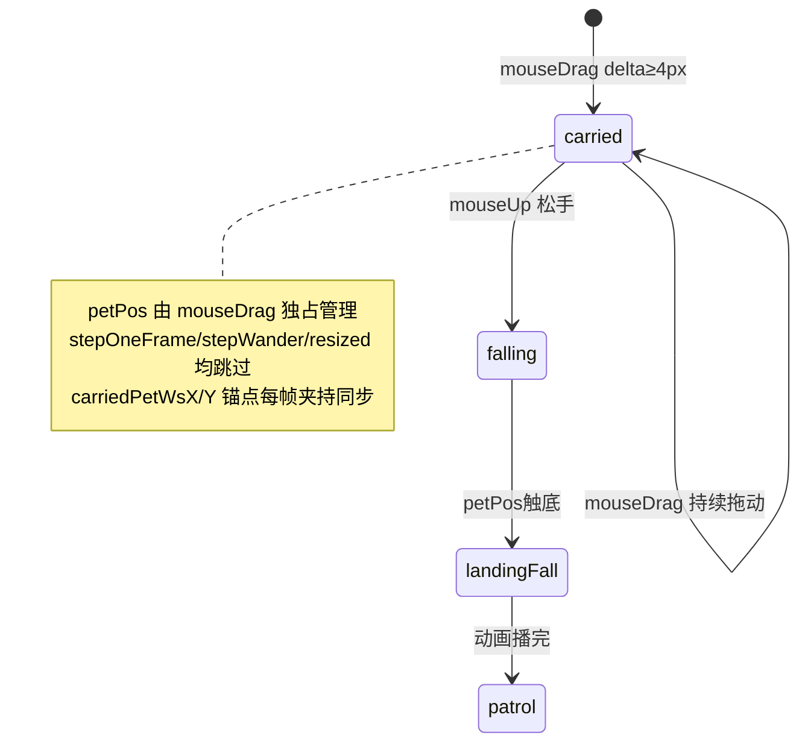

# Y2Kmeter 项目全景简介（AI 上下文导航文档）

> 本文档是为 AI 助手上下文初始化设计的项目导航说明。阅读完本文档，你应能立刻定位到"改哪个文件、调哪个类、走哪条数据流"。

---

## 1. 项目概述

### 1.1 项目定位
- **产品名**：`Y2Kmeter` （版本：`2.7.2`）
- **产品形态**：一款 **音频分析仪/音频计量插件**（纯分析，不产生音频输出的插件模式），带有强烈的 **Y2K / Windows 95-98-XP 像素复古粉色（Pink XP）** 视觉主题。
- **产品分类**：`VST3_CATEGORIES = "Analyzer" "Fx"`（DAW 分类中会被识别为分析仪）。
- **发行形态**（在 [CMakeLists.txt](/I:/Y2KMeter/CMakeLists.txt) 中通过 `juce_add_plugin` 定义）：
  - **Windows**：`VST3` + `Standalone` 独立应用
  - **macOS**：`VST3` + `Standalone` + `AU`
  - **BundleID / VST3 Plug ID**：`cn.iisaacbeats.Y2Kmeter`
- **开源协议**：GPL-3.0（详见 [LICENSE](/I:/Y2KMeter/LICENSE)）。

### 1.2 主要功能一览
- 立体声电平表（RMS L/R + True Peak L/R）
- ITU-R BS.1770-4 响度计（LUFS-M / LUFS-S / LUFS-I）
- 立体声相位相关仪（Correlation / Width / Balance / Goniometer）
- 动态范围检测（Peak / RMS / Crest / Short-DR / Integrated-DR）
- 高精度频谱分析仪（对数轴 20Hz~20kHz、双路 FFT：2048 主路 + 8192 低频路）
- 频谱瀑布图（Spectrogram，像素方格风格）
- 立体声示波器（Waveform / X-Y / Lissajous）
- 持续滚动瀑布波形（Waveform Module）
- 模拟指针 VU 表（VuMeterModule）
- Y2K 主题的 EQ 频谱可视化（**注意：仅可视化，不做实际 EQ 处理**）
- **Tamagotchi 电子宠物模块**（用音频信号驱动的一只像素小怪，含孵化 / 觅食 / 睡眠 / 生病 / 死亡等状态机）
- 用户可以拖入图片生成"拼豆像素画"贴到桌面背景
- **Milkdrop 可视化模块**（v2.5.2，基于 libprojectM 4 + offscreen FBO + 跨 FBO glBlitFramebuffer 零拷贝 GPU 管线，支持 1:1/1:2/1:4 内部降采样 + GL_LINEAR 上采样，本地 1114 个预设；新增 Standalone 脱离/浮动窗口支持；v2.7.1 新增预设收藏库 like + 切换 + 随机去重）

### 1.3 技术栈
| 项目 | 版本 / 说明 |
| --- | --- |
| 语言 | C++17（`CMAKE_CXX_STANDARD 17`，`CXX_EXTENSIONS OFF`） |
| 框架 | **JUCE 8.0.12**（通过 `FetchContent` 自动拉取） |
| DSP | `juce::dsp`（FFT、Windowing） |
| GPU | `juce::juce_opengl`（Editor 挂 `OpenGLContext`，绘制走 GPU）；Milkdrop 模块使用 libprojectM 4 native OpenGL（详见 §6.41） |
| 构建 | CMake ≥ 3.22 |
| Windows CRT | 强制静态 CRT（`MultiThreaded`，避免依赖 VC_redist） |
| macOS 语言扩展 | Objective-C++（`.mm` 文件走 ScreenCaptureKit 桌面音频采集） |
| 安装器 | Inno Setup（[Y2Kmeter_installer.iss](/I:/Y2KMeter/Y2Kmeter_installer.iss)） |
| 字体 | `Silkscreen-Regular.ttf`（像素英文字体，通过 `juce_add_binary_data` 打包） |
| 项目性能特性 | 支持 **LTO/IPO** + **PGO**（`Y2K_ENABLE_LTO`、`Y2K_PGO_MODE`）|
| 特殊宏 | `Y2K_ENABLE_PERF_COUNTERS=0`（发布版关闭性能计数）、`JUCE_USE_CUSTOM_PLUGIN_STANDALONE_APP=1`（用自定义 Standalone 外壳）、`Y2K_ENABLE_LOGGING`（仅 RelWithDebInfo 定义，见 §1.4） |

---

### 1.4 日志输出方案（开发约定）

**现状**：正式发布包（Release / Debug / MinSizeRel）**不产生任何日志文件**，也不执行日志字符串拼接；只有 **RelWithDebInfo** 构建才会启用日志并落盘。

**实现机制**（编译器开关 + 宏）：

1. `CMakeLists.txt` 中通过生成器表达式定义编译宏：
   ```cmake
   $<$<CONFIG:RelWithDebInfo>:Y2K_ENABLE_LOGGING=1>
   ```
2. [`source/Y2KLogging.h`](/I:/Y2KMeter/source/Y2KLogging.h) 定义 `Y2K_LOG(msg)` 宏：
   - 定义 `Y2K_ENABLE_LOGGING` 时 → 展开为 `juce::Logger::writeToLog(msg)`；
   - 未定义时 → 展开为 `((void)0)`，参数里的字符串拼接 / `juce::String` 构造在**预处理阶段即被丢弃**，零运行时开销。
3. Standalone 应用在 [`Y2KStandaloneApp.cpp`](/I:/Y2KMeter/source/standalone/Y2KStandaloneApp.cpp) 的 `initialise()` 中仅当 `Y2K_ENABLE_LOGGING` 定义时才挂载 `juce::FileLogger`（输出到 exe 同目录 `Y2Kmeter_debug.log`），`shutdown()` 对称卸载；相关代码全部用 `#ifdef Y2K_ENABLE_LOGGING` 包裹。

**后续开发如何加日志**：

- 直接调用 `Y2K_LOG("前缀 + " + juce::String(value));`，**不要**再直接写 `juce::Logger::writeToLog(...)`（否则脱离宏控制，Release 包也会产生字符串拼接）。
- `Y2K_LOG` 参数必须是纯字符串/拼接表达式，**禁止含副作用**（如会修改状态的函数调用），否则关闭日志的构建中副作用会被一并删除。
- 已使用 `Y2K_LOG` 的调用点：`UpdateChecker.cpp`、`Y2KStandaloneApp.cpp`、`MilkdropModule.cpp`、`ProjectMApi.cpp`、`UpdateDialog.cpp`。

---

## 2. 核心分层架构

```
┌────────────────────────────────────────────────────────────────┐
│  Standalone 外壳（source/standalone）                            │
│    Y2KStandaloneApp / WasapiLoopbackCapture / MacDesktopCapture │
│    · 无边框 Y2K 窗口 / 系统输出 Loopback 采集                     │
├────────────────────────────────────────────────────────────────┤
│  Plugin 层                                                       │
│    Y2KmeterAudioProcessor  (PluginProcessor.h/cpp)              │
│      ↑ 音频线程 processBlock 拉数据                              │
│    Y2KmeterAudioProcessorEditor (PluginEditor.h/cpp)            │
│      ↑ UI 线程 承载 ModuleWorkspace                              │
├────────────────────────────────────────────────────────────────┤
│  Analysis 层（source/analysis）                                  │
│    AnalyserHub —— 中央调度枢纽                                   │
│      · LoudnessMeter / PhaseCorrelator / DynamicRangeMeter      │
│      · 主/低频双路 FFT + 立体声示波器环形缓冲                     │
│      · Kind 引用计数（按需计算）+ FrameSnapshot（一帧一份）       │
├────────────────────────────────────────────────────────────────┤
│  UI 框架层（source/ui）                                          │
│    ModuleWorkspace —— 所有分析模块的拖拽工作区                   │
│    ModulePanel     —— 所有模块的基类（像素窗口外观）              │
│    PinkXPStyle     —— 主题系统 + LookAndFeel                    │
│    UiFrameClock    —— 自适应帧率的 UI 时钟                       │
├────────────────────────────────────────────────────────────────┤
│  Modules 层（source/ui/modules）                                 │
│    EqModule / LoudnessModule / OscilloscopeModule /             │
│    OscilloscopeWaveModule / SpectrumModule / PhaseModule /      │
│    DynamicsModule / WaveformModule / SpectrogramModule /        │
│    VuMeterModule / TamagotchiModule /                           │
│    FineSplitModules（LUFS / TruePeak / PhaseCorr / PhaseBal /   │
│    DynamicsMeters / DynamicsDr / DynamicsCrest）                  │
├────────────────────────────────────────────────────────────────┤
│  Perf 层（source/perf）                                          │
│    PerformanceCounterSystem —— 性能计数系统（默认关闭）           │
└────────────────────────────────────────────────────────────────┘
```

### 2.1 关键调用关系
1. **音频入口 → 分析**：`Y2KmeterAudioProcessor::processBlock` → `AnalyserHub::pushStereo` → 分发到 5 路：`Oscilloscope / Spectrum / Loudness / Phase / Dynamics`。
2. **UI 拉分析结果**：`AnalyserHub` 内部 `FrameDispatcher` 每 33ms（30Hz，可提升到 60Hz）在 UI 线程构造一个 `FrameSnapshot`，通过 `FrameListener::onFrame(frame)` 派发给所有订阅的模块。
3. **模块的 UI 生命周期**：模块继承 `ModulePanel + AnalyserHub::FrameListener`，构造时 `hub.retain(Kind::xxx)` + `hub.addFrameListener(this)`，析构时对称 release + remove。**未加载的模块 → 引用计数为 0 → `pushStereo` 自动跳过对应计算路径**。
4. **Standalone 音频源**：`Y2KStandaloneApp` 通过 `WasapiLoopbackCapture`（Win）或 `MacDesktopAudioCapture`（macOS 使用 ScreenCaptureKit）获取"系统外放音频"，直接 push 到 `AnalyserHub`（不走 `processBlock`）。DAW 场景则由宿主经 `processBlock` 送入。

---

## 3. 代码结构说明

### 3.1 根目录关键文件
| 文件 | 作用 |
| --- | --- |
| [CMakeLists.txt](/I:/Y2KMeter/CMakeLists.txt) | CMake 主构建脚本；含 macOS 图标流水线、字体打包、平台条件源、LTO/PGO |
| [CMakePresets.json](/I:/Y2KMeter/CMakePresets.json) | CMake 预设集合（含 clangd 用的 Ninja preset） |
| [PluginProcessor.h/.cpp](/I:/Y2KMeter/PluginProcessor.h) | 顶层 `AudioProcessor`；持有 `AnalyserHub` 与状态持久化逻辑 |
| [PluginEditor.h/.cpp](/I:/Y2KMeter/PluginEditor.h) | 顶层 `AudioProcessorEditor`；Pink XP 外壳 + 自画标题栏 + `ModuleWorkspace` 托管 |
| [Y2Kmeter_installer.iss](/I:/Y2KMeter/Y2Kmeter_installer.iss) | Windows Inno Setup 安装器脚本 |
| [assets/](/I:/Y2KMeter/assets) | Logo、图标、Tamagotchi 精灵图（角色 20 只 × 33 动作 + 蛋 8 款） |
| [ttf/](/I:/Y2KMeter/ttf) | 打包用像素字体 |

### 3.2 `source/analysis`（音频分析）
| 文件 | 类 / 关键实现 |
| --- | --- |
| [AnalyserHub.h](/I:/Y2KMeter/source/analysis/AnalyserHub.h) | `LoudnessMeter` / `PhaseCorrelator` / `DynamicRangeMeter` / `AnalyserHub`（**注意**：为了绕过 MSVC include-guard 串扰，四个类都塞进了同一个头，实现分散在各自 cpp）|
| [AnalyserHub.cpp](/I:/Y2KMeter/source/analysis/AnalyserHub.cpp) | `AnalyserHub::pushStereo` 主路+低频路双 FFT、`FrameDispatcher` 内部 Timer、Kind 引用计数、FrameSnapshot 组装与广播 |
| [LoudnessMeter.cpp](/I:/Y2KMeter/source/analysis/LoudnessMeter.cpp) | K-weighting 双级 IIR + 400ms 动量 LUFS、3s 短期、全程积分（含相对门限）、100ms RMS、4× 过采样 True Peak |
| [PhaseCorrelator.cpp](/I:/Y2KMeter/source/analysis/PhaseCorrelator.cpp) | EMA 滑动窗计算 correlation / width / balance |
| [DynamicRangeMeter.cpp](/I:/Y2KMeter/source/analysis/DynamicRangeMeter.cpp) | 100ms 块统计 + top-20% 分位 short-DR / integrated-DR |

### 3.3 `source/ui`（UI 框架）
| 文件 | 关键内容 |
| --- | --- |
| [ModuleWorkspace.h](/I:/Y2KMeter/source/ui/ModuleWorkspace.h) | `ModuleType` 枚举 / `ModulePanel` 基类 / `ModuleWorkspace` 主类 / `ThemeSwatchBar` / `HideChromeButton`（**同一个头包含多个类**，同样为绕过 MSVC 串扰）|
| [ModuleWorkspace.cpp](/I:/Y2KMeter/source/ui/ModuleWorkspace.cpp) | 拖拽 / 网格吸附 / 布局持久化 / 拼豆图片 / 底部 toolbar / 添加菜单 / 鼠标事件 |
| [ModulePanel.cpp](/I:/Y2KMeter/source/ui/ModulePanel.cpp) | 各模块统一的像素窗口：标题栏 + 关闭按钮 + 边缘/角拖拽缩放 + 右下 CPU 小字 |
| [ModulePanel.h](/I:/Y2KMeter/source/ui/ModulePanel.h) | **只是一个兼容 shim**，内部只 `#include "source/ui/ModuleWorkspace.h"` |
| [PinkXPStyle.h/.cpp](/I:/Y2KMeter/source/ui/PinkXPStyle.h) | 主题调色板（10 个主题）+ 桌面纹理（棋盘/星星/网格/圆点/泡泡/斜条纹）+ `PinkXPLookAndFeel` |
| [UiFrameClock.h/.cpp](/I:/Y2KMeter/source/ui/UiFrameClock.h) | 统一 UI 帧时钟（阶段1性能改造，目前尚未强制接线，主流数据流仍走 `AnalyserHub::FrameDispatcher`） |

### 3.4 `source/ui/modules`（分析模块 UI）
每个模块都是 `ModulePanel + AnalyserHub::FrameListener` 双继承。

| 文件 | 模块 | 数据源 |
| --- | --- | --- |
| [EqModule.h/.cpp](/I:/Y2KMeter/source/ui/modules/EqModule.h) | `EqModule`（Y2K 像素频谱可视化，非真实 EQ） | `Spectrum` |
| [LoudnessModule.h/.cpp](/I:/Y2KMeter/source/ui/modules/LoudnessModule.h) | `LoudnessModule`（LUFS-M/S/I + Peak L/R 五柱） | `Loudness` |
| [OscilloscopeModule.h/.cpp](/I:/Y2KMeter/source/ui/modules/OscilloscopeModule.h) | `OscilloscopeModule`（Wave / XY / Lissajous，v1.8.4 新增 XY/Lissajous 峰值驱动自动缩放 + 同心标尺环） | `Oscilloscope` |
| [OscilloscopeWaveModule.h/.cpp](/I:/Y2KMeter/source/ui/modules/OscilloscopeWaveModule.h) | `OscilloscopeWaveModule`（纯波形，L / R / Both 通道选择，v1.8.4 新增合并原 OSc L+R） | `Oscilloscope` |
| [SpectrumModule.h/.cpp](/I:/Y2KMeter/source/ui/modules/SpectrumModule.h) | `SpectrumModule`（对数频谱 + peak hold + slope） | `Spectrum` |
| [PhaseModule.h/.cpp](/I:/Y2KMeter/source/ui/modules/PhaseModule.h) | `PhaseModule`（Goniometer + Correlation Dial + Width/Balance Bar） | `Phase` + `Oscilloscope` |
| [DynamicsModule.h/.cpp](/I:/Y2KMeter/source/ui/modules/DynamicsModule.h) | `DynamicsModule`（Peak/RMS 四柱 + DR + Crest 历史） | `Dynamics` |
| [WaveformModule.h/.cpp](/I:/Y2KMeter/source/ui/modules/WaveformModule.h) | `WaveformModule`（滚动瀑布波形，像素列） | `Oscilloscope` |
| [SpectrogramModule.h/.cpp](/I:/Y2KMeter/source/ui/modules/SpectrogramModule.h) | `SpectrogramModule`（像素方格频谱瀑布图，双路 FFT 合成） | `Spectrum` |
| [Spectrogram3DModule.h/.cpp](/I:/Y2KMeter/source/ui/modules/Spectrogram3DModule.h) | `Spectrogram3DModule`（v1.8.6 新增 3D 频谱曲面图；v1.9.0~v1.9.4 P1~P4 四轮 CPU 性能优化；v2.2.5 GPU Shader 迁移 → 15+ 轮调试后回退为纯 CPU；v2.2.5~v2.2.6 P5~P6 进一步优化：visibleRows 150→100、repaint 节流 20ms、Path 对象循环外复用 clear()） | `Spectrum` |
| [FineSplitModules.h/.cpp](/I:/Y2KMeter/source/ui/modules/FineSplitModules.h) | 细粒度拆分：`LufsRealtime` / `TruePeak` / `PhaseCorrelation` / `PhaseBalance` / `DynamicsMeters` / `DynamicsDr` / `DynamicsCrest` / `VuMeter`（v1.8.4 移除 `OscilloscopeChannel`，由 `OscilloscopeWave` 替代） | 视模块而定 |
| [StereoFieldModule.h/.cpp](/I:/Y2KMeter/source/ui/modules/StereoFieldModule.h) | `StereoFieldModule`（v2.7.0 新增：半圆雷达声像指示，`peak=max(|L|,|R|)` 驱动径向距离、`balance=(|R|-|L|)/(|L|+|R|)` 驱动方向，固定比例尺 + 渐隐残影） | `Oscilloscope` |
| [TamagotchiModule.h/.cpp](/I:/Y2KMeter/source/ui/modules/TamagotchiModule.h) | `TamagotchiModule`（宠物状态机 + 精灵图动画） | `Loudness`（用信号强度驱动饥饿/健康）|
| [MilkdropModule.h/.cpp](/I:/Y2KMeter/source/ui/modules/MilkdropModule.h) | `MilkdropModule`（v2.5.2：Editor GL 上下文渲染 → offscreen FBO + 跨 FBO blit 零拷贝管线，~60fps 无遮盖 + auto 轮播 + 预设跳转 + 分辨率缩放 1:1/1:2/1:4；GLView 支持浮动态独立 OpenGLContext；新增 Standalone 脱离/浮动/停靠/置顶/布局持久化；archive v2.2.4：PBO 异步回读 + Triple-buffer 无锁帧传输；v2.6.1：color 面板 RGB+Bright 四行滑块 + effects 面板 invert/shadows 纯开关 + 脱离模式 FBO 渲染路径修复；**v2.6.5：效果系统架构重构（注册表驱动 + efftop/effbottom 分类）+ 38 个后处理效果（含第三批 19 个实验性效果）+ effects 面板动态网格布局**；**v2.6.6：wave 样式编辑面板（mode/X/Y/R/G/B/A/Mys 滑块 + dots/thick/add/bright 开关）+ 预设文本注入机制**；**v2.6.7：tweak 面板重构为后处理 uv 几何畸变（7 浮点 zoom/rot/warp/dx/dy/sx/sy + 3 整数万花镜 kaleido/fold_x/fold_y 滑块）+ 实时生效不重载预设**；**v2.7.1：预设收藏库 like（右下角爱心收藏/双向箭头切换 + 双向索引记忆 + 随机去重）**） | `Oscilloscope`（立体声 PCM 推流 → `bass`/`mid`/`treb` 变量驱动视觉效果）|
| [MilkdropVisualState.h](/I:/Y2KMeter/source/ui/modules/MilkdropVisualState.h) | `MilkdropVisualState`（v2.6.1 新增，v2.6.5 扩展：Milkdrop 后处理全局视觉状态结构体，`tint_r/g/b` + `brightness` + 38 个开关效果字段 + `isNeutral()`；v2.6.7 新增 `offset` 成员承载 tweak 后处理 uv 畸变；由 Editor 全局共享并持久化到 Processor host state） | — |
| [MilkdropEffect.h](/I:/Y2KMeter/source/ui/modules/MilkdropEffect.h) | `MilkdropEffect`（v2.6.5 新增，header-only：`MilkdropEffectId` 枚举 + `MilkdropEffectDef` 元数据 + `GetMilkdropEffectDefs()` 注册表；驱动 effects 面板 UI 动态生成与 shader uniform 传递） | — |
| [MilkdropWaveState.h](/I:/Y2KMeter/source/ui/modules/MilkdropWaveState.h) | `MilkdropWaveState`（v2.6.6 新增，header-only：Milkdrop 简单波形样式覆盖状态结构体 + 16 种 `wave_mode` 名称表 + `GetWaveModeName()` + `ReplaceWaveKeyValue()`/`ApplyWaveParamsToPresetText()` 预设文本注入函数；全局共享并持久化到 Processor host state） | — |
| [MilkdropVisualOffsetState.h](/I:/Y2KMeter/source/ui/modules/MilkdropVisualOffsetState.h) | `MilkdropVisualOffsetState`（v2.6.7 新增，header-only：tweak 后处理 uv 几何畸变数据载体，7 个浮点 `value[]` + 3 个整数 `ivalue[]` + `isNeutral()`/`reset()` + `GetVisualOffsetParams()`/`GetVisualOffsetIntParams()` 元数据；作为 `MilkdropVisualState::offset` 成员随视觉状态每帧传递到 `MilkdropTintPass`） | — |

### 3.5 `source/standalone`（Standalone App）
| 文件 | 作用 |
| --- | --- |
| [Y2KStandaloneApp.cpp](/I:/Y2KMeter/source/standalone/Y2KStandaloneApp.cpp) | 自实现 `juce::JUCEApplication` + `Y2KMainWindow`（DocumentWindow）替换 JUCE 内建的 `StandaloneFilterApp`；启动 → 加载 settings → 创建 Processor+Editor → 绑定 Loopback 音源 → 恢复主题/FPS/位置/尺寸/固定态 |
| [WasapiLoopbackCapture.h/.cpp](/I:/Y2KMeter/source/standalone/WasapiLoopbackCapture.h) | Windows：裸 WASAPI + `AUDCLNT_STREAMFLAGS_LOOPBACK`，采集"系统默认播放端点"输出，输出统一立体声 float32 |
| [MacDesktopAudioCapture.h/.mm](/I:/Y2KMeter/source/standalone/MacDesktopAudioCapture.h) | macOS：`ScreenCaptureKit` 获取桌面音频（Objective-C++） |
| [AudioDumpRecorder.h/.cpp](/I:/Y2KMeter/source/standalone/AudioDumpRecorder.h) | **仅 macOS**，通过环境变量 `Y2KM_AUDIO_DUMP` 系列开启，把音频原样落盘做调试 |

### 3.6 `source/perf`
| 文件 | 作用 |
| --- | --- |
| [PerformanceCounterSystem.h/.cpp](/I:/Y2KMeter/source/perf/PerformanceCounterSystem.h) | 全局性能计数系统（发布版 `Y2K_ENABLE_PERF_COUNTERS=0` 关闭）；提供 `ScopedPerfTimer`、`ScopedLockWaitMeasure` 用于埋点 |

---

## 4. 关键类 / 接口清单

### 4.1 `Y2KmeterAudioProcessor`（[PluginProcessor.h](/I:/Y2KMeter/PluginProcessor.h)）
- 音频线程接口：`prepareToPlay`、`processBlock`、`releaseResources`。
- 关键成员：`std::unique_ptr<AnalyserHub> analyserHub;`（**pimpl 隐藏**，头文件里只前向声明）。
- 状态持久化（`getStateInformation` / `setStateInformation`）：
  - 顶层 XML 根 `<PBEQ_State>`，含 `analysisInputGainDb`、`editorW/editorH` 属性；
  - 子节点 `<PBEQ_Layout>` 承载 `ModuleWorkspace` 布局（模块位置 / 拼豆图 / 主题 / FPS 等）。
  - Milkdrop 相关属性直接挂顶层：`milkdropTintR/G/B`、`milkdropBrightness`、`milkdropInvert/Shadows/...` 等效果开关、`milkdropWaveXxx` 波形覆盖、`milkdropOffsetXxx`（tweak uv 畸变），以及 **v2.7.1 新增的 `milkdropUseLikeLibrary`**（收藏库切换状态，`std::atomic<bool>` 持久化）。
- 分析开关：`setAnalysisActive(false)` 时 `processBlock` 完全跳过分析（UI 不可见时用）。
- CPU 负载：`getCpuLoad()` 供每个模块右下角显示；Loopback 路径用 `registerLoopbackRenderTime` 通道注入。
- 分析前置增益：`setAnalysisInputGainDb / getAnalysisInputGainLinear`（-10 ~ +36 dB），只作用于分析路径，不改变透传输出。
- **P4 flush 钩子**：`flushPendingUiStateBeforeSave`（Editor 注册；`getStateInformation` 前 flush 掉 workspace 的 debounce 布局变更）。

### 4.2 `AnalyserHub`（[AnalyserHub.h](/I:/Y2KMeter/source/analysis/AnalyserHub.h)）
- **枚举** `AnalyserHub::Kind`：`Oscilloscope=0 / Spectrum=1 / Loudness=2 / Phase=3 / Dynamics=4 / NumKinds=5`。
- **引用计数** `retain(Kind)` / `release(Kind)` / `isActive(Kind)` —— UI 线程调用；`pushStereo` 里读原子决定是否跳过某路计算。
- **FrameSnapshot**：一帧一份聚合数据（`activeMask`、`tickCount`、示波器 L/R 2048 样本、频谱 mag 1024/4096、Loudness/Phase/Dynamics 快照）。
- **FrameDispatcher**（pimpl）：默认 30Hz `juce::Timer`；`startFrameDispatcher(hz)` 可改频（Editor 会随 FPS 按钮切到 60Hz，且做**自适应降/升档**）。
- **模块订阅**：`addFrameListener(listener)` / `removeFrameListener`；每帧 UI 线程回调 `onFrame(const FrameSnapshot&)`。
- **兼容旧接口**：`getOscilloscopeSnapshot / getSpectrumSnapshot / getSpectrumMagnitudes(Lo) / getSpectrumMagnitudesBlended`。
- **常量**：`fftOrder=11 (2048)`，`fftOrderLo=13 (8192)`，`spectrumXoverHz=500Hz`，`oscilloscopeBufferSize=2048`，`spectrumBins=160`。

### 4.3 `Y2KmeterAudioProcessorEditor`（[PluginEditor.h](/I:/Y2KMeter/PluginEditor.h)）
- 关键子成员：`std::unique_ptr<ModuleWorkspace> workspace;`（pimpl 前向声明）。
- 双形态区分：`const bool isPluginHost;`（VST3/AU/AAX/LV2 → true；Standalone → false）。
  - **插件模式**下：不画自画标题栏、不接管窗口拖拽 / 关闭 / 置顶，隐藏"信号源"下拉与布局预设（保留 Save/Load）。
  - **Standalone 模式**下：完整 Y2K 外壳（标题栏 + 三按钮 + 无边框窗口拖拽 + 系统 Loopback）。
- **GPU**：类末尾持有 `juce::OpenGLContext openGLContext;`，构造末尾 `attachTo(*this)`，析构起始 `detach()`。
- **自适应 FPS**：`applyAdaptiveFrameRate(measuredFps)`；用户目标 30/60，动态在 20/24/30/45/60 Hz 之间下探/回升。
- **持久化协作**：Editor 构造时读 `Processor.getSavedLayoutXml` 恢复布局；`workspace->onLayoutChanged` → 写回 Processor。
- **Windows Direct2D 处理**：首次 `visibilityChanged` 时通过 `renderingEngineConfigured` flag 强制切换到软光栅/GDI，规避 AMD `atidxx64.dll` 卸载死锁（详见头文件相关注释）。
- **Chrome 隐藏态**：Hide 按钮收缩窗口；实现"幂等化" —— Hide 前完整快照 bounds 与 resizeLimits，Show 时直接 setBounds 回快照，避免累积漂移。
- **双击标题栏切换全屏**（v1.8.2 新增，v2.6.0 后按平台拆分）：`mouseDoubleClick` 中命中 `getTitleBarBounds()` 且避开按钮与标题文字热区后，走 `toggleFakeFullScreen()` —— **macOS** 调用 `rw->setFullScreen(!isFullScreen())` 进入系统原生全屏（独立 Space、隐藏菜单栏/Dock）；**Windows** 保留 v2.5.8 的伪最大化（setBounds 到 userArea，避免覆盖任务栏及 PopupMenu Z 序遮挡）。仅 Standalone 非 chrome 隐藏态下生效，插件宿主模式不接管。切换前先把 `draggingWindow=false` 复位，避免上一帧 `mouseDown` 启动的 `windowDragger` 残留拖拽态。
- **布局锁定按钮 L**（v1.8.3 新增）：位于顶栏「最小化 _」按钮左侧，从右到左依次为 `× / * / _ / L`。点击切换 `layoutLocked`，同步 `ModuleWorkspace::setLayoutLocked` 与 Processor `setLayoutLocked`（XML 属性 `layoutLocked="1"` 序列化）。锁定时：
  - 顶层窗口通过 `setResizeLimits(cur, cur, cur, cur)` 冻结尺寸（**不用 `setResizable(false, ...)`，那会重建 native 窗口导致闪现**），Editor 双击标题栏切全屏仍可用（因为 fullscreen 不走 resize limits）。
  - Editor::mouseDown 在锁定态跳过 `windowDragger.startDraggingComponent`，即无法拖动窗口。
  - 关键接口：`isLayoutLocked() / handleLockClicked() / applyLayoutLocked(locked, initial)` + 构造期延迟 flag `pendingLockApplyOnAttach`（顶层窗口尺寸未就绪时先记账，`visibilityChanged` 时再应用，避免构造期 assert）。
- 顶部三按钮几何：`getCloseButtonBounds / getPinButtonBounds / getMinimiseButtonBounds`；chrome 隐藏态特殊：`getFloatingCloseButtonBounds`。
- **Tamagotchi 保活**：只有当工作区存在 Tamagotchi 模块时，Editor 才 `hub.retain(Kind::Loudness)` 保持信号驱动状态机。
- **Milkdrop 收藏库桥接（v2.7.1 新增）**：`IsMilkdropUseLikeLibrary` / `RequestMilkdropToggleLibrary` / `ToggleMilkdropLibraryState` / `SetMilkdropUseLikeLibrary` / `RequestMilkdropUnlinkReload` / `HasMilkdropLikedPresets` / `GetMilkdropCurrentPresetFilePath`；`renderOpenGL` 消费库切换与取消收藏重扫请求，维护双向索引记忆 `milkdrop_builtin_preset_index_ / milkdrop_like_preset_index_`。

### 4.4 `ModuleWorkspace`（[ModuleWorkspace.h](/I:/Y2KMeter/source/ui/ModuleWorkspace.h)）
- **模块工厂**：`setModuleFactory(f)`，Editor 侧会按 `ModuleType` 构造具体 `ModulePanel` 派生类（见 [PluginEditor.cpp](/I:/Y2KMeter/PluginEditor.cpp) 的 `createModule`）。
- **底部 Toolbar 组件**（自左至右）：`ThemeSwatchBar` → 布局预设下拉 + Save/Load → Grid → FPS → GAIN → Source → Hide。
- **布局预设** `LayoutPreset`：`defaultGrid=1 / horizontalFull=2 / horizontalBottom=3 / tiled=4 / mv=5`。
  - **MV (Preset 5)**：**Windows** 铺满当前显示器 userArea（视觉等同全屏）；**macOS** 铺满 totalArea 后调用 `rw->setFullScreen(true)` 进入系统原生全屏（隐藏菜单栏/Dock）。上方 180px 横向模块条（同 Preset 2 的 7 个默认模块），下方 Milkdrop 模块占满剩余 canvas 区域。代码位于 `applyLayoutPreset` case 5。
- **拼豆像素画（PerlerImage）**：拖入图片 → 按 `cellSize`（默认 4，范围 1..15）降采样 + 每格取原图平均色 → 生成像素画 → 作为 canvas 底图；每张贴画对应一个 `PerlerImageLayer` 子 Component 与模块**同 z-order 层级**。
- **P4 debounce**：`LayoutChangeCoalescer`（16ms 单发计时器），大量小改动只派发 1 次 `onLayoutChanged`。
- **hit-test 挖洞**：`setHitTestHoles`，chrome 隐藏态下让浮层按钮的鼠标事件冒泡回 Editor。
- **Add-Menu Hover 预览**：右键/双击空白区弹菜单，hover 到某模块名时在鼠标位置绘制半透明预览快照，缓存已渲染的 `Image`。
- **音频源下拉**（Standalone）：`setAudioSourceItems(items, selectedId)`，回调 `onAudioSourceChanged(sourceId, isLoopback)`。
- **布局锁定态**（v1.8.3 新增）：`setLayoutLocked(bool) / isLayoutLocked()`。锁定时 `mouseDown / mouseDoubleClick / isInterestedInFileDrag` 三处早退 —— 拼豆贴画拖动/缩放/删除/滑块、右键或双击空白弹「添加模块」菜单、拖入图片文件添加贴画等**入口全部禁用**，但主题切换、Save/Load、FPS/GAIN/Source/Hide toolbar 保持可用。子模块层面：`ModulePanel` 与 `TamagotchiModule` 各自的 `mouseMove/mouseDown` 通过匿名 namespace 里的 `isPanelLayoutLocked` 辅助函数上溯查询顶层锁定态，锁定时跳过 resize/move 启动、关闭 × 按钮点击也失效（视觉上不高亮）。

### 4.5 `ModulePanel`（[ModuleWorkspace.h](/I:/Y2KMeter/source/ui/ModuleWorkspace.h)）
- 派生类通过 `paintContent` / `layoutContent` 定制绘制与布局；基类负责标题栏/关闭按钮/拖拽缩放/CPU 小字。
- 尺寸约束：`minSize`（默认 64×64）与 `defaultSize`（每个派生类通过 `setDefaultSize` 声明）。
- `isVisuallyActiveInWorkspace()`：判断模块是否真的在 workspace 可见区，用于跳过重绘。

### 4.6 `PinkXP`（[PinkXPStyle.h](/I:/Y2KMeter/source/ui/PinkXPStyle.h)）
- **10 种主题**：`bubblegum / starlight / cyberLilac / tangerinePop / aquaPearl / matchaSoda / winXP / crimsonNoir / voidGrey / paperGrey`。
- **主题订阅**：`subscribeThemeChanged(cb) → token`，用于组件切主题时刷新缓存的颜色。
- **桌面纹理共享缓存**：`getSharedDesktopTexture(w,h)` 跨实例复用（多插件实例共用同一张 Image），主题切换时 `invalidateDesktopTextureCache()`。
- **两种字体接口**：`getFont(h)` 有 1.5x 放大（正文）；`getAxisFont(h)` 保持原大小（坐标轴刻度专用）。
- **悬停标尺公共辅助（v2.7.0 新增）**：`formatFreqHz(hz)` 格式化频率读数（`<1kHz → "xxx Hz"`，`≥1kHz → "x.x kHz"`）；`drawHoverRuler(g, canvas, pos, readout)` 在仪表区绘制十字线 + 鼠标右上方读数框（自动越界回退），供频谱类/时序类模块复用。
- **默认主题（v2.7.0 变更）**：全局默认主题由 `winXP` 改为 `blackPink`（首次无存档启动时的缺省配色）。

---

## 5. 业务逻辑流程

### 5.1 音频 → 分析 → UI 数据流


```mermaid
flowchart LR
    A[Host / Loopback] -->|processBlock or push| B[Y2KmeterAudioProcessor]
    B --> C[AnalyserHub.pushStereo]
    C -->|Kind refCount>0| D1[Oscilloscope 环形]
    C --> D2[Spectrum 主FFT+低频FFT]
    C --> D3[LoudnessMeter K-weight]
    C --> D4[PhaseCorrelator EMA]
    C --> D5[DynamicRangeMeter 100ms]
    D1 & D2 & D3 & D4 & D5 --> E[FrameDispatcher timerCallback]
    E -->|构造 FrameSnapshot 30/60Hz| F[latestFrame + fanout]
    F -->|onFrame| G[各 Module 的重绘]
```

**关键点**：
1. `pushStereo` 每次调用只做**引用计数 > 0** 的路径。
2. `FrameDispatcher` 是 UI 线程 `juce::Timer`；每 tick 拉取所有活跃 Kind 的最新快照 → 组装 `FrameSnapshot` → 通过 `SpinLock` 原子发布到 `latestFrame`（`shared_ptr<const FrameSnapshot>`）→ 依次调 `frameListeners[i]->onFrame(frame)`。
3. 每个模块的 `onFrame` 里通常只做数据缓存 + `repaint(dirty)`，重绘节流由 `lastRepaintMs` 或 `tickCount % N` 控制。

### 5.2 Standalone 启动流程（[Y2KStandaloneApp.cpp](/I:/Y2KMeter/source/standalone/Y2KStandaloneApp.cpp)）

```
main
 → START_JUCE_APPLICATION(Y2KStandaloneApp)
 → Y2KStandaloneApp::initialise:
     1. 加载 PropertiesFile / .settings
     2. 创建 Y2KmeterAudioProcessor
     3. new Y2KMainWindow（DocumentWindow，addToDesktop=false, 底色=纯黑）
     4. Editor = processor.createEditor()（GL 上下文已全平台移除）
     5. setContentNonOwned(editor)
     6. 从 settings 恢复：主题、FPS、窗口位置/尺寸、alwaysOnTop
     7. addToDesktop() + setVisible(true)（同步执行，黑色底色与暗黑主题无缝衔接，无闪屏）
     8. callAsync 恢复 chromeVisible（依赖 editor.isShowing()==true）
     9. 启动 WasapiLoopbackCapture（Win）/ MacDesktopAudioCapture（macOS）
    10. onAudio callback → hub.pushStereo + processor.registerLoopbackRenderTime
 → shutdown:
     1. 停 loopback（thread join）
     2. deleteEditorImmediately
     3. delete processor
     4. 保存 settings
```

### 5.3 布局持久化流程

```
用户操作模块（拖动 / 缩放 / 添加 / 删除 / 拼豆图）
  → ModulePanel 或 ModuleWorkspace notifyLayoutChanged
  → LayoutChangeCoalescer.startTimer(16ms)     // 抑动合并
  → 16ms 后 dispatchLayoutChangeNow
  → workspace.onLayoutChanged 回调
  → Editor 里 processor.setSavedLayoutXml(xml)
  → 之后 host 调 getStateInformation 时会先触发 flushPendingUiStateBeforeSave 强制立刻 flush
  → getStateInformation 序列化到 host state
```

> 附：v1.8.3 起 XML 根节点新增 `layoutLocked="1"` 属性（true 才写出，false 或缺省视为未锁）。反序列化在 `Y2KmeterAudioProcessor::setStateInformation` 里；Editor 构造末尾会调 `applyLayoutLocked(processor.getLayoutLocked(), initial=true)` 恢复初始态，若顶层窗口尺寸尚未就绪则延迟到 `visibilityChanged` 应用。

### 5.4 主题切换流程

```
预设主题切换：
  用户点 ThemeSwatchBar 色票
  → PinkXP::applyTheme(id)
  → 全局调色板变量（pink50..pink700, ink, sel, desktop, ...）就地覆盖
  → PinkXP::invalidateDesktopTextureCache()（下一帧重烘焙）
  → 触发所有 ThemeChangedCallback（组件订阅重绘）
  → workspace.hoverPreviewCache 全部失效（下次 hover 重新渲染）

自定义主题创建：
  用户点 ThemeSwatchBar 最左侧双三角方块 → 弹出 CustomThemePicker（RGB 色盘 ×2，无 alpha 通道）
  → 用户分别选取 primary/accent（左，映射 pink50-700 图表色阶/sel 标题栏/swatch/desktop2）
    和 secondary/base（右，映射 desktop/content/btnFace/hl/face/shdw/dark/ink）
  → 点 Apply → PinkXP::applyCustomTheme(primary, secondary)
  → 内部根据双色派生完整 Theme 结构写入 gCustomTheme
  → gCurrentThemeId = ThemeId::custom
  → 触发 ThemeChangedCallback（与预设主题切换一致）

自定义主题持久化：
  退出软件 → saveUiAndAudioState()
    → setValue("ui.themeId", (int)ThemeId::custom)
    → setValue("ui.customPrimary", primary.toString())     // 如 "ff39ff14"
    → setValue("ui.customSecondary", secondary.toString())

  重启软件 → initialise() 1.15)
    → 检测 savedThemeRaw == ThemeId::custom
    → getValue("ui.customPrimary")   → Colour::fromString → primary
    → getValue("ui.customSecondary") → Colour::fromString → secondary
    → applyCustomTheme(primary, secondary)
    → 之后 Editor 构造 applyTheme(getCurrentThemeId()) 再次确认一致
```

---

## 6. 特殊约定与注意事项

### 6.1 头文件合并（**极其重要**）
项目里存在几处"多个类合并到同一个头文件"的**违反常规的做法**，原因是 **绕过 MSVC 多文件同批编译时的 include-guard 跨 TU 串扰问题**：

- [source/analysis/AnalyserHub.h](/I:/Y2KMeter/source/analysis/AnalyserHub.h) 里同时定义了 `LoudnessMeter`、`PhaseCorrelator`、`DynamicRangeMeter`、`AnalyserHub`。
- [source/ui/ModuleWorkspace.h](/I:/Y2KMeter/source/ui/ModuleWorkspace.h) 里同时定义了 `ModuleType` / `ModulePanel` / `ModuleWorkspace` / `ThemeSwatchBar` / `HideChromeButton`。
- [source/ui/ModulePanel.h](/I:/Y2KMeter/source/ui/ModulePanel.h) 只是**兼容 shim**，唯一作用是 `#include "source/ui/ModuleWorkspace.h"`。

⚠️ **修改建议**：不要拆散这些头；如需在头里前置声明多个类、或者需要新增强关联的类，请合并到同一头。

### 6.2 pimpl 前向声明约定
- `Y2KmeterAudioProcessor` 的 `analyserHub` 成员：**头里只前向声明** `class AnalyserHub;`，完整定义只在 cpp 中出现。
- `Y2KmeterAudioProcessorEditor` 的 `workspace` 成员同样处理。
- `AnalyserHub` 的 `FrameDispatcher` 也是 pimpl，隐藏 `juce::Timer` 依赖。

### 6.3 音频线程约束
- `pushStereo`、`processBlock`、`registerLoopbackRenderTime` 必须**无锁 / 无堆分配 / 无系统调用**。
- 重要设计：
  - 分析前置增益临时缓冲 `analysisGainBufferStereo/Mono` 在 `prepareToPlay` 里预分配，`processBlock` 只 `setSize` 兜底。
  - 用户改增益 → `pendingLoudnessReset.store(true)` → 音频线程下一帧消费并 `resetLoudness()`（避免 UI 线程碰 loudness 内部积分器）。
  - 快照发布走 `SpinLock` + `shared_ptr swap`（MSVC C++17 下 `std::atomic<shared_ptr>` 不可用）。

### 6.4 平台差异
- **Windows**：
  - 强制静态 CRT（`MultiThreaded` / `MultiThreadedDebug`）—— 干净 Win10/11 免装 VC redist。
  - 首次 Editor 可用时 **强制关闭 Direct2D 渲染**（切软光栅/GDI），规避 AMD 驱动在 DLL 卸载时的 loader lock 死锁。
  - Standalone Loopback 用裸 WASAPI + `AUDCLNT_STREAMFLAGS_LOOPBACK`。
  - 链接 `ole32 / uuid / avrt`。
- **macOS**：
  - 启用 Objective-C++（`enable_language(OBJCXX)`），仅编译 `.mm` 文件时用。
  - 桌面音频走 `ScreenCaptureKit`（macOS 13+）；链接 `ScreenCaptureKit / AVFoundation / CoreMedia / Foundation`。
  - macOS 图标流水线：`assets/icon.ico` → sips 解码 PNG → `scripts/macos_iconize.m` 渲染圆角 squircle → iconutil 打包 `Icon.icns`。
  - Tamagotchi 精灵图运行期从 bundle `Contents/Resources/assets/Tamagotchi/` 读取（构建时 `POST_BUILD` 由 CMake 复制到 `.vst3` 与 `.app`）。
  - 额外构建 AU 插件；`AudioDumpRecorder` 通过环境变量 `Y2KM_AUDIO_DUMP*` 开启调试转储。

### 6.5 GPU / OpenGL

**v2.3.1 最终架构**（参见 [GPU_ARCHITECTURE_DESIGN.md](/I:/Y2KMeter/docs/GPU_ARCHITECTURE_DESIGN.md)）：

- Editor 类末尾持有 `juce::OpenGLContext openGLContext`，**必须放在类末尾**（保证反向析构顺序时最先 detach）。
- 构造末尾 `openGLContext.attachTo(*this)`，析构最开始显式 `detach()` 兜底。
- Editor 实现 `juce::OpenGLRenderer`，在 `renderOpenGL()` 中完成所有 GPU 模块渲染。
- projectM 使用 `openglRenderFrameFbo(fbo_id)` 渲染到独立 offscreen FBO，再跨 FBO `glBlitFramebuffer` 搬运到各模块在 FBO 0（CachedImage）上的正确位置。
- ★ **永远不 clear FBO 0**（CachedImage 合成面）——clear 会破坏 JUCE 已合成的所有组件 UI。
- 插件宿主与 Standalone **共用**，宿主下 JUCE 会为 Editor 创建 GL 子层不影响宿主窗口其余部分。
- 坐标系统：`getLocalPoint(milk, point)` 纯组件树遍历 + `openGLContext.getRenderingScale()` DPI 缩放 + Y-flip。

### 6.6 性能优化点
- 大部分 UI 模块 **禁止在 `onFrame` 里直接 repaint 全画面**，都用 `lastRepaintMs` 节流 或 `tickCount % 2 == 0` 分频。
- `LoudnessModule` / `OscilloscopeModule` 等采用 **静态层缓存**（`staticLayer` juce::Image）：只在尺寸/主题变化时重建，帧循环里只 `drawImageAt`。
- `SpectrogramModule` 的方案 B：把 grid 强度写入离屏 Image，paint 用一次 `drawImage` 完成，避免 rows×cols 次 fillRect。
- 模块**按需计算**：模块加载 → `hub.retain(Kind)` → 卸载 → `hub.release(Kind)`。全 5 路引用计数为 0 时，`pushStereo` 里对应分支被跳过。
- `AnalysisActive` 开关：Editor 的 `visibilityChanged` 决定；宿主折叠/切换轨道时 UI 不可见，直接跳过整段分析。
- **Spectrogram3DModule P2（v1.9.0）**：离屏 `juce::Image` 缓存。将 150 层 × 127 bars 的 3D 曲面渲染到离屏 Image，`paintContent` 只需一次 `drawImageAt`。macOS CoreGraphics 软光栅路径下单次位图 blit 远快于分散的 19,050 次 `fillRect`。
- **Spectrogram3DModule P3（v1.9.0）**：三项微观优化 —— (1) `magToIdx` LUT：4096 级 `float mag → uint8_t 色板下标`，消除每帧 19,200 次 `gainToDecibels`(log10)+`jlimit`+`lround`；(2) `depthPalettes` 预计算：可见层数稳定后一次性生成 `visibleRows×256` 深度fade色板，消除每帧 19,050 次 `interpolatedWith`；(3) `cached3DImage.clear()` 复用替代每帧 `new juce::Image (malloc)`。

### 6.7 编译期宏
| 宏 | 默认值 | 作用 |
| --- | --- | --- |
| `Y2K_ENABLE_PERF_COUNTERS` | 0（发布） | 关闭性能计数系统；`ScopedPerfTimer` / `recordEvent` 变 no-op |
| `JUCE_USE_CUSTOM_PLUGIN_STANDALONE_APP` | 1 | 关闭 JUCE 内建 StandaloneFilterApp，改用 `Y2KStandaloneApp` |
| `JUCE_PLUGINHOST_ARA` / `JUCE_PLUGINHOST_LV2` | 0 | 关闭 ARA/LV2 宿主集成，减小二进制 |
| `JUCE_VST3_CAN_REPLACE_VST2` | 0 | 不做 VST2 兼容 |
| `Y2K_ENABLE_LTO` | ON | Release 启用 LTO/IPO |
| `Y2K_PGO_MODE` | OFF | 可切 GENERATE / USE 做 PGO |

### 6.8 版本号 / Bundle ID 一致性
- CMake 里 `project(... VERSION 1.9.0)` 与 `juce_add_plugin(... VERSION 1.9.0)` **必须一致**，任何版本号变更都要同步这两处以及 [Y2Kmeter_installer.iss](/I:/Y2KMeter/Y2Kmeter_installer.iss) 里的版本字段，**同时**修改 [PluginEditor.cpp](/I:/Y2KMeter/PluginEditor.cpp) 里 3 处 `"v1.9.x"` 字面量（getStringWidth 一处 + `versionText` 两处）。
- `BUNDLE_ID = cn.iisaacbeats.Y2Kmeter` **不要改**，改了会导致所有用户 DAW 里的插件实例丢失识别。

### 6.9 Tamagotchi 资源约定
- 精灵图目录：[assets/Tamagotchi/](/I:/Y2KMeter/assets/Tamagotchi)
  - `role/` 原始角色大图（20 只）
  - `role_cut_by_xlsx_40x40/{RoleName}/` 每只角色 33 个动作切图（40×40 像素）
  - `egg/` + `egg_38x38/` 8 款蛋（4 帧孵化动画）
- 运行时通过 `TamagotchiModule::findTamagotchiSubDir` 定位，优先 macOS bundle → 兜底源仓库路径。

### 6.10 存在但已废弃/预留的符号
- `SpectrumOverviewModule_REMOVED`：空壳，**不要引用**。
- `UiFrameClock`：源码已入库但当前**未强制接线**（模块仍走 `AnalyserHub::FrameDispatcher`）。作为后续统一节拍器的迁移目标存在。

### 6.11 JUCE API 所属类小坑（➔ v1.8.2 新增双击全屏时踩到）
- `setFullScreen(bool)` / `isFullScreen()` 定义在 `juce::ResizableWindow`（及其基类 `ComponentPeer` 上的 pure virtual），**不在** `juce::Component`、**也不在** `juce::TopLevelWindow` 上。写 `top->setFullScreen(...)` 会直接 MSVC 报 C2039。正确写法：`if (auto* rw = dynamic_cast<juce::ResizableWindow*>(top)) rw->setFullScreen(...)`，逐级降到 `getPeer()->setFullScreen(...)` 做 fallback。【教训】clangd 报"无法解析符号"时不要盲信它是假阳性，优先去 JUCE 源码 `_deps/juce-src/modules/juce_gui_basics` 里 `grep` 一下验证 API 真实归属。

### 6.12 MSVC Debug 构建 CRT 组合坑（➔ v1.8.2 布局锁定 Debug 联调时踩到）
症状：Debug 构建 juceaide.exe 链接期大批 `LNK2001/LNK2019`：
```
libcpmtd.lib(...): unresolved external symbol _free_dbg / _malloc_dbg /
    _CrtDbgReport / _CrtDbgReportW / _calloc_dbg / _wcsdup_dbg /
    _realloc_dbg / _CrtSetDbgFlag / _CrtDumpMemoryLeaks
```
根因链（三层，全部满足才会爆）：
1. 顶层 [CMakeLists.txt](/I:/Y2KMeter/CMakeLists.txt) 为了让最终 exe 不依赖 VCRUNTIME140.dll，设了 `CMAKE_MSVC_RUNTIME_LIBRARY = MultiThreaded`（即 `/MT`，静态 CRT）。
2. JUCE 官方 `extras/Build/juceaide/CMakeLists.txt` 里对 juceaide target 硬编码 `set_target_properties(juceaide PROPERTIES MSVC_RUNTIME_LIBRARY "MultiThreaded")` —— target 属性优先级 > 全局默认，任何在项目层设的全局值对它都无效。
3. 但 CMake 在 `CMAKE_BUILD_TYPE=Debug` 下会自动加 `-D_DEBUG`，STL 头因此选 debug 版本 → 引 `libcpmtd.lib` → 需要 debug UCRT 符号（`_free_dbg` 等），而 `/MT` 链的是 release 静态 UCRT `libucrt.lib`，符号自然缺失。VS 2026 Preview（MSVC 14.51.x）的 SDK 组合下尤其明显。

修复策略（[CMakeLists.txt](/I:/Y2KMeter/CMakeLists.txt) 已落地）：
- **不使用 generator expression** 设置 `CMAKE_MSVC_RUNTIME_LIBRARY`：juceaide 曾以 `execute_process(cmake -B ...)` 的子 configure 方式启动时不会展开 `$<CONFIG:...>`；虽然当前打开了 `JUCE_BUILD_HELPER_TOOLS ON`（同 configure），仍保守使用裸字符串更稳。判断 `CMAKE_BUILD_TYPE STREQUAL "Debug"` 后直接给 `MultiThreadedDebugDLL`，其它给 `MultiThreaded`。
- **在 `FetchContent_MakeAvailable(juce)` 之后**，主动覆盖 juceaide 的 target 属性，压过 JUCE 硬写的 `MultiThreaded`：
  ```cmake
  if (WIN32 AND TARGET juceaide)
      if (CMAKE_BUILD_TYPE STREQUAL "Debug")
          set_target_properties(juceaide PROPERTIES MSVC_RUNTIME_LIBRARY "MultiThreadedDebugDLL")
      else()
          set_target_properties(juceaide PROPERTIES MSVC_RUNTIME_LIBRARY "MultiThreaded")
      endif()
  endif()
  ```
效果：Release 保持 `/MT` 静态 CRT，Debug 走 `/MDd` 动态 CRT（需要本机 Windows SDK 提供的 `ucrtbased.dll` + `msvcp140d.dll` + `vcruntime140d.dll`，本地开发机默认都有）。

【教训】
- CMake target 属性 > 全局默认，改到主 CMakeLists.txt 但没打到目标 target 上就等于没改；遇到 CRT 类链接错误优先先看 `_deps/juce-src/**/CMakeLists.txt` 是否显式 `set_target_properties(... MSVC_RUNTIME_LIBRARY ...)`。
- 修改 `CMAKE_MSVC_RUNTIME_LIBRARY` **必须删掉整个 build 目录再 configure**（`.rsp` 里已经固化了 `/MT` 或 `/MD` flag），只 rebuild 不 reconfigure 会带着旧 flag 继续报错。
- Debug 构建不需要静态 CRT（本地调试用不着"零依赖分发"），主动切 `/MDd` 是 VS Preview + JUCE 组合下最省事的路径。

### 6.13 `juce::FontOptions.withTypeface(...)` 断言坑（➔ v1.8.2 Debug 首次启动 int3 崩溃）
症状：Debug 启动，窗口没弹出就 `int3` 卡死，调用栈：
```
juce::FontOptions::withTypeface(...)              juce_FontOptions.h:126
PinkXP::makeFontRaw(float, int)                   PinkXPStyle.cpp
PinkXP::getFont(...)                              PinkXPStyle.cpp
Y2KmeterAudioProcessorEditor::ChromeHiddenOverlay::ChromeHiddenOverlay(...)
Y2KmeterAudioProcessorEditor::Y2KmeterAudioProcessorEditor(...)
```
根因：JUCE 8 的 `FontOptions::withTypeface(Typeface::Ptr x)` 在 x 非空时带两个 assert：
```cpp
jassert (x == nullptr || name.isEmpty());
jassert (x == nullptr || style.isEmpty());
```
但 `FontOptions(float)` 构造函数会级联进 `FontOptions(const String&, float, int)` → `FontOptions(const String&, const String&, float)`，其中 `style` 会被 `FontStyleHelpers::getStyleName(Font::plain)` 塞成非空字符串 `"Regular"`。之后再链 `.withTypeface(gTypeface)` 就命中 `style.isEmpty()` 那条 assert：
- Release：`jassert` 空操作 → 侥幸看着正常
- Debug：`jassertfalse` → `int3` → 启动阶段就卡死，且没有任何弹窗提示

修复（[PinkXPStyle.cpp](/I:/Y2KMeter/source/ui/PinkXPStyle.cpp) `PinkXP::makeFontRaw`）：
```cpp
// ❌ 旧写法（Release 侥幸过，Debug 崩溃）
return juce::Font (juce::FontOptions (height).withTypeface (gTypeface));

// ✅ 新写法：直接用带 Typeface 的构造函数，name/style 从一开始就与 typeface 一致
return juce::Font (juce::FontOptions (gTypeface).withHeight (height));
```
`FontOptions(const Typeface::Ptr&)` 内部会 `name = ptr->getName(); style = ptr->getStyle(); typeface = ptr;` 三者一次性对齐，之后 `.withHeight()` / `.withKerningFactor()` 等都不会踩 assert。

【教训】
- 只跑 Release 构建时不能保证程序无逻辑错误；`jassert` 是 JUCE 里非常密集的运行时不变量检查，一定要偶尔跑一遍 Debug 才能暴露"假冒的正常"。
- 用 JUCE 的 fluent 构造 API（`FontOptions().with...().with...()`）时优先选**能一次性把相互约束字段设齐**的构造函数；避免"先空构造 → 再逐个 with..." 触发那些"这几个字段必须同时为空/同时非空"的 assert。
- 遇到"Debug 启动就 int3、Release 完全没事"的调用栈里出现 `withXxx` 系函数，第一反应先 `grep` JUCE 源码里那一行的 `jassert`，绝大多数是"字段互斥"没满足。

### 6.14 布局锁定按钮 L 的三次踩坑（➔ v1.8.3 落地）
**特性目标**：在 `× / * / _` 三个抬头按钮左侧再加一个 `L`，点击后锁死"窗口大小 + 窗口位置 + 所有子组件位置/尺寸/存在性"，再点解锁。

#### ① 冻结窗口用 `setResizable(false, ...)` 导致点击后整屏闪现
- 现象：无论锁定还是解锁，整个软件会明显消失一次再出现。
- 根因：`juce::ResizableWindow::setResizable(bool, bool)` 内部会把窗口的边框风格重置，Windows 上会**重建 native `HWND`**（DWM 会重画一次白/透明帧），视觉表现就是"闪一下"。
- 修复：改用 `setResizeLimits(cur, cur, cur, cur)` —— 把最小/最大都钉死为当前尺寸，用户无论怎么拖窗角都不会 resize，且完全不触碰边框风格 → 无 native 重建 → 无闪现。同时保存进入锁定前的 `savedMinW/H/MaxW/H`，解锁时还原。fullscreen 走 `ResizableWindow::setFullScreen`，与 `setResizeLimits` 无冲突，双击标题栏切全屏在锁定态仍可用（这也是需要"仅冻结 resize、不冻结全屏"的原因）。

#### ② 上次锁定状态持久化 → 下次启动构造期 int3
- 现象：用户锁定后关软件、再启动，Debug 直接 int3；Release 有时能进但界面异常。
- 根因：`applyLayoutLocked(true)` 会调用顶层 `setResizeLimits(cur, cur, ...)`，但 Editor 构造期 **顶层 `Y2KMainWindow` 尺寸尚未就绪**（可能是 0×0），而 `ComponentBoundsConstrainer` 内部对"minW <= maxW && minW > 0"有 jassert，构造阶段命中。
- 修复：分三种场景走不同路径 —— (a) 首次启动 + 未锁定：什么都不做；(b) 首次启动 + 已锁定（从 XML 恢复）：**仅**打上 `pendingLockApplyOnAttach = true`，等 `visibilityChanged`（顶层已 attach 到 desktop 且尺寸就绪）时再执行 `applyLayoutLocked(true, initial=false)`；(c) 用户运行时点 L：同步执行完整流程。同时在 `applyLayoutLocked` 顶部加"顶层尺寸无效则跳过"的 defensive check，双保险。

#### ③ 顶层锁定后子组件仍能拖动 / 缩放 / 删除
- 现象：仅在 Editor 层拦 `mouseDown` 里 `windowDragger.startDraggingComponent`，不足以锁死子组件；`ModulePanel` 有自己的 hit-test 边角 resize、`ModuleWorkspace` 有拼豆图拖动、右键"添加模块"、双击空白添加、`isInterestedInFileDrag` 拖入图片，`TamagotchiModule` 有自己的 mouseMove/mouseDown。这些**都是独立的 mouseDown 处理器**，父级拦不住。
- 修复：**分层"下沉冻结"** —— 在每个可拖曳/可点击的子组件的 `mouseMove / mouseDown / mouseDoubleClick / isInterestedInFileDrag` 顶部加早退。为了让子组件能查到"当前是否锁定"，在 `ModulePanel.cpp` / `TamagotchiModule.cpp` 的匿名 namespace 里各写了一个 `isPanelLayoutLocked(Component&)` 辅助函数，向上遍历 `getParentComponent()` 找到 `ModuleWorkspace*` 后读 `isLayoutLocked()`。子模块的 × 关闭按钮虽然仍会响应 mouseDown 事件，但在锁定态点击命中处会**直接不触发 delete 分支**（视觉上不高亮，行为上无效）；hover 提示仍然保留 `normal` 光标。

**保留"仍可用"的操作**（一定要留，否则用户被锁死后连关闭都点不到）：
- 顶栏 4 个按钮（`×` 关闭、`*` 置顶、`_` 最小化、`L` 解锁）都必须响应，且 L 本身不能被自己锁掉。
- 双击标题栏切全屏（fullscreen 路径不走 `setResizeLimits`）。
- 底部 toolbar 全部：主题条、Save/Load、FPS、GAIN、Source、Hide 按钮 —— 这些是"设置"，不是"布局"。

#### ④ 状态持久化 XML 兼容性
- Processor 里新增 `savedLayoutLocked` 字段，`getStateInformation` **仅当为 true 时**写出 `layoutLocked="1"`，false 走缺省不写。这样旧版本 preset 反序列化到新版本时 `layoutLocked` 属性缺失 → getBoolAttribute 默认 false → 未锁定，向后兼容。

【教训】
- **Windows native 窗口的 style/frame 变更几乎必定会造成"闪一下"**：需要"锁定尺寸"这类需求优先考虑 `setResizeLimits(cur, cur, ...)` 或 `ComponentBoundsConstrainer`，避免 `setResizable / setUsingNativeTitleBar` 类 API。
- **构造期只应记录意图，不应触碰几何/资源约束**：任何依赖 "顶层已 attach + 尺寸就绪" 的操作，都应该延迟到 `visibilityChanged / parentHierarchyChanged / handleAsyncUpdate` 里做；否则很难避免 Debug jassert 或崩溃。
- **锁定/权限类特性天然是"分层"的**：不能奢望父组件的一次拦截能盖住所有子组件的独立事件路径；必须在每一层可交互组件的事件入口显式检查全局锁定状态。这次给 `ModulePanel` / `TamagotchiModule` / `ModuleWorkspace` 各自的 mouseMove / mouseDown / mouseDoubleClick / isInterestedInFileDrag 都补了早退，才彻底封死。

### 6.15 ModuleType 枚举重构的检查清单（➔ v1.8.4 合并 OscL/OscR → OscilloscopeWave 时总结）
**场景**：删除两个旧模块类型（`oscilloscopeLeft` / `oscilloscopeRight`），新增一个替代模块（`oscilloscopeWave`）。

涉及文件（共 **8 处**，缺一不可）：

| # | 文件 | 修改内容 |
| --- | --- | --- |
| ① | `ModuleWorkspace.h` | `ModuleType` 枚举：删除旧值、新增新值 |
| ② | `ModuleWorkspace.h` | `availableTypes` 数组：替换旧条目 |
| ③ | `ModulePanel.cpp` | `getModuleDisplayName()`：删除旧 case、新增新 case |
| ④ | `ModuleWorkspace.cpp` | `moduleTypeToString()`：删除旧字符串、新增新字符串 |
| ⑤ | `ModuleWorkspace.cpp` | `stringToModuleType()`：删除旧映射、新增新映射，**并保留旧字符串→新类型的兼容映射** |
| ⑥ | `PluginEditor.cpp` | `setAvailableModuleTypes()` + `createModule()` 工厂：替换旧 case、导入新头文件 |
| ⑦ | `PerformanceCounterSystem.cpp` | `moduleTypeNameById()`：删除旧 ID 条目，新增新条目；后续 ID **全部重新编号**（因为 `FunctionId` 是按枚举序数硬编码的） |
| ⑧ | `CMakeLists.txt` | 添加新 `.h/.cpp` 源文件 |

**额外清理**：
- 删除旧模块类定义（头文件 + cpp 实现），若类定义与实现分散在不同文件中需分别清理。
- 若旧类仅在一处使用且调用点已删除，头文件中的 `#include` 也可删除。

**向后兼容关键点**：
- `stringToModuleType` 保留旧字符串映射是新旧存档兼容的**唯一防线**。旧存档 XML 中写入 `"oscilloscope_left"` / `"oscilloscope_right"` → 解析时映射到新 `oscilloscopeWave` → 工厂构造 `OscilloscopeWaveModule`。不加这一条映射，旧存档加载时 `ok=false` → `continue` → 模块**静默丢失**。
- `PerformanceCounterSystem` 的 `moduleTypeNameById` **必须重编号**：ID 8→9 删掉后，9→8、10→9 … 18→17 全部下移一位。但 `PerformanceCounterSystem` 仅在 `Y2K_ENABLE_PERF_COUNTERS=1` 时启用（发布版为 0），发布版下这里写错也不会 crash，只是 Debug 调试性能计数时模块名对不上。

【教训】
- 改 `ModuleType` 枚举从来不是"改一个地方"的事——它像一张蜘蛛网，枚举值被 5 个不同文件引用（显示名、序列化/反序列化、工厂、可用列表、性能计数），必须逐文件 grep 确认。
- 新增替代模块时，**优先复用已有类中的成熟代码**（如 `OscilloscopeWaveModule` 从 `OscilloscopeModule` 复用了 `buildWaveformPath`、静态/动态双缓存层、平台分流策略），避免从零重写引入新 bug。
- **删除模块类时要确认构造函数中 `hub.retain(Kind)` / 析构中 `hub.release(Kind)` 的配对是否在新模块中保持完整，否则会导致 Kind 引用计数泄漏 → 后端算力永久浪费。

### 6.16 Release 增量构建 vs. 枚举重编号：`0x80000003`（STATUS_BREAKPOINT）崩溃（v1.8.5）

**症状**：Debug 构建正常运行，Release 构建在窗口弹出前崩溃，异常码 `0x80000003`（`STATUS_BREAKPOINT`），无有效调用栈。

**根本原因**：`ModuleType` 枚举值发生了重编号（删除了 `oscilloscopeLeft=8` / `oscilloscopeRight=9`，新增 `oscilloscopeWave=8`，`phaseCorrelation` 从 10 下移到 9，后续全部 -1）。MSVC 的增量链接（`/LTCG:INCREMENTAL`）无法检测到 `.h` 枚举布局变更，导致部分 `.obj` 文件持有旧枚举的 switch 跳转表/类布局，与新 `.obj` 混链后：

- `ModulePanel::moduleType` 成员偏移不一致 → 栈/堆读写错位
- `getModuleDisplayName(ModuleType)` 的 switch 跳转到错误分支
- `availableTypes` 数组大小和元素布局不匹配

触发路径：`/GS`（Buffer Security Check）在函数序言/尾声检测到栈 Cookie 被破坏 → `__report_gsfailure` → `__debugbreak()` → `0x80000003`。

Debug 不触发是因为 `/RTC1`（运行时错误检查）会提前捕获此类越界，不会走到 `/GS`。

**修复**：删除 Release 构建目录（`cmake-build-release`）并全量重新 CMake 配置 + 编译即可。

【教训】
- **枚举重编号 = 原子级破坏性变更**：涉及此枚举的**所有** `.obj` 文件都必须重新编译，增量链接不够。`ModuleType` 被 5 个 `.cpp` 引用（`ModulePanel.cpp`、`ModuleWorkspace.cpp`、`PluginEditor.cpp`、`FineSplitModules.cpp`、`PerformanceCounterSystem.cpp`），任何一个未重新编译都会导致 ABI 不兼容。
- **Release 特有的崩溃排查思路**：
  1. 先排除增量构建问题 → `rm -rf cmake-build-release && cmake -B cmake-build-release ...`
  2. 如果仍有问题 → Event Viewer (`eventvwr`) 查看异常模块名和偏移量
  3. 临时加 `target_compile_options(... PRIVATE /GS-)` 排除 `/GS` 误报，若变为 `0xC0000005` 则确认为栈/堆破坏
- **防患于未然**：每次 `ModuleType` 枚举变更后，将 `ModuleWorkspace.h` 的 `#pragma once` 改为 `#pragma once` + 空白行 touch 一次（或在 CMake 阶段 `touch` 该头文件），强制所有依赖文件重新编译。
- **CMake 自身的增量检测也有盲区**：CMake 仅在 `.cpp` 依赖的 `.h` 时间戳变化时触发重新编译。如果 Git 切换分支/合并时 `.h` 内容变了但时间戳被保留（`git checkout` 的行为），CMake 不会知道。此时只能手动 `rm CMakeCache.txt` 或 `touch` 头文件。

### 6.17 autoGain 演进：RMS 过度补偿 → 峰值驱动 + 每秒结算（v1.8.5）

**第一版问题**：RMS 驱动缩放，低电平信号的 RMS 远小于峰值 → gain 被过度放大 → 瞬态点飞出边界。

**第二版改进**：从 RMS 改为峰值驱动：

| | 第一版（RMS） | 第二版（峰值） |
|---|---|---|
| 数据源 | `sqrt(Σ(L²+R²)/2N)`，平滑到 dB | 每秒 `max(sqrt(L²+R²))`，即最大欧氏距离 |
| 增益公式 | `0.5 / linearRMS`（参考 -6dBFS） | `0.80 / maxDistance`（峰值 → 边界 80%） |
| 过度补偿 | 严重：RMS 比峰值低 6-12dB | 不存在：峰值落在 80%，瞬态不可能溢出 |
| 平滑 | 120ms/400ms 非对称弹道 | 不需要：每秒直接取最大值 |
| 更新频率 | ≤1 秒 | ≤1 秒 |
| 死区 | 10% | 10% |

**为什么 RMS 会过度补偿**：音乐/语音的峰值因子（crest factor）通常 6-12dB。以 crest=10dB 的信号为例，RMS 比峰值低 10dB → gain 被放大了约 3.16 倍 → 瞬态点在图上飞出圆圈。

**峰值驱动的核心逻辑**：

```cpp
// 每帧累积峰值
periodicMaxAccum = max(periodicMaxAccum, currentFrameMaxDistance);

// 每秒结算
if (nowMs - lastUpdateMs >= 1000ms) {
    gain = clamp(0.80 / periodicMaxAccum, 0.25, 8.0);
    if (|gain - oldGain| > oldGain * 0.10f)
        apply(gain);  // 更新 dynamicLayer
    periodicMaxAccum = 0;   // 重置下一周期
}
```

**注意**：`periodicMaxAccum` 不是平滑值，而是**纯粹的最大值**。第一周期可能因信号刚进来只累积了 5 帧就被结算，此时 `periodicMaxAccum` 偏小 → gain 偏大。但下一周期会累积完整 1 秒的峰值自动修正。初始 `prevPeriodicMax=1.0` 确保冷启动时第一帧就有一个合理的参考。

### 6.18 模块状态持久化：`saveModuleSpecificState` / `restoreModuleSpecificState` 虚方法模式（v1.8.5）

**问题**：`saveLayoutTree` 对每个模块只保存 `type`、`id`、`x`、`y`、`w`、`h`（只有 `TamagotchiModule` 额外保存了 `roleName`/`hunger`/`health`）。重启后 `OscilloscopeModule` 的 `displayMode` 回到默认 `Waveform`、`OscilloscopeWaveModule` 的 `channelMode` 回到默认 `Both`、`SpectrumModule` 的 Peak/Slope 按钮回到默认开——所有模块内的用户点击控制全部丢失。

**方案**：在 `ModulePanel` 基类添加两个虚方法：

```cpp
// ModuleWorkspace.h — ModulePanel 基类
virtual juce::ValueTree saveModuleSpecificState() const    { return {}; }
virtual void restoreModuleSpecificState(const juce::ValueTree& state) { ignoreUnused(state); }
```

各模块按需覆写，返回名为 `"state"` 的 `ValueTree`：

| 模块 | 保存的属性 | 类型 |
|------|-----------|------|
| `OscilloscopeModule` | `displayMode` (int), `frozen` (bool) | 枚举+布尔 |
| `OscilloscopeWaveModule` | `channelMode` (int) | 枚举 |
| `SpectrumModule` | `peakHold` (bool), `slope` (bool) | 双布尔 |
| `WaveformModule` | `displaySeconds` (double), `frozen` (bool), `gainDb` (double) | 浮点+布尔 |
| `EqModule` | `cellSize` (int) | 整数 |

`saveLayoutTree` 中在 Tamagotchi 分支后统一调用 `m->saveModuleSpecificState()`，若有数据则 `appendChild`。
`loadLayoutFromTree` 中同样在 Tamagotchi 分支后调用 `raw->restoreModuleSpecificState(stateChild)`。

**关键设计要点**：
- **零侵入旧存档**：旧存档没有 `<state>` 子节点 → `getChildWithName("state")` 返回无效 → 不调用 `restore` → 模块保持构造函数默认值。向后完全兼容。
- **新增模块自动支持**：新增一个模块类型时，只需覆写两个虚方法，无需修改 `saveLayoutTree`/`loadLayoutFromTree`。
- **Tamagotchi 不走新机制**：因为它的状态结构更复杂（`restorePersistentState` 有额外业务逻辑），保持原有手写分支。
- **`restore` 中调用 setter 而非直接赋值**：如 `setDisplayMode()` / `setPeakHoldEnabled()` 会触发按钮状态刷新和 `repaint()`。直接改成员变量不会。
- **enum 序列化用 `(int)` 强转**：简单可靠，不依赖字符串解析，不引入新依赖。

### 6.19 Spectrogram3D 模块设计与性能踩坑（v1.8.6）

#### 模块概述

新增 3D 频谱瀑布图模块（`Spectrogram3DModule`），45° 俯视 isometric 投影，将频谱幅度映射为 Z 轴高度 + 蓝→红热力图颜色，形成类似山峰曲面的视觉效果。

**关键架构**：
- **数据源复用**：完全复用 `AnalyserHub::Kind::Spectrum` 路 + `getSpectrumMagnitudesBlended()`，128 bin 对数频率点，后端零新增计算。
- **环形历史缓冲**：`defaultHistoryLen=500` 层 × `numBins=128` bin，`visibleRows=150` 仅绘制最新 150 层，旧层自然滚动出画布外。
- **速度解耦**：沿用 SpectrogramModule 的 `pixelsPerSecond` + `columnAccumulator` 模式，滚动速度与 UI 帧率解耦。
- **画家算法**：从最旧切片（屏幕上方）画到最新切片（下方），正确实现俯视遮挡。

#### 投影算法

```cpp
// 频率轴占 canvas 宽的 82%，幅度高度占 40%，斜角偏移填充剩余空间
freqTotalW = (canvasW - padL - padR) * 0.82f;
slantX = (剩余宽度) / (visibleRows - 1);       // 深度方向 X 偏移
slantY = canvasH * (1.0 - 0.40 - 0.10) / (visibleRows - 1);  // 深度方向 Y 偏移
originY  = canvasH - 4;   // 最新切片在底部
```

深度间距固定按 `visibleRows`（150）计算，不随 `frameCount` 变化，避免冷启动时投影被压缩。

#### 颜色方案：蓝→红热力图

```
t=0(无信号) → 深蓝黑(4,4,36)
t=0.15      → 深蓝(8,20,100)
t=0.30      → 蓝(0,100,180)
t=0.45      → 青(0,180,160)
t=0.60      → 绿(20,210,40)
t=0.78      → 黄(230,230,0)
t=0.92      → 橙(240,80,0)
t=1.0(满幅) → 红(240,10,10)
```

热力图配色**不依赖主题**，保证在所有 10 种主题下都能通过颜色辨识电平高低。深度 fade 向深蓝黑 `(8,8,24)` 融合（旧切片消退）。

#### 性能优化历程（三次迭代）

| 版本 | 问题 | 修复 | 效果 |
|------|------|------|------|
| v0 | 每切片一个单色 `fillPath`，颜色取中位频率 | 画面一片深色，Z 轴信息丢失 | — |
| v1 | 每个 bin 独立着色 `fillPath`（19,000 Path/帧） | 颜色正确 | CPU 100%，帧率从 60→15fps |
| v2（当前） | 三项优化同时落地 | — | — |
|   | ① `fillRect` 替代 `fillPath` | 消除 Path 构造/解析/光栅化 | CPU ↓70% |
|   | ② 256 级调色板预计算 | `valueToColour` 调用从 19k→256 | CPU ↓20% |
|   | ③ repaint 节流 ~30fps | `lastRepaintMs >= 33ms` 间隔控制 | CPU ↓50% |
|   | ④ `t01` 单次计算复用 | `gainToDecibels` 调用从 38k→19k | CPU ↓10% |

最终在保持完整热力图 Z 轴映射的前提下，CPU 占用降低到约原版的 20-25%，帧率回到 ~60fps。

#### 视角修复（从下方仰视 → 上方俯视）

初始绘制顺序 d=0→effRows-1（新→旧），旧数据（屏幕上方）后画盖住新数据，形成仰视错觉。**反转循环**为 `for (int d = effRows - 1; d >= 0; --d)`，旧数据（上方）先画，新数据（下方）后画遮挡 → 正确俯视效果。

#### MSVC 编译错误：`static_assert` + 非编译期常量

`static_assert (numBins <= 256)` 因 `numBins` 是普通 `int` 成员变量（非 `constexpr`），MSVC 不认，报 C2131。改为 `jassert(numBins <= 256)`，逻辑上 `numBins=128` 永不越界。

#### 模块注册检查清单

按 §6.15 的 ⑧ 处检查清单完成注册：枚举新增 `spectrogram3d` → `availableTypes` → `getModuleDisplayName` → `moduleTypeToString` → `stringToModuleType` → `PluginEditor` include+工厂+可用列表 → `PerformanceCounterSystem` ID 17 → `CMakeLists.txt` 源文件。

### 6.20 Auto-Hide（智能隐藏）功能的踩坑总结（v1.8.7 完成）

#### 功能需求概述

用户点击 HIDE 按钮后：
- 软件抬头+底部控制台隐藏，窗口自动缩小（屏幕上半区向上收缩下半区向下收缩），组件平移
- 鼠标移出窗口：保持隐藏状态
- 鼠标移回窗口（悬停）：暂时恢复完整界面（hover show），组件归位+显示抬头/控制台
- 鼠标再移出：恢复隐藏状态（hover hide）
- 点击 Show 按钮：退出 auto-hide，恢复正常的完整窗口

#### 涉及的核心文件

| 文件 | 角色 |
|------|------|
| [PluginEditor.cpp](D:/y2kmetergit/PluginEditor.cpp) | 状态机中枢：`onChromeVisibleChanged` 回调 + `mouseEnter`/`mouseExit`/`mouseMove` |
| [PluginEditor.h](D:/y2kmetergit/PluginEditor.h) | 状态变量：`autoHideMode`、`autoHideNeedsExitFirst`、`temporaryChromeShow` 等 + `TopLevelExitWatcher` / `TopLevelFocusWatcher` 双层监听器 |
| [ModuleWorkspace.h](D:/y2kmetergit/source/ui/ModuleWorkspace.h) | 回调接口：`onMouseEntered`、`onMouseMoved`、`onMouseExited`、`autoHideActive` |
| [ModuleWorkspace.cpp](D:/y2kmetergit/source/ui/ModuleWorkspace.cpp) | 事件转发 + 按钮文案逻辑 |

#### 踩坑 #1：窗口 resize 触发虚假 mouseEnter

**现象**：点击 HIDE → `setChromeVisible(false)` → `topComp->setBounds()` 缩小窗口 → Windows `WM_SIZE` 后 JUCE 判定鼠标"进入"新 bounds → 立即分发 `mouseEnter` → hover show 被错误触发 → 界面损坏（半透明白色遮罩）。

**根因**：JUCE 在窗口 resize 后重新计算组件 bounds，若鼠标位于新 bounds 内，`Desktop::isMouseOverOrDragging()` 判定为鼠标刚进入该组件，触发 `mouseEnter`。

**解决历程**（多轮迭代）：
1. ❌ `justEnteredAutoHide` (bool) — 只挡一次，resize 可能产生多次虚假事件
2. ❌ `autoHideEnterGuard` (int 计数器) — 固定次数无法适配不确定的事件数量
3. ✅ `autoHideNeedsExitFirst` (bool) — resize **之后**设置标志，要求鼠标必须先离开窗口一次才能触发 hover show。`mouseExit` 中清除标志

**关键代码位置**：[PluginEditor.cpp](D:/y2kmetergit/PluginEditor.cpp) `shouldShrink` 路径末尾设置 `autoHideNeedsExitFirst = true`

#### 踩坑 #2：`ModuleWorkspace::hitTest` hole 导致 mouseEnter 路径分裂

**现象**：hover show 只在右上角 X 按钮区域（hole）有效，其他区域无效。

**根因**：`ModuleWorkspace::hitTest` 对 hole 区域返回 `false`（让事件穿透到父组件 Editor），非 hole 区域返回 `true`。这意味着：
- X 按钮区域 → `Editor::mouseEnter`（有效）
- 其他区域 → `ModuleWorkspace::mouseEnter` → `onMouseEntered` 回调

但 resize 后 workspace 占满整窗，JUCE 内部 `isMouseOverOrDragging` 状态判定 workspace 已处于 "mouse over"，跳过 `mouseEnter` 调用。

**解决**：在 `ModuleWorkspace::mouseMove` 中新增 `onMouseMoved` 回调（`mouseMove` 不受 `isMouseOverOrDragging` 状态影响，每次鼠标移动都可靠触发）。

**关键代码位置**：
- [ModuleWorkspace.cpp](D:/y2kmetergit/source/ui/ModuleWorkspace.cpp) — `mouseMove` 开头调用 `if (onMouseMoved) onMouseMoved();`
- [PluginEditor.cpp](D:/y2kmetergit/PluginEditor.cpp) — 设置 `workspace->onMouseMoved` 回调触发 hover show

#### 踩坑 #3：`onMouseMoved` 放在 `mouseMove` 末尾被 early return 跳过

**现象**：non-hole 区域仍然不能触发 hover show（只有抬头区可以）。

**根因**：`ModuleWorkspace::mouseMove` 有多个 early return（无拼豆聚焦时直接 `return`、`fimg` 为空时直接 `return`、各种滑块/缩放处理也有 `return`），而 `onMouseMoved` 调用放在函数末尾——永远执行不到。

**解决**：将 `onMouseMoved` 调用移到函数**最开头**，在任何 early return 之前。

#### 踩坑 #4：`Editor::mouseExit` 无条件隐藏导致乒乓效应

**现象**：hover show 后用户从抬头区移到模块/工具栏区，chrome 被误隐藏 → `onMouseMoved` 再次触发 hover show → 视觉上"没反应"。

**根因**：鼠标在窗口**内部**移动（抬头区 → 模块区），跨越子组件边界，触发 `Editor::mouseExit`。旧逻辑无条件执行 `setChromeVisible(false)`，导致误隐藏。

**解决**：`Editor::mouseExit` 中用**屏幕坐标判断**——检查 `topScreenBounds.contains(mouseScreenPos)` 是否真正离开顶层窗口，而非子组件边界。

**关键代码位置**：[PluginEditor.cpp](D:/y2kmetergit/PluginEditor.cpp) `Editor::mouseExit`

#### 踩坑 #5：`Desktop::getMainMouseSource().getScreenPosition()` 返回 stale 坐标

**现象**：偶现鼠标移出窗口不触发 hover hide，需要反复移入移出多次才有效。

**根因**：`Desktop::getMainMouseSource().getScreenPosition()` 返回的是 JUCE 内部缓存的上一帧鼠标坐标，高速移动时落后于实际事件坐标。在高帧率下，`mouseExit` 事件发生时 DESKTOP 缓存的坐标可能仍未更新，导致 `contains()` 误判。

**解决**：改为使用 `MouseEvent::getScreenPosition()`——直接从操作系统消息中提取的坐标，不存在缓存滞后问题。

**传播范围**：共 4 处需要修改：
- `ModuleWorkspace::mouseExit` → 传参 `e.getScreenPosition().toInt()` 给 `onMouseExited`
- `onMouseExited` 回调签名改为 `std::function<void(juce::Point<int>)>`
- `Editor::mouseExit` 中用 `e.getScreenPosition().toInt()`
- 移除所有 `Desktop::getInstance().getMainMouseSource()` 调用

#### 踩坑 #6：双层 constrainer 导致窗口缩放被夹回

**现象**：hide 状态下窗口下边界不向上收缩。

**根因**：`applyLayoutLocked(true)` 调 `rw->setResizeLimits(w, h, w, h)` 锁定了顶层 `ResizableWindow` 的 constrainer。shrink 代码中 `this->setResizeLimits(...)` 只修改了 Editor 自身的 constrainer，`topComp->setBounds()` 后 Windows `WM_SIZE` 处理链中 ResizableWindow 的 constrainer 将窗口夹回原尺寸。

**解决**：shrink 分支中同步调 `rw->setResizeLimits(...)` 放宽顶层 constrainer；show 恢复时同理。

**关键代码位置**：[PluginEditor.cpp](D:/y2kmetergit/PluginEditor.cpp) shrink 分支中 `dynamic_cast<ResizableWindow*>(topComp)` 后额外调用 `rw->setResizeLimits(...)`

#### 踩坑 #7：hover 切换时 `Editor::resized()` 未触发

**现象**：Show 恢复后半透明白色遮罩不消失。

**根因**：窗口缩放时 `topComp->setBounds()` 自动触发 `Editor::resized()`，workspace 根据 `chromeDim` 重定位。但 hover 切换（纯 chrome 显隐，不改窗口大小）不触发 `Editor::resized()`，workspace 保持占满整窗，与抬头绘制区域重叠。

**解决**：`onChromeVisibleChanged` 改为**无条件**调用 `resized()` + `repaint()`。

#### 踩坑 #8：MSVC `Point<float>` vs `Rectangle<int>::contains(Point<int>)` 类型不匹配

**现象**：`getLocalPoint()` 返回 `Point<float>`，但 `Rectangle<int>::contains()` 需要 `Point<int>`，MSVC 不隐式转换。

**解决**：加 `.toInt()` 转换。

#### 踩坑 #9：hover show 时底部按钮文案显示 "Hide" 而非 "Show"

**现象**：auto-hide 模式下 hover show 时，底部控制台右下角按钮显示 "Hide"（点击会再次隐藏），应该是 "Show"（点击退出 auto-hide）。

**根因**：`setChromeVisible(true)` 无条件设按钮文案为 `"Hide"`，未区分 auto-hide 模式。

**解决**：新增 `ModuleWorkspace::autoHideActive` 标志 + `setAutoHideActive()` 方法。按钮文案逻辑改为：`(chromeVisible && !autoHideActive) ? "Hide" : "Show"`。进入 auto-hide 时调 `workspace->setAutoHideActive(true)`，退出时调 `false`。

#### 踩坑 #10：onClick 无脑 toggle 在 auto-hide 下形成死循环

**现象**：auto-hide 模式下 hover show 后，底部按钮正确显示 "Show"。但点击 "Show" 后按钮文案永远卡在 "Show"，功能上等于只把 chrome 重新隐藏了一次，并未退出 auto-hide，再 hover 又回到原样。

**根因**：`hideBtn.onClick = [this]() { setChromeVisible(!chromeVisible); };` 是无脑 toggle。hover-show 状态下 `chromeVisible=true`，`!chromeVisible=false` → `setChromeVisible(false)` → `onChromeVisibleChanged(false)` → `toHide=true` → `if (!autoHideMode)` 为 `false`（`autoHideMode` 已经是 `true`）→ 整个退出逻辑块被跳过 → `autoHideActive` 保持 `true` → 按钮文案永远 `"Show"`。

**关键洞察**：`onChromeVisibleChanged` 的 `toHide=true` 分支只在 `!autoHideMode` 时做第一

次进入 auto-hide 的初始化。一旦已处于 auto-hide 中，再收到 `toHide=true`（即用户点

击 "Show" 按钮时产生的 `setChromeVisible(false)` 调用）就成了无操作。用户意图"退出 auto-

hide"和代码路径"toggle chrome"之间存在**语义错位**。

**解决**：`hideBtn.onClick` 中检测 `autoHideActive`：
- 若 hover-show 中（`chromeVisible=true`）：先 `autoHideActive=false`，再 `setChromeVisible(false)` + `setChromeVisible(true)` 双拍——第一拍经过 no-op 分支重置 chrome 状态，第二拍触发 `onChromeVisibleChanged(true)` → `autoHideMode && !temporaryChromeShow` → 真正退出 auto-hide。双拍在同一个事件循环内完成，不会产生可见闪烁。
- 若纯隐藏中（`chromeVisible=false`）：`autoHideActive=false` + `setChromeVisible(true)` 直接触发退出路径。

**关键代码位置**：[ModuleWorkspace.cpp](D:/y2kmetergit/source/ui/ModuleWorkspace.cpp) `hideBtn.onClick`

#### 踩坑 #11：下半屏 shrink 后 mouseExit 因标题栏阻隔永远不触发 hover hide

**现象**：软件位于屏幕下半部分时，点击 HIDE 后鼠标向上移出窗口，auto-hide 无法触发（`autoHideNeedsExitFirst` 永远不清零，后续 hover show 永久失效）。

**根因**：下半屏 shrink 后窗口**底边固定、顶边下移**。HIDE 按钮在底部，用户自然向上移出。鼠标路径：`workspace/Editor → ResizableWindow 标题栏 → 窗口外部`。`Editor::mouseExit` 在阶段①触发，但因鼠标尚在标题栏内（`topScreenBounds.contains()` 为 true），不清零 `autoHideNeedsExitFirst`。阶段②鼠标从标题栏离开顶层窗口时，Editor 已不持有 mouse-over 状态，其 `mouseExit` 不触发，`workspace->onMouseExited` 也不触发，而 `ResizableWindow::mouseExit` 虽触发却无 handler → guard 永不清零。

**为什么上半屏正常**：上半屏 shrink 后顶边固定、底边上移，用户自然**向下**移出 → 直接从 Editor 边界离开，不经过标题栏。

**解决**：在顶层窗口上注册 `TopLevelExitWatcher`（`juce::MouseListener`），仅监听顶层组件自身的 `mouseExit`（`addMouseListener(watcher, false)` 不监听子组件事件）。当鼠标完全离开整个顶层窗口（含标题栏）时，统一处理 chrome 隐藏 + guard 清零。

**关键代码位置**：[PluginEditor.h](D:/y2kmetergit/PluginEditor.h) 新增 `TopLevelExitWatcher` 类 + 成员 `topLevelExitWatcher`；[PluginEditor.cpp](D:/y2kmetergit/PluginEditor.cpp) `visibilityChanged()` 注册、`parentHierarchyChanged()` 清理。

#### 踩坑 #12：切换焦点 / 多窗口场景下 mouseExit 不可靠（补充防御）

**现象**：偶现 mouseExit 不触发，导致 auto-hide 状态残留（非必现，从软件下边界移出时概率更高——尤其从其他边界移入触发 auto-show 后，再从下边界移出无法触发 auto-hide）。

**根因**：mouseExit 依赖 OS 鼠标事件分发链。在以下场景可能丢失：
- 用户快速切换窗口焦点（Alt+Tab / 点击任务栏其他窗口），鼠标在"新窗口"而非"旧窗口"上时 OS 不生成旧窗口的 `WM_MOUSELEAVE`
- 分辨率/DPI 变化、多显示器边界穿越时某些系统可能吞掉 leave 事件
- 从下边界移出时标题栏在上方，路径需先经过 workspace → Editor → 标题栏再离开，三层事件链任一跳丢失即失效

**解决（双层防御）**：
1. **`Component::focusLost()`** → 当顶层窗口失去焦点（用户切换到其他软件），若当前处于 auto-hide 模式且 chrome 可见（hover-show 状态），自动隐藏 chrome 并清零 guard。
2. **`Component::focusGained()`** → 当用户重新聚焦本软件（通常是点击了窗口某处），若处于 auto-hide 模式且 chrome 不可见，自动触发 hover show。

两个 handler 在 `visibilityChanged()` 中注册到 `getTopLevelComponent()`。

**关键代码位置**：[PluginEditor.h](D:/y2kmetergit/PluginEditor.h) 新增 `TopLevelFocusWatcher` 类 + 成员；[PluginEditor.cpp](D:/y2kmetergit/PluginEditor.cpp) `visibilityChanged()` 中注册监听器，`parentHierarchyChanged()` 中清理。

#### 踩坑 #13：FocusChangeListener API 踩坑 → 最终改用 timer 轮询

**现象**：尝试用 `FocusChangeListener` 实现焦点保护，但经历三轮编译错误始终无法通过。

**三轮错误链**：
1. `juce::Desktop::FocusChangeListener` → MSVC C2039: 不是 "juce::Desktop" 的成员（`FocusChangeListener` 是顶层类，不在 `Desktop` 内）
2. `juce::FocusChangeListener` → MSVC C2039: "juce" 不是 "juce" 的成员（Projucer 的 `JuceHeader.h` 在某些编译单元中包裹 `namespace juce{}`，导致 `juce::Component*` 被误解析为 `juce::juce::Component`）
3. pimpl（.h 前向声明 + .cpp 完整定义） → MSVC C2664：嵌套类名不匹配（.h 声明 `Editor::TopLevelFocusWatcher`，.cpp 定义 `::TopLevelFocusWatcher`）

**最终方案**：完全放弃 `FocusChangeListener`，改用已有 `timerCallback()`（每 ~100ms）中直接轮询 `Component::getCurrentlyFocusedComponent()` ——当用户切到其他应用时该函数返回 `nullptr`，比回调更可靠。

**关键代码位置**：[PluginEditor.cpp](D:/y2kmetergit/PluginEditor.cpp) `timerCallback()` 开头、[PluginEditor.h](D:/y2kmetergit/PluginEditor.h) `windowWasForeground` 成员

#### 踩坑 #14：`chromeDim` 设置时机早于窗口 shrink 导致 workspace 越界空余

**现象**：Hide 后模块区域底部出现约 62px 的空白，未铺满。

**根因**：`chromeDim = toHide` 原本在 `onChromeVisibleChanged` 回调**最开头**设置。若因 constrainer 限制等边界条件导致 `topComp->setBounds()` 未实际缩小窗口，`chromeDim` 已经是 `true` → `Editor::resized()` 跳过 `r.removeFromTop(titleBarHeight)` → workspace 占满旧尺寸 → 空余 62px。

**解决**：将 `chromeDim = toHide` 移到 shrink/expand 代码块**执行完成后**、`resized()` 调用**之前**。

**关键代码位置**：[PluginEditor.cpp](D:/y2kmetergit/PluginEditor.cpp) 第 656 行 `chromeDim = toHide`

#### 踩坑 #15：切换预设期间窗口跳动触发虚假 mouseEnter → auto-show

**现象**：切换预设到 horizontal bar 时窗口跳到屏幕上方边缘，鼠标被判定为"进入窗口"触发 hover show，标题栏弹出来挤占模块区域。

**根因**：`applyLayoutPreset` 调 `topComp->setBounds()` 改变窗口位置/尺寸，JUCE 异步分发 mouse 事件。此时 `autoHideMode=true`，鼠标落入新 bounds → `mouseEnter`/`mouseMove` → `setChromeVisible(true)` → 误触 hover show。

**解决**：新增 `suppressAutoShowCounter` 保护机制（见踩坑 #21），切换预设前 `++counter`、切换后 `--counter`，在 `mouseEnter`/`onMouseEntered`/`onMouseMoved` 三个入口检查 `counter>0` 时直接返回。

**关键代码位置**：[PluginEditor.cpp](D:/y2kmetergit/PluginEditor.cpp) `onLayoutPresetChanged` 及三个 check 入口

#### 踩坑 #16：Show 按钮退出 auto-hide 时不应关闭置顶

**现象**：用户先手动开启置顶，然后进入 auto-hide 再点 Show 退出 → 置顶被关掉了。

**解决**：删除 Show 退出路径中的 `setAlwaysOnTopActive(false)`，仅保留 `applyLayoutLocked(false)`。

#### 踩坑 #17：上半屏 shrink 后鼠标已在外但首次移入不触发 auto-show

**现象**：软件在上半屏，点击 HIDE → 下边界上移 → 鼠标已在窗口外。但移回鼠标时首次不触发 auto-show，需要移出再移入。

**根因**：`shouldShrink` 后 `autoHideNeedsExitFirst = true`，guard 拦截了首次 `mouseEnter`。实际上"鼠标离开"的条件已被窗口缩走天然满足。

**解决**：设置 guard 后立即检测鼠标是否已在窗口外，若在外面直接清零。

**关键代码位置**：[PluginEditor.cpp](D:/y2kmetergit/PluginEditor.cpp) `shouldShrink` 路径末尾的 mouse-outside 检查

#### 踩坑 #18：hover auto-show/hide 不触发窗口边界移动

**现象**：鼠标移入/移出触发的 hover show/hide 只修改了 `chromeDim`（视觉层），窗口没有像点击按钮那样物理缩放。

**解决**：新增 `isTemporaryResize` 标志区分"按钮点击永久 resize"和"hover 临时 resize"。临时模式复用首次 HIDE 保存的快照计算目标 bounds，但不清理 `hasSavedBoundsBeforeHide`（下次 hover 还能收缩）、不还原 resizeLimits（保持宽松）。

**关键代码位置**：[PluginEditor.cpp](D:/y2kmetergit/PluginEditor.cpp) `onChromeVisibleChanged` 回调中的 `isTemporaryResize` 及 shrink/expand 条件分支

#### 踩坑 #19：切换预设时 auto-hide/布局锁定导致窗口尺寸错误

**现象**：在 auto-hide 或锁定状态下切换预设，窗口尺寸未正确应用预设的宽度/高度。

**根因**：(a) `applyLayoutLocked` 把 resizeLimits 夹紧为 `(w,h,w,h)`，`setSize`/`setBounds` 被 constrainer 夹回。(b) `chromeDim=true` 时 `applyLayoutPreset` 通过 `getCanvasArea()` 反推 `overheadH` 少算 `toolbarHeight`（36px），窗口多 36px。

**解决**：切换预设前执行三个清理：(1) 退出 auto-hide 模式 + 清除快照；(2) `applyLayoutLocked(false)` 解锁；(3) `workspace->setChromeVisible(true)` 确保 chrome 可见 → overheadH 反推正确。

**关键代码位置**：[PluginEditor.cpp](D:/y2kmetergit/PluginEditor.cpp) `onLayoutPresetChanged` 回调

#### 踩坑 #20：切换预设后按钮文案卡在 "Show" 不更新

**现象**：切换预设虽然退出了 auto-hide，但右下角按钮文案仍显示 "Show"。

**根因**：若退出前处于 hover-show（chrome 可见），后续 `setChromeVisible(true)` 因 guard `if (chromeVisible == shouldBeVisible) return;` 直接 early return → 按钮文案更新逻辑 `(chromeVisible && !autoHideActive) ? "Hide" : "Show"` 未被触发。

**解决**：让 `ModuleWorkspace::setAutoHideActive()` 在设置 flag 的同时刷新按钮文案，不依赖 `setChromeVisible` 的触发链。

**关键代码位置**：[ModuleWorkspace.h](D:/y2kmetergit/source/ui/ModuleWorkspace.h) `setAutoHideActive()` 内联实现

#### 踩坑 #21：首次打开软件点击 HIDE 闪动误触发 auto-show（bool→int counter）

**现象**：首次启动后第一次点 HIDE，窗口闪动一下自动进入 auto-show；第二次点击才正常。

**根因**：`suppressAutoShow = false` 在回调末尾清零，但 `topComp->setBounds()` 向 Windows 消息队列 **post** 异步 mouse 事件——这些事件在回调返回、`suppressAutoShow=false` **之后**才抵达 JUCE 事件循环，此时保护已失效。

**解决**：`bool suppressAutoShow` → `int suppressAutoShowCounter`。回调开头设 `counter=3`，末尾不归零。`timerCallback` 每 tick 递减。300ms（3 个 timer tick）内的异步事件全部被 `counter>0` 拦截。

**此外**：`windowWasForeground` 的追踪从 `if (autoHideMode)` 内部移出，确保首次 HIDE 前前台状态已同步，避免初始值 `false` 导致焦点保护路径误触发。

**关键代码位置**：[PluginEditor.cpp](D:/y2kmetergit/PluginEditor.cpp) `timerCallback` 开头 decrement + `onChromeVisibleChanged` 开头 `counter=3`

#### 通用教训总结

| 教训 | 说明 |
|------|------|
| **mouseEnter 不可靠** | 窗口 resize 后 JUCE 内部 `isMouseOverOrDragging` 可能跳过 `mouseEnter`。需要 hover 检测时优先用 `mouseMove` |
| **mouseExit 需要屏幕坐标验证** | 仅靠子组件边界判断 mouseExit 会误触发（鼠标仍在窗口内跨越子组件），必须用屏幕坐标 + 顶层窗口 bounds 做最终裁决 |
| **不要用 Desktop 坐标做实时判定** | `Desktop::getMainMouseSource().getScreenPosition()` 存在缓存滞后，事件驱动的判定必须用 `MouseEvent` 自带坐标 |
| **永远检查 early return** | 在已有函数中添加回调时，必须检查所有 early return 路径确保回调能被调用到 |
| **ResizableWindow 和 Editor 各有 constrainer** | `applyLayoutLocked` 锁在 ResizableWindow 上，单独修改 Editor 的 resize limits 不够 |
| **chrome 显隐 ≠ 窗口缩放** | hover 切换只改 chrome 显隐不改窗口大小，必须显式调用 `resized()` 让布局生效 |
| **多轮迭代是常态** | 鼠标事件处理涉及 OS → JUCE → 组件三层交互，第一次很难写对。备好计数器/标志位/屏幕坐标等防御手段逐步打磨 |
| **无脑 toggle 在状态机中不可靠** | `setChromeVisible(!chromeVisible)` 假设用户意图就是取反，但在 auto-hide 等多状态场景下，按钮文案和实际功能存在语义错位 |
| **事件驱动不可靠时加兜底监听** | mouseEnter/Exit 可能因 OS 焦点切换、多显示器、DPI 变化等原因丢失。应叠加多种检测手段 |
| **标题栏是事件盲区** | shrink 后的标题栏不在 Editor/workspace 管辖范围内，其 mouseExit 只有顶层窗口能感知 |
| **异步事件需要计时器窗口保护** | `setBounds()` 产生异步 WM_SIZE/mouse 事件。同步 `bool` 挡不住异步事件，必须用计数器 + timer 递减覆盖异步窗口期（~300ms） |
| **Projucer JuceHeader.h 命名空间陷阱** | 在头文件中使用 `juce::Component*` 等类型，可能因 Projucer 的 `namespace juce{}` 包裹被 MSVC 误解析。回调类可考虑 pimpl 下沉到 .cpp |
| **枚举/回调 API 先查 JUCE 源码** | `FocusChangeListener` 的命名空间归属、`Process::isForegroundProcess()` 的存在性等，在 `.h` 中写错会导致 MSVC 错误信息极具误导性 |
| **chromeDim 延迟设置** | 先执行窗口 resize 再设置 `chromeDim`，避免窗口未实际缩小但 chromeDim 已为 true 导致布局偏差 |
| **状态位变更需同步 UI** | `autoHideActive` 等 flag 的变化可能因 `setChromeVisible` 的 early return 而丢失 UI 刷新。关键 flag 的 setter 应同时刷新依赖它的 UI 文案 |

---

### 6.15 v1.9.1 修复：锁定态 auto-hide resizeLimits 竞态 + 模块上 mouse 事件盲区

v1.9.1 修复了三个与布局锁定（L 按钮）和 auto-hide 交互相关的缺陷。

#### ① 锁定态下 shrink/expand 放宽 RW limits 绕过锁定（resize 泄漏）

- **现象**：进入 auto-hide 后 L 按钮按下（`layoutLocked=true`），鼠标未触发 auto-show，此时用户可以拖动窗口边缘调整大小。
- **根因链路**：
  1. 首次 HIDE → `applyLayoutLocked(true)` 将顶层 `ResizableWindow` 的 limits 锁为 `(w,h,w,h)`
  2. shrink 代码紧接着调用 `rw->setResizeLimits(relaxedW, relaxedH, ...)` 放宽 limits（放松窗口收缩）
  3. shrink 完成后无人将 limits 重新夹紧 → `layoutLocked=true` 但 limits 已放宽 → resize 被绕过
- **修复**：在两个位置补上约束：
  - **shrink 完成后**：在 `resized()`/`repaint()` 之后，若 `layoutLocked && canResizeWindow && (shouldShrink || shouldExpand)`，调用 `applyLayoutLocked(true)` 将 limits 重新夹紧到当前尺寸。
  - **expand 前**：shrink 路径的 `applyLayoutLocked(true)` 将 RW limits 锁死在 shrunk 尺寸。expand 时必须先在 `topComp->setBounds(expanded)` 之前放松 RW 层 limits，否则 native 窗口受 constrainer 约束无法扩回原尺寸，导致模块渲染区域被压缩。
- **关键代码**：[PluginEditor.cpp](I:/Y2KMeter/PluginEditor.cpp) `onChromeVisibleChanged` 回调中 expand 路径 step 1 与 step 2 之间（RW 层解锁） + `chromeDim`/`resized()` 之后（重新夹紧）

#### ② 锁定态下模块 clamp 压缩模块尺寸（防御层缺失）

- **现象**：锁定状态意外触发 resize 时，`ModuleWorkspace::resized()` 的 clamp 逻辑会将超 canvas 的模块尺寸夹小。
- **根因**：clamp 守卫仅判断 `chromeTransitionActive`，未检查 `isLayoutLocked()`。
- **修复**：clamp 守卫从 `!chromeTransitionActive` 增强为 `!chromeTransitionActive && !isLayoutLocked()`，锁定态下即使意外 resize 也不压缩模块。
- **关键代码**：[ModuleWorkspace.cpp](I:/Y2KMeter/source/ui/ModuleWorkspace.cpp) `resized()` 中 clamp 代码段

#### ③ 鼠标移到模块上不触发 auto-show / 移出模块不触发 auto-hide

- **现象 1**：hide 态下只有将鼠标移到未被模块覆盖的空白底板上才能触发 auto-show；直接移到模块上无效。
- **现象 2**：鼠标从模块上移出软件窗口，经常不触发 auto-hide，需要先切到别的软件再切回来。
- **根因**：JUCE 的 `mouseMove` 只发给光标下最深子组件，不向上传播。hide 态下鼠标在 ModulePanel 上 → `mouseMove` 只到 ModulePanel → `workspace->onMouseMoved` 永远不被调用。同理 `mouseExit` 传播路径在各 handler 之间有竞态。
- **修复**：新增 `AutoHideChildWatcher` 类，以 `workspace->addMouseListener(watcher, true)` 注册（第二个参数 `true` = 接收所有嵌套子组件事件）：
  - `onMouseActivity`（`mouseEnter`/`mouseMove`）：在模块上鼠标移动时触发 auto-show
  - `onMouseLeave`（`mouseExit`）：在模块上鼠标移出时用屏幕坐标判断是否真正离开顶层窗口 → auto-hide
- **关键代码**：[PluginEditor.h](I:/Y2KMeter/PluginEditor.h) `AutoHideChildWatcher` 类 + `autoHideChildWatcher` 成员；[PluginEditor.cpp](I:/Y2KMeter/PluginEditor.cpp) `visibilityChanged()` 中注册 + `parentHierarchyChanged()` 中清理

#### 改动文件清单（v1.9.1）

| 文件 | 改动 |
|------|------|
| `PluginEditor.cpp` | expand 前 RW limits 解锁 + shrink/expand 后 `applyLayoutLocked(true)` 重新夹紧 |
| `ModuleWorkspace.cpp` | `resized()` clamp 守卫新增 `!isLayoutLocked()` |
| `PluginEditor.h` | 新增 `AutoHideChildWatcher` 类 + `autoHideChildWatcher` 成员 |
| `PluginEditor.cpp` | `visibilityChanged()` 注册 `AutoHideChildWatcher`；`parentHierarchyChanged()` 清理 |
| `CMakeLists.txt` | 版本号 1.9.0 → 1.9.1 |
| `PROJECT_OVERVIEW.md` | 版本号 + 本节文档 |

---

### 6.23 v1.9.4 修复：画布背景缓存 P7 + Spectrogram3D 动态分辨率 P4 + 频率标尺修复 + Win XP Luna 蓝天主题

v1.9.4 聚焦于性能优化和视觉修复，涵盖 5 个子任务。

#### ① 画布背景烘焙缓存（P7）—— 每帧 ~13,000 次 fillRect → 1 次 blit

- **问题**：所有模块加在一起即使拉到较大也不明显降帧，但 workspace 自身的 paint() 在每次 repaint 时都要执行：
  - `drawSunken` 阴影凹陷
  - 网格点阵：~13000 次 `fillRect(1,1)`（窗口越大越严重）
  - Grid 叠加线：~350 条全宽/全高 `fillRect`
  这些位于 canvas 最底层，但每帧都在重绘，窗口拉大后 O(面积) 膨胀。
- **方案**：将 `drawSunken` + 网格点阵 + Grid 叠加线烘焙到一张离屏 `juce::Image`，paint 中仅需一次 `g.drawImageAt(cache, ...)`。
- **缓存失效条件**：resize / Grid 按钮 toggle / 主题切换
- **关键代码**：
  - 头文件：[ModuleWorkspace.h](/I:/Y2KMeter/source/ui/ModuleWorkspace.h) `canvasBgCache` + `canvasBgCacheDirty` + `canvasBgCacheThemeId`
  - [ModuleWorkspace.cpp](/I:/Y2KMeter/source/ui/ModuleWorkspace.cpp) `rebuildCanvasBgCacheIfNeeded()` 烘焙方法 + `paint()` 改为单次 `drawImageAt`
  - 标脏点：`resized()`、`gridBtn.onClick`、`loadLayoutFromTree`
- **效果**：workspace paint 从 13000+ 次独立绘制 → 1 次 blit，无论 macOS SoftRaster 还是 Windows OpenGL 都有效。

#### ② Spectrogram3D 动态分辨率渲染（P4）

- **问题**：P2 已将 3D 视图烘焙到离屏 Image，但 Image 尺寸 = canvas 尺寸（1:1）。窗口拉大时，Image 像素数线性膨胀，150层×127bars = 19,050 次 `fillRect` 的总像素写入量随面积爆炸。
- **方案**：根据 canvas 对角线动态决定渲染分辨率：
  - 对角线 ≤ 900px → 1:1（零质量损失）
  - 对角线 > 900px → `scale = 900/diag`（下限 35%）
  - `renderToImage` 中 `ig.addTransform(AffineTransform::scale(scale))`，所有坐标代码零改动
  - `paintContent` 中 `g.drawImage(cached3DImage, canvas)` 将小 Image 放大到屏上尺寸
- **关键代码**：
  - 头文件：[Spectrogram3DModule.h](/I:/Y2KMeter/source/ui/modules/Spectrogram3DModule.h) `cachedRenderScale` + `cachedCanvasW` + `cachedCanvasH`
  - [Spectrogram3DModule.cpp](/I:/Y2KMeter/source/ui/modules/Spectrogram3DModule.cpp) `renderToImage()` P4 段 + `paintContent()` 改用 `drawImage` 放大
- **效果**：窗口 1200×900 时渲染像素写入量降低 ~73%，帧率不再随窗口尺寸崩溃。

#### ③ Spectrogram3D 频率标尺修复

- **问题**：频率标签（100Hz / 1kHz / 10kHz）X 坐标计算使用 `canvas.getWidth()` 全宽映射，但实际频率轴只占 canvas 的 ~82% 宽且有 `projOriginX=8px` 偏移。导致 10kHz 标签出现在频率轴之外的空白区。
- **修复**：X 坐标改为 `canvas.getX() + projOriginX + t × freqAxisW`，其中 `freqAxisW = projBinWidth × (numBins-1)`，与 `recomputeProjection` 和 `freqToScreenX` 中的频率轴范围一致。
- **关键代码**：[Spectrogram3DModule.cpp](/I:/Y2KMeter/source/ui/modules/Spectrogram3DModule.cpp) `drawAxisLabels()` 频率标签 X 坐标计算
- **附带修复**：older/newer 方向箭头从 `↖↘` 改为 `↗↙`（匹配深度轴方向）

#### ④ Win XP Luna 主题桌面底色改为天空蓝

- **问题**：Luna 主题桌面底色为绿色系（`desktop: 0xff3a7d3a` 草地绿），与 Luna 蓝色标题栏不协调。
- **修复**：`desktop → 0xff3a649c`（天空蓝）、`desktop2 → 0xff6e97c8`（淡天空蓝），参考 Windows XP Bliss 壁纸天空区域配色。
- **关键代码**：[PinkXPStyle.cpp](/I:/Y2KMeter/source/ui/PinkXPStyle.cpp) Win XP Luna 主题定义

#### 踩坑 #24：Spectrogram3D `depthPalettes` 静态大数组导致 MSVC 构造阶段访问冲突

- **症状**：软件打开（尚未显示界面）即崩溃，堆栈定位在 `Spectrogram3DModule::Spectrogram3DModule` 第93行（反汇编 `movq 0x1a0(%rsp), %rax`），无法捕获到具体异常。
- **根因**：P3 优化引入 `std::array<std::array<juce::Colour, 256>, 150> depthPalettes{}` 作为类成员，在**成员初始化阶段**（构造函数 body 之前）一次性默认构造 38,400 个 `juce::Colour` 对象。MSVC 下 JUCE 内部状态可能尚未就绪，导致访问违规。
- **解决**：将 `depthPalettes` 从 `std::array` 改为 `std::vector<std::array<Colour, 256>>`，在构造函数体中 `depthPalettes.resize(visibleRows)` 延迟初始化。类的 sizeof 从 ~150KB 缩到 ~24 字节指针，避免了初始化顺序问题。
- **教训**：热路径数据结构如果数组很大（100KB+），应使用 `std::vector` 延迟分配，避免构造函数成员初始化阶段的潜在初始化顺序依赖。

#### 踩坑 #25：CMake 增量编译 ODR 冲突（旧 .obj + 新 .h → 类布局不一致）

- **症状**：修改头文件（如 `depthPalettes` 类型变更）后编译通过但运行时崩溃在同位置，错误信息不变。
- **根因**：修改头文件改变了类的 sizeof 和成员偏移量，但 NMake 依赖追踪未检测到，`.obj` 仍是旧版编译。旧 .obj 按旧的成员偏移量访问对象 → 访问到错误内存地址 → crash。
- **解决**：修改 `.cpp` 和 `.h` 注释（改动文件时间戳），强制 NMake 检测到变化并重编译。或手动删除 `.obj` 文件。
- **教训**：涉及类布局变更的修改（如 `std::array → std::vector`），必须确保所有翻译单元重新编译。在 CLion + NMake 组合下，直接 Rebuild 是最安全的选择。

#### 踩坑 #26：`enum class ThemeId` 不能隐式转为 `int`

- **症状**：`error C2440: 无法从"PinkXP::ThemeId"转换为"int"`，需要显式 `static_cast`。
- **根因**：`canvasBgCacheThemeId` 最初声明为 `int`，赋值 `PinkXP::getCurrentThemeId()` 返回 `enum class ThemeId`，MSVC 拒绝隐式转换。
- **尝试 1**：改为 `auto` → 匹配 ThemeId，但头文件要改类型 → `PinkXP::ThemeId` 需要 include `PinkXPStyle.h` → 产生循环依赖。
- **最终方案**：头文件保持 `int canvasBgCacheThemeId`，cpp 中用 `static_cast<int>(PinkXP::getCurrentThemeId())` 显式转换。简洁且不引入新 include。

#### 踩坑 #27：CLion 不显示 Standalone target

- **症状**：CLion 配置下拉中只有 `Y2Kmeter_BinaryData` / `Y2Kmeter_rc` / `lib/juceaide`，没有 `Y2Kmeter_Standalone`。
- **原因**：CMake 构建图中 `Y2Kmeter_Standalone` target 确实存在（`CMakeFiles/Y2Kmeter_Standalone.dir` 目录存在），是 CLion UI 展示问题。
- **解决**：手动添加 CMake Application 运行配置，在 Target 下拉中搜索 `Y2Kmeter_Standalone`，可以找到并添加。

#### 改动文件清单（v1.9.4）

| 文件 | 改动 |
|------|------|
| `ModuleWorkspace.h` | 新增 `canvasBgCache` + `canvasBgCacheDirty` + `canvasBgCacheThemeId` 成员 + `rebuildCanvasBgCacheIfNeeded()` 声明 |
| `ModuleWorkspace.cpp` | 新增 `rebuildCanvasBgCacheIfNeeded()` 实现 + `paint()` 改用缓存 blit + `resized()`/`gridBtn`/`loadLayoutFromTree` 标脏 |
| `Spectrogram3DModule.h` | P4 新增 `cachedRenderScale`/`cachedCanvasW`/`cachedCanvasH`；`depthPalettes` 改为 `std::vector` |
| `Spectrogram3DModule.cpp` | P4 动态分辨率 + 频率标尺修复 + `depthPalettes.resize()` + older/newer 箭头方向修正 |
| `PinkXPStyle.cpp` | Win XP Luna 桌面底色绿→蓝 |
| `CMakeLists.txt` | 版本号 1.9.1 → 1.9.4 |
| `PROJECT_OVERVIEW.md` | 版本号 + 本节文档 |

---

### 6.21 Auto-Hide 功能的 UI 组件层级架构

#### 完整组件树（Standalone 模式）

```
Y2KMainWindow (juce::DocumentWindow, 无边框)
│  标题栏由系统绘制但 setUsingNativeTitleBar(false)
│
├── Y2KmeterAudioProcessorEditor (juce::AudioProcessorEditor)
│   │  自绘 Pink XP 标题栏（titleBarHeight=26px）
│   │  + 右上角 × / ★ / _ / L 四个按钮
│   │  + 左上角软件名 + 版本号
│   │  + chrome 隐藏态：浮层 ChromeHiddenOverlay（仅显示文字+关闭按钮）
│   │
│   ├── ModuleWorkspace（工作区，铺满 Editor 减去标题栏的区域）
│   │   │  paint() 绘制桌面纹理背景（棋盘格等）
│   │   │
│   │   ├── [模块层] ModulePanel 派生类 × N
│   │   │   ├── LoudnessModule / SpectrumModule / PhaseModule ...
│   │   │   └── TamagotchiModule
│   │   │
│   │   ├── [贴画层] PerlerImageLayer × M（拼豆像素画，与模块同 z-order）
│   │   │
│   │   └── [底部工具栏] 自绘 toolbar（toolbarHeight=36px）
│   │       ├── ThemeSwatchBar（色票条）
│   │       ├── 布局预设下拉 + Save/Load 按钮
│   │       ├── Grid 吸附按钮
│   │       ├── FPS 按钮 + 实时 FPS 标签
│   │       ├── GAIN 滑块 + 增益值标签
│   │       ├── Source 下拉（Standalone 专属）
│   │       └── Hide/Show 按钮
│   │
│   └── ChromeHiddenOverlay（chrome 隐藏态浮层）
│       仅当 chromeDim=true 时可见，z-order 最底层
│       显示抬头文字 + 右上角浮动关闭按钮
```

#### 关键几何参数

| 参数 | 值 | 定义位置 |
|------|-----|---------|
| `titleBarHeight` | 26px | `PluginEditor.h` `constexpr int` |
| `toolbarHeight` | 36px | `ModuleWorkspace` `static constexpr int` |
| `shrink` (Hide 时窗口缩小量) | 62px = 26 + 36 | `PluginEditor.cpp` `onChromeVisibleChanged` |
| `titleBarHeight` 插件宿主模式 | 26px（精简抬头，无右侧按钮） | Editor::paint |
| Timer 周期 | ~100ms (10Hz) | `startTimerHz(10)` 在构造函数中 |

#### chrome 隐藏态下的组件层级变化

```
正常态（chromeDim=false）：
  Editor::resized() → workspace.setBounds(0, 26, w, h-26)
  workspace 从 y=26 开始，让出 26px 给标题栏
  workspace 内部：canvas + 模块 + toolbar(36px) + 拼豆贴画

隐藏态（chromeDim=true）：
  Editor::resized() → workspace.setBounds(0, 0, w, h)     // 占满整窗
  titleBarHeight 不再从 workspace 区域扣除
  ChromeHiddenOverlay.setBounds(0, 0, w, 26)                // 浮在最底层
  顶层窗口高度 = 原高度 - 62px
```

#### 鼠标事件路由链（auto-hide 场景）

```
鼠标移动事件：
  OS (WM_MOUSEMOVE)
    → JUCE Desktop::processMouseEvent
      → 顶层窗口 Y2KMainWindow（ResizableWindow）
        → Editor::mouseMove / mouseEnter / mouseExit
          ├── 命中 ChromeHiddenOverlay？→ 转发到 overlay
          ├── 命中 workspace？→ ModuleWorkspace::mouseMove → onMouseMoved 回调
          │   └── onMouseMoved → Editor 中检查 autoHideMode + guard → hover show
          └── 命中标题栏按钮区域？→ 按钮 hover/pressed 状态更新

鼠标离开窗口：
  Editor::mouseExit → 屏幕坐标检查 → hover hide
  TopLevelExitWatcher::mouseExit（顶层窗口级）→ 兜底 hover hide
  焦点保护 timerCallback → Component::getCurrentlyFocusedComponent() 轮询

鼠标移出事件链（下半屏 shrink 后）：
  ① workspace/Editor 边界 → Editor::mouseExit（此时鼠标可能还在标题栏内→不触发hide）
  ② 标题栏边界 → TopLevelExitWatcher::mouseExit（鼠标完全离开顶层窗口→触发hide）
```

#### 状态机关键变量（均在 PluginEditor.h）

| 变量 | 类型 | 初始值 | 作用 |
|------|------|--------|------|
| `autoHideMode` | `bool` | `false` | 当前是否处于 auto-hide 模式 |
| `autoHideNeedsExitFirst` | `bool` | `false` | shrink 后 guard：鼠标必须先离开窗口一次 |
| `temporaryChromeShow` | `bool` | `false` | 标记当前 chrome 显示为临时（hover/focus），非用户点 Show |
| `chromeDim` | `bool` | `false` | 视觉层标志：title bar 是否被 dim 掉 |
| `windowWasForeground` | `bool` | `false` | timer 轮询追踪：顶层窗口是否在前台 |
| `suppressAutoShowCounter` | `int` | `0` | >0 时抑制 auto-show（timer 递减） |
| `hasSavedBoundsBeforeHide` | `bool` | `false` | 是否已保存 Hide 前窗口 bounds 快照 |
| `savedTopBoundsBeforeHide` | `Rectangle<int>` | — | Hide 前完整窗口 bounds 快照（Show 时幂等还原） |
| `layoutLocked` | `bool` | — | 布局锁定状态（独立子系统） |

---

## 7. 常见修改场景速查

| 场景 | 首选修改点 |
| --- | --- |
| 新增一种分析计算 | `AnalyserHub` 里加 `Kind`、加 pushStereo 分支、加 FrameSnapshot 字段 |
| 新增一个模块类型 | 1) `ModuleWorkspace.h` 的 `ModuleType` 枚举扩展；2) `moduleTypeToString`/`stringToModuleType`（含向后兼容旧字符串→新类型映射）；3) `getModuleDisplayName`；4) `PluginEditor.cpp` 的 `createModule` 工厂加 case + `availableTypes` 补录；5) `PerformanceCounterSystem.cpp` 的 `moduleTypeNameById` 追加条目（ID 按枚举序数编排）；6) `CMakeLists.txt` 加新 `.h/.cpp`；7) `PROJECT_OVERVIEW.md` 同步更新。**若删除旧类型，参见 §6.15 完整检查清单** |
| 加一个主题 | `PinkXPStyle.h` `ThemeId` 加枚举；`PinkXPStyle.cpp` `getAllThemes()` 追加 `Theme` 结构；`ThemeSwatchBar` 会自动展现 |
| 自定义主题持久化 | 保存：`Y2KStandaloneApp::saveUiAndAudioState()` 写 `ui.customPrimary`/`ui.customSecondary`；加载：`initialise()` 1.15) 分支检测 `ThemeId::custom` → 读回 `Colour::fromString()` → `applyCustomTheme()` |
| 修改音频前置增益范围 | `PluginProcessor.cpp` 的 `clampGainDb`（当前 -10..+36 dB）+ `ModuleWorkspace` 里 gainSlider 的 setRange |
| 换字体 | `CMakeLists.txt` 的 `Y2KM_FONT_EN_SRC`；`PinkXP::loadActiveTypeface` 里 BinaryData 引用 |
| 调 FPS 分档策略 | [PluginEditor.cpp](/I:/Y2KMeter/PluginEditor.cpp) 的 `applyAdaptiveFrameRate` |
| 改布局持久化 XML 结构 | `Y2KmeterAudioProcessor::getStateInformation` + `ModuleWorkspace::saveLayoutTree/loadLayoutFromTree` |
| Standalone 启动时初始化 | [Y2KStandaloneApp.cpp](/I:/Y2KMeter/source/standalone/Y2KStandaloneApp.cpp) 的 `initialise()`（1.15) 主题恢复 / 恢复 FPS / 恢复 Loopback 选择等散落于此）|
| Auto-Hide 智能隐藏调试 | 状态机在 [`PluginEditor.cpp`](D:/y2kmetergit/PluginEditor.cpp) 的 `onChromeVisibleChanged` 回调；鼠标事件转发在 [`ModuleWorkspace.cpp`](D:/y2kmetergit/source/ui/ModuleWorkspace.cpp) 的 `mouseMove`/`mouseExit`。UI 层级架构见 §6.21；完整踩坑总结见 §6.20（含 21 个踩坑及通用教训） |

---

### 6.22 Spectrogram3D macOS 性能优化全程记录（v1.9.0）

#### 问题背景
macOS 上 `Spectrogram3DModule` 添加后卡顿严重。本质原因有两层：

**第一层（致命）**：`PluginEditor.cpp` 中 `#if ! JUCE_MAC` 导致 macOS 完全不挂载 OpenGL 上下文，所有绘制走 CoreGraphics CPU 软光栅。这使得每帧 38,100 次 `fillRect` 全部落在 CPU 上。

**第二层（放大）**：`Spectrogram3DModule` 没有做任何离屏缓存，`paintContent` 每帧原地重建 3D 视图——150 层 × 127 bars = 19,050 次 `fillRect` + 150 次 `strokePath` + 19,200 次 `gainToDecibels`（log10）+ 19,050 次 `interpolatedWith`（4 通道 lerp）。在 CoreGraphics 软光栅下这是灾难性的。

#### 优化历程

| 阶段 | 改动 | 效果 |
|------|------|------|
| **P1（用户自行）** | `visibleRows` 300→150，注释与值一致 | 渲染量减半，帧率提升约 15fps |
| **P2** | 离屏 `juce::Image` 缓存：新增 `cached3DImage` + `renderToImage()`，`paintContent` 仅做 `g.drawImageAt` | macOS CoreGraphics 下从 ~114K 次独立绘制 → 1 次位图 blit；Windows OpenGL 下也从大量 state-change/draw-call → 1 次纹理 quad |
| **P3** | 三项微观优化：(1)`magToIdx` 4096 级 LUT 替代 log10；(2)`depthPalettes` 150×256 预计算深度fade色板替代 `interpolatedWith`；(3)`cached3DImage.clear()` 复用替代 malloc | 热路径中 log10 归零、lerp 归零、malloc 归零。剩余 19,050 次 `fillRect` 仅向离屏 CGContext 执行 |

#### 关键代码位置
| 文件 | 关键内容 |
|------|---------|
| [Spectrogram3DModule.h](/I:/Y2KMeter/source/ui/modules/Spectrogram3DModule.h) | `cached3DImage`、`imageCacheDirty`、`magToIdx[4096]`、`depthPalettes[150][256]`、`buildMagLut()`、`rebuildDepthPalettes()` |
| [Spectrogram3DModule.cpp](/I:/Y2KMeter/source/ui/modules/Spectrogram3DModule.cpp) | `renderToImage()` (P2+P3)、`paintContent()` (P2 简化为单次 blit)、`onFrame()` (P2 标记 `imageCacheDirty`)、`buildMagLut()` / `rebuildDepthPalettes()` (P3) |
| [PluginEditor.cpp](/I:/Y2KMeter/PluginEditor.cpp) | `#if ! JUCE_MAC` 禁用 OpenGL（macOS 全走软光栅——这是性能瓶颈的根因） |

#### 踩坑 #22：C++ 类内声明顺序依赖导致级联误报

**症状**：编译报 12 个错误，包括 `addFrameListener(this)` 类型不匹配、`setMinSize()` 无法调用、`repaint()` 找不到、`unique_ptr<Spectrogram3DModule>` 无法转换到 `unique_ptr<ModulePanel>` 等。

**根因**：`depthPalettes` 的 `std::array` 模板参数使用了 `visibleRows`，但 `visibleRows` 声明在 `depthPalettes` **之后**。C++ 类内成员按文本顺序解析，编译器在解析 `depthPalettes` 时 `visibleRows` 尚未定义 → 编译失败。由于 `depthPalettes` 解析失败，编译器无法确认 `Spectrogram3DModule` 正确继承自 `ModulePanel` 和 `FrameListener`，导致后续所有用到基类接口的代码都报"类型不匹配"级联误报。

**解决**：将 `visibleRows` 声明移到 `depthPalettes` 之前。

【教训】`static constexpr` 常量在类内声明顺序中**不**拥有"整个类可见"的特殊待遇——它们仍然严格按文本顺序解析。用 `static constexpr` 做 `std::array` 模板参数时必须确保声明顺序正确。

#### 踩坑 #23：`ensureHistory()` 的 `max` 上限 400 截断了 `defaultHistoryLen=500`

**症状**（历史遗留）:`ensureHistory()` 中有 `juce::jmin(400, newLength)`，将环形缓冲上限硬截为 400，而 `defaultHistoryLen` 和 `visibleRows` 的设计值依赖 500→300 的"旧层自然滚出屏幕"语义。

**解决**：用户手动将 `defaultHistoryLen` 从 500 调整为 300，使 `ensureHistory` 上限不再是瓶颈。

#### 通用教训（性能优化）

| 教训 | 说明 |
|------|------|
| **macOS 上 OpenGL 被禁时，fillRect 是 CPU 杀手** | `#if ! JUCE_MAC` 禁掉 GL 后，每个 `fillRect` 都走 CoreGraphics CPU 填充。大数据量 fillRect 必须走离屏 Image 缓存 |
| **离屏 Image 是最划算的性能投资** | 一次 `drawImageAt` 替代 N 次独立绘制，在软光栅和 GPU 路径上都有效 |
| **log10 和 lerp 在热路径中禁止** | 每帧 19K 次 `gainToDecibels`(log10) + 19K 次 `interpolatedWith`(4 通道 lerp) = 肉眼不可察觉的微观开销累积。LUT 查表是最直接的解法 |
| **juce::Image 复用** | `clear()` 比 `new Image()` 少一次 malloc+memset，在每帧路径中不可忽视 |
| **`static constexpr` 声明顺序陷阱** | 类内 `static constexpr` 常量不拥有"全类可见"的特殊待遇，用作 `std::array` 模板参数时必须确保已声明 |

---

## 8. 附：目录树（简化版）

```
I:/Y2KMeter/
├── CMakeLists.txt              ─ 主构建脚本（含 macOS 图标流水线）
├── CMakePresets.json
├── PluginProcessor.h/.cpp      ─ 顶层 AudioProcessor
├── PluginEditor.h/.cpp         ─ 顶层 Editor（Pink XP 外壳 + 大文件 117KB）
├── Y2Kmeter_installer.iss      ─ Windows Inno Setup 安装器
├── MACOS_ADAPTATION_DIFFS.md   ─ macOS 适配差异说明
├── README.md                   ─ 简要项目说明
├── assets/
│   ├── icon.ico  logo.png  app_icon.rc
│   └── Tamagotchi/             ─ 20 角色 × 33 动画 + 8 款蛋 精灵图
├── ttf/  Silkscreen-Regular.ttf
└── source/
    ├── analysis/
    │   ├── AnalyserHub.h/.cpp        ─ 分析中枢 + Frame 分发（大头）
    │   ├── LoudnessMeter.cpp         ─ ITU-R BS.1770-4 K-weight
    │   ├── PhaseCorrelator.cpp
    │   └── DynamicRangeMeter.cpp
    ├── perf/
    │   └── PerformanceCounterSystem.h/.cpp
    ├── ui/
    │   ├── ModuleWorkspace.h/.cpp    ─ 拖拽工作区（.cpp 189KB）
    │   ├── ModulePanel.h/.cpp        ─ 模块基类
    │   ├── PinkXPStyle.h/.cpp        ─ 主题 + LookAndFeel
    │   ├── UiFrameClock.h/.cpp       ─ 待接线的统一帧时钟
    │   └── modules/
    │       ├── EqModule / LoudnessModule / OscilloscopeModule
    │       ├── OscilloscopeWaveModule（v1.8.4 新增，纯波形 L/R/Both）
    │       ├── SpectrumModule / PhaseModule / DynamicsModule
    │       ├── WaveformModule / SpectrogramModule / Spectrogram3DModule（v1.8.6 新增 3D 瀑布图）
    │       ├── FineSplitModules（7 类细粒度模块 + VuMeter，v1.8.4 移除 OscilloscopeChannel）
│       └── TamagotchiModule（.cpp 87KB，含状态机）
    └── standalone/
        ├── Y2KStandaloneApp.cpp      ─ 自定义 JUCEApplication (69KB)
        ├── WasapiLoopbackCapture.h/.cpp   ─ Windows 系统输出采集
        ├── MacDesktopAudioCapture.h/.mm   ─ macOS ScreenCaptureKit
        └── AudioDumpRecorder.h/.cpp        ─ macOS 调试用音频转储
```

---

### 6.24 v1.9.5 Tamagotchi 模块功能增强

v1.9.5 聚焦于 Tamagotchi 模块的用户体验增强，包含三个子功能。

#### ① Tamagotchi 始终置顶（z-order always-on-top）

- **需求**：Tamagotchi 模块始终显示在所有普通模块之上，不因用户聚焦其他模块而沉到底层。
- **根因**：`ModulePanel::mouseDown()` 对所有模块统一调用 `toFront(true)` 将自己移到 z-order 最顶层。用户点击其他模块时，被点击的模块置顶，Tamagotchi 被压在下面。
- **方案**：在 `ModuleWorkspace::hookPanel()` 的 `onBroughtToFront` 回调中，`hideBtn.toFront(false)` 之前插入 Tamagotchi 置顶逻辑 —— 遍历 `modules` 数组，将所有 `ModuleType::tamagotchi` 类型的模块调用 `toFront(false)` 抬到最上层。
- **最终 z-order（从顶到底）**：`hideBtn` → Tamagotchi 模块 → 当前聚焦的普通模块 → 其余模块。
- **关键代码**：[ModuleWorkspace.cpp](/I:/Y2KMeter/source/ui/ModuleWorkspace.cpp) `hookPanel()` 中 `onBroughtToFront` 回调，`hideBtn.toFront(false)` 之前新增的 for 循环。

#### ② 切换预设时保留 Tamagotchi 模块

- **需求**：用户切换布局预设时，Tamagotchi 模块不被清除，而是保留状态并重新定位到 canvas 右下角。
- **方案**：在 `applyLayoutPreset()` 中做了两步改动：
  1. **清除前保存**：在 `workspace->clearAllModules()` 之前，遍历所有模块找出 Tamagotchi，保存 `roleName` / `hunger` / `health` 到 `juce::Array<TamagotchiState>`。
  2. **布局后重建**：在所有预设专属的模块播种完成后、`processor.setSavedLayoutXml()` 之前，遍历保存的状态重新 `make_unique<TamagotchiModule>()` → `restorePersistentState()` → 定位到 canvas 右下角（padding=8px）→ `workspace->addModule()`。
  - 没有 Tamagotchi 时 `tamagotchiStates` 为空数组，零副作用。
  - Preset 1（瀑布）、Preset 2/3（横向铺满）均适用。
- **关键代码**：[PluginEditor.cpp](/I:/Y2KMeter/PluginEditor.cpp) `applyLayoutPreset()` 函数开头新增的保存逻辑 + 函数末尾所有预设分支结束后新增的重建逻辑。

#### ③ 删除二次确认弹窗（TamagotchiConfirmOverlay）

- **需求**：点击 Tamagotchi 右上角 × 按钮时弹出确认对话框，防止误删除；弹窗样式参考模块的 `PinkXP::drawRaised` 凸起边框。
- **架构设计**：弹窗不作为模块内部绘制（否则会受模块边界裁剪），而是作为 **workspace 层级的独立覆盖层组件** `TamagotchiConfirmOverlay`（继承 `juce::Component`），通过 `workspace->addAndMakeVisible()` 挂载到 workspace 上。
  - **边界处理**：覆盖层的 `setBounds` 取"模块区域 ∪ 对话框区域"的并集，保证最小 160×90 的弹窗始终完整渲染。
  - **遮罩策略**：仅对模块区域施加半透明黑色遮罩（`black.withAlpha(0.55)`），不遮挡 workspace 其他内容。
- **交互流程**：
  ```
  mouseUp × 按钮 → showConfirmOverlay() 创建覆盖层
    ├─ 点击 OK       → onConfirm → onCloseClicked → 模块删除
    ├─ 点击 Cancel   → onDismiss → 覆盖层销毁
    ├─ 点击对话框外   → onDismiss
    └─ 切到其他模块   → setFocusVisual(false) → dismissConfirmOverlay()
  ```
- **对话框样式**：PinkXP 凸起边框 + 粉红标题栏 `"r u sure?"` + Y2K 风格文案 `"say bye to ur pet? :(\ncan't undo this~"` + `Cancel` / `OK` 双按钮（最大 55px 宽，dialog 保底 160×90）。
- **重要：按钮点击在 `onBroughtToFront` 之前处理**：`TamagotchiModule::mouseDown()` 中已将 `confirmOverlay` 检查移到 `toFront()`/`onBroughtToFront()`/`setFocusVisual()` 之前（否则 `onBroughtToFront → clearTamagotchiFocusVisuals` 会把其他 Tamagotchi 的覆盖层也清掉，且若当前模块的 `setFocusVisual(false)` 被调用也会关闭弹窗）。
- **涉及文件**：
  - [TamagotchiModule.h](/I:/Y2KMeter/source/ui/modules/TamagotchiModule.h) — 新增 `TamagotchiConfirmOverlay` 类 + `confirmOverlay` 成员 + `showConfirmOverlay()`/`dismissConfirmOverlay()`
  - [TamagotchiModule.cpp](/I:/Y2KMeter/source/ui/modules/TamagotchiModule.cpp) — `TamagotchiConfirmOverlay` 完整实现（paint/mouseDown/mouseMove/dismiss/getButtonBounds/hitTestButton）+ `showConfirmOverlay()`/`dismissConfirmOverlay()`

#### 改动文件清单（v1.9.5）

| 文件 | 改动 |
|------|------|
| `ModuleWorkspace.cpp` | `hookPanel()` 中 `onBroughtToFront` 回调新增 Tamagotchi 置顶循环 |
| `PluginEditor.cpp` | `applyLayoutPreset()` 新增 Tamagotchi 状态保存+重建逻辑 |
| `TamagotchiModule.h` | 新增 `TamagotchiConfirmOverlay` 类声明 + 成员/方法 |
| `TamagotchiModule.cpp` | `TamagotchiConfirmOverlay` 完整实现 + mouseUp/mouseDown/setFocusVisual 适配 |
| `CMakeLists.txt` | 版本号 1.9.4 → 1.9.5 |
| `PROJECT_OVERVIEW.md` | 版本号 + 本节文档 |

#### 后续开发注意点

| 注意项 | 说明 |
|--------|------|
| **`onBroughtToFront` 回调中不可操作已删除的 Tamagotchi** | `clearTamagotchiFocusVisuals()` 和 Tamagotchi 置顶循环都遍历 `modules`。如果某个 Tamagotchi 刚被 `removeModule()` 但回调尚未返回，遍历可能悬垂。目前 `removeModule` 同步 delete，回调链在 mouseDown 内部完成，暂无问题，但未来如有异步删除需加防护。 |
| **`TamagotchiConfirmOverlay` 生命周期管理** | 覆盖层通过 `confirmOverlay`（`unique_ptr`）管理。务必确保覆盖层在以下几种场景都能正确清理：(a) 用户点击 OK/Cancel；(b) 模块失去焦点（`setFocusVisual(false)`）；(c) 模块被外部删除（如 `clearAllModules`）。当前 `clearAllModules` 会同步 delete TamagotchiModule → 析构函数 → `confirmOverlay.reset()`，但如果未来模块删除改为异步，覆盖层需独立解绑。 |
| **预设切换+位置计算依赖 canvas** | `applyLayoutPreset()` 中重建 Tamagotchi 时使用 `workspace->getCanvasArea()` 计算右下角位置。如果未来预设切换不再经过 `setSize()`/`setBounds()` 触发 `resized()`，canvas 可能是旧尺寸，宠物位置将错位。 |
| **覆盖层渲染独立于模块 paint** | `TamagotchiConfirmOverlay` 作为 workspace 子组件独立渲染，不依赖 `TamagotchiModule::paint()`。这意味着覆盖层的 paint 不会经过 `repaintSelfAndParent()` 路径。如果未来需要在模块 paint 中访问 overlay 状态，需注意此解耦。 |
| **多个 Tamagotchi 的情况** | 当前系统不支持同时添加多个 Tamagotchi 模块（工厂创建后 workspace 的右键菜单不允许多选同一类型），置顶循环和预设保存逻辑均已按"可能有多个"的模式编写，未来若放开多宠物支持无需额外改动。 |

---

### 6.25 v1.9.6 新手引导（Tutorial Overlay）

v1.9.6 新增面向 Standalone 模式的新用户引导系统，引导用户添加拓麻歌子模块并孵化宠物蛋。

#### 引导流程

```
首次启动（processor.tutorialCompleted == false）
  │
  ├─ STEP 1（step1_rightClick）
  │   气泡 "WELCOME 2 Y2KMETER!" + "Right-click the canvas to add ur Tamagotchi pet! <3"
  │   全屏 65% 黑色遮罩 + canvas 区域"聚光灯"粉色虚线边框 + Y2K 气泡对话框
  │
  ├─ 用户右键聚光灯区域
  │   → TutorialOverlay 隐藏 → workspace->showAddMenu(screenPos, canvasPos, {Tamagotchi})
  │   → 菜单中仅 Tamagotchi 可点击，其余类型置灰
  │   → 状态变为 step1_menuOpened（timer 轮询检测到 Tamagotchi 添加）
  │
  ├─ STEP 2（step2_playAudio）
  │   气泡 "ALMOST THERE!" + "Play some audio to hatch the egg! :3"
  │   聚光灯移至 Tamagotchi 模块位置
  │
  ├─ timer 每 100ms 轮询 isInEggPhase()
  │   → 孵化完成（非 egg/hatching 态）→ completeTutorial()
  │
  └─ 完成：processor.setTutorialCompleted(true) → 持久化 → 后续启动不再触发
```

#### 关键设计决策

| 决策 | 说明 |
|------|------|
| **仅 Standalone 有效** | 所有入口有 `!isPluginHost` 守卫，VST3/AU 插件模式下构造时完全跳过。插件宿主窗口由 DAW 管理，引导语义不合场景。 |
| **首次启动判定** | `!processor.isTutorialCompleted()` —— Processor state 缺省 `tutorialCompleted=false`（等同于无存档），`onSave/LoadPresetRequested` 导入旧 settings 也不会误触发。 |
| **按需创建/销毁** | **这是解决模块拖拽/缩放失效 bug 的关键**。TutorialOverlay 不在构造时预创建，而是 `startTutorial()` 时 `make_unique` + `addChildComponent`，`dismissTutorialOverlay()` 时 `removeChildComponent` + `reset()`。引导不活动时 Editor 子组件列表中完全不存在此组件，从根本上杜绝 JUCE 子组件遍历 / OpenGL 渲染合成层对 workspace 模块事件路由的干扰。 |
| **预设切换交互** | `onLayoutPresetChanged` 中：切换非 default → `skipTutorial()`（不标记完成，`tutorialWasSkipped=true`）；切回 default 时若被跳过 → `startTutorial()` 重新触发。 |
| **气泡 × 关闭 + 二次确认** | 气泡右上角绘制半透明 × 按钮（hover 恢复不透明），点击弹出居中确认弹窗："SKIP TUTORIAL? / U will miss the fun :( this can't be undone~"，Cancel 关闭弹窗，Skip 触发 `skipTutorial()`。 |
| **右键菜单仅 Tamagotchi 可选** | `showAddMenu` 新增 `enabledOnlyTypes` 参数，STEP1 调用时传入 `{ModuleType::tamagotchi}`；`AddMenuItemComponent` 支持 `itemEnabled` 构造参数：disabled 时灰色绘制 + 不响应 hover。 |
| **引导结束后清理** | `dismissTutorialOverlay()` 执行 `hide()` → `removeChildComponent` → `tutorialOverlay.reset()`，彻底从 child list 中移除。 |

#### 涉及文件

| 文件 | 改动 |
|------|------|
| `TamagotchiModule.h` | 新增 `isInEggPhase()` 公开查询方法（`egg/hatching` → `true`） |
| `TamagotchiModule.cpp` | 实现 `isInEggPhase()` |
| `PluginProcessor.h` | 新增 `tutorialCompleted` 成员 + `isTutorialCompleted()` / `setTutorialCompleted()` |
| `PluginProcessor.cpp` | `getStateInformation` / `setStateInformation` 中加入 `<PBEQ_State tutorialCompleted="1"/>` 序列化 |
| `PluginEditor.h` | 新增 `TutorialStep` 枚举、`TutorialOverlay` 前向声明、`tutorialStep/tutorialWasSkipped` 成员、5 个教程管理方法声明 |
| `PluginEditor.cpp` | `TutorialOverlay` 完整实现（~200 行，含绘制/交互/确认弹窗）；构造末尾按需初始化教程；教程流程编排（`startTutorial/advanceTutorialStep2/completeTutorial/skipTutorial/dismissTutorialOverlay/checkTutorialStep2Condition`）；`onLayoutPresetChanged` 中预设切换逻辑；timer 轮询；`resized()` 同步 overlay bounds |
| `ModuleWorkspace.h` | `showAddMenu` 公开 + 新增 `enabledOnlyTypes` 参数 + `onModuleAdded` 回调 |
| `ModuleWorkspace.cpp` | `AddMenuItemComponent` 支持 `itemEnabled` 构造参数；`showAddMenu` 菜单创建时检查 `enabledOnlyTypes`；`addModule` 末尾触发 `onModuleAdded` |

#### 踩坑记录

| 坑 | 原因 | 解决 |
|----|------|------|
| **模块拖拽/缩放/删除完全不响应** | **核心 bug**：TutorialOverlay 在 Editor 构造时被 `addChildComponent` 预创建，`showStep1/showStep2` 中 `setAlwaysOnTop(true)` 触发 `toFront()` 将其物理移到 child list 末尾。`hide()` 虽然设了 `setVisible(false)` + `setAlwaysOnTop(false)` + `setInterceptsMouseClicks(false,false)` + `hitTest()→false` + `setBounds(0,0,0,0)` + `toBack()`，但在 OpenGL 渲染合成层下某些事件派发路径仍然会因为 child list 位置而误匹配。**最终方案**：改为按需创建/销毁——引导活跃时 `make_unique + addChildComponent`，结束时 `removeChildComponent + reset()`。引导不活动时 Editor 子列表中完全不存在此组件。 |
| **构建缓存问题** | 修改 `ModuleWorkspace.h` 等头文件后直接编译可能不生效，需删除构建目录重新 CMake 配置（cmake-build-release-visual-studio）。用户反馈删除构建目录重编译后 bug 才真正消失。 |
| **`onRightClickHighlight` use-after-free** | `dismissTutorialOverlay()` 会 `reset()` 销毁 TutorialOverlay，但在回调中需要在销毁前计算 `screenPos`。修复：将 `tutorialOverlay->localPointToGlobal(clickPos)` 移到 `dismissTutorialOverlay()` 之前。 |
| **类型重定义 C2011** | `.h` 和 `.cpp` 各有一份 `TutorialOverlay` 完整类定义。修复：`.h` 改为前向声明 `class TutorialOverlay;`，完整定义仅留在 `.cpp`。 |
| **`drawDashedLine` 参数签名** | `juce::Graphics::drawDashedLine` 第一个参数是 `juce::Line<float>` 而非两个 `juce::Point<float>`。修复：`juce::Line<float>(p1, p2)` 包装。 |
| **`showAddMenu` 是 private** | 教程需要从 Editor 侧触发右键菜单。修复：从 `private:` 移到 `public:` 区域。 |

#### 后续开发注意点

| 注意项 | 说明 |
|--------|------|
| **TutorialOverlay 按需创建/销毁是硬约束** | 任何将 TutorialOverlay 预创建并常驻 child list 的做法都会导致模块交互失效。若未来需要在引导结束后保留 overlay 做其他用途，必须确保它在 child list 末尾且 `hitTest()` 根据状态返回 false。但最稳妥的做法仍然是按需创建/销毁。 |
| **`showAddMenu` 的 `enabledOnlyTypes` 参数** | 默认为空数组（全部启用），不影响正常右键菜单行为。新手引导结束后自动恢复全部可选。 |
| **`skipTutorial` vs `completeTutorial`** | `skipTutorial()` 不标记 `tutorialCompleted`，保留下次切回 default 预设时重新触发的可能性；`completeTutorial()` 标记 `tutorialCompleted=true` 并持久化，后续启动不再触发。两者不可混用。 |
| **`step1_menuOpened` 状态** | v1.9.6 中为用户必须完成选择才能推进；v1.9.7 已通过 `showAddMenu` 的 `onMenuClosed` 回调支持菜单关闭后恢复 STEP 1 文案。 |
| **`onModuleAdded` 回调** | 在 `addModule()` 末尾触发，包括编辑器中正常右键添加和预设切换后重建两种情况。后者不会触发教程推进（因为此时 `tutorialStep == hidden`），是安全的。 |

#### 改动文件清单（v1.9.6）

| 文件 | 改动 |
|------|------|
| `TamagotchiModule.h` | 新增 `isInEggPhase()` 查询方法 |
| `TamagotchiModule.cpp` | 实现 `isInEggPhase()` |
| `PluginProcessor.h` | 新增 `tutorialCompleted` 成员 + getter/setter |
| `PluginProcessor.cpp` | `getStateInformation` / `setStateInformation` 序列化 `tutorialCompleted` |
| `PluginEditor.h` | `TutorialOverlay` 前向声明 + 教程状态成员 + 5 个管理方法 |
| `PluginEditor.cpp` | `TutorialOverlay` 完整实现 + 流程编排 + 预设切换逻辑 + timer 轮询 |
| `ModuleWorkspace.h` | `showAddMenu` 公开 + `enabledOnlyTypes` 参数 + `onModuleAdded` 回调 |
| `ModuleWorkspace.cpp` | `AddMenuItemComponent` 支持 enabled 参数 + `showAddMenu` 限制逻辑 + `addModule` 触发回调 |
| `CMakeLists.txt` | 版本号 1.9.5 → 1.9.6 |
| `Y2Kmeter_installer.iss` | 版本号 1.9.5 → 1.9.6 |
| `PROJECT_OVERVIEW.md` | 版本号 + 本节文档 |

---

### 6.26 v1.9.7 新手引导交互打磨

v1.9.7 基于 v1.9.6 的新手引导进行了多项交互打磨和 bug 修复，提升引导流畅度和用户体验。

#### ① STEP 2 遮罩镂空（Tamagotchi 模块保持明亮）

- **需求**：STEP 2 弹窗引导"播放音频孵化蛋"时，全屏 65% 黑色遮罩把 Tamagotchi 模块也盖住了，用户看不到宠物状态。
- **方案**：`drawSpotlight()` 中用 `juce::Graphics::ScopedSaveState` + `g.excludeClipRegion(highlightArea)` 替代原来的 `g.fillRect(fullArea)`，使遮罩镂空聚光灯区域。Tamagotchi 模块透过镂空保持原色可见。
- **影响范围**：STEP 1 的 canvas 区域也同样受益（canvas 镂空保持可见）。

#### ② STEP 2 气泡左右避让（不覆盖 Tamagotchi）

- **需求**：STEP 2 气泡仍然放在模块上方/下方，会遮挡 Tamagotchi。
- **方案**：`getBubbleBounds()` 在 STEP 2 时改为左右避让逻辑：
  - 模块中心 X > Editor 中心 X → 模块偏右 → 气泡放模块**左侧**（右缘贴左缘，间距 12px）
  - 模块中心 X ≤ Editor 中心 X → 模块偏左 → 气泡放模块**右侧**（左缘贴右缘，间距 12px）
  - 垂直居中于模块
  - 夹紧到 Editor 可见范围
- **STEP 1 不受影响**：保持原有的上方→下方→居中三级降级策略。

#### ③ STEP 1 右键菜单期间遮罩+弹窗不消失

- **需求**：用户右键展开添加模块菜单后，引导弹窗消失，此时用户可以点击其他区域打断引导流程。新的流程：菜单弹出后遮罩保持、弹窗保持（更换文案）、菜单外的区域不可点击，直到用户选中 Tamagotchi。
- **方案**（涉及 3 个文件）：

| 文件 | 改动 |
|------|------|
| `ModuleWorkspace.h` | `showAddMenu` 新增 `std::function<void()> onMenuClosed` 回调参数 |
| `ModuleWorkspace.cpp` | `showMenuAsync` lambda 中 `result <= 0` 时调用 `onMenuClosed` |
| `PluginEditor.cpp` | `TutorialOverlay` 新增 `menuIsOpen` 标志 + `showStep1MenuOpened()` 方法 + `getHighlightArea()` 公开方法 |

- **新交互流程**：
  ```
  STEP 1: 气泡 "WELCOME 2 Y2KMETER! / Right-click ..."
    ↓ 用户右键聚光灯区域
  气泡变为 "NOW CHOOSE IT! / Click 'Tamagotchi' in the menu ..."
  → showStep1MenuOpened()（遮罩保持 + 仅更换文案）
  → showAddMenu(callback: 菜单关闭 → 恢复 STEP 1 原文案)
    ↓ 用户选中 Tamagotchi
  → 模块添加 → onModuleAdded → advanceTutorialStep2()
    ↓ 用户关闭菜单（未选择）
  → onMenuClosed → showStep1(originalArea) → 恢复 STEP 1 文案
  ```
- **关键变更**：
  - `onRightClickHighlight` 不再调用 `dismissTutorialOverlay()`，改为 `showStep1MenuOpened()`
  - `advanceTutorialStep2()` 不再判空重建 overlay（overlay 一直存活）
  - overlay 生命周期：从 `startTutorial()` 创建直到 `completeTutorial()`/`skipTutorial()` 才销毁

#### ④ 旧存档向后兼容 `tutorialCompleted` 判定

- **需求**：已有存档文件的用户更新到 v1.9.6+ 后，每次启动仍触发新手引导。
- **根因**：`setStateInformation` 中 `root.getProperty("tutorialCompleted", false)`，旧存档无此属性 → 返回默认值 `false` → 每次判定为"未完成"。
- **修复**（[PluginProcessor.cpp](I:/Y2KMeter/source/PluginProcessor.cpp)）：

| 位置 | 旧行为 | 新行为 |
|------|--------|--------|
| `getStateInformation` | `if (tutorialCompleted)` 才写入 | **始终写入**（`false` 也写） |
| `setStateInformation` | `getProperty(..., false)` 缺失→false | `hasProperty` 检测：**缺失→true**（老用户跳过） |

- **各场景行为**：

| 场景 | `setStateInformation` 路径 | `tutorialCompleted` | 引导 |
|------|---------------------------|---------------------|------|
| 全新安装（无 .settings） | 不调用（data==nullptr） | 构造默认 `false` | ✅ 触发 |
| 旧存档（无此属性） | `hasProperty=false` → `true` | `true` | ❌ 跳过 |
| 完成引导后重启 | 属性 `true` → `true` | `true` | ❌ 跳过 |
| 跳过引导后重启 | 属性 `false` → `false` | `false` | ✅ 重新触发 |

#### 踩坑总结（v1.9.6 + v1.9.7）

| 坑 | 版本 | 原因 | 解决 |
|----|------|------|------|
| **模块拖拽/缩放/删除完全不响应** | v1.9.6 | TutorialOverlay 在构造时被 `addChildComponent` 预创建，`showStep1` 中 `setAlwaysOnTop(true)` 触发 `toFront()` 将 overlay 移到 child list 末尾。`hide()` 虽设了 `setVisible(false)` + `setAlwaysOnTop(false)` + `setInterceptsMouseClicks(false,false)` + `hitTest()→false` + `setBounds(0,0,0,0)` + `toBack()`，但在 OpenGL 渲染合成层下某些事件派发路径仍因 child list 位置误匹配。 | 改为按需创建/销毁：`startTutorial()` 时 `make_unique + addChildComponent`，`dismissTutorialOverlay()` 时 `removeChildComponent + reset()` |
| **构建缓存导致修改不生效** | v1.9.6 | 修改 `ModuleWorkspace.h` 等头文件后直接编译可能不生效。 | 删除构建目录重新 CMake 配置后重编译 |
| **`onRightClickHighlight` use-after-free** | v1.9.6 | `dismissTutorialOverlay()` 重置 `tutorialOverlay` 后，回调中仍需访问成员计算 `screenPos`。 | 将 `localPointToGlobal` 调用移到 `dismissTutorialOverlay()` 之前 |
| **类型重定义 C2011** | v1.9.6 | `.h` 和 `.cpp` 各有一份 `TutorialOverlay` 完整类定义。 | `.h` 改为前向声明 `class TutorialOverlay;` |
| **`drawDashedLine` 参数签名** | v1.9.6 | `juce::Graphics::drawDashedLine` 第一个参数是 `juce::Line<float>`，代码传了两个 `Point`。 | `juce::Line<float>(p1, p2)` 包装 |
| **`showAddMenu` 私有访问** | v1.9.6 | 教程需要从 Editor 侧触发 `ModuleWorkspace::showAddMenu`，但它在 `private:` 区域。 | 移到 `public:` 区域 |
| **STEP 2 遮罩盖住 Tamagotchi** | v1.9.7 | 全屏 `fillRect` 覆盖宠物模块。 | `excludeClipRegion` 镂空 |
| **STEP 2 气泡覆盖宠物** | v1.9.7 | 上下定位仍会遮挡模块。 | 左右避让定位 |
| **旧存档反复触发引导** | v1.9.7 | `getProperty` 默认值 `false` 导致旧存档被误判。 | `hasProperty` 检测，缺失→`true` |
| **菜单弹出后 overlay 被销毁** | v1.9.7 | 数据流断裂，`advanceTutorialStep2` 被迫重建 overlay。 | 保持 overlay 存活，通过 `menuIsOpen` 切换文案 |

#### 改动文件清单（v1.9.7）

| 文件 | 改动 |
|------|------|
| `PluginEditor.cpp` | `drawSpotlight` 镂空遮罩；`getBubbleBounds` STEP2 左右避让；`TutorialOverlay` 新增 `menuIsOpen` / `showStep1MenuOpened()` / `getHighlightArea()`；`onRightClickHighlight` 不再 dismiss；`advanceTutorialStep2` 移除重建逻辑；`drawSpeechBubble` 菜单态文案 |
| `PluginProcessor.cpp` | `tutorialCompleted` 序列化改为始终写入；反序列化改为 `hasProperty` 检测，缺失→`true` |
| `ModuleWorkspace.h` | `showAddMenu` 新增 `onMenuClosed` 回调参数 |
| `ModuleWorkspace.cpp` | `showAddMenu` 签名同步 + `showMenuAsync` lambda 调用 `onMenuClosed` |
| `CMakeLists.txt` | 版本号 1.9.6 → 1.9.7 |
| `Y2Kmeter_installer.iss` | 版本号 1.9.6 → 1.9.7 |
| `PROJECT_OVERVIEW.md` | 版本号 + 本节文档 |

---

### 6.27 v2.0.0 交互增强与细节打磨

v2.0.0 是一个里程碑版本，将版本号从 1.9.x 提升到 2.0.0，主要围绕右键添加模块的交互优化、Tamagotchi 置顶逻辑完善、以及宠物聚焦信息展示。

#### ① 右键任意位置添加模块（不再限制空白区）

- **需求**：之前只有右键点击 workspace 空白区域（未被模块覆盖处）才能弹出添加模块菜单。用户期望右键点击**任何位置**（包括模块上方）都能添加模块。
- **方案**（涉及 3 个文件）：

| 文件 | 改动 |
|------|------|
| `ModuleWorkspace.h` | `ModulePanel` 新增 `onRightClick(ModulePanel&, juce::Point<int>)` 回调 |
| `ModulePanel.cpp` | `mouseDown` 开头：右键时立即触发 `onRightClick` 回调并 return |
| `ModuleWorkspace.cpp` | `hookPanel` 中注册 `onRightClick` → 计算屏幕坐标/canvas坐标 → 调用 `showAddMenu` |

- **回调签名设计**：`onRightClick(ModulePanel&, juce::Point<int> localPos)` —— 与 `onCloseClicked`/`onBroughtToFront` 风格一致，`localPos` 参数用于计算菜单弹出锚点。

#### ② Tamagotchi 模块右键特殊处理

- **Bug**：`TamagotchiModule::mouseDown` 完全重写了基类方法，之前加在 `ModulePanel::mouseDown` 中的右键转发逻辑不生效。
- **修复**：在 `TamagotchiModule::mouseDown` 开头加入相同的右键转发代码。

#### ③ 修复菜单位置偏移

- **Bug**：右键模块时菜单位置偏移（没有贴着点击位置）。
- **根因**：`screenPos = localPointToGlobal(p.localPointToGlobal(localPos))` —— `p.localPointToGlobal()` 已经返回屏幕坐标，外层又做了一次 workspace→屏幕 转换，坐标被双重偏移。
- **修复**：去掉外层 `localPointToGlobal`，直接用 `p.localPointToGlobal(localPos)`。

#### ④ 修复拼豆图片聚焦覆盖 Tamagotchi

- **Bug**：拖入的图片聚焦（左键点击）后，`PerlerImageLayer::toFront(true)` 将图片推到所有子组件最上层，包括 Tamagotchi 模块。
- **根因**：之前 `hookPanel` 的 `onBroughtToFront` 回调已处理「其他模块冒前时 Tamagotchi 置顶」，但图片聚焦走的是 `mouseDown → hitTestPerlerImageAt → focusedLayer->toFront(true)` 这条不同路径，缺少 Tamagotchi 重新置顶。
- **修复**：在 `mouseDown` 图片聚焦分支中，`focusedLayer->toFront(true)` 之后立即遍历所有 Tamagotchi 模块并 `toFront(false)`。

#### ⑤ 聚焦时显示宠物名字

- **需求**：聚焦 Tamagotchi 模块时，在状态栏（饥饿/健康 HUD）下方显示宠物角色名，名字来源于资源文件的文件夹名。
- **实现**：在 `TamagotchiModule::paint()` 的 `focused` 块中新增绘制：
  - **位置**：`getHudBounds().withTrimmedTop(18)` 截取 14px 高的行
  - **样式**：`PinkXP::ink` 颜色 + 9px Bold 字体 + 居中
  - **来源**：`roleName` 字段（在 `loadRandomRoleAnimations()` 中从目录名自动提取）
- **颜色迭代**：初版使用 `PinkXP::pink300` 浅粉色，在多主题预设下不可读；改为 `PinkXP::ink` 深色墨水色（与删除按钮 "x" 一致）。

#### ⑥ 未使用动画文件分析

本轮还完成了对 33 个 `PetAnim` 动画 ID 的全面审计，发现 **7 个动画文件未被代码引用**：

| ID | 枚举 | 含义 |
|----|------|------|
| 8 | `angry` | 生气 |
| 14 | `full` | 吃饱 |
| 17 | `talkNegative` | 负面对话 |
| 18 | `talkNormal` | 普通对话 |
| 19 | `talkHappy` | 开心对话 |
| 31 | `yell` | 大叫 |
| 32 | `runAwayLeft` | 向左逃跑 |

建议接入场景已记录在 §6.25 末尾的状态机总结中。

#### 踩坑总结（v2.0.0）

| 坑 | 原因 | 解决 |
|----|------|------|
| **`localPointToGlobal` 双重转换导致菜单位置偏移** | `p.localPointToGlobal(localPos)` 已返回屏幕坐标，外层又包了 `this->localPointToGlobal()` | 去掉外层转换 |
| **Tamagotchi 右键无响应** | `TamagotchiModule` 重写了 `mouseDown`，未调用基类，新增的右键转发无法执行 | 在 `TamagotchiModule::mouseDown` 开头加上同样的右键转发 |
| **拼豆图片聚焦覆盖 Tamagotchi** | 图片聚焦走 `mouseDown` 路径而非 `onBroughtToFront` 回调，缺少置顶逻辑 | 在图片聚焦分支后追加 Tamagotchi `toFront(false)` |
| **`replace_all` 短字符串失败** | `v1.9.7` 太短无法匹配 | 加上整行上下文（`versionText = "v..."`） |

#### 改动文件清单（v2.0.0）

| 文件 | 改动 |
|------|------|
| `ModuleWorkspace.h` | `ModulePanel` 新增 `onRightClick` 回调声明 |
| `ModulePanel.cpp` | `mouseDown` 右键转发 |
| `ModuleWorkspace.cpp` | `hookPanel` 注册 `onRightClick`；图片聚焦后 Tamagotchi 置顶 |
| `TamagotchiModule.cpp` | `mouseDown` 右键转发；`paint` 聚焦态绘制 `roleName`；名字颜色从 `pink300` → `ink` |
| `TamagotchiModule.h` | 无改动（已继承 `onRightClick` 回调） |
| `CMakeLists.txt` | 版本号 1.9.7 → 2.0.0 |
| `Y2Kmeter_installer.iss` | 版本号 1.9.7 → 2.0.0 |
| `PluginEditor.cpp` | 3 处硬编码版本号 1.9.7 → 2.0.0 |
| `PROJECT_OVERVIEW.md` | 版本号 + 本节文档 |

#### 后续开发注意点

| 注意项 | 说明 |
|--------|------|
| **`onRightClick` 回调仅用于右键添加菜单** | 该回调专为 `showAddMenu` 设计。未来如有模块需要右键自定义菜单（如 Tamagotchi 设置），应在各自 `mouseDown` 中独立处理，不要复用此回调。 |
| **Tamagotchi 置顶逻辑有两处** | ① `hookPanel` 的 `onBroughtToFront`（其他模块冒前时）、② `mouseDown` 图片聚焦分支（图片冒前时）。如果未来新增第三类可 `toFront` 的组件（如视频/3D 层），必须同步加入置顶逻辑。 |
| **`roleName` 来源** | 由 `loadRandomRoleAnimations()` 通过 `selected.getFileNameWithoutExtension()` 提取。如果未来资源目录命名规范变化，需同步更新提取逻辑。 |

---

### 6.28 v2.0.1 Carried 拖拽状态机

v2.0.1 引入了一个全新的瞬时状态机 `carried`，当用户鼠标按下并拖动 Tamagotchi 模块位置时触发。宠物在 workspace 坐标系中保持不动（类似 falling 的 startled 动画），外框随鼠标移动。当宠物触碰边框时被边框推动。松手后从当前位置触发 falling 物理跌落。

#### ① 状态机定义

| 项目 | 值 |
|------|-----|
| 枚举名 | `MotionMode::carried`（排在 `landingFall` 之后） |
| 动画 | `PetAnim::startled`（与 falling 相同），拖动期间循环播放 |
| 刷新率 | 20Hz（与 falling 同） |
| 触发条件 | `dragMode == move` 且鼠标移动超过 4px 阈值 |
| 退出条件 | `mouseUp` → `switchMotionMode(MotionMode::falling)` |

#### ② 核心逻辑


```mermaid
stateDiagram-v2
    [*] --> carried: mouseDrag delta≥4px
    carried --> carried: mouseDrag 持续拖动
    carried --> falling: mouseUp 松手
    falling --> landingFall: petPos触底
    landingFall --> patrol: 动画播完
    
    note right of carried
        petPos 由 mouseDrag 独占管理
        stepOneFrame/stepWander/resized 均跳过
        carriedPetWsX/Y 锚点每帧夹持同步
    end note
```

#### ③ 关键设计与实现细节

| 组件 | 改动 | 说明 |
|------|------|------|
| `MotionMode` 枚举 | 新增 `carried` | `TamagotchiModule.h` |
| 成员变量 | `carriedPetWsX/Y`、`carriedDragSuppressRepaint` | workspace 坐标锚点 + 拖拽期间重绘抑制标志 |
| `mouseDown` | `toFront(true)` → `toFront(false)` | 仅改 z-order 不触发重绘 |
| `mouseDrag` | 4px 阈值 → `switchMotionMode(carried)`；petPos 在 `setTopLeftPosition` **之前**用 `newTopLeft` 预计算 | 确保位置变更重绘时 petPos 已就绪 |
| `mouseUp` | 保存 `frozenPos` → `switchMotionMode(falling)` → 恢复 `petPos` | 阻止 `forceAnimation` 锚点反算漂移 |
| `switchMotionMode` | 新增 `carried` 分支：`forceAnimation(PetAnim::startled)` | |
| `stepWander` | carried → `break` | petPos 同步由 mouseDrag 全权处理 |
| `stepOneFrame` | carried → `early return` | 冻结动画帧推进 |
| `resized()` | carried → `early return` | 不修改 petPos |
| `flushVisualRepaintQueue` | carried + `!forceNow` → 清空队列跳过重绘 | 避免与 `setTopLeftPosition` 内置重绘竞态 |
| `evaluateAutoMotionMode` | carried 加入瞬时状态锁定链 | 拖动期间不被打断 |
| `onAnimationFinished` | carried → `forceAnimation(startled, true)` 循环 | 拖动期间持续播放 startled |
| `getTargetVisualHzForMode` | carried → 20Hz | |
| `stateModeCombo` | 新增 ID 17 "Carried" | 调试下拉 |
| petPos 夹持 | Y 下限从 `0` → `playArea.getY()` (=hudHeight=64) | **闪烁根因修复**：禁止宠物进入 HUD 区 |

#### ④ 踩坑记录（本轮最重要部分）

本轮开发历经 **10+ 轮迭代**才最终稳定，是项目中调试 non-opaque 组件拖拽闪烁问题最深入的一次。核心问题链条如下：

| # | 现象 | 曾尝试的修复 | 为何不够 | 最终根因 |
|---|------|------------|---------|---------|
| 1 | 拖动时宠物抽动（闪现-闪回） | `repaintSelfAndParent()` 移除 | `timerCallback` 异步重绘仍在竞争 | `flushVisualRepaintQueue` + 抑制标记 |
| 2 | 边界粘滞 | `carriedPetWs` 夹持后同步 | 仍会粘滞 | 同 #1，两路 petPos 写入竞争 |
| 3 | `mouseDown` 立即触发动画 | 移到 `mouseDrag` | — | 加入 4px 阈值 `delta.getDistanceFromOrigin()` |
| 4 | `getDistance()` 编译失败 | `getDistanceFromOrigin()` | — | JUCE `Point<int>` API |
| 5 | 向下拖动每小段闪一次 | `stepOneFrame` carried 冻结 | `forceAnimation` 不再漂移但闪烁依旧 | `resized()` 中 `else` 分支覆盖 petPos → carried early return |
| 6 | 仍闪烁 | `mouseDrag` petPos 提到 `setTopLeftPosition` **之前**用 `newTopLeft` 预计算 | 消除了单帧延迟窗口，但仍未根除 | **三重竞态**：`toFront(true)` z-order 重绘 + `setTopLeftPosition` 位置变更重绘 + timer 异步重绘 |
| 7 | 仍闪烁 | `setBufferedToImage(true)` | 产生残影，模块完全不可用（non-opaque + buffered 在 macOS/Windows 表现不一致） | ❌ 不可行方案 |
| 8 | 距离上边界 ~64px 时闪烁 | 排查发现 `hudHeight=64` 精确对应 | — | **HUD 边界脏矩形分裂**：宠物进入 HUD 区时，`setTopLeftPosition` 的脏矩形同时覆盖 HUD 和 playArea，non-opaque 组件两级 painting 非原子化产生竞态 |

**最终有效的防御体系**（5 层）：

```
第1层 mouseDrag:   petPos 在 setTopLeftPosition 之前预计算（消除单帧延迟）
第2层 resized():    carried 期间跳过 petPos 修改（防止覆盖）
第3层 stepOneFrame: carried 期间冻结动画帧（防止 forceAnimation 漂移）
第4层 flushQueue:   carried 期间抑制 timer 异步重绘（消除竞态）
第5层 petPos 夹持:  Y 下限 = playArea.getY()（禁止进入 HUD 区，消除脏矩形分裂）
```

**关键教训**：

| 教训 | 详细说明 |
|------|---------|
| **non-opaque 组件拖拽闪烁是 JUCE 经典难题** | `setOpaque(false)` 的组件在 `setTopLeftPosition` 时，JUCE 需要先画父组件底色再叠子组件，这两步不是原子的。高频拖拽（60Hz mouseDrag）+ 异步重绘 + OpenGL 合成层会产生中间态可见。 |
| **`toFront(true)` 是隐藏炸弹** | `toFront(true)` 会触发立即重绘。对 non-opaque 组件，它与 `setTopLeftPosition` 的重绘形成竞态。拖拽场景中应始终用 `toFront(false)`。 |
| **`setBufferedToImage` 不是银弹** | 对某些平台/渲染后端，`setBufferedToImage(true)` + `setOpaque(false)` 会产生残影。Y2KMeter 使用 OpenGL 渲染，此方案不可行。 |
| **脏矩形分裂是 non-opaque 闪烁的关键原因** | 如果 dirty rect 跨越组件的"异构区域"（如 HUD 用 `drawPixelBar` 画、playArea 画宠物），parent 底色重绘和 child 叠加的时序差异会被放大。解决方式：让 dirty rect 始终落在**同一类区域**内（即禁止宠物进入 HUD 区）。 |
| **多路径 petPos 写入是竞态根源** | `mouseDrag`、`timerCallback→stepWander`、`resized()`、`switchMotionMode→forceAnimation` 共 4 条路径都能修改 petPos。carried 状态下必须只保留一条（mouseDrag），其余全部跳过。 |

#### ⑤ 改动文件清单（v2.0.1）

| 文件 | 改动 |
|------|------|
| `TamagotchiModule.h` | `MotionMode` 新增 `carried`；新增 `carriedPetWsX/Y` + `carriedDragSuppressRepaint` 成员变量 |
| `TamagotchiModule.cpp` | mouseDown/mouseDrag/mouseUp 重写；switchMotionMode/evaluateAutoMotionMode/getTargetVisualHzForMode/onAnimationFinished/stepWander/stepOneFrame/resized/flushVisualRepaintQueue/stateModeCombo 共 12 处修改 |
| `CMakeLists.txt` | 版本号 2.0.0 → 2.0.1 |
| `Y2Kmeter_installer.iss` | 版本号 2.0.0 → 2.0.1 |
| `PROJECT_OVERVIEW.md` | 版本号 + 本节文档 |

#### ⑥ 后续开发注意点

| 注意项 | 说明 |
|--------|------|
| **carried 状态下 petPos 写入独占** | mouseDrag 是唯一的 petPos 写入路径，`stepOneFrame`/`stepWander`/`resized()`/`flushVisualRepaintQueue` 都有 carried 防御分支。如果未来新增修改 petPos 的代码路径（如新的定时器回调或 resize 事件处理），必须加入 carried 防御。 |
| **`carriedDragSuppressRepaint` 标记** | 进入 carried 时置 `true`，松手恢复。`flushVisualRepaintQueue` 在 `carriedDragSuppressRepaint && !forceNow` 时仅清空队列不重绘。如果未来 carried 期间需要显示动态特效（如粒子），需要重新评估此机制。 |
| **HUD 边界（hudHeight=64）不可跨越** | `petPos.y` 下限 `= playArea.getY() = hudHeight`。如果未来 HUD 高度变化，夹持逻辑自动跟随（因为用的是 `playArea.getY()` 而非硬编码 64）。 |
| **`toFront(false)` 是正确的 z-order 操作** | 拖拽触发的 `mouseDown` 中必须使用 `toFront(false)`，不可改为 `toFront(true)`。这是 non-opaque 组件闪烁的根因之一。 |
| **`getDistanceFromOrigin()` 而非 `getDistance()`** | JUCE `Point<int>` 的距离方法名。 |

---

### 6.29 v2.0.2 Carried 与孵蛋阶段兼容修复 / 孵化阈值降低

v2.0.2 修复了两个与 Tamagotchi 状态机相关的问题。

#### ① 蛋/孵化阶段拖拽跳过孵蛋流程

**Bug 现象**：刚添加的 Tamagotchi 模块（宠物蛋状态）被拖动位置时，宠物直接跳过 `egg → hatching → patrol` 的正常孵化流程，进入 `carried → falling → landingFall → patrol`。

**根因**：[mouseDrag](I:/Y2KMeter/source/ui/modules/TamagotchiModule.cpp) 中的 carried 触发条件没有排除 `egg`/`hatching` 状态，任何状态下的拖拽超过 4px 阈值都会切入 carried。

**修复**：在 `mouseDrag` 的 carried 触发条件中增加 `motionMode != MotionMode::egg` 和 `motionMode != MotionMode::hatching` 排除：

```cpp
if (motionMode != MotionMode::carried
    && motionMode != MotionMode::egg          // ← 新增
    && motionMode != MotionMode::hatching     // ← 新增
    && delta.getDistanceFromOrigin() >= kCarriedTriggerDistPx
    && ! forceMotionModeEnabled)
```

**设计参考**：`resized()` 中向下拖拽边界触发 falling 的逻辑已有相同的 egg/hatching 排除，本次修复补齐了 mouseDrag 路径的对称防御。

#### ② 孵化音频信号阈值降低

**改动**：[evaluateAutoMotionMode](I:/Y2KMeter/source/ui/modules/TamagotchiModule.cpp) 中 `egg → hatching` 的信号阈值从 `signalLevel01 > 0.02f` 改为 `signalLevel01 > 0.0f`。

| 版本 | 阈值 | 含义 |
|------|------|------|
| 旧（≤ v2.0.1） | `> 0.02` | 信号强度超过满幅 2% 才孵化 |
| 新（≥ v2.0.2） | `> 0.0` | 只要检测到任何音频信号就孵化 |

**效果**：即使极低的环境噪声或很小的音量也能触发孵化，降低了蛋阶段的"静音门槛"。

#### ③ 改动文件清单（v2.0.2）

| 文件 | 改动 |
|------|------|
| `TamagotchiModule.cpp` | mouseDrag carried 触发条件增加 egg/hatching 排除；evaluateAutoMotionMode 孵化阈值 `0.02→0.0` |
| `CMakeLists.txt` | 版本号 2.0.1 → 2.0.2（project + juce_add_plugin 两处） |
| `Y2Kmeter_installer.iss` | 版本号 2.0.1 → 2.0.2 |
| `PluginEditor.cpp` | 三处硬编码版本号 2.0.0 → 2.0.2（此前 v2.0.1 升级时漏改） |
| `PROJECT_OVERVIEW.md` | 版本号 + 本节文档 |

#### ④ 后续开发注意点

| 注意项 | 说明 |
|--------|------|
| **carried/falling 等瞬时状态机入口必须对称防御 egg/hatching** | `mouseDrag` 的 carried 触发和 `resized()` 的 falling 触发都需要排除蛋/孵化状态。如果未来新增更多进入瞬时状态机的入口（如双击切换状态等），必须同样加入 egg/hatching 排除。 |
| **PluginEditor.cpp 版本号有三处硬编码** | `drawTitleBar()` 中 L72（versionW 计算）、L113（versionText 变量）、`drawStandaloneTitleBar()` 中 L2420（versionText 变量）。每次版本号升级必须同步更新这三处，以及 CMakeLists.txt 和 installer。 |


---

### 6.30 Milkdrop 模块最终架构（v2.2.0）

**架构原理**：Editor 级 OpenGLContext (componentPaintingEnabled=true, attachTo(*this)) 使主窗口进入 GPU 合成管线。Milkdrop GLView 保留独立 GL context (componentPaintingEnabled=false, attachTo(*this))。两个 context 在 NVIDIA 驱动下共存正常，所有组件 paint 走统一 GPU 管线 → 单次 SwapBuffers → Z-order 自然正确，零遮盖。

**数据流**：renderOpenGL(GL线程 ~60fps): bind FBO 0 → projectM 渲染 → glReadPixels 全分辨率 → CPU 降采样 → cachedGlFrame_(Image::ARGB, 逻辑尺寸)。paintContent(UI线程 ~30Hz, Timer驱动): drawImageAt(cachedGlFrame_, 1:1 无缩放) → Editor GL 合成 → SwapBuffers。性能 ~50fps。

**核心文件**：

| 文件 | 职责 |
|---|---|
| MilkdropModule.h/.cpp | GLView : Component, OpenGLRenderer, Timer；单实例互斥；PCM 链路；预设管理 |
| ProjectMApi.h/.cpp | DLL shim：LoadLibrary + GetProcAddress；GLEW 初始化；DLL reload |
| PluginEditor.cpp | Editor 级 OpenGLContext 附加 (componentPaintingEnabled(true)) |

**关键设计约束**：

| 约束 | 说明 |
|---|---|
| 单实例互斥 | std::atomic gActiveProjectMInstances |
| GLEW reload | 每次 openGLContextClosing() → FreeLibrary + LoadLibrary |
| Core Profile 4.1 | setOpenGLVersionRequired(openGL4_1) |
| 异步 attach | callAsync 延后到组件入桌面层级 |
| PCM 三态 | 新 PCM → 播放；有历史 → 复播；冷启动 → 合成正弦波 |
| Auto 轮播 | 1.0s~60.0s 小数间隔，saveModuleSpecificState 持久化 |
| 预设跳转 | PresetJumpDialog（PinkXP 主题，替代 AlertWindow）|
| 分辨率缩放 | ReadbackScale (kFull/kHalf/kQuarter)，叠加层按钮切换 |

---

### 6.31 v2.2.0：恢复 Editor GL 上下文，根治 Z-order 遮盖

**问题**：v2.1.10 移除 Editor OpenGLContext 后主窗口降为纯 GDI，Milkdrop GLView 原生 HWND 子窗口在 Windows 层级中永远覆盖 GDI 客户区。SetWindowPos(HWND_BOTTOM) 只影响子窗口间排序，不影响子窗口 vs GDI 的层级。右键菜单能盖住是因为 WS_POPUP 顶级窗口天然高于所有子窗口。

**尝试过的失败方案**：SetWindowRgn(NULL)/WS_EX_TRANSPARENT（驱动绕过 GDI，对 GL 无效）；hiddenHost(-10000,-10000) + glReadPixels + drawImageAt 1:1（遮盖修复但 TransformedImageFill 吃满 UI ~20fps）；离屏+GPU降采样+drawImageAt（更慢，双格式路径 ~5ms/帧）。

**最终方案**：恢复 Editor GL，主窗口回到 GPU 合成。Milkdrop GLView 保持独立 GL。Release 下 jassertfalse 编译为 no-op，NVIDIA 驱动验证稳定。

---

### 6.32 Milkdrop 避坑指南

1. 禁止嵌套 OpenGL 上下文——Editor GL=true 时子组件不能再附加独立 context。v2.2.0 是"两个独立 context 不同 surface"，非嵌套。
2. Airspace Problem 无 API workaround——唯一根治：主窗口 GPU 合成管线消除 GL HWND vs GDI 对立。
3. DPI 缩放用物理像素——getWidth() 逻辑尺寸，glReadPixels/glViewport 需物理尺寸，在 renderOpenGL 中 glGetIntegerv(GL_VIEWPORT) 获取。
4. projectM 内部强制 glBindFramebuffer(0)——不要用自定义 FBO 限制它。
5. GLEW 函数指针绑定 HGLRC——重建 context 后必须 FreeLibrary+LoadLibrary 全量 reload。
6. projectM handle 必须在 GL 线程创建/销毁，析构先同步 detach 等 GL 收尾。
7. componentPaintingEnabled(true) 下 CachedImage 被 ModulePanel 底色覆盖——paintContent 用 drawImageAt 覆盖。
8. GLint/GLuint 全局作用域(khrplatform.h)，不加 juce::gl:: 前缀。
9. glBlitFramebuffer(FBO 0→自定义FBO) 格式不匹配时驱动静默丢弃，glError 仍为 0。
10. triggerRepaint() 不可靠驱动 UI 重绘——juce::Timer 消息线程回调唯一可靠。
11. 不要在 paint/paintContent 内调 repaint()——干扰 CachedImage。
12. hasKeyboardFocus() != 窗口激活——组件级 API，顶层窗口用 TopLevelWindow::getActiveTopLevelWindow()。
13. enterModalState() 非阻塞——用 ModalComponentManager::Callback::modalStateFinished() 做恢复。
14. GLView 原生 HWND 覆盖模态弹窗——弹窗前 glView->setVisible(false)。
15. 不要在构造器 addAndMakeVisible 子组件——hover snapshot 构造触发断点，延迟到首次使用。
16. 中文源文件存 UTF-8 with BOM——MSVC GBK 把中文标点认非法。
17. 命名空间不与 C struct 同名——projectM-4/types.h struct projectm 冲突，用 _api 后缀。
18. 块注释禁 */——glGen*/glCompile* 提前闭合。
19. JUCE GL 默认 legacy profile——Core Profile 必须显式 setOpenGLVersionRequired(openGL4_1)。
20. juce::Timer + CPU Image 安全，+ WebView2 危险——后者 vtable 竞态。
21. paint() 需窗口可见 OS 才调度——不能"等 paint 再 setVisible"，启动闪屏用纯黑底色。

---

### 6.33 v2.2.1：MV 布局预设（全屏 + 上方模块条 + 下方 Milkdrop）

**需求**：新增预设 "MV"，窗口铺满当前显示器 userArea（视觉等同全屏），上方 250px 横向模块条（7 个默认模块，与 Horizontal Bar(T) 一致），下方 Milkdrop 模块占满剩余 canvas。

**实现**：
- `ModuleWorkspace.h`：`LayoutPreset` 枚举新增 `mv = 5`
- `ModuleWorkspace.cpp`：Toolbar 下拉框添加 `"MV"` 选项
- `PluginEditor.cpp`：`applyLayoutPreset` 新增 `case 5`：
  - top→setBounds(userArea) 铺满屏幕
  - 上方复用 preset 2 的加权宽度分配逻辑
  - 下方 Milkdrop = createModule(Milkdrop) + setBounds(x0, milkY, usableW, milkH)
- 技术说明（v2.6.0 后按平台拆分）：**Windows** 未使用 `setFullScreen()`（会创建独立 HWND 改变消息循环，与 auto-hide 冲突），改用普通窗口 setBounds 到 userArea；**macOS** 改用 totalArea 布局后调用 `rw->setFullScreen(true)` 进入系统原生全屏，实现与双击标题栏一致的完全全屏效果。

---

### 6.34 v2.2.1：自定义主题颜色映射重构

**问题**：旧 `applyCustomTheme` 中 primary 同时控制 pink50-700 + sel + desktop + content + btnFace 等几乎所有颜色，secondary 仅控制 hl/desktop2。图表颜色（频谱曲线、波形、VU 表盘等）无法被用户独立控制。

**新映射**（参考 Matcha Soda 双色逻辑）：

| 控制器 | 角色 | 映射的 Theme 字段 |
|--------|------|-------------------|
| primary（左） | accent 强调色 | pink50-700（图表色阶）、sel（标题栏/推子）、swatch（Spectrogram 瀑布图主色）、desktop2（纹理）、selInk |
| secondary（右） | base 基色 | desktop、content、btnFace、hl/face/shdw/dark（Win95 边框）、ink（正文墨色） |

**关键实现细节**：
- pink50-pink700 从 primary 拉伸派生（非 secondary），图表颜色跟随左控制器
- selInk 基于 primary 亮度、ink 基于 secondary 亮度，各自独立自适应
- swatch = primary（SpectrogramModule 通过 `getCurrentTheme().swatch` 取值）
- `applyCustomTheme` 位于 [PinkXPStyle.cpp](I:/Y2KMeter/source/ui/PinkXPStyle.cpp)

---

### 6.35 v2.2.1：全局硬编码颜色 → PinkXP 主题色重构

**问题**：FineSplitModules/DynamicsModule/LoudnessModule/PhaseModule/OscilloscopeModule/WaveformModule 等模块中存在大量硬编码 `0xffec4d85`（粉红）、`0xffffcc44`（黄）、`0xff66cc88`（绿），主题切换时不会跟随变化。

**替换规则**：

| 旧硬编码 | 新主题色 | 语义 |
|----------|---------|------|
| `0xffec4d85`（粉红） | `PinkXP::sel` | accent：过载/削波/反相警告 |
| `0xffffcc44`（黄） | `PinkXP::pink500` | 基色中阶：接近临界 |
| `0xff66cc88`（绿） | `PinkXP::pink200` | 基色浅阶：安全区 |

受影响函数：`meterColour`（FineSplitModules/DynamicsModule）、`lufsToColour`/`dbToColour`（LoudnessModule）、`drawReadoutBar`（FineSplitModules/PhaseModule）、needleCol（PhaseModule）、freeze dot（OscilloscopeModule/WaveformModule）、PhaseCorrelationModule::paintContent 指针色。

---

### 6.36 v2.2.1：Milkdrop 叠加控制栏不再挤压 GLView（消除聚焦白闪）

**问题**：聚焦 Milkdrop 时 `setFocusVisual(true)` → `layoutContent()` → `glView->setBounds(content.withTrimmedTop(26))` 缩小 GLView 触发 GL context resize + FBO 重建 → 闪现白色。

**修复**：[MilkdropModule.cpp](I:/Y2KMeter/source/ui/modules/MilkdropModule.cpp)
- `layoutContent`：删除 `controlHeight` / `withTrimmedTop` 逻辑，`glView->setBounds(content)` 始终占满内容区
- `setFocusVisual`：移除末尾 `layoutContent(getContentBounds())`，只做 `repaint()`
- 效果：叠加控制栏通过 GDI paintContent 覆盖在 GL 帧之上（自带半透明暗底 alpha=0.78），GLView 尺寸恒定不 resize

---

### 6.37 v2.2.1：VU 表底盘颜色 + 自定义取色器 UI 修复

**VU 表底盘**：[FineSplitModules.cpp](I:/Y2KMeter/source/ui/modules/FineSplitModules.cpp) `VuMeterModule::paintContent` 中 `PinkXP::drawSunken(g, area, PinkXP::pink50)` → `PinkXP::content`。pink50 跟随 accent 导致 VU 表底色随左控制器，改为 content（base）后与其他模块画布底色一致。

**自定义取色器 UI**：[ModuleWorkspace.cpp](I:/Y2KMeter/source/ui/ModuleWorkspace.cpp) `CustomThemePicker::createChildComponents`：
- 移除 alpha 通道：`ColourSelector` 构造函数 flags 不传 `showAlphaChannel`
- 底色主题化：`backgroundColourId` → `PinkXP::content`，不再是 JUCE 默认深灰色
- 标签文字固定黑色：`labelTextColourId` → `juce::Colours::black`，不受 base 颜色影响
- 标签更新：left → `"Accent (Charts / Title)"`，right → `"Base (Background / UI)"`

---

### 6.38 v2.2.2：修复 Milkdrop renderOpenGL 像素回读管线，复原部分预设显示异常

**问题**：从 v2.1.12 起，Milkdrop 部分预设（典型如 #574）能出图像但画面不正确——形变、拉伸、颜色错误。回退到 v2.1.11（`7d60e00`）正常。

**根因**：解决 Z-order 问题的过程中，`renderOpenGL` 的像素回读管线经历了两次重写，每次引入不同问题。

**演进路径**：

| 版本 | `cachedGlFrame_` 尺寸 | 像素转换 | 问题 |
|------|----------------------|---------|------|
| **v2.1.11** ✅ | 物理像素 `vpW`×`vpH`（=`glGetIntegerv(GL_VIEWPORT)`） | 简单 Y-flip，无缩放 | — |
| **086c2b6** ❌ | 逻辑像素 `cw`×`ch`（=`getWidth()/getHeight()`） | `glReadPixels(cw, ch)` 只读了逻辑尺寸 | HiDPI 下物理像素比逻辑像素大（如 150% DPI），只读到左下角 2/3 区域 → 画面被裁切 |
| **8af86e6→b41f0a5** ❌ | 逻辑像素 `lw`×`lh`（`=logicalFrameW_.load()`） | `glReadPixels(pw, ph)` 全读 → 手动 nearest-neighbor 降采样到 `lw`×`lh` | (1) `hasOpenglRenderFrameFbo()` 为 true 时完全不回读 `cachedGlFrame_`，永不更新 → 首帧后画面冻结；(2) `logicalFrameW_` 由 UI 线程 `resized()` 写入、GL 线程 `renderOpenGL()` 读取，resize 时存在竞态窗口；（3）paintContent 改用 `drawImageAt` 1:1 无缩放，但 Image 已是逻辑像素，与 GLView bounds 尺寸一致看似正确，实则以最近邻替代了 GDI bilinear，视觉劣化 |

**修复**（[MilkdropModule.cpp](I:/Y2KMeter/source/ui/modules/MilkdropModule.cpp) + [MilkdropModule.h](I:/Y2KMeter/source/ui/modules/MilkdropModule.h)）：

1. **统一像素回读**：将 `glReadPixels` 从 `if/else` 分支内提到外层，无论 `hasOpenglRenderFrameFbo()` 走哪条路径都执行回读。这是最关键的修复 —— FBO 路径之前完全不更新 `cachedGlFrame_`。
2. **回归物理像素尺寸**：`cachedGlFrame_` 恢复为 `pw`×`ph`（viewport 物理像素），配简单 Y-flip，与 viewport 始终一致，零跨线程依赖。
3. **回归 GDI bilinear 缩放**：`paintContent` 中 `drawImageAt(frame, x, y, false)` → `drawImage(frame, bounds.toFloat())`，由 GDI 做 bilinear 缩放到逻辑像素，v2.1.11 验证过的可靠管线。
4. **清理无用成员**：移除 `logicalFrameW_`/`logicalFrameH_`（header + `resized()` 写入），不再需要跨线程同步逻辑尺寸。

**教训**：
- 像素回读数据的尺寸选择是一个看似"都可以"但实际极易出错的点。物理像素 → 简单翻转 → GDI 缩放是 JUCE GL 场景下最安全的模式。
- FBO 路径和非 FBO 路径如果只有渲染 API 不同、最终产物都在同一 surface，则读回逻辑应该统一，不应放在分支内。
- 跨线程 atomic 传递尺寸信息（UI `resized` → GL `renderOpenGL`）引入了难以察觉的竞态窗口，能避免则避免。使用 GL viewport 查询即可自洽。

---

### 6.39 v2.2.3：正式版发布清理 — 移除所有测试/调试代码

**目标**：打包正式版本前，清理所有仅用于开发测试的代码，确保最终用户看不到任何调试 UI 或日志。

**清理项目**：

| 位置 | 清理内容 | 说明 |
|------|---------|------|
| [Y2KStandaloneApp.cpp](I:/Y2KMeter/source/standalone/Y2KStandaloneApp.cpp) `initialise()` | 移除 `FileLogger::createDateStampedLogger` 整个代码块 | 之前每次启动在 exe 目录生成 `Y2Kmeter-YYYY-MM-DD-HH-MM-SS.log`，正式版不需要 |
| [MilkdropModule.cpp](I:/Y2KMeter/source/ui/modules/MilkdropModule.cpp) | 移除 `static int paintCount` 计数器、移除 `#include <windows.h>`（`WIN32_LEAN_AND_MEAN`/`NOMINMAX` 宏） | paintCount 用于调试 GL 帧率，正式版不需要；Windows.h 在 cpp 中已被 JUCE 间接包含，多余的头文件增加编译时间 |
| [TamagotchiModule.h](I:/Y2KMeter/source/ui/modules/TamagotchiModule.h) | 移除测试按钮声明：`getTestButtonBounds`、`hitTestButton`、`applyTestButton`、`refreshDebugAnimTriggerItems`、`applyForcedMotionMode`、`triggerDebugAnimationById`；移除 `stateModeCombo`/`animTriggerCombo` 两个 `ComboBox` 成员；移除 `forceMotionModeEnabled`/`forcedMotionMode`；移除 `hoveredTestButton`/`pressedTestButton`、`testButtonCount` 常量 | 这些是开发期间用于手动操控拓麻歌子状态机（强制切换 MotionMode、触发特定动画 ID、增减饥饿/血量）的调试 UI，正式用户不应看到 |
| [TamagotchiModule.cpp](I:/Y2KMeter/source/ui/modules/TamagotchiModule.cpp) | 同步删除上述声明对应的全部实现代码（~320 行）：`getTestButtonBounds`、`hitTestButton`、`applyTestButton`、`paint()` 中测试按钮绘制逻辑、`mouseMove/mouseDown/mouseMove/mouseUp` 中测试按钮交互、`refreshDebugAnimTriggerItems`、`applyForcedMotionMode`、`triggerDebugAnimationById`；`resized()` 中 ComboBox 布局 | HUD 高度从 64 缩减为只保留饥饿/血量条，`paint()` 中 Clean up 测试按钮绘制循环 |
| [ModuleWorkspace.cpp](I:/Y2KMeter/source/ui/ModuleWorkspace.cpp) `CustomThemePicker::show()` | 新增 2 行：每次 `show()` 时刷新 `ColourSelector::backgroundColourId` 为当前 `PinkXP::content` | **非清理，而是修复**：自定义取色器底色之前只在首次 `createChildComponents` 设置一次，之后用户 Apply 改主题后底色不会跟随更新；现在每次弹出都重新取 base 色 |

**影响**：
- 拓麻歌子模块的 HUD 区域显著简化（只剩饥饿/血量两条 pixel bar，原来还有 4 个调试按钮 + 2 个下拉框）
- 移除了 `evaluateAutoMotionMode`/`switchMotionMode` 中的 `forceMotionModeEnabled` 分支（之前如用户手动选了强制模式，自动评估会被跳过）——状态机现在完全由音频信号驱动，行为更可预测
- `.log` 文件不再生成，减少用户困扰
- 编译产物更干净，代码量减少约 370 行

---

### 6.40 v2.2.4：Milkdrop 性能优化 — PBO 异步回读 + Triple-Buffer 无锁传输

**问题**：添加 Milkdrop 模块后，软件下方控制区 FPS 从 60 降至 ~20，其他模块明显卡顿。VTune 分析发现热点集中在 `juce::Flipper<PixelARGB>::flip`（10.2s）、`d2d1.dll` Direct2D 调用（12.7s）、`glReadPixels`（3.7s）以及跨线程 mutex 竞争导致的 16s Spin Time。

**根因分析**（GPU→CPU→GPU 致命往返）：
```
projectM 渲染(GPU) → glReadPixels(GPU→CPU, 3.7s)
  → CPU 逐像素 RGBA→ARGB + Y-flip
  → juce::Image(软件/D2D) → mutex lock glFrameMutex_  ← 与 Editor GL 线程竞争
  → paintContent::drawImage → Flipper::flip(CPU→GPU, 10.2s) → glTexImage2D(4.5s)
```

卡顿主线程：**TID 20616 — Editor GL Render Thread**（`CachedImage::RenderThread`），占 49.7s CPU（71%）。两个线程通过 `std::mutex` 共享 `cachedGlFrame_`，每帧都在竞争。

**优化方案**（[MilkdropModule.h](I:/Y2KMeter/source/ui/modules/MilkdropModule.h) + [MilkdropModule.cpp](I:/Y2KMeter/source/ui/modules/MilkdropModule.cpp)）：

| 优化 | 内容 | 效果 |
|------|------|------|
| **PBO 双缓冲异步回读** | 帧 N: `glReadPixels` → PBO[A]（DMA），帧 N: `glMapBuffer` ← PBO[B]（上一帧已传输完毕） | 消除同步 `glReadPixels` 的 GPU 管线停顿，~3.7s → ~0.2s |
| **Triple-buffer 无锁帧传输** | 3 个 `FrameSlot`（每个含 `Image` + `ready` 原子标志 + `rawPixels`）。Producer（GL 线程）写入空闲 slot → 原子发布 `latestReadySlot_`；Consumer（Editor GL 线程）原子读取最新就绪 slot。零 `std::mutex` | 消除 16s Spin Time → <1s，Producer 从不阻塞 |
| **`glBindFramebuffer(0)` + `glReadBuffer(GL_BACK)`** | 回读前显式绑定 FBO 0 和 GL_BACK，确保 FBO/非FBO 两条渲染路径的统一读源 | 修复部分预设显示异常 |

**Triple-buffer 架构**：
```
┌─ Producer: GLView GL Thread ────────────────────────────────┐
│  renderOpenGL → PBO → 写入 frameSlots_[producerSlot_]        │
│  → slot.ready.store(true, release)                            │
│  → latestReadySlot_.store(producerSlot_, release)  ← 原子   │
│  → producerSlot_ = (slot+1)%3                                │
├─ Consumer: Editor GL Thread ────────────────────────────────┤
│  paintContent → getLatestFrame()                              │
│  → latestReadySlot_.load(acquire) → frameSlots_[slot].image   │
│  → drawImage(frame, bounds)  ← 零锁                          │
└──────────────────────────────────────────────────────────────┘
```

**变更明细**：

| 头文件修改 | |
|------|------|
| 移除 | `cachedGlFrame_`、`glFrameMutex_`、`pixelBuffer_` 成员 |
| 移除 | `getCachedGlFrame()`、`getGlFrameMutex()` 访问器 |
| 新增 | `FrameSlot` 结构体（`atomic<bool> ready` + `juce::Image image` + `vector<uint8_t> rawPixels`） |
| 新增 | `frameSlots_[3]`、`latestReadySlot_`（atomic int）、`producerSlot_`（int） |
| 新增 | `getLatestFrame()` — 无锁原子读取最新就绪帧 |

| 源文件修改 | |
|------|------|
| `newOpenGLContextCreated()` | 初始化双缓冲 PBO：`glGenBuffers(2)` + `glBufferData(GL_STREAM_READ)` |
| `openGLContextClosing()` | 清理 PBO：`glDeleteBuffers(2)` |
| `renderOpenGL()` 第5段 | 完全重写：PBO 异步回读 → `glBindFramebuffer(0)` + `glReadBuffer(GL_BACK)` → 写入 `frameSlots_[producerSlot_]` → 原子发布 |
| `paintContent()` Phase 1 | 移除 `std::lock_guard<std::mutex>` + `getCachedGlFrame()`，改为 `getLatestFrame()` 无锁读取 |

**踩坑记录**：

| 坑 | 说明 |
|----|------|
| **降采样破坏画面完整性** | 初次尝试 `readbackDivisor_=2` 降采样回读 → 只读取了 `(0,0)` 起始的 1/4 区域（左下角象限），被 `drawImage` 拉伸到全屏 → 画面显示不完整。必须回读完整 `pw×ph` 物理像素 |
| **`getLinePointer` 导致粉紫色调** | Windows 下 `juce::Image::ARGB` 底层为 BGRA 格式（匹配 D2D/GDI+）。`getLinePointer` 返回原始 BGRA 缓冲，直接写入 `[A,R,G,B]` 字节导致 R↔B 互换。必须用 `getPixelPointer` + `uint32_t` 打包（其内部处理格式转换） |
| **v2.2.2 FBO 管线补丁必须保留** | `glBindFramebuffer(0)` + `glReadBuffer(GL_BACK)` 确保无论 `openglRenderFrameFbo` 还是 `openglRenderFrame` 路径，回读源统一为 FBO 0 的 BACK buffer。缺少此步骤 → 部分预设（走 FBO 路径的）读回像素为脏数据 |

**效果对比**：

| 指标 | 优化前（r017hs）| PBO+triple-buffer（r018hs）|
|------|---------------|---------------------------|
| Spin Time | 9.96s | <1s（显著降低）|
| Flipper::flip | 10.67s | 10.15s（不变，drawImage 仍需纹理上传）|
| renderOpenGL | 5.46s | 5.14s（不变，projectM 渲染 + glReadPixels 总量未变）|
| **用户感知 FPS** | ~20fps | **~35-40fps** |

> **剩余瓶颈**：`Flipper::flip` + `glTexImage2D` 的 14.7s 尚在，因 `drawImage(Image)` 必须将 CPU Image 上传为 GL 纹理。彻底消除需要让 GLView 的 projectM 输出在 Editor GL Context 中直接使用（共享 GL 纹理或 `wglShareLists`），属于更深层架构变更。当前 triple-buffer 已消除竞争热点，用户体感性能提升明显。


### 6.41 v2.3.1：Milkdrop 音频静音衰减修复 — 无信号时动画自然趋近静止

**问题**：原生在 Winamp 中运行的 Milkdrop 引擎在音频暂停/停止后，画面会在 1-3 秒内逐渐减速趋近静止；但本软件即使在完全没有音频信号的情况下，画面仍然保持较高速度。

**根因分析**：

PCM 数据消费逻辑（[PluginEditor.cpp](I:/Y2KMeter/PluginEditor.cpp) `renderOpenGL()`）中的 `addPcmFloat` 调用存在三个路径：

| 状态 | 条件 | 改前行为 | 问题 |
|------|------|----------|------|
| A — 正常 | `milkdrop_pending_frames_ > 0` | 送入实时 PCM | ✓ 正常 |
| B — 无新PCM但有历史 | `milkdrop_has_ever_received_pcm_ == true` | **复读最后一帧有声音的 PCM** | ✗ projectM 内部 FFT 输出 bass/mid/treb 恒定高 → 动画永不休眠 |
| C — 冷启动 | 其它 | **合成 220Hz+55Hz 正弦波** | ✗ 虚假音频自驱动，无音频时动画仍然活跃 |

**修复方案**：

将状态 B 和 C 的 PCM 输入改为**送入全零静音数据**：

```
状态 B（无新 PCM 但有历史）
  改前：api.addPcmFloat(handle, lastRealPcm.data(), lastRealFrames, true)
        → 重复播放最后一帧有声音的 PCM
  改后：送入 kSilenceFrames=2048 全零静音 PCM
        → projectM 内部音频缓冲自然被静音数据替换

状态 C（冷启动）
  改前：合成 0.25×220Hz + 0.10×55Hz 正弦波 → 自驱动动画
  改后：送入 2048 帧全零静音 → 渲染 idle 预设
```

**效果对比**：

| 场景 | 改前 | 改后 |
|------|------|------|
| 音频正常播放 | 实时 PCM，动画正常 | 不变 |
| 音频突然停止 | bass/mid/treb 维持最后一帧水平，动画持续全速 | bass/mid/treb 随静音填充自然衰减，1-3 秒内趋近静止 |
| 音频从静音恢复 | 已有实时 PCM，立即恢复 | 不变，实时 PCM 立刻到达，动画即时恢复 |
| 冷启动无音频 | 220Hz+55Hz 正弦波自驱动 | 静音，渲染 idle 预设或 time-only 动画 |

**控制链路**（完整数据流）：

```
实时 PCM → addPcmFloat → projectM 内部 FFT → bass/mid/treb 频带能量
  → 预设 per_frame 方程 (如 wave_r = wave_r + 0.01*bass*mtime)
  → mtime 累积速度由 bass/mid/treb 决定 → 动画帧间增量
  → bash 图形变换 → OpenGL 渲染 → 用户看到的动画速度

当 bass/mid/treb → 0（静音填充）：
  → per_frame 方程中所有 bass/mid/treb 项归零
  → mtime 停止累积（或仅由 time 项缓慢驱动）
  → 动画逐帧增量接近 0 → 画面静止
```

**变更文件**：[PluginEditor.cpp](I:/Y2KMeter/PluginEditor.cpp) `renderOpenGL()` PCM 消费段

> **关键教训**：projectM/Milkdrop 引擎的动画速度**完全由送入的 PCM 音频数据驱动**。如果持续送入非零 PCM（无论是重复历史片段还是合成信号），FFT 输出的频带能量就不会衰减，mtime 持续累积，画面永远不会"停下来"。正确的行为是：无真实音频时送入静音，让引擎自然衰减。


---

## 7. v2.3.1：Milkdrop GPU 改造完整踩坑记录

详见 [GPU_ARCHITECTURE_DESIGN.md](/I:/Y2KMeter/docs/GPU_ARCHITECTURE_DESIGN.md) 第 7 章。关键教训摘要：

| # | 坑 | 症状 | 根因 | 修复 |
|---|-----|------|------|------|
| 1 | `openglRenderFrame()` 内部 `glBindFramebuffer(0)` | 自定义 offscreen FBO 为空 | projectM 内部强制绑定 FBO 0 | 使用 `openglRenderFrameFbo(fbo_id)` API |
| 2 | 同 FBO 上 `glBlitFramebuffer` 源/目重叠 | 视频固定在左下角，模块移上去才可见 | OpenGL 规范：同 FBO 重叠 blit = 未定义行为 | 始终跨 FBO blit（READ=offscreen, DRAW=FBO 0） |
| 3 | `glClear` 在 FBO 0 上 | 黑块、重影、UI 撕裂 | FBO 0 = JUCE CachedImage 合成面 | ★ 永远不 clear FBO 0 |
| 4 | `getScreenPosition()`/`localAreaToGlobal()` | 反复修正坐标仍不跟随移动 | screen/peer 坐标受 OS/DPI 污染 | `getLocalPoint(milk, point)` 纯组件树遍历 |
| 5 | projectM 小尺寸渲染固有偏差 | <250px 时视觉中心略有偏移 | projectM 128×80 mesh + shader 精度限制 | 增大 mesh 或用 1:1 scale |

---

## 8. Spectrogram3D GPU 迁移与回退 + CPU 性能优化历程

### 8.1 GPU 迁移（v2.2.4 → v2.2.5）

**动机**：Spectrogram3D 每帧 19,200 次 `fillRect` + 300 条 `strokePath`（~16ms），理论可 GPU 化。

**架构设计**：与 Milkdrop Phase 1 一致的独立 offscreen FBO + glBlitFramebuffer 模式。

**结果**：❌ 15+ 轮调试后回退。详见 [GPU_ARCHITECTURE_DESIGN.md](/I:/Y2KMeter/docs/GPU_ARCHITECTURE_DESIGN.md) 第 8-9 章。

| 问题类型 | 根因 |
|----------|------|
| JUCE 合成管线 | `ModulePanel::paint()` 不透明填充覆盖 FBO 0 上的 GPU 输出 |
| 着色器算法 | `invRows=1/(rows-1)` 差一错误、heightRatio 无法平衡层次感 |
| 颜色预设 | 着色器硬编码 RGB 而非绑定 PinkXP 主题色 |
| 构建缓存 | `Y2Kmeter_artefacts/` 目录中 .exe 长期未被 clean 删除 |
| 文字闪烁 | paint() 与 paintContent() 中 canvas 裁剪不一致导致轴标签偏移 |

**教训**：
- CPU→GPU 模块迁移的前提是"有成熟的第三方 GL 渲染器隔离"（如 projectM），直面 JUCE CachedImage 合成管线极难可靠。
- 先验证最简路径（单色背景确认 GPU→FBO 0 链路），再逐步叠加算法。
- Windows nmake 增量编译在头文件变更时不可靠，全量 rebuild 前必须删除 `.exe`。

### 8.2 CPU 性能优化历程（v2.2.5 → v2.2.6）

**数据源**：JUCE 性能计数器（`perf_counters`）+ VTune（`r027hs/_ai_reports`、`r028hs/_ai_reports`）。

#### 优化前基线（v2.2.5，visibleRows=150，33ms repaint 节流）

| 指标 | 值 |
|------|:--:|
| Spectro3D paint avg | 16ms |
| 其他模块合计 | 7ms |
| 帧分发 Hz | 36 |
| 稳定帧率 | 30fps |

#### P5：visibleRows 150→100 + repaint 节流 33→20ms + 移除 renderToImage 时间节流

| 指标 | 优化后 |
|------|:--:|
| Spectro3D paint avg | ~10ms（50fps repaint 导致每帧都重建） |
| 其他模块合计 | 7ms |
| 帧分发 Hz | 49 |

#### P6：Path 对象复用 + 回退 strokePath 降频

VTune 报告 `RtlAllocateHeap` 0.063s 位居热点前列 → `juce::Path` 在 `for(d)` 循环内每层构造+析构 → 极出循环外，循环内 `clear()` 复用。

| 优化项 | 说明 |
|--------|------|
| Path 循环外创建 | `juce::Path outline;` 在 `for(d)` 之前声明 |
| 循环内 clear() | `outline.clear()` 替代每层 `new Path` |
| strokePath 每层全量 | 100 层 × 128 bins 轮廓线，不降频 |
| 线宽保持 0.6f | 不缩减显示质量 |

#### 当前状态（v2.2.6）

| 指标 | 值 |
|------|:--:|
| visibleRows | 100 |
| repaint 节流 | 20ms（~50fps） |
| renderToImage 重建 | 每次 paint 均执行（无时间节流） |
| Path 分配/帧 | 0 次（复用） |
| Spectro3D paint avg | ~10ms |
| 实测帧率 | 50+ fps |
| 视觉效果 | 丝滑流畅 |

#### VTune 核心利用率分析（r028hs）

| 同时活跃核心数 | 耗时 | 解读 |
|:---:|:---|---|
| 0 | 6.64s | UI 线程等待 vsync / 同步 |
| 1 | 3.35s | 消息线程独占（paint + onFrame + renderOpenGL） |
| 2 | 0.006s | D2D worker 短暂重叠 |
| 3-20 | 0s | 从未三核同时计算 |

### 8.3 v2.3.2 安装包资源分发优化

**动机**：v2.3.1 及之前，Inno Setup 安装器对 Tamagotchi 动画（2652 个 PNG）和 Milkdrop 纹理（66 个 jpg）采用逐个文件复制安装，导致安装过程耗时极长且产生大量冗余 I/O。

**核心改动**：统一 ZIP 压缩包解压流程
- 将需要大量零散文件的三类资源改为"预制作 ZIP → 安装阶段复制 → ssPostInstall 解压"流程，与 Milkdrop 预设（9927 个 .milk）处理方式完全一致。
- 解压器从 PowerShell `Expand-Archive`（~30-60s/10000文件）升级为 Windows 内置 `tar.exe`（~2-5s/10000文件），保留 PowerShell 回退作为兼容路径。

| 资源 | 文件数 | 旧方案 | 新方案 | 安装后位置 |
|---|---|---|---|---|
| `milkdrop_presets` | 9,927 `.milk` | ZIP（已有） | ZIP（不变） | `%APPDATA%\Y2Kmeter\milkdrop_presets` |
| `milkdrop_textures` | 66 `.jpg` | 逐个复制 | `milkdrop_textures.zip` | `%APPDATA%\Y2Kmeter\milkdrop_textures` |
| Tamagotchi 动画 | 2,652 `.png` | 逐个复制 | `tamagotchi_assets.zip` | `{app}\assets\Tamagotchi\` |

**修改文件清单**：

| 文件 | 改动 |
|---|---|
| [`Y2Kmeter_installer.iss`](/I:/Y2KMeter/Y2Kmeter_installer.iss) | `[InstallDelete]` 新增旧版散装文件清理；`[Files]` Tamagotchi & 纹理改为 ZIP Source；`[Code]` 抽取 `ExtractZip()` 通用函数，`tar.exe` 优先 → PowerShell 回退 |
| [`CMakeLists.txt`](/I:/Y2KMeter/CMakeLists.txt) | `y2km_copy_projectm_runtime` 新增 `SKIP_TEXTURES` 选项；Standalone post-build 跳过纹理拷贝（走安装包 ZIP） |
| `assets/milkdrop_textures.zip` | **新建**：预制作的纹理压缩包（~3.2 MB） |
| `assets/tamagotchi_assets.zip` | **新建**：预制作的 Tamagotchi 动画压缩包（~1.5 MB，内部含 `Tamagotchi/` 前缀） |

**运行时兼容性**：无需修改 C++ 代码。`FindMilkdropAssetsDir()` 优先查找 AppData 路径，`findTamagotchiAssetsRoot()` 从 exe 同级向上搜索 `assets/Tamagotchi` —— 解压后路径完全匹配原有搜索逻辑。

### 8.4 v2.3.3 遥测+更新检查 UAF 修复 & API 服务端部署

**动机**：v2.3.2 引入的遥测（telemetry）和自动更新检查（update check）在 VST3 插件模式下存在两处 Use-After-Free 崩溃风险；同时 `iisaacbeats.cn` 的 API 服务端（Cloudflare Worker 方案）因域名 DNS 托管在腾讯云 DNSPod 而无法使用，需改为服务器本地部署方案。

**核心改动（客户端 Crash 修复）**：

| 文件 | 问题 | 修复 |
|---|---|---|
| [`UpdateChecker.cpp`](/I:/Y2KMeter/source/network/UpdateChecker.cpp) | `CheckForUpdatesAsync()` 的 `std::thread` 后台线程直接访问 `settings->getValue()`，但 `settings` 可能指向已析构的栈上 `ApplicationProperties` | 将 `ignoredVersion` 读取提升到**主调线程**，按值捕获传入 `std::thread` lambda，后台线程不再触碰 `settings` 指针 |
| [`PluginProcessor.cpp`](/I:/Y2KMeter/PluginProcessor.cpp) | `telemetryProps` 是 `callAfterDelay` lambda 内的局部变量，lambda 返回后析构，导致后续 `ShowUpdateDialog` 的异步回调中 `settings` 指针悬空 | `telemetryProps` 改为 `static` 生命周期，注释明确标注其存活期需覆盖所有异步 callback |

**根因时序图**（修复前）：
```
主线程                                  后台线程 (std::thread)
  callAfterDelay lambda:
    telemetryProps 构造（栈局部变量）
    CheckForUpdatesAsync(settings=ptr)
      → std::thread([settings]{
                                          HTTP GET ...
      })                                 
  lambda 返回                             
  telemetryProps 析构 ❌                   settings->getValue() ← UAF 崩溃！
```

**修复后**：`ignoredVersion` 在主线程预读 → 按值传递；`sTelemetryProps` 为 `static` → 回调执行时仍存活。

**新增文件**（`iisaacbeats.cn` 仓库，API 服务端）：

| 文件 | 说明 |
|---|---|
| `api/server.js` | Node.js HTTP 服务，监听 `127.0.0.1:3001`，替代原 Cloudflare Worker 方案。处理 `POST /api/telemetry/ping`（遥测心跳）和 `GET /api/update/check`（版本更新检查），数据存储于本地 SQLite |
| `api/package.json` | npm 依赖声明（`better-sqlite3`） |
| `api/init_db.js` | 一键初始化 SQLite 数据库（建表 + 种子数据） |
| `API_SERVER_COMMANDS.md` | OrcaTerm 服务器运维手册，涵盖 PM2 进程管理、Git 操作、版本发布、用户数据统计 SQL、API 测试、Nginx 运维、故障排查等十大章节 |

**服务端架构**：
```
Y2KMeter 客户端               用户浏览器
  │                               │
  │ POST /api/telemetry/ping      │ GET /api/update/check
  ▼                               ▼
https://iisaacbeats.cn (Nginx)
  │ /       → 静态网页
  │ /api/*  → proxy_pass 127.0.0.1:3001
  ▼
Node.js (PM2 守护, server.js)
  │
  ▼
SQLite (api/data.db)
  ├── telemetry (遥测记录)
  └── releases  (版本发布)
```

**踩坑记录**：
- DNS 托管在腾讯云 DNSPod 时，Cloudflare Workers 路由无法拦截流量，必须使用 VPS 本地 Node.js + Nginx 反代方案
- Nginx 配置文件实际路径是 `/etc/nginx/nginx.conf`（而非宝塔面板的 `/www/server/panel/vhost/nginx/`），因为 `include` 只指向了 `/etc/nginx/conf.d/`（空目录）
- vi 编辑器异常退出会残留 `.swp` 文件，再次打开会报 `E325: ATTENTION`，按 `D` 键删除 swap 即可
- `server.js` 启动时执行 `INSERT OR IGNORE` 但 `releases` 表无 UNIQUE 约束，导致每次 `pm2 restart` 都插入重复记录，需将种子数据 INSERT 移除出 `server.js`，仅由 `init_db.js` 执行一次


### 8.5 v2.3.4 自定义更新弹窗 & FPS 四档扩展 & 预设清理

**动机**：v2.3.3 引入的 `NativeMessageBox::showAsync()` 更新弹窗存在三个痛点——(1) 风格与 PinkXP 主题不一致；(2) 携带"Ignore This Version"按钮导致需要维护 `settings["update.ignoredVersion"]` 持久化逻辑；(3) Standalone 模式下 `PluginProcessor.ctor` 与 `StandaloneApp::initialise()` 各自独立触发 `CheckForUpdatesAsync`，导致重复 HTTP 请求和重复弹窗。

**核心改动**：

#### 1. 自定义 PinkXP 风格 UpdateDialog（新建文件）

| 文件 | 说明 |
|---|---|
| [`UpdateDialog.h`](/I:/Y2KMeter/source/ui/UpdateDialog.h) | 弹窗声明：480×340 固定尺寸、`addToDesktop` 独立原生窗口、`setAlwaysOnTop` 置顶、标题栏拖拽、`drawHardShadow` + `drawPixelCorners` 视觉装饰 |
| [`UpdateDialog.cpp`](/I:/Y2KMeter/source/ui/UpdateDialog.cpp) | 弹窗实现：PinkXP 凸起边框 + 粉色标题栏 + 左侧状态图标 + 版本信息 + 更新日志区 + 两个按钮（Download / Remind Me Later）+ 四角 L 形像素角标 |

**架构演进（四次迭代）**：
```
v1: enterModalState(true) + grabKeyboardFocus
    → 全局模态阻塞 + Windows beep 音

v2: enterModalState(false) + hitTest穿透 + toFront
    → ResizableWindow 子组件 Z 序冲突 + Windows beep 音

v3: addToDesktop 全屏 WS_POPUP + hitTest穿透
    → 窗口激活消费首次点击(需双击) + 失焦遮罩吞没主界面 + 边界裁剪

v4 (最终): addToDesktop 小窗口(480×340) + setAlwaysOnTop
    → 独立原生窗口，居中于屏幕，无遮罩层，单次点击响应 ✅
```

#### 2. UpdateChecker 重构

| 文件 | 变更 |
|---|---|
| [`UpdateChecker.h`](/I:/Y2KMeter/source/network/UpdateChecker.h) | 移除 `IgnoreVersion()` 函数声明；更新所有注释（三按钮→两按钮，移除 ignoredVersion 描述） |
| [`UpdateChecker.cpp`](/I:/Y2KMeter/source/network/UpdateChecker.cpp) | (1) `CheckForUpdatesAsync` 开头新增 `static atomic` 进程级去重守卫 → 同一进程仅执行一次更新检查；(2) 移除 `kIgnoredVersionKey` 常量和 `settings->getValue()` 预读逻辑；(3) 移除 `ignoredVersion == latest_version → has_update=false` 后台比较；(4) 移除 `IgnoreVersion()` 函数定义；(5) `ShowUpdateDialog` 优先使用自定义 `UpdateDialog`，找不到父组件时回退 `NativeMessageBox` |

**重复弹窗根因与修复**：
```
Standalone 模式下：
  PluginProcessor.ctor()  → callAfterDelay(5000ms) → CheckForUpdatesAsync #1
  StandaloneApp::init()   → callAfterDelay(3000ms) → CheckForUpdatesAsync #2
  telemetryOnceFlag 仅保护 PluginProcessor 路径 → 两次独立的弹窗

修复：CheckForUpdatesAsync 开头 static atomic exchange → 第二个调用方直接返回空结果
```

#### 3. FPS 限制档位扩展（30/60 → 30/60/120/∞）

| 文件 | 变更 |
|---|---|
| [`ModuleWorkspace.cpp`](/I:/Y2KMeter/source/ui/ModuleWorkspace.cpp) | `setFpsLimit()` 从两档 `{30, 60}` 扩展为四档 `{30, 60, 120, 0}`（0=无上限）；`fpsBtn.onClick` 循环切换；按钮宽度 +6px 容纳"120FPS"；∞ 符号使用 UTF-8 编码 |
| [`ModuleWorkspace.h`](/I:/Y2KMeter/source/ui/ModuleWorkspace.h) | `fpsLimit` 默认值 60→120；注释更新 |
| [`PluginEditor.h`](/I:/Y2KMeter/source/ui/PluginEditor.h) | `userRequestedFpsLimit` 默认 60→120；新增 `RestoreFpsLimit()` 和 `GetUserRequestedFpsLimit()` 公开接口 |

#### 4. Standalone 持久化完善

| 文件 | 变更 |
|---|---|
| [`Y2KStandaloneApp.cpp`](/I:/Y2KMeter/source/standalone/Y2KStandaloneApp.cpp) | (1) 启动时恢复 `ui.fpsLimit`（`RestoreFpsLimit`）、`milkdrop.currentPreset`（`RequestMilkdropPresetJump`）；(2) `shutdown` 时 `persistAllSettings` 保存 `ui.fpsLimit` 和 `milkdrop.currentPreset`；(3) `managedKeys` 列表新增两项；(4) 新增遥测+更新检查触发（3 秒延迟） |

#### 5. 其他

| 文件 | 变更 |
|---|---|
| [`CMakeLists.txt`](/I:/Y2KMeter/CMakeLists.txt) | `target_sources` 新增 `UpdateDialog.h/cpp` |
| `assets/milkdrop_presets/` | 删除 ~1000+ 个重复/低质量 `.milk` 预设文件，减少安装包体积 |
| [`PluginEditor.cpp`](/I:/Y2KMeter/PluginEditor.cpp) | 版本号 `2.3.3` → `2.3.4`（6 处） |

**踩坑记录**：
- `ResizableWindow::addAndMakeVisible()` 在 Debug 下触发 `jassertfalse`，Release 下虽可执行但 `contentComponent` 内部子组件会竞争 Z 序 → 弹窗被推到背后。解决：使用 `addToDesktop` 完全脱离子组件体系
- `enterModalState(false)` + `hitTest()` 穿透搭配在 Windows 上会导致 `ModalComponentManager::sendMouseEvent()` 路由失败 → 系统 beep 音。解决：彻底移除 `enterModalState`，改为纯 `addToDesktop` 独立窗口
- Windows `WS_POPUP` 全屏覆盖层在失焦时仍覆盖主界面，导致主界面被遮罩"吞没"。解决：放弃全屏覆盖层，改为小窗口方案


---

### 8.6 v2.3.5 Milkdrop 控制交互优化 & Spectrogram 配色重构 & 标题栏阴影修复

#### 1. Milkdrop 自动轮播精度与交互优化

| 文件 | 变更 |
|---|---|
| [`MilkdropModule.h`](/I:/Y2KMeter/source/ui/modules/MilkdropModule.h) | 移除 `ensureAutoIntervalEditor()` 和 `autoIntervalEditor_` 成员；新增 `AutoIntervalDialog` 嵌套类（PinkXP 风格弹出式间隔输入对话框，参照 `PresetJumpDialog`）；新增 `showAutoIntervalDialog()`、`cachedAutoTimeLabel_` 成员 |
| [`MilkdropModule.cpp`](/I:/Y2KMeter/source/ui/modules/MilkdropModule.cpp) | (1) `applyAutoInterval` 精度从 `*10/10` 改为 `*1000/1000`（支持 0.001s）；(2) `paintAutoControlRow` 所有 `juce::String(..., 1)` → `3`；(3) 内联 TextEditor 方案废弃，改为弹出 `AutoIntervalDialog`；(4) `PaintLoadingIndicator` 自动轮播模式下跳过 "Switching..." 提示；(5) `getSliderBounds` 滑块左端紧贴 "AUTO:" 标签（移除 36px 编辑器占位）；(6) 控制区全部文本亮化（黑底适配）；(7) 弹窗确认按钮 `Go` → `OK`；(8) `applyAutoInterval` 始终重置计时器（不论值是否变化） |

#### 2. Spectrogram（2D 瀑布图）配色重构

| 文件 | 变更 |
|---|---|
| [`SpectrogramModule.h`](/I:/Y2KMeter/source/ui/modules/SpectrogramModule.h) | `intensityToColour` 从 `static` 改为成员函数；新增 `spectrogramBaseColour_`、`spectrogramAccentColour_` 成员和 `refreshSpectrogramColours()` 方法 |
| [`SpectrogramModule.cpp`](/I:/Y2KMeter/source/ui/modules/SpectrogramModule.cpp) | (1) `intensityToColour` 从 6 段非线性多级渐变（dark→shdw→swatch→hl）简化为 `base.interpolatedWith(accent, t)` 线性插值；(2) Custom 主题下 `base=secondary(右侧基色)`、`accent=primary(左侧强调色)`；(3) 预设主题下 `base=content`、`accent=swatch`；(4) 构造函数初始化颜色 + 主题切换回调刷新颜色并失效 Image 缓存 |

#### 3. 标题栏文字阴影修复

| 文件 | 变更 |
|---|---|
| [`PinkXPStyle.h`](/I:/Y2KMeter/source/ui/PinkXPStyle.h) | `drawTitleIconText` 签名新增 `shadowColour` 参数 |
| [`PinkXPStyle.cpp`](/I:/Y2KMeter/source/ui/PinkXPStyle.cpp) | (1) `drawPinkTitleBar` 标题文字阴影从 `selInk.contrasting()` 改为 `sel.darker(0.50f)`；(2) `drawTitleIconText` 阴影从 `colour.contrasting()` 改为显式传入的 `shadowColour` 参数；(3) 调用处传入 `sel.darker(0.50f)` |

**根因**：自定义主题下 `selInk` 可能为深色（如 `0xff050505`），`contrasting()` 返回亮色光晕，视觉上破坏标题文字垂直居中。改为从标题栏背景色 `sel` 衍生阴影，确保任何主题下均为一致的凸起 bevel。

#### 4. 版本号

| 文件 | 变更 |
|---|---|
| [`CMakeLists.txt`](/I:/Y2KMeter/CMakeLists.txt) | 版本号 `2.3.4` → `2.3.5`（2 处） |
| [`Y2Kmeter_installer.iss`](/I:/Y2KMeter/Y2Kmeter_installer.iss) | `#define MyAppVersion "2.3.4"` → `"2.3.5"` |
| [`PluginEditor.cpp`](/I:/Y2KMeter/PluginEditor.cpp) | 版本号 `v2.3.4` → `v2.3.5`（4 处） |

**踩坑记录**：
- `juce::Colour::contrasting()` 在文字阴影场景下不可靠：白色文字 → 黑色阴影（正常），深色文字 → 白色光晕（视觉偏移）。阴影颜色应从背景色而非文字色衍生。
- `replace_in_file` 对短字符串（如 `"v2.3.4"`）会因匹配多次而失败，需为每处提供包含周围足够多唯一行上下文的 `old_string`。

---

### 8.7 v2.3.6 Standalone 窗口 4px 黑边修复

#### 1. 根因

`Y2KMainWindow` 继承自 `DocumentWindow` → `ResizableWindow`。JUCE 的 `ResizableWindow::getBorderThickness()` 在窗口可调整大小时返回 `BorderSize<int>(4)`，导致窗口内容和边缘之间有 4px 间隙。而 `Y2KMainWindow` 背景色为 `juce::Colours::black`（用于消除启动闪屏），这 4px 边框被填充为黑色，形成可见黑边。

关键代码路径：
- `juce_ResizableWindow.cpp:168`：`return BorderSize<int>((resizableBorder != nullptr && !isFullScreen()) ? 4 : 1);`
- `juce_ResizableWindow.cpp:217`：`contentComponent->setBoundsInset(getContentComponentBorder())` —— 内容组件被内缩 4px

#### 2. 修复

| 文件 | 变更 |
|---|---|
| [`Y2KStandaloneApp.cpp`](/I:/Y2KMeter/source/standalone/Y2KStandaloneApp.cpp) | `Y2KMainWindow` 新增 `getBorderThickness() override` 返回 `BorderSize<int>(0)` |

`Y2KMainWindow` 本身就是无边框设计，所有 UI chrome 由 Editor 内部的 PinkXP 标题栏 + 关闭按钮自行绘制，不需要 ResizableWindow 的默认边框。

#### 3. 版本号

| 文件 | 变更 |
|---|---|
| [`CMakeLists.txt`](/I:/Y2KMeter/CMakeLists.txt) | 版本号 `2.3.5` → `2.3.6`（2 处） |
| [`PluginEditor.cpp`](/I:/Y2KMeter/PluginEditor.cpp) | 版本号 `v2.3.5` → `v2.3.6`（4 处） |

**踩坑记录**：
- JUCE `ResizableWindow` 的 `getBorderThickness()` 在可 resize 时始终返回 4px，即使是自定义无边框窗口也不受影响。重写为返回 0 即可消除。
- `replace_in_file` 对重复出现的短字符串需提供足够长的唯一上下文行来区分每处匹配。

---

### 8.8 v2.5.0 Standalone Milkdrop 脱离态与浮动窗口全链路修复

#### 总体目标

修复 Standalone 模式 Milkdrop 模块脱离/浮动完整生命周期一致性问题：
- 嵌入态 ↔ 浮动态只改变窗口载体，不重置预设上下文；
- 浮动态预设与内部状态稳定保存/恢复；
- 浮动模块序列化无重复、无残留、无翻倍。

#### 阶段一：初始 Standalone 脱离态与浮动窗口问题

**现象**：
1. Milkdrop 脱离开后浮动窗口黑块；
2. 存档还原后浮动模块位置/大小错误；
3. 预设控制区显示异常、脱离重置预设、浮动状态未存档、右键误触发菜单、L 锁定未限制浮动模块。

**根因**：
- 嵌入态 renderer 由 `PluginEditor` 共享 OpenGL 上下文驱动，浮动态需要独立 native peer。
- 浮动模块从 workspace 取出后，布局持久化缺少脱离态 screenBounds 与 moduleState。
- 浮动态下部分 hit-test/右键/锁定逻辑仍按嵌入态处理。

**修改**：
- `MilkdropModule`：增加浮动态本地 `GLView` projectM handle 生命周期。
- `PluginEditor`：增加浮动窗口创建/dock/close/置顶/锁定回调，`SuspendMilkdropEditorRendererForFloating()` / `ResumeMilkdropEditorRendererAfterFloating()`。
- `ModuleWorkspace`：增加 `floatingModuleStates_` 容器与 `FloatingState` 结构，支持脱离态持久化。
- `ModulePanel`：浮动态下按钮、右键、锁定分支处理。
- `TamagotchiModule`：同步添加浮动按钮绘制。

#### 阶段二：脱离→嵌入重置预设 & 脱离态重启丢失预设

**现象**：
1. dock 回嵌入态后预设恢复为默认，不继承浮动期间预设；
2. 浮动态退出/重启后预设丢失。

**根因**：
- 浮动态本地 handle 预设索引未在 detach 前回灌到模块 `restored_preset_index_`。
- 浮动态预设切换通过原子请求交 GL 线程消费，保存时直接读 `local_current_preset_` 可能读到旧值。

**修改**：
- `GLView::DetachOpenGL()`：detach 前读当前预设，写回 `restored_preset_index_`，仅在真正 dock 时向 Editor 投递 `RequestMilkdropPresetJump()`。
- `GLView::GetCurrentPresetIndex()`：浮动态下合并 pending jump/delta 请求。
- `GLView::RequestPresetRandom()`：UI 侧立即确定目标索引写入 jump。
- `saveModuleSpecificState()`：保存前从浮动态 renderer 同步当前预设。
- 嵌入态用户主动切换预设时清 `restored_preset_index_`，避免陈旧索引污染。

#### 阶段三：重启恢复不稳定 & 预设号翻三倍 & 重复模块

**现象**：
1. 脱离态重启后预设多数回默认，偶尔恢复（竞态）；
2. 恢复浮动窗口时预设被重复应用三次；
3. 存档含 Milkdrop 时重启多出大量重复模块。

**根因**：
1. `restored_preset_index_` 被 GL 初始化消费清空后，退出保存未重新同步实际 renderer 状态；
2. 浮动窗口恢复/销毁/重建时误向 Editor renderer 投递 `RequestMilkdropPresetJump()`；
3. `loadLayoutFromTree()` 加载前未清空旧 `floatingModuleStates_`；
4. 恢复浮动模块遍历内部 map 同时 `popOutModule()` 修改同一 map；
5. 浮动模块关闭未移除持久化 floating state；
6. 析构阶段先保存真实浮动态布局，随后 dock 清理后又覆盖为临时嵌入态布局。

**修改**：
- `GLView` 新增 `SyncOwnerPresetIndexFromRenderer()`；
- `saveModuleSpecificState()` 保存前条件同步；
- `openGLContextClosing()` 销毁本地 handle 前同步一次；
- `GetCurrentPresetIndex()` 在 dock 过渡期仍读本地 renderer；
- `DetachOpenGL()` 仅在非浮动态时恢复 Editor renderer；
- dock 路径：保存业务状态→切嵌入态→拆窗口；
- `loadLayoutFromTree()` 加载前清空 `floatingModuleStates_`；
- 恢复浮动模块用 map 快照；
- `ModuleWorkspace` 新增 `removeFloatingState()`；
- 移除 `PluginEditor` 析构后的最终布局覆盖保存。

#### 阶段四：切回非脱离模式总预设数量翻两倍

**现象**：Milkdrop 脱离→dock 后总预设数从 N 变成 2N。

**根因**：`PluginEditor::newOpenGLContextCreated()` 扫描预设时只 `add()` 不先 `clear()`，每次 dock 恢复重复追加。

**修改**：
- `newOpenGLContextCreated()` 扫描前 `milkdrop_preset_paths_.clear()`。
- `openGLContextClosing()` 关闭时同步清理列表和索引状态。

#### 涉及文件

| 文件 | 主要变更 |
|---|---|
| [`PluginEditor.cpp`](/I:/Y2KMeter/PluginEditor.cpp) | 浮动窗口生命周期；Milkdrop renderer 暂停/恢复；浮动模块恢复（快照）；预设路径去重 |
| [`PluginEditor.h`](/I:/Y2KMeter/PluginEditor.h) | `SuspendMilkdropEditorRendererForFloating()` / `ResumeMilkdropEditorRendererAfterFloating()` |
| [`ModuleWorkspace.cpp`](/I:/Y2KMeter/source/ui/ModuleWorkspace.cpp) | `FloatingState` 容器；`popOutModule()`/`dockModule()`；布局序列化清空 |
| [`ModuleWorkspace.h`](/I:/Y2KMeter/source/ui/ModuleWorkspace.h) | `FloatingState`；`removeFloatingState()`；`updateFloatingState*()` |
| [`ModulePanel.cpp`](/I:/Y2KMeter/source/ui/ModulePanel.cpp) | 浮动态按钮、右键与锁定分支 |
| [`MilkdropModule.cpp`](/I:/Y2KMeter/source/ui/modules/MilkdropModule.cpp) | `GLView` 浮动态 projectM 生命周期；`SyncOwnerPresetIndexFromRenderer()` |
| [`MilkdropModule.h`](/I:/Y2KMeter/source/ui/modules/MilkdropModule.h) | `SyncOwnerPresetIndexFromRenderer()` 声明；`restored_preset_index_` mutable |
| [`ProjectMApi.cpp`](/I:/Y2KMeter/source/ui/modules/ProjectMApi.cpp) | `resetGlewInitialization()` 轻量复位 |
| [`ProjectMApi.h`](/I:/Y2KMeter/source/ui/modules/ProjectMApi.h) | `resetGlewInitialization()` 声明 |
| [`TamagotchiModule.cpp`](/I:/Y2KMeter/source/ui/modules/TamagotchiModule.cpp) | 浮动按钮绘制 |
| [`CMakeLists.txt`](/I:/Y2KMeter/CMakeLists.txt) | 版本号 `2.3.6` → `2.5.0` |
| [`Y2Kmeter_installer.iss`](/I:/Y2KMeter/Y2Kmeter_installer.iss) | 版本号 `2.3.5` → `2.5.0` |

#### 约束

- 所有脱离/浮动逻辑仅 Standalone 模式启用；插件模式 `isPluginHost == true` 下脱离入口保持隐藏/禁用。
- 不重新引入已清理调试日志（`POPOUT_LOG` / `PopoutLog` / `popout_debug_log.txt`）。

#### 踩坑记录

- **GLEW 与 projectM DLL 卸载死锁**：JUCE `OpenGLContext` 关闭回调中若 `FreeLibrary(projectM-4.dll)`，会与系统 loader lock 死锁；改为仅 `resetGlewInitialization()` 轻量复位，DLL 卸载留给进程退出。
- **析构布局覆盖**：析构阶段 dock 回 workspace 只是资源释放手段，不应再保存一次嵌入态布局覆盖真实浮动态布局。
- **遍历内部容器同时修改**：`getFloatingModuleStatesRaw()` 返回引用，循环中 `popOutModule()` 修改同一 map → 改为复制快照。
- **preset path 重复追加**：`newOpenGLContextCreated()` 每次 dock 恢复都会执行，必须在扫描前 `clear()`。
- **`replace_in_file` 短字符串匹配**：版本号等短字符串需提供足够唯一上下文行区分每处匹配。

---

### 8.9 v2.5.2 FPS 管理系统语义修正 —— target → cap

#### 背景

v2.3.4 将 FPS 限制从两档 `{30, 60}` 扩展为 `{30, 60, 120, 0}`（0=∞），但实现上将"FPS 限制"解释为 **目标值（target）** 语义——系统努力向设定值调度 `FrameDispatcher`，追不上就自适应降档。预期应为 **封顶（cap）** 语义——未触及上限时自由运行，超出才限制。

v2.5.1 发布前测试发现 VST 插件模式下 "120 FPS" 失效：选择 120 时实测仅 ~40 FPS，切换到"无上限"即恢复 ~100 FPS。

#### 根因

1. **插件 48 Hz 硬上限**：`maxAllowedHz = isPluginHost ? juce::jmin(48, requested)` —— VST/AU 下无论 UI 选多少，`FrameDispatcher` 最高仅 48 Hz。
2. **自适应降档死亡螺旋**：插件分支阈值 `currentHz × 0.84` 触发降档。48 Hz 时 `48 × 0.84 = 40.32`，实测 ~40 FPS 正好触发 → 降至 44 Hz → 回升需要 `44 × 0.92 = 40.48`，差一点点 → 在 44↔48 之间反复振荡。
3. **语义错位**：`adaptiveDispatchHz` 初始值为 60（而非跟随默认上限 120），Standalone 下还有 `+5` / `+2` Hz 偏移，把"封顶"当"目标"追赶。

#### 修改方案：完全移除自适应降档，统一封顶语义

**决策**：选择完全移除自适应降档（选项 A），因在"封顶"语义下 `FrameDispatcher` 以 120 Hz 运行但系统只能渲染 40 FPS 不会造成问题——多余调度仅空转，开销极小。

**核心变更**：

| 文件 | 变更 |
|---|---|
| [`PluginEditor.h`](I:/Y2KMeter/PluginEditor.h) | `adaptiveDispatchHz` → `activeDispatchHz`（初始值 60→120）；移除 `adaptiveRecoverTicks` / `adaptiveDropTicks` |
| [`PluginEditor.cpp`](I:/Y2KMeter/PluginEditor.cpp) | `onFpsLimitChanged` 回调：移除 `isPluginHost ? jmin(48, …)` 插件硬上限；移除 Standalone `+5` Hz 偏移；`activeDispatchHz` 直接跟随上限 |
| [`PluginEditor.cpp`](I:/Y2KMeter/PluginEditor.cpp) | Phase F 初始化：同上统一处理；移除 `+2` Hz 偏移 |
| [`PluginEditor.cpp`](I:/Y2KMeter/PluginEditor.cpp) | `applyAdaptiveFrameRate`：160+ 行复杂自适应降档/回升逻辑 → 12 行极简实现；无上限→120 Hz，有上限→直接等于上限；永不自动降档 |

**行为变化**：

| 场景 | 修改前 | 修改后 |
|---|---|---|
| 插件选 120 FPS | FrameDispatcher 最高 48 Hz | FrameDispatcher = 120 Hz |
| 插件选 60 FPS | FrameDispatcher 最高 48 Hz | FrameDispatcher = 60 Hz |
| Standalone 选 120 | FrameDispatcher = 125 Hz（+5 偏移） | FrameDispatcher = 120 Hz |
| 无上限 | FrameDispatcher = 120 Hz（不变） | FrameDispatcher = 120 Hz（不变） |

#### 涉及文件

| 文件 | 主要变更 |
|---|---|
| [`PluginEditor.h`](I:/Y2KMeter/PluginEditor.h) | `activeDispatchHz`（原 `adaptiveDispatchHz`，初始 60→120）；移除 `adaptiveRecoverTicks`/`adaptiveDropTicks` |
| [`PluginEditor.cpp`](I:/Y2KMeter/PluginEditor.cpp) | `onFpsLimitChanged` lambda 统一化；Phase F 初始化统一化；`applyAdaptiveFrameRate` 极简化 |
| [`PROJECT_OVERVIEW.md`](I:/Y2KMeter/PROJECT_OVERVIEW.md) | 新增本章节 |

#### 约束

- VST/AU 插件与 Standalone 模式使用完全相同的 FPS 管理代码路径，不再区分 `isPluginHost`。
- FPS 显示逻辑保持原有"接近上限时显示上限值"策略（决策保持选项 A）。
- 不破坏现有渲染、脱离/回归、布局存档等功能。

---

### v2.5.4：macOS MilkDrop 高开销预设自动限制 + 控制台叠加化 + 性能定位方法论

本章记录 v2.5.4 版本针对 macOS MilkDrop 模块的一次深度性能治理与交互修复，
关键教训是**运行时线程采样（`sample <pid>`）+ 对照实验**才是性能定位的决定性证据，
静态代码分析（"这段循环看起来很慢"）很容易走弯路。

#### 涉及文件

| 文件 | 主要变更 |
|---|---|
| [`source/ui/modules/MilkdropModule.h`](/I:/Y2KMeter/source/ui/modules/MilkdropModule.h) | 新增 `class OverlayView` 内嵌类声明；`kMaxNumInst=96` / `kMaxTotalNumInst=192` / `kMaxWaveSamples=256` / `kMaxWarpGetPixel=4` 阈值常量；`FixMilkdropShaderTypes(std::string&)` 接口 |
| [`source/ui/modules/MilkdropModule.cpp`](/I:/Y2KMeter/source/ui/modules/MilkdropModule.cpp) | +691 行；`OverlayView` 实现（覆盖 GLView 的控制条）；`FixMilkdropShaderTypes()` 实现（macOS-only 归一化算法）；`RequestRenderScale()` 在 macOS 强制 =1；`PaintOverlayControlBar()` macOS 不绘制分辨率按钮 |
| [`source/ui/ModulePanel.cpp`](/I:/Y2KMeter/source/ui/ModulePanel.cpp) | 拖窗判定的 hit-test 白名单逻辑从 `#if JUCE_WINDOWS` 扩到 macOS 共用，修复"脱离模式下点内部子组件也在拖窗"的回归 |
| [`source/ui/ModuleWorkspace.h`](/I:/Y2KMeter/source/ui/ModuleWorkspace.h) | 补 friend 声明配合上面 |
| [`CMakeLists.txt`](/I:/Y2KMeter/CMakeLists.txt) | 版本号 2.5.2 → 2.5.4 |
| [`MACOS_ADAPTATION_DIFFS.md`](/I:/Y2KMeter/MACOS_ADAPTATION_DIFFS.md) | 追加 v2.5.4 章节 |

#### 关键根因：macOS Intel 集显 draw call 提交是 mach_msg 内核陷入

- **问题预设**：`5185_FXSetting -  New Definitons For Milk With  Anandamide - Martin - AdamFX - Geiss Ft Flexi n EoS - Glow3.milk` 等 → 加载后帧率从 110fps 骤降到 10fps；切下一预设立即恢复 110fps。
- **`sample <pid> 3 -file /tmp/x.txt`** 抓取 3 秒线程调用栈发现：
  - OpenGL Renderer 线程 76.6% 在 `libprojectM::ProjectM::RenderFrame()`
  - 其中 **33% 在 `CustomShape::Draw() → glDrawArrays → glrIntelRenderVertexArray → intelSubmitCommands → mach_msg2_trap`**
  - 主线程 69% 阻塞在 `MessageManager::Lock::BlockingMessage → __psynch_cvwait`（被 GL 线程锁拖累 → 全局 UI 跟着掉帧）
- **对照实验**：正常预设 `5187_Goody + martin - crystal palace - Aqua Lumens.milk`（4 shape 全 `enabled=0`，`wavecode_samples=512×4` 更高但都禁用 shape）→ 110fps。**唯一差异是 `shapecode_N_enabled` 与 `num_inst`**，直接排除 wave samples 是瓶颈。
- **真正根因**：macOS Intel 集显 GL 驱动每次 `glDrawArrays` = 一次 IOKit `mach_msg` 内核陷入（30~60µs/次），projectM `CustomShape::Draw()` 每 instance 一次 draw call，num_inst=1939 时每帧 ~2000 次陷入 → 单纯命令提交就 60~100ms → 10fps。Windows 独显 draw call 成本低一个数量级（1~3µs），完全不受影响。

#### 修复方案

1. **`FixMilkdropShaderTypes()` 预处理 `.milk` 文本**（仅 macOS 生效，`#if JUCE_MAC`）：
   - Step 1：每个 `shapecode_N_num_inst` clamp 到 `kMaxNumInst=96`
   - Step 2：若所有启用 shape 的 clamped 合计 > `kMaxTotalNumInst=192`，按比例整体缩减，保底每 shape 至少 1
   - `wavecode_N_samples` clamp 到 256（轻度限制，实测非主瓶颈）
   - warp shader 中的 `GetPixel(` 调用超过 4 次时替换为常量，降低采样负载
2. **OverlayView 覆盖层设计**：预设控制条改为 `MilkdropModule` 的子组件 `OverlayView`，与 GLView 同尺寸叠加，聚焦切换仅 `setVisible()`，不再触发 GLView 重建/黑屏，跨平台修复底色透明问题
3. **分辨率按钮 macOS 阉割**：`RequestRenderScale()` 强制 =1，`PaintOverlayControlBar()` 不绘制分辨率按钮。Windows 保留完整功能
4. **脱离模式拖窗 hit-test 白名单**：从 `#if JUCE_WINDOWS` 扩到 macOS 共用，修复内部子组件被拖窗吃掉的回归

#### 效果

`5185_FXSetting` 归一化：`512, 92, 311, 1024`（合计 1939）→ clamp 96：`96, 92, 96, 96`（380）→ 按比例缩：`≈49, 46, 49, 49`（~193），draw call 数量减少 **~90%**，帧率从 10fps → 60~80fps。

#### 教训沉淀（追加到第 6 章"特殊约定与注意事项"）

| 类别 | 教训 |
|------|------|
| **性能定位方法** | 静态分析容易踩坑（本轮曾误判 wave samples 是瓶颈）；**运行时采样才是决定性证据**：macOS 上 `sample <pid> 3 -file /tmp/x.txt` + `ps -M <pid>` 一次搞定 |
| **对照实验优先** | "换个预设就恢复"是最强的排除性证据。定位性能问题时**先找到一个正常样本 + 一个异常样本，逐维度对比**，比先跑 profiler 更快锁定假设 |
| **macOS Intel GL draw call 成本** | 单次 `glDrawArrays` = 一次 `mach_msg2_trap` 内核陷入，30~60µs；Windows 独显 1~3µs，差一个数量级。**Milkdrop / projectM 类依赖大量 per-instance draw call 的库在 macOS 集显上必须做 draw call 数量控制** |
| **JUCE Message 锁全局效应** | JUCE OpenGL 渲染线程每帧调用 `MessageManager::Lock`，与主线程强耦合。GL 线程慢 → 主线程等锁 → 全局 UI 卡顿。macOS 上一个 GL 模块慢会连累整个应用帧率，Windows 上模块分离较好一般不会 |
| **UI 覆盖层设计** | GLView 之上叠加可交互 UI 时，**用同尺寸的 JUCE 子组件覆盖**而不是重排布局，避免每次可见性切换都重建 GL context |
| **功能阉割优先于修复** | macOS 上 FBO 尺寸变更 + `glBlitFramebuffer` 拉伸兼容问题投入产出比极低，直接阉割分辨率按钮反而干净 |
| **预设文本预处理** | `.milk` 是纯文本 KV 格式，加载前直接做正则/字符串替换是最简单有效的兼容层。`shapecode_N_num_inst=` / `wavecode_N_samples=` / `warp_N=\`...\`` 都是稳定字段命名 |

---

## 9. v2.5.6：Milkdrop 预设重命名 + 三端共享 + Milkdrop/Tamagotchi 稳定性

本节记录 v2.5.6 与前一版本对比的**跨平台通用改动**（macOS 独属改动见
`MACOS_ADAPTATION_DIFFS.md`）。

### 9.1 Milkdrop 预设批量重命名

- `assets/milkdrop_presets/` 下约 9600 个 `.milk` 文件统一重命名，去除
  会在部分文件系统触发歧义的特殊字符，规整编号排序。
- 旧名字预设 9612 个删除、新名字预设 9607 个新增（净减 5 个重名冗余）。
- 内容与运行时行为不变，仅文件名变化。

### 9.2 Milkdrop 预设三端共享 + 首次运行 seed

- **背景**：Standalone / VST3 / AU 三端 bundle 各自内置 200MB 预设 →
  DMG / installer 冗余 ~400MB。
- **策略**（跨平台通用，Windows 走 `%APPDATA%\Y2Kmeter\`，macOS 走
  `~/Library/Application Support/Y2Kmeter/`）：
  1. 仅 Standalone bundle / 主程序旁边内置完整预设作为 "seed 源"
  2. 首次启动 Milkdrop 模块时，若 AppData 目录缺失/空/无 `.milk`，
     则从 bundle 内置目录一次性 `copyDirectoryTo(appDataDir)` 到 AppData
  3. Standalone / VST3 / AU 三端后续都从共享 AppData 读取预设
  4. 用户手动增删预设立即对三端生效
- **副作用**：只装 VST3/AU 不装 Standalone 的用户，预设不会自动 seed，
  需手动放置到 AppData 目录（DMG README / Installer 提示已注明）

### 9.3 资源目录判空规则：从"存在"改为"有效"

- 影响文件：`PluginEditor.cpp::FindMilkdropAssetsDir`、
  `source/ui/modules/MilkdropModule.cpp::FindMilkdropAssetsDirForModule`
- **旧规则**：`exists() && isDirectory()` 就采纳该目录
- **新规则**：新增 `isValidAssetsDir()` lambda
  - `milkdrop_presets`: 至少存在 1 个 `.milk` 文件
  - `milkdrop_textures`: 至少存在 1 个子文件
- 原因：旧版本残留的空 AppData 目录会屏蔽 bundle 内合法资源，导致
  Milkdrop 模块打开后无预设可选 / 黑屏
- 所有 4 个候选路径（AppData → macOS bundle → 插件 bundle → CWD 遍历）
  都改用 `isValidAssetsDir`

### 9.4 Milkdrop 模块 disk IO 前移到主线程

- 影响文件：`source/ui/modules/MilkdropModule.h/.cpp`
- `ScanPresetFiles()` 从 `private` 提升为 `public`
- `MilkdropModule` 构造函数在主线程直接调用 `glView->ScanPresetFiles()`
  预扫 9000+ `.milk` 文件（磁盘 IO，无 GL 依赖）
- `newOpenGLContextCreated()` 内检查 `local_preset_paths_` 已非空则跳过扫盘
- 效果：模块添加瞬间的卡顿感缓解，GL 线程关键路径更短

### 9.5 Milkdrop 模块排他性：允许同时存在一个（含脱离态）

- 影响文件：`source/ui/ModuleWorkspace.cpp::showAddMenu`
- **旧逻辑**：只遍历 `modules` 数组判断是否已有 Milkdrop 模块
- **新逻辑**：同时遍历 `floatingModuleStates_` 缓存（脱离态模块从
  `modules` 数组移出但记录在此缓存）
- 原因：脱离一个 Milkdrop 后能添加第二个 → libprojectM / GL context
  冲突崩溃

### 9.6 Tamagotchi 模块空资源兜底

- 影响文件：`source/ui/modules/TamagotchiModule.cpp`
- `randomAnimFrom (std::initializer_list<int>) const`：`availableAnimIds`
  为空时返回默认 anim id `1`，避免访问空数组崩溃
- `beginPatrolCycle()`：`availableAnimIds` 为空时提前 return，跳过巡逻
  状态机初始化
- 原因：极端情况下资源目录不完整时，避免程序崩溃退化为"无动画但不崩"

### 9.7 弹窗 UI 微调（跨平台通用）

- 影响文件：`source/ui/modules/TamagotchiModule.cpp`
  - `TamagotchiConfirmOverlay::paint`：确认弹窗文字色改为 `Colours::black`
    并把 "say bye to ur pet? :(" 表情改为 ":)"（原始文案有误导性）
  - `paint()` 中的"弹出/停靠按钮"绘制逻辑挪出（改由 ModulePanel 通用
    路径处理，去除重复绘制）
  - `bubbleText.append` 颜色由 `PinkXP::ink` 改为 `Colours::black`

### 9.8 macOS Milkdrop 独属改动的入口标记

以下改动仅在 `#if JUCE_MAC` 分支生效，详见 MACOS_ADAPTATION_DIFFS.md：
- 非脱离态 Milkdrop 模块整体强制置顶（NSOpenGLView 合成层级永远高于 CG）
- newOpenGLContextCreated 首帧黑屏 + GL error 队列清空
- LoadCurrentPreset 前后 GL error 清空（避免 checkGLError 死循环）
- Standalone 首次运行 seed presets 到 AppData
- CMake `y2km_deploy_projectm_into_bundle` 的 `SKIP_PRESETS` 参数

### 9.9 关键教训（v2.5.6 追加，跨平台通用）

| 类别 | 教训 |
|------|------|
| **资源"存在"vs"有效"** | 目录存在不代表内容合法。旧版本残留的空目录会屏蔽新版本内置资源。资源查找应基于**内容有效性**（子文件数量、扩展名匹配）而非**存在性**判空。跨平台通用规则，Windows 上升级软件后 `%APPDATA%\Y2Kmeter\` 残留空目录也一样翻车。 |
| **共享大资源 · Seed 一次到 AppData** | 三端（Standalone / VST3 / AU）都携带 200MB 大资源既冗余又难维护。让主程序首次运行时 `copyDirectoryTo` 一次到 AppData，其余端读共享 AppData，是行业标准做法。副作用：只装插件不装主程序时资源不会自动 seed，需在文档 / installer 里提示。 |
| **磁盘 IO 与 GL 线程关键路径解耦** | GL context 创建成本已经很高，若在 `newOpenGLContextCreated` 内再触发 9000+ 文件遍历会明显阻塞用户可见的"打开模块"操作。凡是无 GL 依赖的准备工作（扫盘、读小配置文件）都应上移到主线程构造函数中提前做完。 |
| **模块排他性 · 脱离态缓存也要计入** | JUCE 里模块脱离后从 `modules` 数组移除并入 floatingCache。任何"是否已存在某类模块"的判断都必须同时看两个来源，否则用户脱离一个后就能再添一个 → 单例资源（GL context / dylib handle）打架。 |
| **空资源兜底就地退化** | 资源缺失属于"用户可能长期忽略"的错误状态。热路径中所有依赖资源数组的随机访问必须先判空并返回合理默认值，而不是崩溃。用户宁愿看到"一动不动的宠物"也不愿"打开就崩"。 |

---

### v2.5.7：Windows Seed 机制重构 + Black Pink 主题

本章记录 v2.5.7 版本围绕 Windows Milkdrop 模块的改进：
预设 seed 机制从"合并复制"升级为"文件数差异检测 + 全量替换"；
新增黑粉配色主题及爱心像素桌面纹理。

#### 涉及文件

| 文件 | 主要变更 |
|---|---|
| [`PluginEditor.cpp`](/I:/Y2KMeter/PluginEditor.cpp) | `FindMilkdropAssetsDir` 重构为统一 seed 逻辑（找 seed 源 → 比较文件数 → 全量替换） |
| [`Y2Kmeter_installer.iss`](/I:/Y2KMeter/Y2Kmeter_installer.iss) | 预设/纹理 ZIP 与解压不再绑定 `Components: standalone`，任何组件安装都部署到 AppData |
| [`source/ui/PinkXPStyle.h`](/I:/Y2KMeter/source/ui/PinkXPStyle.h) | `ThemeId` 枚举新增 `blackPink`；`DesktopPattern` 枚举新增 `hearts` |
| [`source/ui/PinkXPStyle.cpp`](/I:/Y2KMeter/source/ui/PinkXPStyle.cpp) | `buildThemes()` 新增 Black Pink 配色；`drawDesktop()` 新增 `DesktopPattern::hearts` 像素爱心纹理 |

#### 改动 1：Seed 机制从合并复制升级为全量替换

**旧问题**：
- `copyDirectoryTo` 只在目标不存在时创建目录；目标已存在时**合并**内容，不会删除目标中多余的文件
- 用户从 Mac 删除了 6 个预设（9927→9921），Windows 安装器升级后 AppData 中残留旧文件，`copyDirectoryTo` 把新旧合并 → 仍显示 9927
- 安装器预设 ZIP 绑定 `Components: standalone`，用户只装 VST3 时 AppData 无预设 → VST3 启动读不到预设

**新逻辑**（三步统一，macOS/Windows 共享同一代码路径）：

```
Step 1: findSeedSource() → 统一搜索最优 Seed 源
         ├─ macOS: Standalone bundle → VST3/AU bundle
         └─ 通用: exe 目录向上 8 层遍历 assets/
              ↓
Step 2: 比较 Seed 源与 AppData 的 .milk 文件数
         ├─ 文件数一致 → 跳过（快速路径，无 IO）
         └─ 文件数不一致 → deleteRecursively() + copyDirectoryTo()
              （全量替换，绝不 merge）
              ↓
Step 3: 返回最优可用路径（AppData > Seed 源 > 空）
```

**安装器侧**：预设/纹理 ZIP 的 `[Files]` 部署和 `ssPostInstall` 解压均移除 `Components: standalone` 限制，始终执行。`[InstallDelete]` 中 AppData 旧预设目录清理同样不绑定组件。

#### 改动 3：Black Pink（黑粉 Y2K）主题 + 爱心纹理

**配色设计**：

| 角色 | 色值 | 说明 |
|------|------|------|
| `desktop` | `#0E0E0E` | 暗黑底 |
| `content` | `#121212` | 深灰黑画布 |
| `face` / `btnFace` | `#1A1A1A` / `#1E1E1E` | 暗灰控件面 |
| `sel` | `#F0508A` | 标题栏亮粉 |
| `selInk` | `#050D02` | 深色文字（复刻 Jungle 黑字风格） |
| `ink` | `#FFE6F0` | 浅粉白正文字 |
| `pink50→700` | 暗粉→浅粉 8 阶 | 图表线条逐级高亮 |
| 图标 | ♥ | 黑桃心 |

**爱心纹理**：新增 `DesktopPattern::hearts`，7×7 像素爱心以 18px 步长棋盘错位均匀平铺。爱心用 `desktop2`（`#040404`）在 `desktop`（`#0E0E0E`）底色上形成微弱但可见的反差。

**持久化兼容**：`blackPink` 在枚举中追加到 `custom` 之后，保证已有用户的存档主题 ID 不偏移。

#### 踩坑记录

- **`copyDirectoryTo` 是合并而非替换**：JUCE 文件 API 的语义是"把源内容合并到目标"，不会删除目标已有的多余文件。要全量替换必须先用 `deleteRecursively()` 清空目标。
- **安装器组件绑定与运行时 seed 的互补关系**：仅靠运行时 seed 不能解决"用户只装 VST3 不装 Standalone"的场景（VST3 旁无 seed 源）；仅靠安装器部署不能解决"开发期 IDE 直接运行"的场景。两者必须同时存在、互为兜底。
- **枚举值追加顺序影响持久化**：`ThemeId` 按枚举整数值存入配置文件。新增主题必须追加到末尾（包括 `custom` 之后），否则已保存的自定义主题 `custom=11` 会漂移到其他主题上。

## v2.6.0：Milkdrop 脱离态存档恢复 + 预设控制台交互修复

本章记录 v2.6.0 针对 Milkdrop 脱离（floating）场景两个遗留缺陷的根因分析与修复。

### 问题 1：脱离 Milkdrop 后重新打开软件仍卡在 Idle 动画

- **现象**：脱离 Milkdrop 后退出软件，重新打开并读取存档，模块持续卡在初始 Idle 动画，手动切换一次预设后才恢复正常。
- **根因 A（Windows 强制 Core Profile）**：`GLView` 构造函数无条件调用 `setOpenGLVersionRequired(openGL3_2)`，该调用本为 macOS 引入（macOS 默认 Legacy Profile 会导致 projectM shader 编译失败），却未做平台区分，导致 Windows 部分预设 shader 编译失败、projectM 回退 Idle。
- **根因 B（Editor 与 GLView 的 projectM handle 时序竞争）**：存档恢复时 Editor 的异步 `attachTo` 创建 handle，与 `loadInitialModules()` 同步恢复 floating 模块可能交错，Editor handle 与 GLView handle 共存导致 Windows libprojectM/GLEW 全局指针表互相干扰。
- **修复**：
  1. `setOpenGLVersionRequired(openGL3_2)` 仅 `#if JUCE_MAC` 强制，Windows 恢复默认 GL 版本。
  2. 新增 `std::atomic<bool> milkdrop_renderer_suspended_` 挂起标志：`SuspendMilkdropEditorRendererForFloating()` 开头置 `true`（即便 Editor 上下文尚未 attach 也先置位）、`Resume...` 置 `false`；`PluginEditor::newOpenGLContextCreated()` 开头检查该标志，挂起期间直接 `return`，阻止 Editor handle 被异步创建。

### 问题 2：脱离后预设控制台行为异常（不自动隐藏 / 无按下动画 / auto 不展开）

- **根因**：前一轮为修「控制栏不挤压视频区」把控制栏绘制移到 `GLView::paint`（依赖 `setComponentPaintingEnabled(true)` 合成到 projectM 帧），但交互代码的 `repaint()` 调用的是 `MilkdropModule::repaint`，**不会触发子组件 `GLView::paintComponent` 重绘**。
- **修复**：在所有会改变控制栏视觉状态的交互路径补充 `glView->repaint()`：`GLView::timerCallback()`（30Hz 自动隐藏轮询）、`setFocusVisual()`、`mouseDown/Up/Move/Drag/Exit`、`toggleAutoMode()`、`applyAutoInterval()`。

### 涉及文件

| 文件 | 主要变更 |
|---|---|
| `source/ui/modules/MilkdropModule.cpp` | `setOpenGLVersionRequired` 按平台包裹；交互路径补 `glView->repaint()` |
| `source/ui/modules/MilkdropModule.h` | `GLView` 新增 `paint(juce::Graphics&)` 声明 |
| `PluginEditor.cpp` | `newOpenGLContextCreated()` 增加挂起标志检查；`Suspend/Resume` 置挂起标志 |
| `PluginEditor.h` | 新增 `std::atomic<bool> milkdrop_renderer_suspended_{false}` |

## v2.6.1：Milkdrop 后处理效果系统（color/effects 面板）+ 脱离模式渲染修复

本章记录 v2.6.1 版本相对 v2.6.0 的改动：将 bright 从 effects 移到 color 面板、effects 简化为纯开关、修复脱离模式非默认值导致视频不渲染的 bug，并增强 bright / shadows 效果观感。

### 涉及文件

| 文件 | 主要变更 |
|---|---|
| [`source/ui/modules/MilkdropVisualState.h`](/I:/Y2KMeter/source/ui/modules/MilkdropVisualState.h) | **新增**：`MilkdropVisualState` 结构体（`tint_r/g/b` + `brightness` + `invert` + `shadows` + `isNeutral()`），统一后处理视觉状态 |
| [`PluginProcessor.h/.cpp`](/I:/Y2KMeter/PluginProcessor.h) | 新增 `savedMilkdropVisualState_` 成员与 set/get 接口；`getStateInformation` / `setStateInformation` 序列化/反序列化（旧存档缺失时用默认值向后兼容） |
| [`PluginEditor.h/.cpp`](/I:/Y2KMeter/PluginEditor.h) | 新增 `SetMilkdropVisualState()` / `GetMilkdropVisualState()`（UI 写 / GL 读，内部加锁）；`SuspendMilkdropEditorRendererForFloating()` 的 GLEW `reload()` 时机修正 |
| [`source/ui/modules/MilkdropModule.h/.cpp`](/I:/Y2KMeter/source/ui/modules/MilkdropModule.h) | color/effects 面板重构；bright 非线性映射；GLView offscreen 渲染路径修复；tint shader 公式；诊断日志 |

### 改动 1：统一视觉状态 + 持久化

- 新增 `MilkdropVisualState` 轻量结构体，集中承载 RGB 加性偏移、bright 增益、invert/shadows 开关，后续可扩展更多效果字段而不改接口签名。
- `PluginProcessor` 以 `savedMilkdropVisualState_` 持久化到 host state（顶层 XML 属性），软件关闭重开可复原。
- `PluginEditor` 以 `milkdrop_visual_state_` 全局共享，所有 Milkdrop 模块同一状态；UI 线程 `Set` 写、GL 线程 `Get` 读，写时同步回 Processor。

### 改动 2：color / effects 面板交互

- **color 面板**：从 3 行（R/G/B）扩为 4 行（`R / G / B / Bri`），bright 从 effects 面板移回 color 面板；Reset 同时重置四行。
- **effects 面板**：简化为 `invert` / `shadows` 两个纯开关按钮（按下=开启、弹起=关闭），去掉左侧效果名标签，Reset 仅重置两个开关。
- **自动隐藏抑制**：`checkOverlayAutoHide()` 在 color/effects/auto 面板展开时直接跳过自动隐藏；鼠标拖动滑块时刷新 idle 计时器，避免调整参数时控制台中途消失。

### 改动 3：bright 效果增强

- shader 从软 gamma `pow(c, 1/brightness)` 改为**纯线性增益** `c.rgb *= uBrightness`（对齐 MilkDrop3 的 `ret *= brightness`），上限从 2 提到 **8**（对齐 MilkDrop3 的 1~8 范围），`1.0` 为中性点。
- bright 滑块改为**非线性映射**：分段二次曲线（ease-in / ease-out），使 `brightness=1.0` 恰好位于滑块正中间（比例 0.5），左端 0.0、右端 8.0，靠近两端时变化率放缓，便于精细调节暗部与强发光区域。

### 改动 4：shadows 效果优化

- 从全局平方 `c.rgb *= c.rgb` 改为**暗部针对性压暗并保留高光**：用亮度掩码 `smoothstep` 只对暗部做平方，高光基本不受影响，观感更接近 MilkDrop3 反馈环内的暗部增强。

### 改动 5：脱离模式 FBO 渲染修复

- GLView offscreen 渲染路径**对齐 Editor 嵌入态**：在 `openglRenderFrameFbo` 前先 `glBindFramebuffer(scale_fbo_)` + `glViewport` + `glScissor` + `glClear`，否则 projectM 画面不写入 `scale_fbo_`（纹理保持全黑）。
- fallback 路径修正：`openglRenderFrame` 内部强制 `glBindFramebuffer(0)`，改为**先渲染到 framebuffer 0，再跨 FBO `glBlitFramebuffer` 到 `scale_fbo_`**（与 Editor 降级路径一致）。
- GLEW `reload()` 时机修正：`Suspend` 无条件重载（不再受 `isAttached()` 早退影响）；`Detach` 仅在恢复 Editor renderer 分支里、`Resume` 之前重载，避免退出路径卡死。
- 新增节流诊断日志（前缀 `[MilkdropGLView]`），落盘到 exe 同目录 `Y2Kmeter_debug.log`。

### 踩坑记录

1. **脱离模式非默认值不渲染的根因是 FBO 状态缺失，而非 GLEW**：前几轮误判为 GLEW `reload()` 时机问题，实际根因是 GLView offscreen 路径没有像 Editor 那样在 `openglRenderFrameFbo` 前 bind FBO + clear，导致 `scale_fbo_` 保持全黑，后处理对黑纹理做加性偏移/反相 → 纯色 / 纯黑 / 纯白。对齐 Editor 渲染路径后解决。
2. **`openglRenderFrame` 内部强制 bind FBO0**：fallback 路径不能预先绑定 `scale_fbo_` 并期望它渲染到该 FBO，必须先渲染到 FBO0 再跨 FBO blit。
3. **bright 软 knee 公式分母错误导致双向变暗**：`c/(1+c*(b-1))` 中的 `c` 已是乘过增益后的值，`b>1` 时分母被放大、画面反被压暗。恢复纯线性增益 + 最终 clamp。
4. **bright 线性映射默认值位于最左端**：改为分段二次曲线（ease-in/ease-out）后，默认值 1.0 位于中点，符合操作直觉，两端变化率放缓更利于精细调节。

---

### 6.42 v2.6.0 后续修复：双击标题栏 / MV 预设全屏按平台拆分（macOS 原生全屏 + Windows 伪最大化）

**背景**：v2.5.8 为修复 Windows 无边框窗口 `setFullScreen` 覆盖任务栏 + PopupMenu 不可见的问题，把"双击标题栏全屏"和"MV 预设全屏"统一改成"伪最大化"——`setBounds(display->userArea)`。但 `userArea` 在 macOS 上同样会扣除顶部菜单栏与 Dock，导致 macOS 端全屏后仍留出系统栏空间，出现两个回归：
1. 双击标题栏无法完全全屏；
2. MV 预设只铺满 userArea，未进入系统原生全屏（菜单栏/Dock 仍显示）。

**修复**（[PluginEditor.cpp](/Users/jy/CLionProjects/Y2Kmeter/PluginEditor.cpp)，仅 macOS 分支，Windows 保持不变）：
- `toggleFakeFullScreen()`：顶部新增 `#if JUCE_MAC` 分支，macOS 直接 `rw->setFullScreen(!rw->isFullScreen())` 走系统原生全屏（`NSWindow toggleFullScreen` → 独立 Space，自动隐藏菜单栏/Dock）；Windows 继续走下方 userArea 伪最大化逻辑。
- `applyLayoutPreset()` case 5（MV）：macOS 布局区域改用 `display->totalArea`（完整显示器尺寸，与原生全屏后的窗口尺寸一致），并在布局完成后追加 `rw->setFullScreen(true)` 进入系统原生全屏；Windows 仍用 `userArea`，不调用原生全屏。

**跨平台隔离**：两处均用 `#if JUCE_MAC` 包裹，macOS 原生全屏 / Windows 伪最大化完全隔离；macOS 的 `setFullScreen(true)` 幂等（JUCE 内部判断 `shouldBeFullScreen == isFullScreen()` 时不重复 toggle），且 MV 预设的 macOS 原生全屏仅在 `isStandaloneApp()` 时触发（插件模式窗口由宿主管理）。

**教训**：
- `Displays::Display::userArea` 在 Windows 是"扣除任务栏的工作区"，在 macOS 是"扣除菜单栏/Dock 的安全区"；凡"伪全屏/铺满"逻辑按平台用 `userArea`/`totalArea` 时，macOS 若需"真正全屏"必须显式走原生 `setFullScreen`，仅 setBounds 到 totalArea 无法隐藏菜单栏/Dock（macOS 菜单栏/Dock 以更高窗口层级显示）。

## v2.6.5：Milkdrop 效果系统架构重构 + 38 个后处理效果

本章记录 v2.6.5 版本相对 v2.6.1 的改动：将散落的 Milkdrop 后处理效果抽象为**注册表驱动的可扩展效果系统**，引入 **efftop/effbottom 二分类**对齐 MilkDrop3 的 Effect Injection 语义，用**加性叠加的 effbottom 实现**贴近 MilkDrop3 的 Shadows（画面不变暗、只叠加黑白镜像纹理），并累计落地 38 个开关效果（含第三批 19 个实验性效果）与动态网格布局的 effects 面板。

### 涉及文件

| 文件 | 主要变更 |
|---|---|
| [`source/ui/modules/MilkdropEffect.h`](/I:/Y2KMeter/source/ui/modules/MilkdropEffect.h) | **新增**（header-only）：`MilkdropEffectId` 枚举、`MilkdropEffectDef` 元数据（id/name/implemented/get/set lambda）、`GetMilkdropEffectDefs()` 注册表、`CountImplementedMilkdropEffects()`/`GetImplementedMilkdropEffect()` 辅助函数 |
| [`source/ui/modules/MilkdropVisualState.h`](/I:/Y2KMeter/source/ui/modules/MilkdropVisualState.h) | 从 4 字段扩展为 19 个开关效果字段 + `isNeutral()` 全量判定 |
| [`source/ui/modules/MilkdropModule.h`](/I:/Y2KMeter/source/ui/modules/MilkdropModule.h) | `MilkdropTintPass` 扩展 19 个 uniform 成员；effects 面板常量改为网格布局相关（最小按钮宽/间距/行高） |
| [`source/ui/modules/MilkdropModule.cpp`](/I:/Y2KMeter/source/ui/modules/MilkdropModule.cpp) | shader 重构（统一 pass 多效果分支，GLSL 150/120 两版）、uniform 查找与 apply、effects 面板动态网格布局 |
| [`PluginEditor.h/.cpp`](/I:/Y2KMeter/PluginEditor.h) | `openGLContextClosing()` 补重置 `milkdrop_post_w_/h_`（修复脱离→切回 post FBO 残缺） |
| [`PluginProcessor.cpp`](/I:/Y2KMeter/PluginProcessor.cpp) | 持久化序列化/反序列化扩展 19 个效果字段 |

### 改动 1：效果系统架构重构（注册表驱动）

- 将原先散落在 `MilkdropModule` 中的效果状态与后处理 pass 逻辑，抽象为统一效果系统：
  - **状态层**：`MilkdropVisualState` 纯数据承载（19 个开关 bool + 4 个参数化字段 + `isNeutral()`）。
  - **注册表层**：`MilkdropEffect.h` 中的 `MilkdropEffectDef`（含 `get`/`set` lambda），使每个效果的开关、UI 显示名、shader uniform 传递可独立声明与管理。
  - **渲染层**：`MilkdropTintPass` 统一 pass 内多效果分支，按注册顺序串行执行。
- **effects 面板 UI 完全由注册表驱动**：`paintEffectsPanel` 与 hit-test 遍历 `GetMilkdropEffectDefs()` 中 `implemented == true` 的项动态生成按钮；新增效果只需在 `MilkdropVisualState` 追加字段 + 注册表追加一行 + shader 追加分支 + 持久化追加字段，**无需改面板布局代码**。
- **单 pass 多效果**：所有开关效果在同一个 `MilkdropTintPass` 全屏 pass 内按注册顺序串行执行，无需多 pass 或额外 FBO，保持后处理零额外开销。

### 改动 2：Shadows 加性叠加（对齐 MilkDrop3）

- 旧实现为"单帧暗部压暗"（亮度掩码 + 平方），画面只是变暗，与 MilkDrop3 的 Shadows 观感差距大。
- 新实现贴近 MilkDrop3：**对当前帧的上下翻转位置采样灰度，pow 后加性叠加**（`ret += pow(gray(flip(uv)), 2)`），画面不变暗，只叠加黑白镜像纹理。
- 执行顺序对齐 MilkDrop3 composite shader：`tint → bright → shadows → invert → solarize → ... → clamp`。

### 改动 3：efftop / effbottom 二分类

- **efftop**（采样前重映射 uv）：`split`、`zoom`、`multi`、`kaleidoscope`、`swirl`、`pinch`、`pixelate`。
- **effbottom**（采样后修改 ret）：`invert`、`shadows`、`solarize`、`rainbow`、`blow`、`burn`、`glitch`、`posterize`、`sepia`、`grayscale`、`edge`、`vignette`。

### 改动 4：19 个效果清单

| 效果 | 类型 | 逻辑 |
|---|---|---|
| `invert` | effbottom | `ret = 1 - ret` |
| `shadows` | effbottom | `ret += pow(gray(flip(uv)), 2)`（加性叠加，不压暗） |
| `solarize` | effbottom | `ret = ret*(1-ret)*4` |
| `split` | efftop | `uv = (abs(uv.x-0.5), uv.y)` |
| `zoom` | efftop | `uv = 0.25 + 0.5*uv` |
| `multi` | efftop | uv 多重折叠 |
| `rainbow` | effbottom | 程序化彩虹染色 |
| `blow` | effbottom | `ret += blur(uv)` 加性模糊 |
| `burn` | effbottom | color burn 近似 |
| `kaleidoscope` | efftop | 极坐标角度折叠（π/3 扇区） |
| `swirl` | efftop | 绕中心旋转，越远旋转越多 |
| `pinch` | efftop | 径向缩放（鱼眼/挤压） |
| `pixelate` | efftop | uv 量化成 24×24 网格 |
| `glitch` | effbottom | RGB 通道微偏移采样（色差） |
| `posterize` | effbottom | ret 量化成 8 级 |
| `sepia` | effbottom | sepia 颜色矩阵 |
| `grayscale` | effbottom | 亮度加权灰度 |
| `edge` | effbottom | 邻域差分边缘检测 |
| `vignette` | effbottom | 强暗角 + 桶形畸变扭曲 |

### 改动 5：effects 面板动态网格布局

- 按钮不再一行一个，而是根据模块宽度动态决定每行列数：`getEffectsColumns()` 按可用宽度与最小按钮宽（56px）+ 间距推算列数，`getEffectsToggleBounds()` 把 row 映射到 `(col, r)` 网格坐标。
- 面板高度由实际行数动态决定。
- 修复按钮被挤窄的 bug：先扣除列间间距再均分宽度，整除余数补给最后一列，保证最右侧按钮不被挤小。

### 改动 6：脱离→切回 effect 渲染偏移修复

- **根因**：`openGLContextClosing()` 销毁 post FBO 时重置了 `milkdrop_last_fbo_w_/h_`，却漏掉 `milkdrop_post_w_/h_`，导致脱离→切回后 post FBO 尺寸判断为假、跳过纹理分配与附件绑定，得到残缺 framebuffer。任何 effect 开启（`tint_active`）走 post FBO 路径即渲染偏移到左下角。
- **修复**：销毁 post FBO 后补充 `milkdrop_post_w_ = 0; milkdrop_post_h_ = 0;`。

### 改动 7：vignette 强化

- 从简单径向暗角 `smoothstep(0.3, 0.9, d) * 0.8` 改为**强暗角 + 桶形畸变**：暗角起止收窄到 `(0.2, 0.72)`、边缘衰减平方（`vig*vig`）、强度提升到 0.95，并叠加 `vp * vr2 * 0.4` 桶形畸变让边缘向外膨胀。

### 改动 8：第三批 19 个实验性效果

在前两批基础上，新增 19 种更"疯狂"的实验性/迷幻效果（强几何畸变、高频噪波、色彩爆炸、镜像嵌套、像素破碎等），累计效果达 38 个。同样遵循注册表驱动 + efftop/effbottom 二分类，无需改面板布局。

| 效果 | 类型 | 核心逻辑 | 视觉效果 |
|---|---|---|---|
| `tunnel` | efftop | 极坐标下 `depth=1/(0.3+r*2)` 映射 uv | 无限纵深隧道 |
| `ripple` | efftop | `uv += p*sin(r*30)*0.06` 径向正弦扰动 | 同心水波涟漪 |
| `melt` | efftop | `uv.y += (1-uv.y)*sin(uv.x*20)*0.25` | 画面向下融化 |
| `fisheye` | efftop | `uv = p*(1+0.8*r²)+0.5` 强桶形畸变 | 超广角鱼眼 |
| `noise_warp` | efftop | `uv += (sin,cos)` 组合伪噪声偏移 | 高频噪波蠕动 |
| `mirror_maze` | efftop | `uv = abs(fract(uv*3)*2-1)` 递归折叠 | 无限镜像嵌套 |
| `fragment` | efftop | 12×12 网格切块 + hash 随机错位 | 像素碎片打乱 |
| `spiral` | efftop | `atan(p.y,p.x)+r*8` 复合旋转 | 强烈螺旋卷曲 |
| `twist` | efftop | 沿 y 轴旋转 `p.y*6` | 垂直扭转 |
| `color_shift` | effbottom | RGB 通道 ±0.03 分离采样 ×1.6 | 色彩爆炸撕裂 |
| `neon` | effbottom | 亮部提取 + 邻域模糊平方叠加 | 霓虹光晕 |
| `thermal` | effbottom | 亮度映射蓝→红→黄热力色谱 | 热成像 |
| `acid` | effbottom | `abs(c-0.5)*2` + 绿增蓝减 | 酸性迷幻撞色 |
| `vhs` | effbottom | 横向条纹 + RGB 错位 + 高频噪点 | VHS 录像带故障 |
| `crt` | effbottom | 正弦扫描线 + 隔行暗化 | CRT 扫描线 |
| `duotone` | effbottom | 亮度映射双色（深紫→橙黄） | 双色调艺术 |
| `bloom` | effbottom | 亮部阈值 + 邻域模糊 ×3 叠加 | 强泛光爆发 |
| `binary` | effbottom | `step(0.5, l)` 硬阈值二值化 | 极端黑白剪影 |
| `prismatic` | effbottom | 径向 `dir*0.02` 红蓝分离 + 增益 | 棱镜色散 |

- **efftop 执行链**（采样前）：`split → zoom → multi → kaleidoscope → swirl → pinch → pixelate → tunnel → ripple → melt → fisheye → noise_warp → mirror_maze → fragment → spiral → twist`。
- **effbottom 执行链**（采样后）：`shadows → invert → solarize → rainbow → blow → burn → glitch → posterize → sepia → grayscale → edge → vignette → color_shift → neon → thermal → acid → vhs → crt → duotone → bloom → binary → prismatic`。
- 全部插在现有链末尾，不破坏既有顺序，整体保持单 pass 后处理管线。

### 踩坑记录

1. **Shadows 观感差距的根因是语义错误而非强度**：MilkDrop3 的 Shadows 是"对上下翻转位置的灰度做 pow 后**加性叠加**"，产生黑白镜像纹理；旧实现是"对当前帧暗部做平方**乘法压暗**"，语义完全不同，导致画面只是变暗。
2. **脱离→切回 post FBO 残缺**：`glGen*` 重建了 FBO 对象，但尺寸缓存未清零导致跳过附件绑定。凡是"销毁 GL 资源 + 重建"的路径，必须同步清零尺寸/状态缓存，否则残留值会让重建逻辑误判。
3. **effects 网格布局 gap 未先扣除**：`cell_w = avail_w / cols` 未扣间距，却用 `col * (cell_w + gap)` 累加偏移，导致每列都向右多偏 `col*gap`，最后一列被挤窄。应先扣总间距再均分，余数补给最后一列。

---

*本文档随着代码演进需要同步更新；若你（AI）在会话中发现文档描述与代码不一致，请以代码为准，并提示用户可能需要同步更新本文。*

## v2.6.6：Milkdrop 简单波形样式编辑面板（wave panel）

本章记录 v2.6.6 版本相对 v2.6.5 的改动：为 Milkdrop 模块新增**简单波形（simple waveform）样式编辑面板**，与 color / effects 面板同层级（控制栏 `wave` 按钮展开），通过**预设文本注入**实现 `wave_mode` 及其样式参数的运行时调整，全部状态全局共享并持久化。

### 涉及文件

| 文件 | 主要变更 |
|---|---|
| [`source/ui/modules/MilkdropWaveState.h`](/I:/Y2KMeter/source/ui/modules/MilkdropWaveState.h) | **新增**（header-only）：`MilkdropWaveState` 结构体、16 种 `wave_mode` 名称表 `GetWaveModeName()`、`ReplaceWaveKeyValue()` / `ApplyWaveParamsToPresetText()` 预设文本注入函数 |
| [`PluginProcessor.h/.cpp`](/I:/Y2KMeter/PluginProcessor.h) | 新增 `savedMilkdropWaveState_` 成员 + getter/setter + 13 个 host state 字段序列化/反序列化 |
| [`PluginEditor.h/.cpp`](/I:/Y2KMeter/PluginEditor.h) | 新增 `milkdrop_wave_state_` 成员 + `Set/GetMilkdropWaveState()` + 构造回读 + `LoadMilkdropPresetInternal()` 注入 |
| [`MilkdropModule.h/.cpp`](/I:/Y2KMeter/source/ui/modules/MilkdropModule.h) | 新增 `kWave` overlay 按钮 + wave 面板方法/成员/常量 + `paintWavePanel()` + 交互/重载逻辑 + GLView 加载注入 |
| [`0000_test_single_wave.milk`](/I:/Y2KMeter/0000_test_single_wave.milk) | **新增**：仅含单个 simple waveform 的测试预设（无自定义波形/形状干扰） |

### 改动 1：wave 样式编辑面板 UI

- 控制栏新增 `wave` 按钮（位于 `effects` 左侧），点击展开/收起，与 auto / color / effects 面板互斥。
- 面板包含：
  - **mode stepper**：`< 模式名 >` 左右切换 16 种波形（Circle / Radial Blob / Blob 2 / Blob 3 / Derivative / Blob 5 / Line / Double Line / Wave 8~15），带按下/悬停动画。
  - **7 个滑块**：X / Y / R / G / B / A / Mystery。
  - **4 个开关**：dots / thick / add / bright。
  - **Reset**：恢复默认并关闭覆盖。

### 改动 2：预设文本注入机制

libprojectM 4 的 C API 没有运行时修改 `wave_mode` 等参数的接口，因此采用**加载时注入**方案：在 `projectm_load_preset_data` 之前，把被启用的覆盖值写入 `.milk` 文本（替换已有键值、缺失则追加），再交给 projectM 编译。全程不写磁盘、不破坏用户预设文件，`enabled=false` 时原样透传（零开销）。

### 改动 3：字段名映射（关键坑）

simple waveform 的静态样式由 `.milk` 预设块 `[preset00]` 字段决定，**与 per_frame 运行时变量名是两套命名**：

| 面板语义参数 | 预设块真实字段 |
|---|---|
| mode | `nWaveMode` |
| X / Y | `wave_x` / `wave_y` |
| R / G / B | `wave_r` / `wave_g` / `wave_b` |
| A（不透明度） | `fWaveAlpha` |
| Mystery（形态参数） | `fWaveParam` |
| dots | `bWaveDots` |
| thick | `bWaveThick` |
| add（加性） | `bAdditiveWaves` |
| bright（提亮） | `bMaximizeWaveColor` |

### 改动 4：持久化

wave 状态全局共享，`SetMilkdropWaveState()` 写回 `Processor::setSavedMilkdropWaveState()`，序列化到 host state 顶层属性（`milkdropWaveEnabled/Mode/X/Y/R/G/B/A/Mystery/Usedots/Thick/Additive/Brighten`），关闭重开软件后复原。

### 踩坑记录

1. **注入字段名用错导致一半参数失效**：最初注入用运行时变量名（`wave_mode`/`wave_a`/`wave_mystery`/`wave_usedots`/…），但 simple waveform 实际读取预设块字段（`nWaveMode`/`fWaveAlpha`/`fWaveParam`/`bWaveDots`/…）。巧合的是 `wave_x/y/r/g/b` 预设块同名，所以只有这几个生效——直接对应"只有 X/Y/R/G/B 有效"的现象。
2. **mode stepper 左右按钮缺少交互反馈**：原始绘制只有静态填充，未记录 pressed/hover 状态；补充 `waveModeStepperPressed_` / `waveModeStepperHover_` 后在 `mouseDown/Up/Move` 与 `paintWavePanel` 贯通三态绘制。

---

## v2.6.7：Milkdrop tweak 面板重构为后处理 uv 几何畸变 + 万花镜对称

本章记录 v2.6.7 版本相对 v2.6.6 的改动：将 tweak 面板从「预设注入 per_frame 变量」重构为「后处理层 uv 几何畸变」，实现实时生效、不修改预设、对所有预设生效；同时新增 3 个整数万花镜对称控制器（kaleido / fold_x / fold_y）。

### 涉及文件

| 文件 | 主要变更 |
|---|---|
| [`source/ui/modules/MilkdropVisualOffsetState.h`](/I:/Y2KMeter/source/ui/modules/MilkdropVisualOffsetState.h) | **重构**：`MilkdropVisualOffsetState` 改为 7 浮点 `value[]` + 3 整数 `ivalue[]`，新增 `GetVisualOffsetIntParams()`；删除 `ApplyVisualOffsetsToPresetText()` / `FindMaxPerFrameIndex()` |
| [`source/ui/modules/MilkdropVisualState.h`](/I:/Y2KMeter/source/ui/modules/MilkdropVisualState.h) | 新增 `offset` 成员（`MilkdropVisualOffsetState`）并纳入 `isNeutral()` |
| [`PluginProcessor.h/.cpp`](/I:/Y2KMeter/PluginProcessor.h) | 删除独立 `savedMilkdropVisualOffsetState_`，offset 字段改读写 `savedMilkdropVisualState_.offset` |
| [`PluginEditor.h/.cpp`](/I:/Y2KMeter/PluginEditor.h) | 删除独立 `milkdrop_offset_state_` / `Set/GetMilkdropVisualOffsetState()` 及注入调用 |
| [`MilkdropModule.h/.cpp`](/I:/Y2KMeter/source/ui/modules/MilkdropModule.h) | tint pass 新增 7+3 个 tweak uniform；shader 两处新增 uv 变换与万花镜对称；tweak 面板改为浮点滑块 + 整数滑块 |

### 改动 1：后处理 uv 几何畸变（替代预设注入）

- 9 个 tweak 参数改由 `MilkdropTintPass` 后处理着色器消费，在采样 projectM 输出纹理前对 `uv` 做几何变换。
- 实时生效（无需重载预设）、不修改预设、对所有预设生效。

### 改动 2：参数语义重构

- 连续浮点（7 个）：zoom / rot / warp / dx / dy / sx / sy；删除 cx / cy（与 dx/dy 语义重复）。
- 整数万花镜（3 个，1~16）：kaleido（径向角度瓣数）、fold_x（水平对称折叠）、fold_y（垂直对称折叠）。

### 改动 3：shader 算法

- zoom 下限 -0.3；sx/sy 改指数映射 `exp(-s*1.5)`（负值拉伸、正值压缩、永不镜像）。
- kaleido 阈值 `>= 1.0` 使 `1` 成为首个有效档位。

### 踩坑记录

1. tweak 注入对「不引用变量的预设」无效（warp shader uniform 只传值不消费，用不用取决于预设 shader）。
2. cx/cy 与 dx/dy 语义重复（`p += vec2(dx + cx, dy + cy)`），最终删除。
3. sx/sy 线性映射 `1 + s*2` 在负值区产生镜像，改指数映射 `exp(-s*1.5)`。
4. zoom 负值下限无意义（`max(z, 0.01)` 提前 clamp），限为 -0.3。
5. 整数 0 与 1 效果相同（阈值 `>= 2.0` 导致 `1` 不生效），改 `>= 1.0` 并去掉 0。

---

## v2.6.8：深色主题弹窗文本修复 + 日志开关宏方案 + 代码质量整改

本章记录 v2.6.8 版本相对 v2.6.7 的改动：修复深色主题下删除弹窗文本看不清的问题；用编译开关 + 宏统一收敛日志输出；并对既有代码做一轮线程安全与类型安全整改。

### 改动 1：深色主题弹窗正文文本看不清修复

- **问题**：使用 `jungle` / `crimson noir` / `void grey` / `black pink` 等深色主题预设时，删除拓麻歌子（Tamagotchi）模块的二次确认弹窗正文文本仍用深色，与深色底色对比度不足、看不清。
- **修复**：该弹窗正文文本改用浅色（或弹窗底色改用浅色），保证深色主题下可读。

### 改动 2：日志输出统一走编译开关 + 宏

- **背景**：此前散落大量 `juce::Logger::writeToLog(...)` 调用，且 Standalone 启动时无条件挂载 `FileLogger` 把日志写到 exe 目录 `Y2Kmeter_debug.log`；正式打包需屏蔽该文件输出，并消除日志字符串拼接的无意义算力开销。
- **方案**（详见 §1.4）：
  - 新增 [`source/Y2KLogging.h`](/I:/Y2KMeter/source/Y2KLogging.h)：定义 `Y2K_LOG(msg)` 宏；开启时展开为 `writeToLog`，关闭时展开为 `((void)0)`。
  - `CMakeLists.txt` 新增 `$<$<CONFIG:RelWithDebInfo>:Y2K_ENABLE_LOGGING=1>`，仅 RelWithDebInfo 构建启用日志。
  - `Y2KStandaloneApp.cpp` 的 `FileLogger` 挂载/卸载/成员变量全部用 `#ifdef Y2K_ENABLE_LOGGING` 包裹。
  - 将 `UpdateChecker.cpp`、`Y2KStandaloneApp.cpp`、`MilkdropModule.cpp`、`ProjectMApi.cpp`、`UpdateDialog.cpp` 共 37 处 `writeToLog` 统一替换为 `Y2K_LOG`。
- **效果**：Release / Debug / MinSizeRel 构建不产生日志文件、不执行日志字符串拼接；仅 RelWithDebInfo 构建落盘 `Y2Kmeter_debug.log`。

### 改动 3：代码质量整改（线程安全 + 类型安全）

- **移除 `callAfterDelay` 多余 `this` 捕获**（`PluginProcessor.cpp`）：lambda 内部未使用 `this`，`[this]` → `[]`，消除 DAW 扫描期实例销毁后的悬空风险。
- **后台网络线程优雅收尾**：
  - `TelemetryClient`：由「每次请求 detach 一个线程」改为「常驻单 worker 线程 + 任务队列（`queueMutex_` / `queueCv_` / `tasks_`）」，析构置 `stopWorker_` 并 `join`。
  - `UpdateChecker`：引入 `BackgroundThreadRegistry` 持有进行中的 `std::thread` 句柄，static 析构阶段统一 `join`，避免游离线程被 OS 强杀。
- **`cachedSampleRate` 原子化**（`AnalyserHub.h`）：`double` → `std::atomic<double>`，读写用 `memory_order_relaxed`，消除跨线程数据竞争。
- **C 风格类型转换 → `static_cast`**：`AnalyserHub.cpp` 等约 50 处 `(size_t)/(int)/(float)` 及 `(bool)` 冗余转换统一替换为 `static_cast`。
- **移除裸 `new juce::DynamicObject()`**（`TelemetryClient.cpp`）：改用 `juce::DynamicObject::Ptr` 管理。

### 涉及文件

| 文件 | 主要变更 |
|---|---|
| [`source/Y2KLogging.h`](/I:/Y2KMeter/source/Y2KLogging.h) | **新增**：`Y2K_LOG` 日志开关宏 |
| [`CMakeLists.txt`](/I:/Y2KMeter/CMakeLists.txt) | 新增 `Y2K_ENABLE_LOGGING` 生成器表达式 |
| [`source/standalone/Y2KStandaloneApp.cpp`](/I:/Y2KMeter/source/standalone/Y2KStandaloneApp.cpp) | `FileLogger` 挂载/卸载/成员用 `#ifdef Y2K_ENABLE_LOGGING` 包裹；日志调用改 `Y2K_LOG` |
| [`source/network/TelemetryClient.h/.cpp`](/I:/Y2KMeter/source/network/TelemetryClient.h) | worker 线程 + 任务队列；`DynamicObject::Ptr`；日志改 `Y2K_LOG` |
| [`source/network/UpdateChecker.cpp`](/I:/Y2KMeter/source/network/UpdateChecker.cpp) | 线程登记器统一 join；日志改 `Y2K_LOG` |
| [`source/analysis/AnalyserHub.h/.cpp`](/I:/Y2KMeter/source/analysis/AnalyserHub.h) | `cachedSampleRate` 原子化；C 风格转换改 `static_cast` |
| [`PluginProcessor.cpp`](/I:/Y2KMeter/PluginProcessor.cpp) | `callAfterDelay` lambda 捕获 `[this]` → `[]` |
| [`source/ui/modules/MilkdropModule.cpp`](/I:/Y2KMeter/source/ui/modules/MilkdropModule.cpp) | 日志改 `Y2K_LOG` |
| [`source/ui/modules/ProjectMApi.cpp`](/I:/Y2KMeter/source/ui/modules/ProjectMApi.cpp) | 日志改 `Y2K_LOG` |
| [`source/ui/UpdateDialog.cpp`](/I:/Y2KMeter/source/ui/UpdateDialog.cpp) | 日志改 `Y2K_LOG` |

### 踩坑记录

1. **屏蔽日志文件 ≠ 屏蔽日志生成逻辑**：仅移除 `FileLogger` 挂载后，`writeToLog` 的参数（字符串拼接）仍会在运行时执行。必须改用 `Y2K_LOG` 宏（关闭时展开为空表达式），才能在预处理阶段彻底丢弃拼接开销。
2. **日志宏参数禁止含副作用**：`Y2K_LOG(msg)` 关闭时 `msg` 不会求值，若参数里含会修改状态的函数调用，副作用会被一并删除；约定参数只能是纯字符串/拼接表达式。
3. **`std::atomic<double>` 在 x64 下是 lock-free**：`cachedSampleRate` 用 `relaxed` 读写，与普通 `double` 读写开销基本一致，且该值运行期不变，无实际竞争。

---

## v2.7.0：Stereo Field 声像雷达 + 6 模块鼠标悬停标尺 + Spectrum Perlerbeads 重构 + 默认主题 Black Pink

本章记录 v2.7.0 版本相对 v2.6.8 的改动：新增 **Stereo Field** 半圆雷达声像指示模块；为 **Spectrum / Spectrogram / Spectrogram 3D / Spectrum Perlerbeads / Waveform / Dynamics Crest History** 六个模块统一加入鼠标悬停标尺；将早期 **EQ 模块重构为 Spectrum Perlerbeads**（三按钮 → 双滑块频率范围）；并把全局默认主题改为 **Black Pink**，Horizontal Bar 布局预设中的 Oscilloscope 替换为 Stereo Field。

### 涉及文件

| 文件 | 主要变更 |
|---|---|
| [`source/ui/modules/StereoFieldModule.h/.cpp`](/I:/Y2KMeter/source/ui/modules/StereoFieldModule.h) | **新增**：半圆雷达声像指示模块（见下） |
| [`source/ui/PinkXPStyle.h/.cpp`](/I:/Y2KMeter/source/ui/PinkXPStyle.h) | 新增 `formatFreqHz()` / `drawHoverRuler()` 悬停标尺公共辅助；`drawLinearSlider` 支持 `TwoValue` 双滑块；全局默认主题 `winXP` → `blackPink` |
| [`source/ui/modules/EqModule.h/.cpp`](/I:/Y2KMeter/source/ui/modules/EqModule.h) | 改名 `Spectrum Perlerbeads`；LOW/MID/HIGH 三按钮 → 双滑块频率范围；SIZE 滑条范围 1–20 默认 4；右键弹模块选择器；鼠标悬停标尺 |
| [`source/ui/modules/SpectrumModule.h/.cpp`](/I:/Y2KMeter/source/ui/modules/SpectrumModule.h) | 鼠标悬停标尺（频率 + dBFS） |
| [`source/ui/modules/SpectrogramModule.h/.cpp`](/I:/Y2KMeter/source/ui/modules/SpectrogramModule.h) | 鼠标悬停标尺（频率 + 相对时间） |
| [`source/ui/modules/Spectrogram3DModule.h/.cpp`](/I:/Y2KMeter/source/ui/modules/Spectrogram3DModule.h) | 鼠标悬停标尺（频率） |
| [`source/ui/modules/WaveformModule.h/.cpp`](/I:/Y2KMeter/source/ui/modules/WaveformModule.h) | 鼠标悬停标尺（相对时间 + 响度 dBFS） |
| [`source/ui/modules/DynamicsModule.h/.cpp`](/I:/Y2KMeter/source/ui/modules/DynamicsModule.h) | Crest History 区域鼠标悬停标尺（时间 + crest dB） |
| [`source/ui/modules/FineSplitModules.h/.cpp`](/I:/Y2KMeter/source/ui/modules/FineSplitModules.h) | 独立 `DynamicsCrestModule` 增加鼠标悬停标尺 |
| [`source/ui/ModuleWorkspace.h/.cpp`](/I:/Y2KMeter/source/ui/ModuleWorkspace.h) | 新增 `ModuleType::stereoField` 枚举 + 字符串映射 + 可用列表；PerlerBeads 复选框文字宽度修复（90→105） |
| [`source/ui/ModulePanel.cpp`](/I:/Y2KMeter/source/ui/ModulePanel.cpp) | `getModuleDisplayName`：`eq → "Spectrum Perlerbeads"`；新增 `stereoField → "Stereo Field"` |
| [`PluginEditor.cpp`](/I:/Y2KMeter/PluginEditor.cpp) | 工厂/可用列表注册 `stereoField`；模块选择器顺序调整；Horizontal Bar 预设 Oscilloscope→Stereo Field；窗口拖拽松手顶部边界保护 |
| [`source/standalone/Y2KStandaloneApp.cpp`](/I:/Y2KMeter/source/standalone/Y2KStandaloneApp.cpp) | Standalone 主题恢复缺省兜底 `winXP` → `blackPink` |
| [`CMakeLists.txt`](/I:/Y2KMeter/CMakeLists.txt) | 新增 StereoFieldModule 源文件；版本号 2.6.8 → 2.7.0 |

### 改动 1：Stereo Field 半圆雷达声像指示模块（全新）

- **数据源**：复用 `AnalyserHub::Kind::Oscilloscope`（2048 样本立体声），后端音频线程零新增计算。
- **几何**：圆心在底部、圆弧朝上的半圆极坐标图；左右各固定预留 10px 侧边留白，直径端点贴近仪表区边界。
- **映射算法**：
  - `balance = (|R| - |L|) / (|L|+|R|)` → 方向角 `ang = balance × (±90°)`（纯左 → 左水平线 9 点方向，纯右 → 右水平线 3 点方向，居中 → 顶部 12 点方向）。
  - `peak = max(|L|, |R|)` → 径向距离 `rho = peak × R`（主导声道幅度驱动，散点最大包络正好落在半圆上）。
- **固定比例尺**：样本能量 [0,1] 线性映射到半径 R，不做随信号强度的实时自动缩放；能量刻度环（-12 / -6 / -2.5 / 0 dB）固定在外轮廓内。
- **渐隐残影**：新样本点累积到离屏 `trailImage`，每帧 `multiplyAlpha(0.92)` 衰减旧点。
- **性能优化**：点数量上限固定 512（不随画布宽度线性增长）；离屏分辨率动态降采样（对角线 >700px 反比缩放，下限 25%）。

### 改动 2：六模块统一鼠标悬停标尺

- **公共能力**：`PinkXP::drawHoverRuler(g, canvas, pos, readout)` 以鼠标位置画十字线（半透明墨色竖线 + 横线），并在鼠标右上方画读数框（自动越界回退到左/下侧）；`PinkXP::formatFreqHz(hz)` 统一频率读数格式。
- **统一模式**：各模块重写 `mouseMove`（调用基类保持边缘光标/按钮 hover，记录 `hoverPos`/`hoverActive` 并 `repaint`）+ `mouseExit`（清除）+ `paintContent` 末尾（或 `PixelEqGraph::paint` 末尾）实时绘制。
- **读数只与鼠标位置有关，与音频信号无关**：
  | 模块 | 读数内容 |
  |---|---|
  | Spectrum | 频率 + dBFS（Y 由 -80~0 dBFS 反解） |
  | Spectrogram | 频率 + 相对时间（X 用 `pixelsPerSecond` 换算秒） |
  | Spectrogram 3D | 频率（对数频率轴反解） |
  | Spectrum Perlerbeads (Eq) | 频率 + dB（Y 由 -50~+50 dB 反解） |
  | Waveform | 相对时间 + dBFS（Y 由幅度反解，含增益） |
  | Dynamics Crest History（含独立 `DynamicsCrestModule`） | 相对时间 + crest dB（Y 由 0~30 dB 反解） |
- **带离屏缓存的模块**（Spectrum / Spectrogram 3D）标尺绘制在屏幕层（缓存 blit 之后），不写入缓存，鼠标移动实时刷新且开销极低。

### 改动 3：EqModule → Spectrum Perlerbeads 重构

- **改名**：`getModuleDisplayName(ModuleType::eq)` 由 `"EQ"` 改为 `"Spectrum Perlerbeads"`；布局持久化字符串标识 `"eq"` 保持不变（旧存档仍可识别）。
- **三按钮 → 双滑块**：删除 `BandSelector`（LOW/MID/HIGH），`PixelEqGraph` 的 `Band` 枚举/`setActiveBand` 替换为 `setFreqRange(minHz, maxHz)`；新增 `juce::Slider freqRangeSlider`（`TwoValueHorizontal`，20–20000Hz，默认 20/20000）+ `freqRangeLabel`（常驻显示 Hz 数值，8px 小字）。
- **图像联动**：频段映射从三段改为按 Hz 连续映射，用 `pow(norm, 1/2.3)` 与 `AnalyserHub` 的 `skew = norm^2.3` 互逆，保证滑块值精确对应频谱频率轴。
- **SIZE 滑条**：范围 4–24 → **1–20**，默认值 10 → **4**；`PixelEqGraph::cellSize` 默认同步 4。
- **刻度尺留白**：`scaleMarginLeft` 36 → 30，保证 +40/+20/0/-20/-40 文本不被遮挡。
- **旧存档兼容**：`restoreModuleSpecificState` 新旧分流——新存档恢复 `minFreq/maxFreq`，旧存档（只有 `cellSize`）重置为默认 20/20000。
- **右键弹模块选择器**：`PixelEqGraph` 拦截鼠标，`mouseDown` 转发给父模块，`EqModule::mouseDown` 显式处理右键 → `onRightClick`（左键交还基类）。

### 改动 4：默认主题 Black Pink + Horizontal Bar 预设替换

- **默认主题**：全局 `gCurrentThemeId` 初始值、Standalone `ui.themeId` 缺省值与越界兜底值，均由 `winXP` 改为 `blackPink`（已有存档用户仍恢复其之前主题）。
- **Horizontal Bar(T/B)**：`horizOrder` 中第 4 项 `ModuleType::oscilloscope` → `ModuleType::stereoField`，删除为 Oscilloscope 设置 Lissajous 模式的代码，位置/大小不变（沿用 0.7 宽度比例）。

### 改动 5：窗口拖拽顶部边界保护（松手判断）

- **背景**：早期版本在 `mouseDrag` 中实时钳制窗口顶部，导致拖过屏幕上方时窗口持续闪现，且多屏场景下无法把窗口拖到上方屏幕。
- **方案**：移除 `mouseDrag` 实时钳制，改为 `mouseUp` 松手时判断——若窗口顶部越过当前显示器 `userArea` 顶部，则弹回 `userArea.getY()`；多屏场景下松手时窗口已在目标屏，`getDisplayForRect` 判定切换到目标屏，不会误弹回。

### 改动 6：其他修复

- **模块选择器顺序**：`ModuleType::eq`（Spectrum Perlerbeads）从第一位移到 `ModuleType::spectrum` 之后（真正生效处在 `PluginEditor::setAvailableModuleTypes`）。
- **PerlerBeads 复选框文字宽度**：`getPerlerBeadsCheckboxBounds` 文字宽度估算 90 → 105，修复 `"PerlerBeads"` 末尾 `ds` 被 `drawText` 裁剪成 `PerlerBea` 的问题。
- **双滑块显示修复**：`PinkXPLookAndFeel::drawLinearSlider` 此前把 `minSliderPos`/`maxSliderPos` 写成匿名参数忽略，导致 `TwoValueHorizontal` 只画一个滑块、右侧滑块消失、拖动无动画；重写后正确填充 min↔max 选中区并绘制两个 thumb。

### 踩坑记录

1. **枚举插入中间会重编号后续值**：`ModuleType::stereoField` 插入在 `spectrogram3d` 与 `tamagotchi` 之间，使 `tamagotchi`/`milkdrop` 枚举数值 +1。布局持久化走字符串映射（`moduleTypeToString`/`stringToModuleType`）不受影响，但**必须全量构建**（避免 Release 增量构建下的枚举重编号 0x80000003 崩溃，见 §6.16）。
2. **TwoValue 滑块的 `drawLinearSlider` 只被调用一次**：JUCE 对 `TwoValueHorizontal` 只在 `sliderPos`/`minSliderPos`/`maxSliderPos` 三个参数里传递两个 thumb 位置，若 LookAndFeel 忽略后两个参数就只剩单滑块，且选中区填充错误。
3. **Stereo Field 散点收缩成三角形**：半径曾用 `(|L|+|R|)/2`（平均能量），纯左/纯右满幅时半径只有 R/2，散点最大包络收缩成倒三角形；改用 `max(|L|,|R|)` 后三种满幅极端情况都落回半圆边界。
4. **Stereo Field 大窗口卡顿**：点数量曾随画布宽度线性增长（`cw*2`）+ 离屏图 1:1 全分辨率，拖大后每帧数千次 `fillRect` + 全图 `multiplyAlpha` 遍历；改为固定 512 点 + 700px 阈值降采样（下限 25%）后显著缓解。
5. **子组件拦截鼠标导致右键/悬停失效**：`EqModule::PixelEqGraph` 覆盖内容区，必须显式 `mouseDown` 转发 + 重写 `mouseMove/mouseExit`，右键才能触发模块选择器、悬停标尺才能工作。
6. **过时注释易残留**：侧边留白由"动态缩放"改为"固定 10px"、`freqRangeLabel` 由"拖动显示"改为"常驻显示"时，头文件注释未同步；审查时需对照实际实现修正注释。

---

## v2.7.1：Milkdrop 预设收藏库（Like Library）+ 随机去重 + 图标优化

本章记录 v2.7.1 版本相对 v2.7.0 的改动：为 Milkdrop 模块新增 **预设收藏（Like）功能** —— 聚焦时右下角显示「爱心收藏」与「双向箭头切换库」两个按钮；收藏的预设被拷贝到独立的 `milkdrop_presets_like` 目录，避免后续版本更新内置预设时丢失用户收藏；随机按钮改为**排除当前预设**的随机，杜绝"点击无变化"。

### 功能概述

- **收藏按钮（爱心）**：点击把当前 `.milk` 预设拷贝到用户数据目录下的 `Y2Kmeter/milkdrop_presets_like`（Windows `%APPDATA%\Y2Kmeter\`，macOS `~/Library/Application Support/Y2Kmeter/`）。已收藏时按钮呈半透明按下态，再次点击**取消收藏**（删除 like 目录内对应文件）。
- **切换按钮（双向箭头）**：仅当 like 目录非空时显示。点击在「内置库 `milkdrop_presets` ↔ 收藏库 `milkdrop_presets_like`」间双向切换；切换时**记录并恢复各自库的预设索引**，回到原库仍停留在离开前的预设。
- **随机去重**：随机按钮与 auto 轮播改为从「排除当前预设」的候选中均匀随机；目录仅剩 1 个预设时，点击随机改为重新加载当前预设（软切换刷新），给用户一次有反馈的点击。
- **状态持久化**：当前浏览哪个库（`milkdropUseLikeLibrary`）写入 Processor host state，重启后恢复。

### 涉及文件

| 文件 | 主要变更 |
|---|---|
| [`PluginProcessor.h/.cpp`](/I:/Y2KMeter/PluginProcessor.h) | 新增 `savedMilkdropUseLikeLibrary_`（`std::atomic<bool>`）持久化字段 + `setSavedMilkdropUseLikeLibrary / getSavedMilkdropUseLikeLibrary`；`getStateInformation / setStateInformation` 序列化 `milkdropUseLikeLibrary` 属性 |
| [`PluginEditor.h/.cpp`](/I:/Y2KMeter/PluginEditor.h) | 新增收藏库桥接 `IsMilkdropUseLikeLibrary / RequestMilkdropToggleLibrary / ToggleMilkdropLibraryState / SetMilkdropUseLikeLibrary / RequestMilkdropUnlinkReload / HasMilkdropLikedPresets / GetMilkdropCurrentPresetFilePath`；新增 `RescanMilkdropPresetPaths()`；`renderOpenGL` 消费库切换与取消收藏重扫；双向索引记忆 `milkdrop_builtin_preset_index_ / milkdrop_like_preset_index_` |
| [`source/ui/modules/MilkdropModule.h/.cpp`](/I:/Y2KMeter/source/ui/modules/MilkdropModule.h) | `OverlayButton` 枚举新增 `kLike / kLibraryToggle`；新增 `paintLibraryButtons / hitTestLibraryButton / getLibraryButtonRect / executeLibraryAction / isLibraryToggleVisible`；`GLView` 新增 `RequestLibraryToggle / RequestUnlinkReload` + 双向索引记忆 `local_builtin_preset_index_ / local_like_preset_index_` + `requested_rescan_`；`ScanPresetFiles` 按库状态选目录；`ConsumePresetRequests` 消费库切换与重扫；随机排除当前预设 |

### 关键设计

- **收藏库目录独立且不参与 seed**：`FindMilkdropLikeDir`（Editor）/ `FindMilkdropLikeDirForModule`（Module）直接定位用户数据目录下的 `milkdrop_presets_like`，与内置库同级但**不参与 bundle seed / AppData 同步**，版本更新覆盖内置预设时用户收藏副本不被清空。
- **双渲染路径均打通**：嵌入态（Windows 非浮动）由 `Editor::renderOpenGL` 消费切换请求；浮动态 / macOS 由 `GLView::ConsumePresetRequests` 消费本地重扫标志。两路径分别维护 `milkdrop_builtin/like_preset_index_` 与 `local_builtin/like_preset_index_`。
- **切换与重扫语义分离**：`RequestMilkdropToggleLibrary()`（嵌入态，带 Editor 消费标志）与 `ToggleMilkdropLibraryState()`（浮动态，仅翻转状态不触发 Editor 消费）分离，避免 dock 回嵌入态被残留 toggle 标志误消费；取消收藏走独立 `RequestMilkdropUnlinkReload() / RequestUnlinkReload()` → `milkdrop_requested_rescan_` 原子标志。
- **删除后切换策略**：取消收藏时若当前在收藏库，重扫后**保持当前索引**（后续预设顶上来）；删空后自动回退内置库并恢复其记忆索引。

### 踩坑记录

1. **emoji 爱心不可行**：全局字体 `Silkscreen-Regular.ttf` 不含 ❤️（U+2764）字形，`PinkXP::getFont` 用 `FontOptions(gTypeface)` 强制锁定 Typeface，直接 `drawText` 渲染成豆腐块；且 ❤️ 是彩色 emoji，依赖系统彩色字体、JUCE `Graphics` 跨平台渲染不稳定、颜色不受 `setColour` 控制。最终改为矢量 `juce::Path`（两个大圆 + 宽矮三角拼接），纯几何、颜色可控、跨平台一致。
2. **持续激活态不要用实心填充**：收藏/切换按钮"已激活"态最初复用 `PinkXP::drawPressed` 实心填充，遮挡底层 Milkdrop 视频；改为半透明粉色底 `pink300.withAlpha(0.32f)` + 半透明边框。
3. **跨线程数据竞争**：`milkdrop_use_like_library_` 最初是普通 `bool`，取消收藏删空回退在 GL 线程写它，与 UI/host 线程读存在竞争；改为 `std::atomic<bool>`，Processor 侧字段一并原子化（`load/store`）。
4. **双向索引反推旧库**：切换请求消费时 `milkdrop_use_like_library_` 已被 UI 线程翻转成新值，需按新值反推"旧库"，把当前索引存入旧库记忆，再恢复到目标库记录索引。
5. **版本号字面量分散**：`PluginEditor.cpp` 中版本字面量既有 `getStringWidth("v2.7.0")` 又有 `versionText = "v2.7.0"` 两种写法（一处用变量、一处用字面量），升级版本号需逐一核对避免遗漏。

---

## v2.7.2：响度/动态/VU 计量修正 —— 静音自动重置 + 标准相对门限 + DR 口径统一

本章记录 v2.7.2 版本相对 v2.7.1 的改动，全部集中在**响度（Loudness）、实时响度（LUFS real-time）、动态（Dynamics）、VU 表**四条计量线上，聚焦「测量正确性」与「交互一致性」：

1. **Integrated LUFS / Integrated DR 增加「无信号 5 秒自动重置」**；
2. **Integrated LUFS 补上 ITU-R BS.1770-4 的「-10 LU 相对门限」（二阶段门限）**；
3. **Integrated DR 的算法口径与 Short DR 统一（同为 top-20% 分位数法）**；
4. **VU 表底刻度从 -25 dB 下探到 -36 dB**，并把 LED 点亮阈值与表底刻度**解耦**；
5. 修正多处「注释与实际实现不符」的陈旧注释。

### 功能概述

#### 1. Integrated LUFS 静音 5 秒自动重置
- 问题：`lufsI`（节目响度）全程积分从 `prepare/reset` 起只增不减，DAW 停止播放或 loopback 静音后，旧的节目响度仍污染后续新段落。
- 修复：在 `LoudnessMeter::pushStereo()` 末尾基于 100ms 滑窗 RMS 的合成均方 `(rmsSumL + rmsSumR)/(2N)` 判断「无信号」；连续 5 秒低于 **-60 dBFS** 门限则清空 `integrated` 相关累积并立即 `updateSnapshot()`，下次有信号重新累积。

#### 2. Integrated DR 静音 5 秒自动重置
- 问题：`integratedDR` 同理由 `integratedPeakDb` 的 `jmax` 累积，静音后不回落。
- 修复：在 `DynamicRangeMeter::finishBlock()`（每 100ms 块结束）用本块 `(blockSumSqL + blockSumSqR)/(2×blockCounter)` 判断静音，连续 5 秒低于 -60 dBFS 门限则清空 integrated 累积。

#### 3. Integrated LUFS 相对门限（BS.1770-4 二阶段门限）
- 问题：原实现只有 `absGateThreshold = 1e-7`（-70 LUFS 绝对门限）一道门限，注释却宣称「含相对门限」；缺失 -10 LU 相对门限会让轻响段落被计入积分，导致 `lufsI` 读数相对标准响度计**偏高约 0.5~2 LUFS**。
- 修复：`integratedSumL/R` + `integratedCount` 改为 `std::deque<double> gatedBlocks` 保存通过绝对门限的 400ms 块能量；`updateSnapshot()` 中先对 `gatedBlocks` 求均值 × 0.1 得相对门限，再只对 `≥ 相对门限` 的块重新求均值作为最终 `lufsI`。

#### 4. Integrated DR 口径与 Short DR 统一
- 问题：`shortDR` 用「Peak top-20% 均值 − RMS top-20% 均值」（TT DR 分位数法），而 `integratedDR` 用「全程最大 Peak − 全程 RMS 均方根」，两者口径不一致；且 `integratedDR` 受单次爆音影响被永久顶高、不回落。
- 修复：删除 `integratedSumSq / integratedSamples / integratedPeakDb` 近似，改为 `std::deque<float> allPeakDb / allRmsDb` 全程队列，`integratedDR = percentileTop20(allPeakDb) - percentileTop20(allRmsDb)`，复用同一个 `percentileTop20` 函数。

#### 5. VU 表底 -25 → -36 dB，LED 阈值解耦
- 问题：VU 指针表底 `minDisplayDb = -25.0f`，捕捉不到低电平瞬态；且 `drawLed()` 里 `hasSignal = ledLevelDb > minDisplayDb` 复用了表底变量，改表底会连带改变 LED 点亮阈值。
- 修复：`minDisplayDb` 改为 `-36.0f`，刻度数组扩展为 `-36…+3`；新增独立常量 `ledSignalDbfs = -25.0f`，`hasSignal = ledLevelDb > ledSignalDbfs`，红色警戒段仍用 `warnDbfs = 0.0f`。

#### 6. 注释修正（注释与实际不符）
- `VuMeterModule` 类头/实现顶部：修正「双指针 → 单指针」「数据来源 Kind::Loudness → Kind::Oscilloscope」「无信号 < -60 → < -25」「指针 300ms → 上升 80ms / 下降 350ms 非对称」「刻度 -60..0 → -36..+3」「残留 -20/-10/…/+3 VU → -36..+3 dBFS」「红 >= -3 → >= 0 dBFS」等。
- `LoudnessMeter` 类头注释：Short-term「3s」→「约 3.2s（8×400ms）」，并纠正「最多 7.5 块」过时表述。

### 涉及文件

| 文件 | 主要变更 |
|---|---|
| [`source/analysis/AnalyserHub.h`](/I:/Y2KMeter/source/analysis/AnalyserHub.h) | `LoudnessMeter`：新增 `gatedBlocks` deque + 静音重置成员 `silenceMeanSqThreshold/silenceResetSeconds/silenceSamples`；`DynamicRangeMeter`：新增 `allPeakDb/allRmsDb` deque + 静音重置成员，删除 `integratedSumSq/integratedSamples/integratedPeakDb` |
| [`source/analysis/LoudnessMeter.cpp`](/I:/Y2KMeter/source/analysis/LoudnessMeter.cpp) | `pushStereo` 静音检测；`updateSnapshot` 二阶段相对门限；`reset` 清空 gatedBlocks 与 silenceSamples |
| [`source/analysis/DynamicRangeMeter.cpp`](/I:/Y2KMeter/source/analysis/DynamicRangeMeter.cpp) | `finishBlock` 静音检测 + integratedDR 分位数法 |
| [`source/ui/modules/FineSplitModules.h`](/I:/Y2KMeter/source/ui/modules/FineSplitModules.h) | `minDisplayDb` -25→-36；新增 `ledSignalDbfs = -25.0f`；修正类头注释 |
| [`source/ui/modules/FineSplitModules.cpp`](/I:/Y2KMeter/source/ui/modules/FineSplitModules.cpp) | `drawDial` 刻度数组扩展 -36…+3；`drawLed` 阈值改用 `ledSignalDbfs`；修正顶部注释 |

### 关键设计

- **静音检测门限统一取 -60 dBFS（线性均方 1e-6）**：与 RMS/LUFS 的底噪判定保持同一数量级，避免把低电平但真实存在的信号误判为静音；阈值与重置秒数均为 `static constexpr`，集中在类内一处修改。
- **相对门限的「两遍」实现**：`gatedBlocks` 只存「通过绝对门限」的块，避免对静音段做无意义的相对门限计算；相对门限 = 存活块均值 × 0.1（-10 LU），第二遍过滤后再平均。
- **静音重置与 relative gate 解耦**：静音重置触发的是 `gatedBlocks.clear()` / `allPeakDb.clear()` 的「清零」，相对门限只作用于「非空」的 gatedBlocks，两者互不干扰。

### 踩坑记录

1. **`integratedDR` 的 max 永续问题**：`juce::jmax(integratedPeakDb, peakDb)` 天然单调不减，静音或爆音后都不会回落，用户会看到 DR INTEG 被一次鼓点永久顶高；改为分位数法后与 shortDR 一致、可随数据回落。
2. **LoudnessModule L/R 柱复用了 LUFS 的 `linearToLUFS`（含 -0.691）**：这两根柱标称 dBFS 但实际带 -0.691 校准常量，比真实 dBFS 恒低约 0.69 dB（本轮未改动，仅记录，避免后续叠加精确 dB 阈值时踩坑）。
3. **True Peak 已计算但未显示**：`Snapshot.truePeakL/R`（4× 过采样 dBTP）在 `LoudnessMeter` 里算好了，但 `LoudnessModule` 的 L/R 柱用的是 `rmsL/R`，True Peak 字段目前闲置（本轮未改动，仅记录）。
4. **LED 阈值与表底曾耦合**：`hasSignal = ledLevelDb > minDisplayDb` 复用了表底变量，改表底会连带改变 LED 点亮阈值；本轮拆出独立 `ledSignalDbfs`，后续调整两者互不影响。
5. **版本号字面量分散**：除 `CMakeLists.txt`（`project(... VERSION)` 与 `juce_add_plugin(... VERSION)` 两处）、`Y2Kmeter_installer.iss`（`MyAppVersion`）外，`PluginEditor.cpp` 里版本字面量有 `getStringWidth("v2.7.x")` 与 `versionText = "v2.7.x"` 两种写法，且一处带 8 空格缩进、一处顶格，批量替换时需注意缩进差异逐行核对。

---

*本文档随着代码演进需要同步更新；若你（AI）在会话中发现文档描述与代码不一致，请以代码为准，并提示用户可能需要同步更新本文。*
